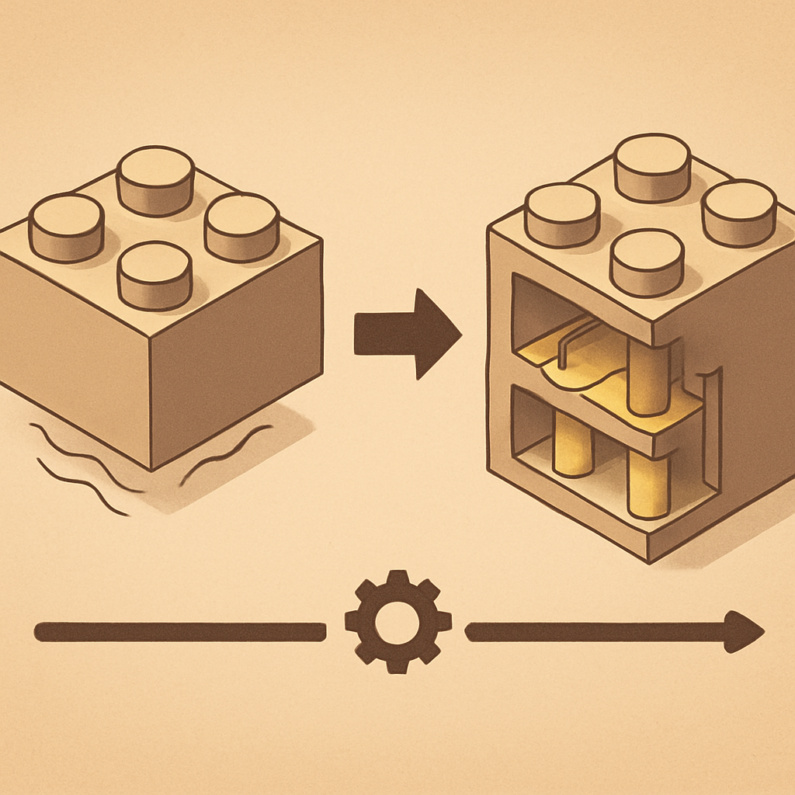

# Origens do Sistema de Encaixe



Para entender por que qualquer fabricante no mundo pode hoje produzir uma peça que encaixa no seu tijolo LEGO — sem pagar royalty, sem infringir lei alguma — é preciso voltar a uma decisão tomada em Billund, Dinamarca, em 1949. Mas essa história começa ainda antes, e a quase dois mil quilômetros de distância, em Londres.

Em 1939, o empresário e designer de brinquedos britânico Hilary Fisher Page fundou a Kiddicraft e começou a desenvolver brinquedos construtivos baseados em princípios de psicologia infantil. Page tinha uma convicção: brinquedos deveriam ser simples, seguros e estimular a criatividade motora das crianças. Em 1947, ele patenteou no Reino Unido as chamadas **Self-Locking Building Bricks** — tijolos plásticos com pinos (studs) na face superior que se encaixavam em orifícios correspondentes na face inferior de outro tijolo. A ideia central do encaixe por fricção, com geometria de pino e cavidade, estava ali. O tijolo básico da Kiddicraft era retangular, oco por dentro e usava os studs como único ponto de contato entre as peças.

Ole Kirk Christiansen, fundador da LEGO, era fabricante de brinquedos de madeira em Billund. Em 1947, a empresa comprou sua primeira máquina de moldagem por injeção de plástico — equipamento adquirido de um fornecedor britânico. Foi nessa transação que os Christiansen tiveram acesso a amostras físicas dos tijolos da Kiddicraft. A conclusão foi imediata: o plástico moldado por injeção e o tijolo de encaixe eram a combinação certa. Em 1949, a LEGO lançou suas próprias versões sob o nome **Automatic Binding Bricks**, depois renomeadas LEGO Mursten (tijolos LEGO). A geometria era fundamentalmente a mesma que a de Page — dimensões adaptadas para milímetros, mas o princípio intacto.

O tijolo de 1949, porém, tinha um problema técnico sério: o encaixe era fraco. Com apenas os studs como pontos de contato e o interior oco, as peças se soltavam com facilidade, e construções mais altas desmoronavam. Foi Godtfred Kirk Christiansen, filho de Ole, que resolveu isso. Em 28 de janeiro de 1958, às 13h58, ele depositou a patente que transformou o tijolo de brinquedo em um sistema de engenharia: o **stud-and-tube**. A inovação era elegante — três tubos cilíndricos ocos foram adicionados ao interior de cada tijolo 2×4, alinhados com o padrão de quatro studs acima. Quando dois tijolos são encaixados, os studs do de baixo passam pelos tubos do de cima, criando múltiplos pontos de contato por atrito. A força de retenção (clutch power) aumentou dramaticamente. Uma construção com tijolos de 1949 poderia ser empurrada lateralmente e colapsar; a mesma construção com tijolos de 1958 resistia.

```
Tijolo Kiddicraft / LEGO 1949       Tijolo LEGO 1958 (stud-and-tube)
─────────────────────────────       ──────────────────────────────────
 ● ● ● ● ● ● ● ●   (studs)          ● ● ● ● ● ● ● ●   (studs)
┌──────────────────┐                ┌──────────────────┐
│                  │                │   │○│     │○│     │  ← tubos internos
│   (oco, sem      │                │   │○│     │○│     │
│    suporte)      │                │   └─┘     └─┘     │
└──────────────────┘                └──────────────────┘
         ↓                                   ↓
   Encaixe fraco                     Encaixe forte
   (só atrito nos studs)             (studs + tubos = 6 pontos de contato)
```

A patente de 1958 foi registrada em 33 países. A data — 28 de janeiro de 1958 — é considerada o "nascimento" oficial do tijolo LEGO moderno, porque é a geometria de 1958, e não a de 1949, que permanece inalterada até hoje. Um tijolo fabricado em 1958 e um fabricado em 2024 são fisicamente intercambiáveis.

O que a pesquisa histórica revela, e que a própria LEGO acabou reconhecendo, é que o sistema de encaixe nunca foi uma invenção surgida do nada em Billund. Page inventou o conceito estrutural; Godtfred Christiansen aperfeiçoou a mecânica. A LEGO adquiriu os direitos dos herdeiros de Hilary Page somente em 1981 — três décadas depois de ter copiado e comercializado o design original sem acordo formal. Page morreu em 1957, um ano antes de a patente aperfeiçoada que tornaria seu conceito imortal ser depositada.

Esse pano de fundo importa por uma razão prática direta: o sistema de encaixe stud-and-tube, em sua geometria funcional, nunca foi invenção exclusiva de uma única empresa. Quando as patentes de 1958 expiraram — processo que se completou ao longo das décadas seguintes — o que entrou em domínio público era precisamente essa geometria de stud-and-tube, uma solução de engenharia que Page havia antecipado em 1947 e que Godtfred havia refinado. O mercado de peças compatíveis que o leitor vai usar para montar mosaicos e esculturas está assentado sobre essa história: fabricantes como Gobricks reproduzem hoje a mesma geometria de 1958, com precisão de tolerância comparável ou superior à do original, porque essa geometria é, há décadas, de todos.

## Fontes utilizadas

- [Hilary Page — Wikipedia](https://en.wikipedia.org/wiki/Hilary_Page)
- [Kiddicraft, LEGO before LEGO — Inverso.pt](https://www.inverso.pt/legos/clones/texts/kiddicraft.htm)
- [The History of Interlocking Bricks: From Kiddicraft to LEGO — Brick Me UK](https://uk.brick.me/blogs/educational/the-history-of-interlocking-bricks-from-kiddicraft-to-lego-brick-me)
- [LEGO Stole Their Bricks From Kiddicraft's Patented Self Locking Building Bricks — Today I Found Out](https://www.todayifoundout.com/index.php/2011/03/lego-stole-their-now-patented-bricks-from-kiddicrafts-patented-self-locking-bricks/)
- [The stud and tube principle — LEGO History (lego.com)](https://www.lego.com/en-my/history/articles/d-the-stud-and-tube-principle)
- [28 January 1958: the Lego brick is patented — MoneyWeek](https://moneyweek.com/424169/28-january-1958-the-lego-brick-is-patented)
- [60 Years of Lego Building Blocks and Danish Patent Law — Library of Congress](https://blogs.loc.gov/law/2018/01/60-years-of-lego-building-blocks-and-danish-patent-law/)
- [Fake LEGO®s? The truth behind LEGO®'s patents — Latericius](https://latericius.com/en/blogs/blog/fake-legos)

---

**Próximo conceito** → [A Linha do Tempo das Patentes](../02-a-linha-do-tempo-das-patentes/CONTENT.md)
