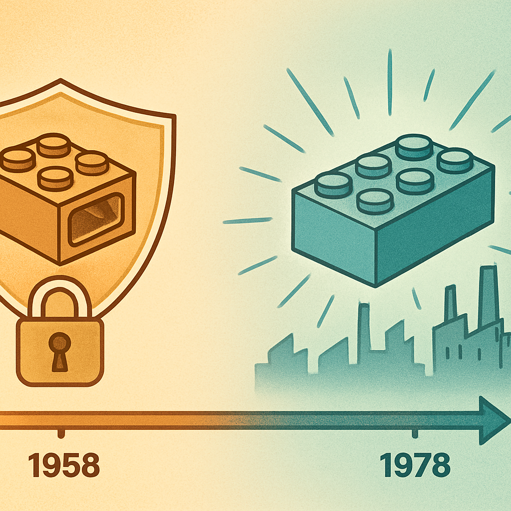

# A Linha do Tempo das Patentes



O conceito anterior estabeleceu que a geometria stud-and-tube — o mecanismo que transformou o tijolo de brinquedo em um sistema de engenharia — foi depositada como patente em 28 de janeiro de 1958. O que falta entender é o que acontece com uma patente ao longo do tempo, e o que especificamente aconteceu com a patente de 1958 da LEGO. Essa sequência de eventos é o que explica, juridicamente, por que qualquer fabricante no mundo pode hoje produzir o mesmo encaixe sem pagar royalty.

Patentes têm duração limitada por design — essa limitação é intencional e filosófica, não uma falha do sistema. A lógica é: o inventor tem um período exclusivo para explorar comercialmente a invenção (recompensa pela divulgação e pelo risco), mas ao fim desse período a sociedade inteira ganha acesso livre ao conhecimento técnico. A duração padrão, vigente na maioria dos países desde meados do século XX, é de **20 anos a partir do depósito** (ou da data de prioridade). Em 1958, quando Godtfred Kirk Christiansen depositou a patente do stud-and-tube, esse prazo de 20 anos era a regra na Dinamarca e na maior parte dos países onde a LEGO registrou proteção.

A aritmética é simples, mas a consequência é enorme: **1958 + 20 = 1978**. Em 1978, a patente principal do stud-and-tube entrou em domínio público. O que isso significa na prática é que qualquer fabricante passou a ter direito legal de reproduzir exatamente aquela geometria — o padrão de studs na face superior, os tubos internos alinhados com as fileiras intermediárias de studs, as dimensões em milímetros — sem pedir autorização, sem pagar royalty, sem infringir lei alguma.

```
Linha do tempo das patentes LEGO

1947  ──── Hilary Page (Kiddicraft) patenteia tijolos de encaixe no Reino Unido
1949  ──── LEGO lança Automatic Binding Bricks (encaixe fraco, sem tubos)
1958  ──── Godtfred deposita patente do stud-and-tube em 33 países
             ↓
             Início do período exclusivo de 20 anos
             ↓
1978  ──── PATENTE PRINCIPAL EXPIRA — stud-and-tube entra em domínio público
             ↓
             Qualquer fabricante pode reproduzir a geometria legalmente
             ↓
1978+ ──── Tyco Industries (EUA) entra no mercado com tijolos compatíveis
1987  ──── LEGO processa Tyco; Tyco vence — precedente nos EUA
1988  ──── Mega Bloks fundada no Canadá
1991  ──── Mega Bloks inicia produção comercial de compatíveis
2005  ──── Suprema Corte do Canadá julga LEGO vs. Mega Bloks; LEGO perde
2010  ──── Tribunal de Justiça da UE: design do tijolo não pode ser trademark
```

Um detalhe técnico importante: a LEGO não registrou apenas uma patente em 1958 — registrou a mesma invenção em dezenas de países separadamente, porque naquele período não existia um sistema internacional unificado como o PCT (Patent Cooperation Treaty), que só foi criado em 1970. Cada registro nacional tinha sua própria data de início e, portanto, sua própria data de expiração. Nos países onde o depósito foi feito em 1958, a expiração foi em 1978. Nos países onde o depósito ocorreu um ou dois anos depois — casos onde a LEGO esperou para patentear em mercados secundários — a expiração também foi deslocada proporcionalmente. Mas para os mercados principais (Dinamarca, EUA, Reino Unido, Alemanha, Canadá), 1978 é o ano de referência.

Há uma confusão comum na literatura: alguns textos mencionam "1989" como ano de expiração de patentes LEGO relevantes. Essa data refere-se a um segundo grupo de patentes — proteções mais específicas sobre variações do sistema básico (certas peças especializadas, mecanismos de conexão auxiliares) que a LEGO acumulou ao longo das décadas de 1960 e 1970. Essas patentes secundárias, depositadas por volta de 1969-1975, expiraram entre o final dos anos 1980 e início dos anos 1990. Mas o sistema de encaixe fundamental — studs + tubos — estava em domínio público desde 1978. A distinção é relevante porque alguns competidores entraram no mercado logo após 1978 (Tyco, por exemplo) enquanto outros esperaram até o início dos anos 1990, quando o terreno jurídico estava completamente limpo.

Após 1978, a LEGO tentou recriar proteção por outro caminho: o **trademark** (marca registrada). O argumento era que a forma do tijolo, depois de décadas de uso exclusivo, havia se tornado uma "marca" no sentido legal — que consumidores associavam aquela forma específica exclusivamente à LEGO, de modo que qualquer cópia configuraria confusão de marca. Esse argumento foi testado repetidamente em tribunais ao longo das décadas seguintes, e a LEGO perdeu todas as vezes.

| Tribunal | Ano | Resultado |
|---|---|---|
| Suprema Corte do Canadá | 2005 | LEGO vs. Mega Bloks: forma funcional não é trademark |
| Tribunal de Justiça da UE | 2010 | Design do tijolo de 8 studs não pode ser registrado como marca |
| Cortes europeias diversas | 1987–2000s | Múltiplos casos Tyco e similares — todos desfavoráveis à LEGO |

A lógica jurídica por trás dessas derrotas é consistente: o sistema de propriedade intelectual proíbe que uma empresa use o direito de marcas para perpetuar um monopólio que o direito de patentes deliberadamente encerrou. Se a forma é necessária para que o produto funcione — e a geometria stud-and-tube claramente é — então ela não pode ser monopolizada por trademark. O contrário transformaria patentes de 20 anos em monopólios perpétuos por uma mudança de roupagem jurídica, subvertendo o equilíbrio intencional do sistema.

O resultado prático dessa linha do tempo para quem compra peças hoje é direto: a geometria que você usa quando encaixa qualquer tijolo compatível em uma baseplate LEGO — ou em uma baseplate Gobricks, ou em qualquer baseplate de qualquer fabricante — é domínio público desde 1978. Quarenta e sete anos de mercado aberto. Não há brecha legal, não há zona cinzenta na geometria básica. O que a LEGO ainda protege — e protege com legitimidade — são outros elementos que não expiraram: a marca "LEGO" em si, os designs específicos das minifiguras, os nomes e visuais de sets licenciados. Esses são o território do próximo conceito.

## Fontes utilizadas

- [Fake LEGO®s? The truth behind LEGO®'s patents — Latericius](https://latericius.com/en/blogs/blog/fake-legos)
- [60 Years of Lego Building Blocks and Danish Patent Law — Library of Congress](https://blogs.loc.gov/law/2018/01/60-years-of-lego-building-blocks-and-danish-patent-law/)
- [The intellectual property story of Legos — University of Notre Dame Patent Law Blog](https://sites.nd.edu/patentlaw/2015/03/19/the-intellectual-property-story-of-legos/)
- [LEGO Patents — Brickset](https://brickset.com/article/57632/lego-patents)
- [Why LEGO Lost Its Brick Monopoly (And We All Won) — Made-in-China Insights](https://insights.made-in-china.com/Why-LEGO-Lost-Its-Brick-Monopoly-And-We-All-Won_kfhauIldHmHj.html)
- [US3005282A — Toy building brick (patente original, Google Patents)](https://patents.google.com/patent/US3005282A/en)
- [How LEGO Built a "Monopoly-Like" Position — The Fashion Law](https://www.thefashionlaw.com/how-lego-has-dominated-the-market-one-plastic-brick-at-a-time/)

---

**Próximo conceito** → [O que a LEGO Ainda Protege](../03-o-que-a-lego-ainda-protege/CONTENT.md)
