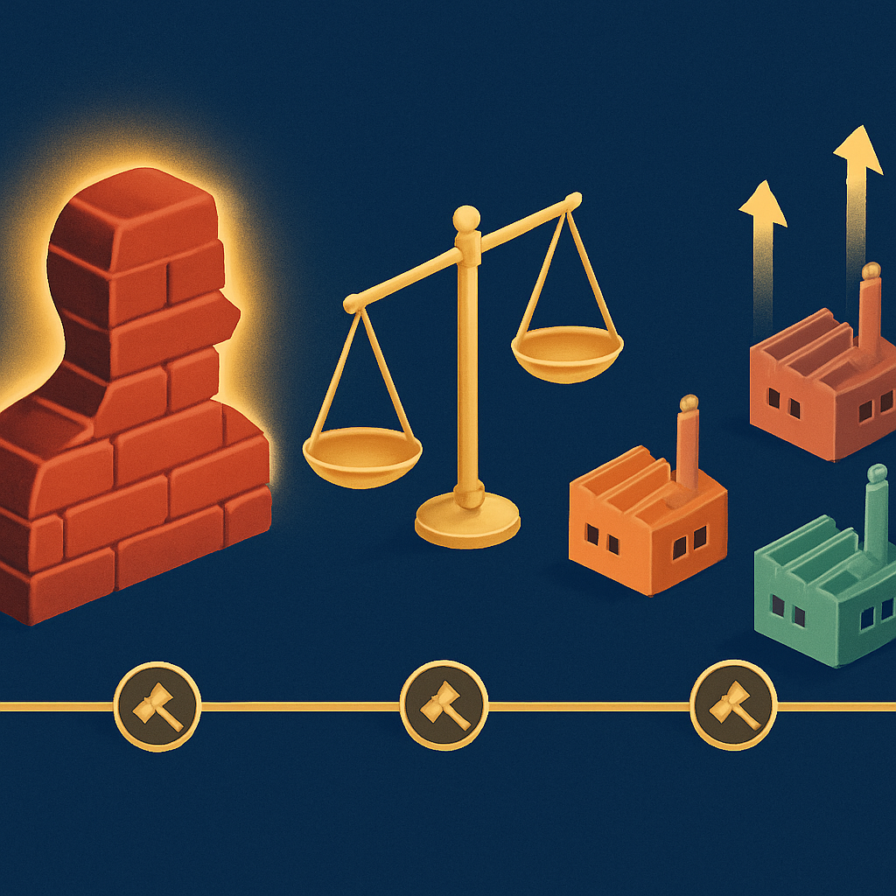

# Os Casos Judiciais que Consolidaram o Mercado Aberto



As três peças conceituais anteriores construíram um argumento progressivo: a geometria stud-and-tube foi inventada com inspiração externa, expirou em 1978, e a LEGO ainda protege ativos legítimos como marca, minifigura e propriedades licenciadas. O que falta entender é como esse argumento foi **testado em tribunal** — porque afirmar que o domínio público abre o mercado é diferente de ter um juiz, ou uma Suprema Corte, confirmar isso sob contestação. São exatamente esses precedentes judiciais que transformam a expiração de uma patente em um mercado aberto irrevogável.

A LEGO não aceitou passivamente a perda do monopólio após 1978. A empresa tentou, por décadas e em múltiplas jurisdições, reclassificar a geometria de encaixe como um ativo de marca — argumentando que décadas de uso exclusivo teriam tornado aquela forma tão reconhecível que reproduzi-la configuraria confusão com a LEGO. Essa estratégia foi testada em Hong Kong, nos EUA, no Canadá e na União Europeia. Os resultados foram consistentes: a LEGO perdeu todas as batalhas que importam para o sistema de encaixe básico. Cada derrota é uma camada de segurança jurídica para quem usa compatíveis hoje.

**O caso Tyco nos EUA (1984–1988)** foi o primeiro grande confronto após a expiração da patente principal. A Tyco Industries lançou os Super Blocks em 1984 — tijolos compatíveis com LEGO, dimensionalmente intercambiáveis, vendidos a preço menor. A LEGO respondeu com ação judicial em Hong Kong (onde venceu em questões específicas de copyright de desenhos técnicos) e a Tyco abriu ação preventiva nos EUA, no Tribunal Federal de Nova Jersey. Em 1987, o tribunal americano se pronunciou: a Tyco podia continuar fabricando e vendendo seus tijolos, com uma restrição única — não podia publicitar seus produtos como equivalentes aos LEGO. O significado é preciso: o tribunal reconheceu que a geometria de encaixe era reproduzível por qualquer fabricante, e que a única coisa protegida era o **nome** e a **identidade comercial** da LEGO, não a forma funcional. A LEGO recorreu ao Terceiro Tribunal de Apelações dos EUA (Third Circuit Court of Appeals), e perdeu. Recorreu ao Supremo Tribunal dos EUA, que simplesmente se recusou a ouvir o caso — na prática, deixando o precedente do Third Circuit em pé. Em 1988, a batalha americana estava encerrada: qualquer fabricante nos EUA podia produzir tijolos compatíveis. (A Tyco descontinuou os Super Blocks em 1991 por razões comerciais — a empresa pivotou para sets militares —, não por derrota jurídica.)

Paralelamente, o Privy Council britânico julgou em 1988 o caso **Interlego AG v. Tyco Industries** vindo de Hong Kong, que lidava especificamente com a questão do copyright nas plantas técnicas dos tijolos. O argumento da LEGO era que redesenhar periodicamente suas especificações técnicas gerava novo copyright sobre os desenhos, o que impediria engenharia reversa. O Privy Council rejeitou: mero redrawing de uma especificação existente sem acréscimo criativo substancial não gera novo copyright. Essa decisão estabeleceu o princípio de que não se pode usar copyright para perpetuar proteção sobre forma funcional depois que a patente expirou — um obstáculo que teria bloqueado qualquer fabricante que precisasse de plantas técnicas de referência para garantir compatibilidade dimensional.

O precedente mais robusto, porém, veio do Canadá. A **Kirkbi AG v. Ritvik Holdings Inc.** — conhecida como o caso Mega Bloks — foi julgada pela Suprema Corte canadense em novembro de 2005, e é citada até hoje em discussões de direito de marcas em todo o mundo. O contexto: a Mega Bloks foi fundada em 1988 e iniciou produção comercial de compatíveis em 1991. Desde então, a LEGO Canada e a Kirkbi AG (holding da LEGO) moveram cerca de uma dezena de ações judiciais contra a empresa. A disputa que chegou à Suprema Corte focava em um ponto específico: a LEGO argumentava que o padrão de studs na face superior do tijolo era uma **marca registrada não registrada** (unregistered trademark) — ou seja, uma marca que teria adquirido proteção pelo uso contínuo e pelo reconhecimento do público, mesmo sem registro formal. A LEGO também alegou passing off, a figura jurídica que proíbe fazer consumidores confundirem um produto com o de outro fabricante.

A Suprema Corte canadense rejeitou o argumento por unanimidade. O princípio central da decisão ficou conhecido como **doutrina da funcionalidade**: características de um produto que servem a uma função técnica não podem ser protegidas como marca, nem registrada nem não-registrada. O raciocínio é idêntico ao que o conceito anterior identificou como a lógica por trás das derrotas da LEGO na Europa — o sistema jurídico não pode permitir que o direito de marcas prolongue indefinidamente um monopólio que o direito de patentes deliberadamente encerrou. A corte foi explícita nesse ponto, usando quase essa formulação literal: "Trademark law should not be used to perpetuate monopoly rights enjoyed under now-expired patents."

```
Cronologia dos precedentes jurídicos

1984 ──── Tyco lança Super Blocks; LEGO processa em Hong Kong e NJ
1987 ──── Tribunal federal dos EUA: Tyco pode continuar produzindo
1988 ──── Third Circuit confirma; SCOTUS recusa-se a ouvir o caso
1988 ──── Privy Council (caso HK): redrawing não gera novo copyright
1991 ──── Mega Bloks inicia produção comercial no Canadá
1996 ──── LEGO Canada inicia ação judicial contra Mega Bloks
2004 ──── OHIM (EU) invalida trademark tridimensional do tijolo de 8 studs
2005 ──── Suprema Corte do Canadá: geometria funcional não pode ser trademark
2010 ──── Tribunal de Justiça da UE confirma: tijolo LEGO não registrável como marca
```

O caso de 2005 teve uma segunda consequência menos óbvia mas igualmente relevante: ele validou constitucionalmente a competência do Parlamento canadense para regular marcas com base no poder de comércio e trocas previsto na constituição — e ao fazê-lo, aplicou essa regulação de forma que protege concorrentes em vez de monopolistas. Não é um detalhe técnico-constitucional irrelevante; ele sinaliza que o estado canadense, naquele momento, deliberadamente escolheu a abertura de mercado como política pública.

Na União Europeia, o desfecho veio em duas etapas. Em 2004, o OHIM (Escritório de Harmonização do Mercado Interno) declarou inválido o registro tridimensional que a LEGO havia conseguido para o tijolo vermelho de 8 studs, após ação da Mega Brands. A LEGO recorreu, e em setembro de 2010 o Tribunal de Justiça da UE confirmou: a forma do tijolo não pode ser registrada como marca comunitária porque suas características essenciais — os studs no topo, os tubos internos — desempenham uma função técnica. O mesmo artigo que impede marcas puramente funcionais foi aplicado aqui com clareza: a finalidade da norma é precisamente impedir que se crie "monopólio perpétuo que prejudique permanentemente a oportunidade de concorrentes de comercializar produtos cuja forma incorpore a mesma solução técnica."

O quadro consolidado dessas batalhas é direto:

| Jurisdição | Caso | Ano | Resultado para LEGO |
|---|---|---|---|
| EUA (Third Circuit) | Tyco Industries v. LEGO Systems | 1988 | Derrota — geometria reproduzível |
| Hong Kong / Privy Council | Interlego AG v. Tyco Industries | 1988 | Derrota — redrawing sem novo copyright |
| Canadá (Suprema Corte) | Kirkbi AG v. Ritvik Holdings | 2005 | Derrota — funcionalidade impede trademark |
| União Europeia (TJ-UE) | Lego Juris / OHIM | 2010 | Derrota — forma funcional não registrável |

Para quem vai comprar peças de Gobricks, Mould King ou qualquer fabricante compatível, esses precedentes têm um significado operacional simples: o terreno jurídico foi testado repetidamente, nas principais economias do mundo, por uma empresa com recursos para contratar os melhores escritórios de propriedade intelectual disponíveis — e a conclusão foi a mesma em todas as instâncias. Não existe zona cinzenta para o sistema de encaixe básico. As peças 1×1 coloridas, os plates, as baseplates — nada disso tem proteção jurídica recuperável. O que está em domínio público desde 1978 permanece em domínio público por decisão judicial confirmada em quatro jurisdições distintas ao longo de três décadas. Esse é o fundamento sobre o qual o mercado global de compatíveis foi construído, e é o mesmo fundamento sobre o qual cada pedido de mosaico que usar peças Gobricks está apoiado.

## Fontes utilizadas

- [Interlego AG v Tyco Industries Inc — Wikipedia](https://en.wikipedia.org/wiki/Interlego_AG_v_Tyco_Industries_Inc)
- [Battle of the Bricks: LEGO vs Tyco Super Blocks — ACT Museum](https://actmuseum.org/2024/12/26/battle-of-the-bricks-lego-vs-tyco-super-blocks/)
- [Tyco Industries, Inc. v. Lego Systems, Inc. — Justia (Third Circuit, 1988)](https://law.justia.com/cases/federal/appellate-courts/F2/853/921/121392/)
- [Kirkbi AG v Ritvik Holdings Inc — Wikipedia](https://en.wikipedia.org/wiki/Kirkbi_AG_v_Ritvik_Holdings_Inc)
- [Mega Bloks wins SCOC ruling on Lego trademark — CBC News](https://www.cbc.ca/news/business/mega-bloks-wins-scoc-ruling-on-lego-trademark-1.555292)
- [LEGO Loses Trademark Battle in Canada — Smart & Biggar](https://www.smartbiggar.ca/insights/publication/lego-loses-trademark-battle-in-canada---update)
- [ECJ: no trademark protection for Lego's well-known toy brick — Lexology](https://www.lexology.com/library/detail.aspx?g=3f68a253-e0dd-408c-b49f-cc990087dd80)
- [LEGO brick not a trademark, court rules — CNN](https://www.cnn.com/2010/BUSINESS/09/15/eu.lego.trademark/index.html)
- [LEGO loses EU trademark case — Brickset](https://brickset.com/article/887/lego-loses-eu-trademark-case)
- [The intellectual property story of Legos — University of Notre Dame Patent Law Blog](https://sites.nd.edu/patentlaw/2015/03/19/the-intellectual-property-story-of-legos/)
- [Lego Compatible: The Intellectual Property Cases of Alternative Bricks — Brick Toad](https://bricktoad.com/posts/lego-compatible-alt-bricks/)

---

**Próximo subcapítulo** → ["Clone", "Compatível" e "Alternativo" — o Vocabulário do Mercado](../../02-clone-compativel-e-alternativo-o-vocabulario-do-mercado/CONTENT.md)
