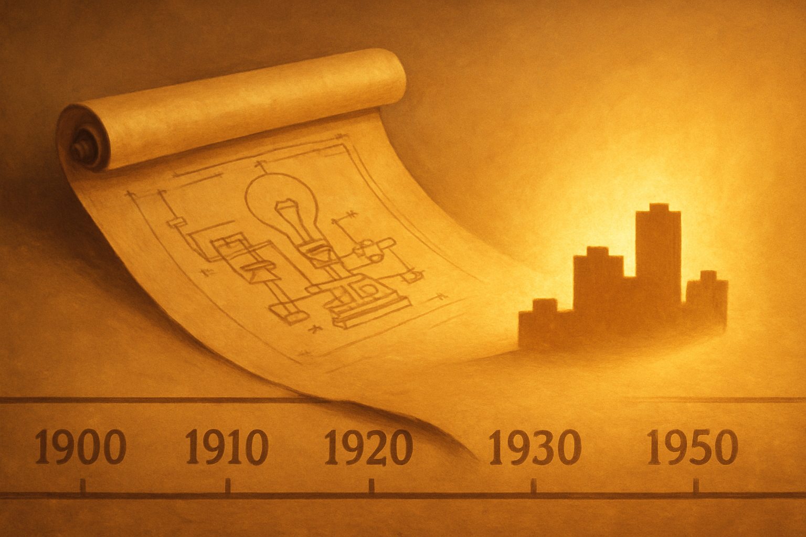

# A Expiração das Patentes LEGO

## Sobre este subcapítulo

Este subcapítulo abre o capítulo respondendo à pergunta mais estrutural de todas: por que qualquer empresa pode hoje fabricar peças que encaixam nos seus tijolos LEGO? A resposta está na história das patentes — e sem ela, tudo que vier depois (comparações de marcas, critérios de qualidade, decisões de compra) fica sem fundação. Entender a linha do tempo das patentes transforma a percepção do leitor: o mercado de compatíveis não é um beco lateral da indústria, mas o resultado previsível e legítimo de um ciclo normal de proteção intelectual chegando ao fim.

O recorte é deliberadamente técnico-histórico, mas filtrado para quem pensa como dono de negócio: não se trata de memorizar datas, mas de internalizar o argumento central — o tijolo básico é domínio público desde 1978, os casos judiciais subsequentes confirmaram isso repetidamente, e a LEGO convive com essa realidade há quase cinquenta anos.

## Estrutura

Os blocos deste subcapítulo são: (1) **origens do sistema de encaixe** — Hilary Page, a empresa Kiddicraft e a inspiração que Ole Kirk Christiansen usou para criar o tijolo moderno em 1958, estabelecendo que a ideia básica nunca foi exclusiva da LEGO; (2) **a linha do tempo das patentes** — a patente principal do stud-and-tube expirou em 1978, as últimas patentes relevantes do sistema básico em 1989, e o que esse vencimento significou praticamente para fabricantes concorrentes; (3) **o que a LEGO ainda protege** — a marca registrada "LEGO", designs específicos de minifiguras, nomes de sets e propriedades licenciadas (Star Wars, Harry Potter), que seguem protegidos por trademark e copyright independentemente das patentes; (4) **os casos judiciais que consolidaram o mercado** — Tyco Industries (1987), Mega Bloks na Suprema Corte canadense (2005) e outros precedentes que impediram a LEGO de usar lei de marcas para recuperar o monopólio perdido.

## Objetivo

Ao terminar este subcapítulo, o leitor saberá articular com precisão por que o mercado de compatíveis é legal — não de forma vaga ("as patentes expiraram"), mas com a linha do tempo correta e com a distinção clara entre o que é domínio público (o sistema de encaixe) e o que ainda pertence à LEGO (marca, minifiguras, designs proprietários). Esse piso conceitual é o que permite absorver os próximos subcapítulos — sobre vocabulário do mercado, players e legalidade — sem ficar preso em dúvidas sobre a legitimidade do próprio ecossistema.

## Conceitos

1. [Origens do Sistema de Encaixe](01-origens-do-sistema-de-encaixe/CONTENT.md) — Kiddicraft, Hilary Page e o tijolo de Ole Kirk Christiansen em 1958
2. [A Linha do Tempo das Patentes](02-a-linha-do-tempo-das-patentes/CONTENT.md) — stud-and-tube expirou em 1978, sistema básico em 1989
3. [O que a LEGO Ainda Protege](03-o-que-a-lego-ainda-protege/CONTENT.md) — marca registrada, minifiguras, designs proprietários e licenças
4. [Os Casos Judiciais que Consolidaram o Mercado Aberto](04-os-casos-judiciais-que-consolidaram-o-mercado/CONTENT.md) — Tyco (1987) e Mega Bloks na Suprema Corte canadense (2005)

## Fontes utilizadas

- [Fake LEGO®s? The truth behind LEGO®'s patents — Latericius](https://latericius.com/en/blogs/blog/fake-legos)
- [Lego clone — Wikipedia](https://en.wikipedia.org/wiki/Lego_clone)
- [60 Years of Lego Building Blocks and Danish Patent Law — Library of Congress](https://blogs.loc.gov/law/2018/01/60-years-of-lego-building-blocks-and-danish-patent-law/)
- [LEGO Patents — Brickset](https://brickset.com/article/57632/lego-patents)
- [The intellectual property story of Legos — University of Notre Dame Patent Law Blog](https://sites.nd.edu/patentlaw/2015/03/19/the-intellectual-property-story-of-legos/)
- [How LEGO Built a "Monopoly-Like" Position — The Fashion Law](https://www.thefashionlaw.com/how-lego-has-dominated-the-market-one-plastic-brick-at-a-time/)
