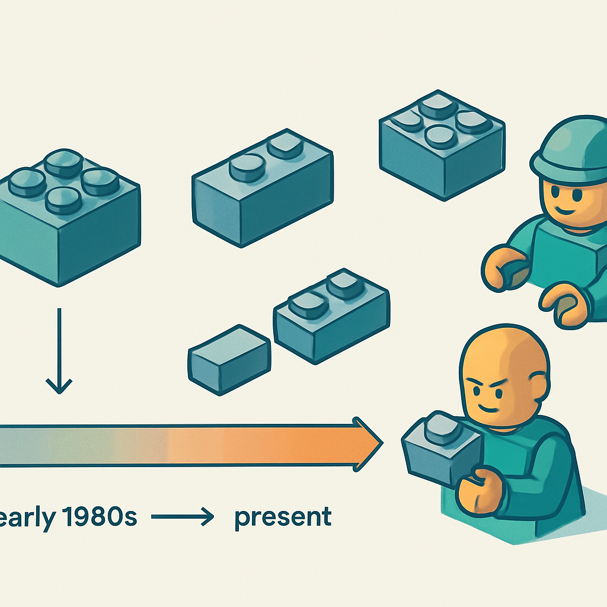

# "Clone" — o Termo Mais Antigo e Sua Conotação Variável

Este subcapítulo começa com vocabulário porque vocabulário carrega julgamento implícito — e o termo mais carregado de todos é "clone". Para quem está montando um negócio de mosaicos customizados e precisa decidir de onde comprar peças, entender o peso semântico da palavra é tão importante quanto conhecer qualquer especificação técnica: o termo que você usa com um cliente comunica uma posição, o termo que você usa com um fornecedor sinaliza um nível de conhecimento, e o termo que você usa internamente para categorizar o seu estoque reflete como você enxerga o produto que está vendendo.

"Clone", no contexto de tijolos de construção, é o mais antigo dos termos em circulação — seu uso precede em décadas expressões como "compatível" ou "alt bricks". Ele surgiu organicamente na comunidade de fãs adultos de LEGO (os AFOLs) nas décadas de 1980 e 1990, quando os primeiros fabricantes além da LEGO começaram a produzir peças que encaixavam no sistema de stud-and-tube recém-liberado pela expiração das patentes em 1978 e 1989. O modelo mental era simples e um pouco brutal: "eles copiaram". A Tyco Industries foi uma das primeiras a chegar ao mercado americano nesse período; a Mega Bloks chegou logo depois, em 1991. A palavra "clone" capturava bem o espírito daquele momento inicial — marcas que replicavam o sistema de encaixe da LEGO sem muita diferenciação própria, apostando em preço mais baixo como único argumento.

O ponto técnico por trás do termo é preciso: um "clone" LEGO produz peças dimensionalmente compatíveis com o sistema original — stud spacing de 8 mm, altura de tijolo de 9,6 mm, diâmetro de tubo interno que aceita o stud sem folga excessiva nem resistência demais. A compatibilidade mecânica é o critério definidor. O que varia entre fabricantes, e é onde a conotação começa a se diferenciar, é a tolerância com que essas dimensões são respeitadas. Um fabricante que acerta ±0,01 mm nas dimensões críticas produz um "clone" que encaixa tão bem quanto o original. Um fabricante que trabalha com moldes desgastados e nenhum controle de qualidade produz peças que também são "clones" no sentido técnico — mas que emperram, soltam com facilidade ou deformam a baseplate com o tempo.

Essa variação de qualidade dentro da categoria "clone" é o motivo pelo qual o termo ganhou, ao longo dos anos, uma conotação de neutra a levemente pejorativa dependendo do contexto. Na comunidade AFOL tradicional — especialmente nos fóruns europeus e americanos dos anos 2000 e 2010 —, "clone" era dito com certa desdém: implicava produto inferior, cópia sem originalidade, opção de quem não pode (ou não quer) pagar pelo original. A pesquisa mostra que parte da comunidade AFOL chegava a chamar esses produtos de "fakos" — fusão informal de "fake" com a terminação afetiva dos fóruns. Esse preconceito tinha base parcial na realidade do período: muitos clones daquela época, especialmente os genéricos sem marca, eram de qualidade inconsistente.

O problema com essa conotação é que ela colapsou numa palavra só um espectro enorme de produtos. Quando a Mega Bloks levou a LEGO ao Supremo Tribunal do Canadá em 2005 e venceu — consolidando o direito de qualquer fabricante produzir peças no sistema de encaixe expirado —, o mercado de "clones" se tornou um mercado maduro e diversificado. BlueBrixx (alemã), COBI (polonesa), Cada e Mould King (chinesas) emergiram como marcas com identidade própria, controle de qualidade estabelecido e, em alguns casos, licenças de propriedade intelectual legítimas. Gobricks, como veremos no subcapítulo sobre o mercado global, opera como fornecedora OEM de escala industrial com padrões de tolerância que chegam perto dos originais LEGO.

Chamar Gobricks de "clone" no mesmo sentido que se chamava um genérico de plástico ruim dos anos 1990 é impreciso. É por isso que parte da comunidade técnica migrou para termos como "compatível" (que cobre o próximo conceito deste subcapítulo) e "alternativo" (que abre ainda mais o espectro). Mas "clone" não desapareceu — continua sendo o termo mais usado em contextos rápidos e informais, especialmente em títulos de artigos, vídeos do YouTube e threads de Reddit onde o objetivo é ser encontrado por buscas, não ser tecnicamente preciso.

A tabela abaixo resume como o mesmo termo carrega pesos diferentes dependendo de quem fala e em que contexto:

| Contexto | Uso de "clone" | Conotação |
|---|---|---|
| Fóruns AFOL tradicionais (Eurobricks, Brickset) | Frequente, às vezes pejorativo | Levemente negativo — implica inferioridade ou falta de originalidade |
| Artigos e vídeos de review (YouTube, Reddit) | Frequente, descritivo | Neutro — serve como categoria de busca, sem julgamento embutido |
| Fabricantes premium (Gobricks, BlueBrixx) | Evitado | Esses fabricantes preferem "compatible" em seu próprio marketing |
| Público geral / clientes finais | Raramente usado | Pode soar como "falsificação" para quem não conhece o mercado |
| Contexto de negócio (fornecedor, estoque) | Aceitável internamente | Neutro como rótulo de categoria, mas evitar em comunicação com cliente |

Para quem está montando um negócio de mosaicos, o aprendizado prático é duplo. Primeiro: "clone" é um rótulo útil internamente para categorizar uma linha de peças — faz parte do vocabulário do setor e qualquer fornecedor ou comunidade técnica vai entender. Segundo: nunca use "clone" com o cliente final, porque para o público sem familiaridade com o mercado de tijolos o termo soa como sinônimo de falsificação — o que não é. O cliente que recebe um mosaico com peças Gobricks está recebendo um produto legal, produzido com tecnologia de molde de precisão, que encaixa perfeitamente em qualquer baseplate original. Nada disso cabe na conotação popular de "clone".

O próximo conceito deste subcapítulo trata justamente do termo que a comunidade técnica e os fabricantes de qualidade preferem: "compatível" — uma escolha de palavra que muda o enquadramento de "cópia" para "interoperabilidade", e que é muito mais adequada quando o objetivo é comunicar qualidade, não apenas preço.

## Fontes utilizadas

- [Lego clone — Wikipedia](https://en.wikipedia.org/wiki/Lego_clone)
- [Clone Brands — Bricks McGee](https://www.bricksmcgee.com/glossary/clone-brands/)
- [Survey of clone brands — Brickset](https://brickset.com/article/10110/survey-of-clone-brands)
- [The ultimate guide to LEGO® compatible building blocks — Latericius](https://latericius.com/en/blogs/blog/lego-compatible-building-blocks)
- [Lego® Alternatives: The 8 best Knock off Brands — BrickFact](https://brickfact.com/blog/bricks/lego-alternatives-the-big-guide)
- [An introduction to LEGO® alternative brands and alt bricks — Latericius](https://latericius.com/en/blogs/blog/what-are-alt-bricks-lego-alternatives)

---

**Próximo conceito** → ["Compatível" — Interoperabilidade com o Sistema LEGO sem Implicar Inferioridade](../02-compativel-interoperabilidade-sem-inferioridade/CONTENT.md)
