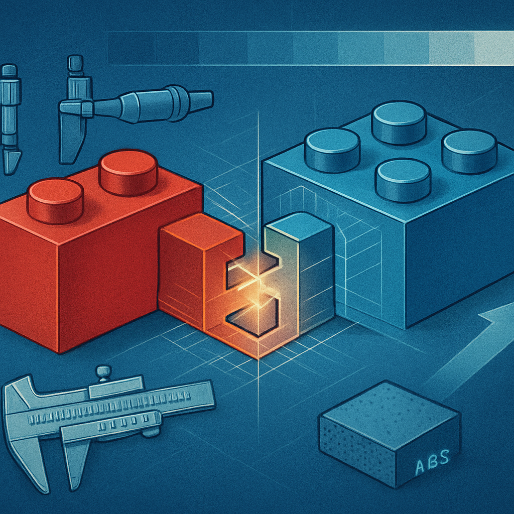

# "Compatível" — Interoperabilidade com o Sistema LEGO sem Implicar Inferioridade

O texto anterior deixou um ponto deliberadamente em aberto: fabricantes como Gobricks evitam o rótulo "clone" no próprio marketing, e a comunidade técnica migrou gradualmente para outro termo. Essa migração não é cosmética — ela carrega uma mudança real de enquadramento conceitual, e entendê-la é o que permite usar a linguagem certa na hora certa.

"Compatível", no contexto de tijolos de construção, descreve uma relação técnica antes de qualquer julgamento de valor: a peça encaixa física e mecanicamente no sistema LEGO sem que as duas partes precisem ter saído da mesma fábrica. O conceito central é interoperabilidade — o mesmo princípio que faz uma tomada tipo N funcionar em qualquer tomada padrão NBR 14136 ou que faz um pendrive USB-A encaixar em qualquer porta com aquele conector, independentemente do fabricante. O encaixe não é coincidência; é o resultado de respeitar um conjunto de dimensões definidas e não protegidas por patente.

Essas dimensões são precisas e imutáveis desde 1958. O espaçamento entre studs é de 8 mm (com pitch preciso de 7,985 mm). O diâmetro do stud é 4,8 mm com tolerância de ±0,01 mm. A altura de um tijolo é 9,6 mm; de uma plate, 3,2 mm. A interface de travamento — stud encaixando no tubo interno do tijolo abaixo — depende de uma folga calculada para gerar clutch power: resistência suficiente para não soltar acidentalmente, mas sem travar a ponto de exigir força para desencaixar. É esse equilíbrio de forças que separa uma peça "compatível de verdade" de uma peça que apenas coincide nas medidas externas mas falha na hora de montar.

A distinção entre respeitar as dimensões externas e respeitar a interface de clutch é onde boa parte dos fabricantes de qualidade inferior tropeça. Um tijolo pode ter 8 mm de espaçamento entre os studs e ainda assim encaixar mal se o ABS usado tiver módulo de elasticidade diferente, se o molde estiver desgastado produzindo studs com diâmetro abaixo de 4,78 mm, ou se o acabamento interno do tubo não tiver a rugosidade correta para gerar a fricção desejada. "Compatível", usado com rigor, não descreve apenas que a peça entra — descreve que ela entra com o comportamento mecânico correto.

É precisamente por isso que fabricantes no topo da hierarquia de qualidade — Gobricks sendo o exemplo mais citado pela comunidade de MOCers — adotaram "compatible" como termo central do próprio branding. O marketing deles não fala em "clone" e raramente usa "alternativo"; cada produto listado traz a expressão "high-precision MOC building bricks compatible with LEGO". A palavra "compatible" nesse contexto não é eufemismo de "mais barato" — é uma afirmação técnica: clutch power consistente, controle industrial de cor, acabamento superficial de alto brilho e tolerâncias que chegam perto do padrão LEGO de 0,01 mm. Quando a comunidade de MOCers fala que Gobricks "rivals LEGO itself" em qualidade, está dizendo que a interoperabilidade é real e não degradada — não que a peça é igual em todos os aspectos, mas que o comportamento mecânico dentro de um build é indistinguível.

Para quem está montando um negócio de mosaicos, a precisão desse vocabulário tem impacto direto na comunicação. Quando você diz a um cliente que usa "peças compatíveis com LEGO", você está afirmando: encaixam no sistema LEGO, funcionam em baseplates originais, têm o mesmo comportamento mecânico. Você não está dizendo que são originais, mas também não está sugerindo que são inferiores. O termo é neutro quanto à origem e neutro quanto ao preço — descreve exclusivamente a relação técnica de interoperabilidade. "Clone", como vimos no conceito anterior, carrega uma camada de conotação que pode desviar a conversa; "compatível" mantém o foco no que importa para o cliente de um mosaico de retrato: a peça encaixa? fica firme? tem a cor certa?

Há uma nuance adicional que vale registrar. "Compatível com LEGO" pode ser usado por qualquer fabricante, desde os mais rigorosos até os mais descuidados — o termo em si não garante nada sobre a qualidade de execução. A tabela abaixo mostra como o mesmo rótulo funciona em espectros diferentes:

| Fabricante | Uso de "compatível" | Tolerância real | Clutch power |
|---|---|---|---|
| Gobricks | Marketado como "high-precision compatible" | Próximo de ±0,01 mm | Consistente, sem variação por lote |
| Mould King | "Compatible with LEGO" (usa Gobricks como OEM em parte da linha) | Variável por produto | Bom a muito bom |
| Genérico AliExpress | Frequentemente marcado como "compatible" | Altamente variável | Inconsistente — pode soltar com facilidade |
| COBI / Mega Construx | Evitam "compatible with LEGO" intencionalmente | Próprio sistema | Não intercambiável com LEGO |

A última linha é importante: existem marcas que não reivindicam compatibilidade com LEGO porque operam sistemas de encaixe proprietários com pequenas diferenças dimensionais. Essas marcas não são "compatíveis" no sentido técnico — são "alternativas", que é o próximo conceito deste subcapítulo e cobre exatamente essa diferença.

Para o contexto de mosaicos planares de retrato, a interoperabilidade tem um significado prático bem específico: peças 1×1 — plates, tiles, round plates — precisam encaixar em baseplates sem folga perceptível e sem resistência que destrua a ponteira dos dedos em centenas de repetições. Nesse uso, uma peça Gobricks compatível de qualidade é funcionalmente indistinguível da original. O stud entra no mesmo buraco, trava com o mesmo clique, e o mosaico acabado não revela qual peça veio de qual fábrica. Essa indistinguibilidade no produto final é o argumento econômico central do livro — e ela só existe porque "compatível" tem substância técnica real, não é apenas uma palavra de marketing.

## Fontes utilizadas

- [The ultimate guide to LEGO® compatible building blocks — Latericius](https://latericius.com/en/blogs/blog/lego-compatible-building-blocks)
- [LEGO's 0.002mm Specification and Its Implications for Manufacturing — The Wave](https://www.thewave.engineer/articles.html/productivity/legos-0002mm-specification-and-its-implications-for-manufacturing-r120/)
- [Stud Dimensions Guide — Brick Owl](https://www.brickowl.com/help/stud-dimensions)
- [Are LEGO-Compatible Knockoff Bricks Worth Buying? — How-To Geek](https://www.howtogeek.com/reasons-to-buy-lego-compatible-bricks-from-knockoff-brands/)
- [Gobricks vs LEGO Bricks: What's the Difference? — Lumibricks](https://www.lumibricks.com/blogs/news/lego-vs-gobricks-review)
- [Lego clone — Wikipedia](https://en.wikipedia.org/wiki/Lego_clone)
- [Lego Geometry 101: Studs, Bricks, and Plates — Bricking Ohio](https://www.brickingohio.com/blog/lego-geometry-101)

---

**Próximo conceito** → ["Alternativo" — a Categoria Mais Ampla](../03-alternativo-a-categoria-mais-ampla/CONTENT.md)
