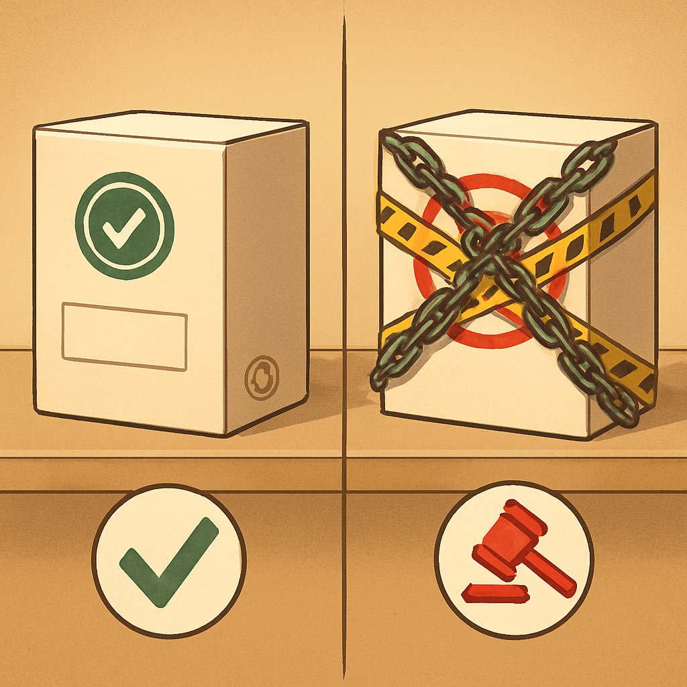

# "Falsificação" e "Pirata" — o que Esses Termos Realmente Significam Legalmente

O vocabulário construído ao longo deste subcapítulo — "clone", "compatível", "alternativo" — descreve um espectro de produtos que compartilham uma característica comum: todos são legais. A expiração das patentes stud-and-tube em 1978 e do sistema básico em 1989 abriu o campo para qualquer fabricante produzir peças com o sistema de encaixe LEGO sem pedir permissão a ninguém. O que nenhuma expiração de patente liberou, porém, é o uso da marca registrada da empresa, a cópia de seus logotipos, a reprodução de designs proprietários protegidos por copyright ou trade dress, ou a comercialização de produtos embalados de forma a induzir o consumidor a acreditar que está comprando um produto LEGO original. É exatamente aí que "falsificação" e "pirata" entram — e onde a distinção deixa de ser vocabular e passa a ser jurídica.

"Falsificação", no sentido legal, refere-se ao uso não autorizado de uma marca registrada em produtos idênticos ou quase idênticos aos originais, com a intenção — ou o efeito prático — de enganar o consumidor. A definição técnica do Lanham Act americano (que é a referência global mais citada em casos de trademark counterfeiting) exige três elementos: a marca usada é uma cópia exata ou essencialmente idêntica à marca registrada; os bens sobre os quais ela aparece são iguais ou virtualmente iguais ao produto genuíno; e o uso ocorre no contexto de venda ou distribuição comercial. O que transforma uma marca em "counterfeit" não é a semelhança entre os produtos em si — é a presença não autorizada do símbolo registrado sobre eles. Uma peça Gobricks sem nenhum logotipo LEGO não é falsificação por mais que encaixe perfeitamente no mesmo sistema. Uma peça idêntica em plástico mas com o logotipo "LEGO" impresso no stud — como alguns fabricantes oportunistas fazem — já configura falsificação de marca registrada independentemente da qualidade do produto.

No Brasil, a distinção entre "pirata" e "falsificado" tem uma nuance que vale registrar. A pirataria, no sentido estrito do direito brasileiro, descreve a reprodução não autorizada de obras protegidas por direito autoral — filmes, músicas, softwares, instruções de montagem com criatividade suficiente para ter proteção autoral. Já a falsificação ocorre quando o produto imita não apenas a obra, mas a apresentação comercial completa: embalagem, logotipo, marca, trade dress — com o objetivo de fazer o consumidor confundir o produto com o original. A definição do PROCON e da doutrina consumerista brasileira traça a linha assim: na pirataria, o consumidor geralmente sabe que está comprando uma imitação (pelo preço e pela aparência grosseira); na falsificação, o objetivo é justamente que ele não saiba. No contexto de tijolos de construção, um kit embalado com caixas que imitam a tipografia e o esquema de cores da LEGO, com o logotipo reproduzido ilegalmente, é falsificação — não pirataria.

O caso mais documentado e mais instrutivo é o da LEPIN, fabricante chinesa que operou entre 2015 e 2019 e que foi o maior produtor de sets falsificados de LEGO da história. O que tornou a LEPIN especificamente ilegal não foi o fato de usar o sistema de encaixe stud-and-tube expirado — isso qualquer fabricante pode fazer. O que a LEPIN fez foi copiar os sets completos da LEGO em escala 1:1: mesmos temas, mesmo número de peças, mesmas instruções de montagem, embalagens com layout visualmente idêntico ao da LEGO. O departamento de design da empresa comprava sets originais, desmontava as peças, fazia engenharia reversa dos moldes e reproduzia o produto inteiro incluindo a arte das caixas. Esse conjunto de atos — copyright infringement sobre as instruções e arte das caixas, trade dress copying sobre a embalagem, e design piracy sobre as peças únicas ainda protegidas — foi o que gerou a derrota judicial e o encerramento das operações. A LEPIN não foi punida por fabricar peças com stud-and-tube; foi punida por copiar a identidade comercial e os designs proprietários da LEGO sistematicamente.

O caso mais recente, julgado na China em 2024, envolveu a empresa Long XX Company e estabeleceu precedente criminal — não apenas civil — para counterfeit de LEGO. A empresa operou de 2016 a 2022, acumulou mais de 1,1 bilhão de RMB em vendas de sets copiados 1:1 da LEGO, e quando recebeu as primeiras notificações judiciais, mudou a fábrica de endereço para continuar operando. O principal réu recebeu pena de 9 anos de prisão e multa de 20 milhões de RMB; a empresa foi condenada a pagar 600 milhões de RMB. Esses números mostram que o mercado de tijolos compatíveis legais e o mercado de falsificações operam em universos jurídicos completamente diferentes — o primeiro conta com proteção da lei de concorrência, o segundo responde à lei penal.

A tabela abaixo sintetiza os critérios que separam os produtos legais dos ilegais nesse mercado:

| Prática | Legal? | Por quê |
|---|---|---|
| Fabricar peças com sistema stud-and-tube | Sim | Patentes expiraram em 1978/1989 |
| Vender peças avulsas com marca própria | Sim | Qualquer fabricante pode criar sua marca |
| Imprimir "LEGO" no stud das peças | Não | Viola marca registrada do Grupo LEGO |
| Copiar embalagem com logotipo LEGO | Não | Trademark counterfeiting + trade dress |
| Reproduzir instruções de montagem originais | Não | Copyright infringement |
| Copiar designs de minifiguras LEGO | Não | Design copyright ainda vigente (minifig registrada em 1978, renovada) |
| Criar sets com temática similar mas design próprio | Sim | Ideia não é protegida, apenas a expressão específica |
| Vender sets como "compatíveis com LEGO" sem usar a marca | Sim | Descrição técnica de interoperabilidade, não uso de marca |

O último ponto da tabela merece atenção especial porque é onde a confusão mais comum aparece. Dizer que um produto é "compatível com LEGO" — sem usar o logotipo LEGO nem simular a embalagem — é geralmente legal na maioria das jurisdições, incluindo o Brasil e os EUA. Trata-se de uso descritivo ou referencial da marca alheia para indicar interoperabilidade, prática reconhecida em marketing como "nominative fair use". Gobricks, Mould King, Cada e virtualmente todos os fabricantes sérios do mercado usam a expressão "compatible with LEGO" ou equivalentes no marketing sem que isso configure violação — porque não estão usando a marca como elemento de identidade do produto, mas como referência técnica de compatibilidade.

O próprio documento "Fair Play" publicado pelo Grupo LEGO delimita o campo com precisão: a empresa persegue "pirate copies of LEGO® elements" — cópias que enganam o consumidor sobre a origem — e "infringement of our rights" sobre marcas registradas, designs e copyrights. O texto não reclama o direito exclusivo sobre o sistema de encaixe; reconhece implicitamente que esse domínio público expirou. O que a empresa defende ativamente são as camadas de propriedade intelectual que ainda estão em vigor: a marca "LEGO", o design da minifigura, as artes dos sets, e em algumas jurisdições europeias o design registrado dos tijolos básicos (a União Europeia concedeu ao Grupo LEGO até 25 anos de design right sobre certos elementos após o CJEU decidir que a forma funcional não pode ser protegida como trademark — uma distinção técnica que levou a LEGO a mudar de instrumento jurídico).

Para quem está montando um negócio de mosaicos de retrato em São Paulo, toda essa distinção converge em uma regra operacional simples: nunca use o nome "LEGO" no marketing do produto como se o produto fosse LEGO; nunca imprima o logotipo da empresa em peças ou embalagens; e nunca compre de fornecedores que copiam sets completos incluindo arte e embalagem — porque esses fornecedores operam na ilegalidade e qualquer operação policial que os atinge pode interromper o abastecimento do seu negócio de forma abrupta, sem aviso. O risco de comprar de um falsificador não é apenas ético; é logístico e financeiro. Gobricks, Mould King, Cada e os demais fabricantes sérios que operam com marca própria, design próprio e sem reproduzir a identidade visual da LEGO são o oposto disso — existem há anos, têm reputação documentada pela comunidade e operam em conformidade com a lei de propriedade intelectual.

A confusão popular entre "clone legal" e "falsificação" tem uma origem compreensível: para quem não conhece o mercado, qualquer peça que encaixe em LEGO e não seja LEGO parece suspeita. Mas como este subcapítulo inteiro demonstrou — do conceito de "clone" ao de "compatível" e "alternativo" e agora ao de "falsificação" — o critério que separa o legal do ilegal não é a compatibilidade física. É o respeito à propriedade intelectual ainda vigente: marcas, designs proprietários, arte e embalagem. Uma peça Gobricks 1×1 encaixando numa baseplate original LEGO é tão legal quanto um cabo USB de terceiros encaixando num notebook: o conector é padrão aberto, e qualquer fabricante pode produzi-lo.

## Fontes utilizadas

- [Fair Play — Grupo LEGO](https://www.lego.com/en-us/legal/notices-and-policies/fair-play)
- [Fake LEGO®s? The truth behind LEGO®'s patents — Latericius](https://latericius.com/en/blogs/blog/fake-legos)
- [Lego clone — Wikipedia](https://en.wikipedia.org/wiki/Lego_clone)
- [9-Year Prison Sentence and 600 Million RMB Fine for Criminal Copyright Infringement of Lego Sets — China IP Law Update](https://www.chinaiplawupdate.com/2024/05/9-year-prison-sentence-and-600-million-rmb-fine-for-criminal-copyright-infringement-of-lego-sets/)
- [Chinese police seized more than 630,000 LEGO counterfeits — Legal Patent](https://legal-patent.com/product-and-trademark-piracy/chinese-police-seized-630000-lego-counterfeits/)
- [Guangdong Higher People's Court Ups Damages 10X on Appeal in Trademark Infringement Case for Lego Bricks — National Law Review](https://natlawreview.com/article/guangdong-higher-people-s-court-ups-damages-10x-appeal-trademark-infringement-case)
- [Counterfeit vs. Trademark Infringement: What Is the Difference? — Brewer Long](https://brewerlong.com/information/business-law/counterfeit-vs-trademark-infringement/)
- [Produtos piratas e falsos — Valinke](https://valinke.com/produtos-piratas-e-falsos/)
- [Protecting the Block: How LEGO Enforces Trademark Rights — Generis Online](https://generisonline.com/protecting-the-block-how-lego-enforces-trademark-rights-to-safeguard-its-iconic-brand/)

---

**Próximo conceito** → [Como a Comunidade Categoriza na Prática](../05-como-a-comunidade-categoriza-na-pratica/CONTENT.md)
