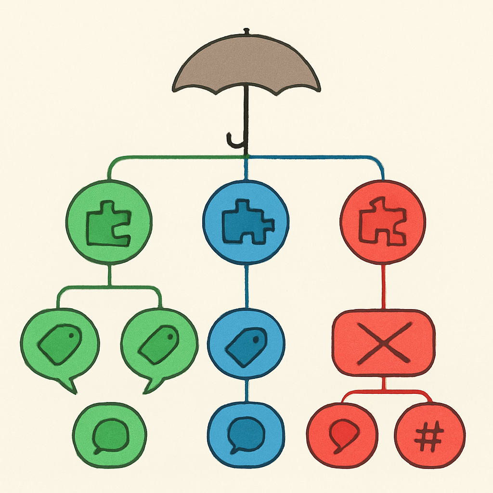

# Como a Comunidade Categoriza na Prática

Depois de construir as definições de "clone", "compatível", "alternativo" e "falsificação" com rigor técnico e legal, é tentador imaginar que a comunidade usa esses termos com o mesmo cuidado. Ela não usa. O vocabulário que realmente circula em fóruns, subreddits, canais do YouTube e sites de review é mais fluido, mais contextual e às vezes mais impreciso do que as definições ideais sugerem — e entender essa fluidez é tão importante quanto entender as definições, porque é esse vocabulário impreciso que o leitor vai encontrar quando for pesquisar fornecedores, ler reviews e navegar comunidades.

O termo que mais se aproxima de um consenso neutro e de largo espectro é **"alt bricks"** — abreviação de "alternative bricks". A Latericius, um dos sites europeus de referência para o mercado, define "alt bricks" explicitamente como "a catch-all term for any brick building brand that isn't LEGO". Essa ausência de requisito técnico é propositalmente diferente de "compatível": um produto pode ser "alt brick" mesmo que encaixe frouxamente, mesmo que o clutch power seja ruim, mesmo que o sistema de encaixe seja ligeiramente diferente do original LEGO. O guarda-chuva cobre tudo que não é LEGO, sem hierarquia embutida. Em fóruns como Eurobricks e grupos do Reddit, "alt bricks" funciona como etiqueta de entrada para uma conversa — diz "estamos falando de marcas que não são LEGO" sem pré-julgar a qualidade do que vem a seguir.

No mesmo espectro de neutralidade ampla, "LEGO alternatives" é a expressão preferida de sites voltados ao público geral que precisa de SEO — BrickFact e Latericius usam a expressão como categoria de navegação de topo porque captura qualquer produto que sirva como alternativa à LEGO: desde Gobricks com tolerância industrial até sets genéricos de AliExpress com clutch power inconsistente. Para quem pesquisa no Google sem vocabulário técnico, "LEGO alternatives" é o ponto de entrada; o refinamento (compatível vs. sistema próprio, premium vs. genérico) vem depois, dentro da categoria.

A comunidade do Brickset — um dos sites mais antigos e respeitados do ecossistema LEGO, com banco de dados online desde 2000 — tem uma relação histórica interessante com esse vocabulário. Entre 2015 e 2018, o usuário Anthony Tomkins publicou uma série de surveys anuais chamada informalmente de "Communist LEGO" para o Brickset, revisando sistematicamente marcas chinesas de tijolos. O próprio título irônico revela a postura de uma parte da comunidade AFOL tradicional em relação a essas marcas naquele período — um misto de curiosidade, ceticismo e humor autodepreciativo. Nos fóruns do Brickset, "clone brands" era a tag usada para esses threads, e a conotação era mais descritiva do que pejorativa quando usada naquele contexto específico. Quem participa desse tipo de conversa entende que "clone" está sendo usado como categoria, não como insulto.

Já o Reddit desenvolveu sua própria taxonomia informal. O subreddit r/lepin concentrou durante anos a discussão sobre knockoffs — incluindo Lepin antes de sua derrota judicial — e por contaminação o nome "lepin" passou a ser usado coloquialmente como sinônimo genérico de qualquer tijolo não-LEGO, mesmo os legais. O problema dessa generalização é óbvio: Lepin era um falsificador no sentido do conceito anterior; Gobricks não tem nada a ver com isso. Outros termos que circulam em threads do Reddit incluem "KO bricks" (knock-off bricks), "bootlego" e "China bricks" — todos com conotações que vão de neutro a pejorativo dependendo de quem escreve e em que contexto. A comunidade do Reddit em torno de tijolos alternativos é notoriamente variável em qualidade: posts upvotados podem misturar Gobricks premium com falsificadores na mesma conversa sem distinção clara.

Sites especializados — como Seven Star Bricks — propõem uma distinção operacional mais limpa, alinhada com o que este subcapítulo construiu: "alternative bricks" (design próprio, sem copiar sets LEGO) vs. "knock offs" (copies sets LEGO existentes com modificações mínimas). Essa distinção é mais útil do que "clone vs. compatível" para quem está avaliando se um produto é ethicamente comprável, mas menos útil para quem está avaliando se uma peça vai encaixar corretamente numa baseplate. São critérios diferentes respondendo a perguntas diferentes.

A tabela abaixo mapeia os principais termos em circulação com o contexto onde cada um predomina e o que ele de fato cobre:

| Termo | Onde predomina | O que cobre | Risco de confusão |
|---|---|---|---|
| "alt bricks" | Sites especializados (Latericius), YouTube, Instagram | Qualquer marca não-LEGO, incluindo premium | Baixo — é neutro e amplo por definição |
| "LEGO alternatives" | Google, BrickFact, sites de review genérico | Qualquer produto que substitua a LEGO | Baixo para o público geral |
| "clone brands" | Brickset, Eurobricks, comunidade AFOL | Marcas que replicam o sistema de encaixe | Médio — "clone" carrega conotação variável |
| "KO bricks" / "knock offs" | Reddit, grupos informais | Produtos que copiam sets LEGO existentes | Alto — pode confundir legal com ilegal |
| "bootlego" | Reddit, jargão informal | Cópias de sets LEGO (originais ou não) | Alto — fortemente associado a falsificação |
| "lepin" (como genérico) | Reddit antigo, grupos de Telegram | Qualquer tijolo alternativo (uso informal) | Muito alto — Lepin era falsificador, Gobricks não |
| "compatible bricks" | Fabricantes premium, comunidade técnica | Peças que encaixam com mecânica correta | Baixo — termo preciso, usado por fabricantes sérios |

O que a tabela deixa claro é que nenhum guarda-chuva da coluna "onde predomina" é universal. Um artigo em inglês no YouTube pode chamar Mould King de "alt brick" sem qualquer conotação negativa; o mesmo produto em um thread antigo do Reddit pode aparecer rotulado como "KO" com implicação de suspeita. A mesma peça, rotulada de forma diferente, comunica avaliações completamente distintas sem que a peça tenha mudado em nada.

Para um negócio de mosaicos em São Paulo, essa fluidez tem uma implicação prática direta: quando for pesquisar fornecedores, ler reviews e navegar comunidades, calibre o vocabulário encontrado pelo contexto da fonte. Uma busca por "alt bricks Gobricks review" vai chegar a conteúdo de qualidade; uma busca por "KO bricks AliExpress" vai misturar produtos legítimos com knockoffs de qualidade duvidosa. O critério para filtrar não é o termo — é a fonte. Eurobricks e Brickset tendem a reviews mais rigorosos; Reddit requer triagem pelo histórico do usuário que posta; sites de curadores como Latericius e BrickFact têm linha editorial que separa explicitamente falsificações de alternativas legítimas.

O subcapítulo inteiro convergiu para um resultado prático: o vocabulário correto no lugar certo. Com o cliente, "compatível" — porque descreve a relação técnica de interoperabilidade sem conotação negativa. Com fornecedores e comunidade técnica, "clone" ou "compatible" dependendo do nível de precisão necessário. Para pesquisa e navegação em comunidades, "alt bricks" ou "LEGO alternatives" como ponto de entrada. E "falsificação", "pirata", "KO" e "bootlego" ficam fora do vocabulário do negócio — não porque as palavras sejam proibidas, mas porque não descrevem o produto que vai entrar no estoque.

## Fontes utilizadas

- [An introduction to LEGO® alternative brands and alt bricks — Latericius](https://latericius.com/en/blogs/blog/what-are-alt-bricks-lego-alternatives)
- [Survey of clone brands — Brickset](https://brickset.com/article/10110/survey-of-clone-brands)
- [Everything you wanted to know about clone brands — Brickset](https://brickset.com/article/11416/everything-you-wanted-to-know-about-clone-brands)
- [The Many Shades of Grey in the Questionable World of Lego Knock-Offs and Alt-Bricks — Paperwave Substack](https://paperwave.substack.com/p/the-many-shades-of-grey-in-the-questionable)
- [Get Started with Alternative Bricks & Knock Offs — Seven Star Bricks](https://sevenstarbricks.wordpress.com/get-started/)
- [Lego® Alternatives: The 8 best Knock off Brands — BrickFact](https://brickfact.com/blog/bricks/lego-alternatives-the-big-guide)
- [Brick Alternatives to LEGO® — How Do They Compare? — BamGoodBricks](https://bamgoodbricks.com/blogs/lego-reviews/brick-alternatives-to-lego%C2%AE-how-do-they-compare)
- [Lego clone — Wikipedia](https://en.wikipedia.org/wiki/Lego_clone)

---

**Próximo subcapítulo** → [O Mercado Global de Compatíveis Hoje](../../03-o-mercado-global-de-compativeis-hoje/CONTENT.md)
