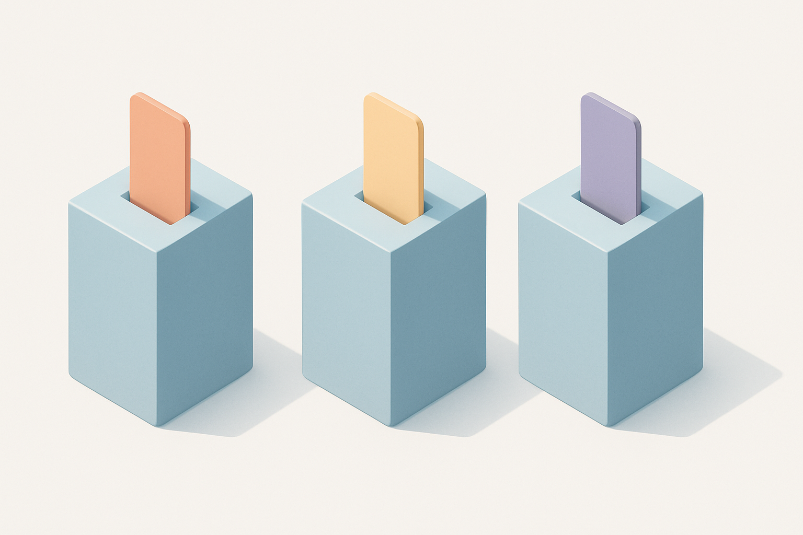

# "Clone", "Compatível" e "Alternativo" — o Vocabulário do Mercado

## Sobre este subcapítulo

Antes de comparar marcas ou avaliar qualidade, é preciso entender a linguagem. A comunidade de AFOLs (Adult Fans of LEGO) e MOCers desenvolveu ao longo dos anos um vocabulário próprio para categorizar peças que não são LEGO — e os termos importam porque carregam julgamentos implícitos sobre qualidade, intenção do fabricante e posicionamento no mercado. Chamar tudo de "falso" ou "pirata" é tecnicamente errado e estrategicamente contraproducente para quem quer construir um negócio sólido: confunde produtos de qualidade diferente numa mesma categoria negativa e dificulta a comunicação com clientes.

Este subcapítulo vem logo após a história das patentes porque o vocabulário só faz sentido com aquela base: uma vez que se sabe que o tijolo básico é domínio público, termos como "clone" deixam de ter conotação negativa e passam a descrever, simplesmente, uma categoria de produto no mercado.

## Estrutura

Os blocos são: (1) **"clone"** — o termo mais antigo, usado para fabricantes que replicam o sistema de encaixe LEGO com foco em compatibilidade e preço acessível; a conotação varia de neutra a levemente pejorativa dependendo do contexto e da qualidade; (2) **"compatível"** — termo preferido pela comunidade técnica e por fabricantes de ponta como Gobricks, porque enfatiza a interoperabilidade com peças originais sem implicar inferioridade; (3) **"alternativo"** — mais amplo, inclui marcas como COBI e Mega Construx que têm sistemas próprios e não necessariamente buscam compatibilidade total com LEGO; (4) **"falsificação" e "pirata"** — termos reservados para produtos que copiam ilegalmente marcas registradas, logotipos ou designs proprietários protegidos, categoria completamente distinta das anteriores e com implicações legais reais; (5) **como a comunidade categoriza na prática** — fóruns como Eurobricks e Brickset usam "alt bricks" como guarda-chuva neutro, enquanto sites como Brickfact e Latericius adotam "LEGO alternatives" para o público amplo.

## Objetivo

Ao terminar este subcapítulo, o leitor usará os termos corretos em cada contexto — sabendo quando dizer "compatível" a um cliente, quando "clone" funciona numa conversa técnica com fornecedor e por que nunca deve usar "falsificação" para Gobricks ou Mould King. Essa precisão vocabular é a base para comunicar com segurança sobre o produto tanto internamente (estoque, processo) quanto externamente (cliente, marketing).

## Fontes utilizadas

- [Lego clone — Wikipedia](https://en.wikipedia.org/wiki/Lego_clone)
- [The Difference Between Alternative Bricks and LEGO — BrickNut](https://bricknut.com/blog/build-brick-guide)
- [Clone Brands glossary — Bricks McGee](https://www.bricksmcgee.com/glossary/clone-brands/)
- [Survey of clone brands — Brickset](https://brickset.com/article/10110/survey-of-clone-brands)
- [The ultimate guide to LEGO® compatible building blocks — Latericius](https://latericius.com/en/blogs/blog/lego-compatible-building-blocks)
- [Lego® Alternatives: The 8 best Knock off Brands — BrickFact](https://brickfact.com/blog/bricks/lego-alternatives-the-big-guide)
