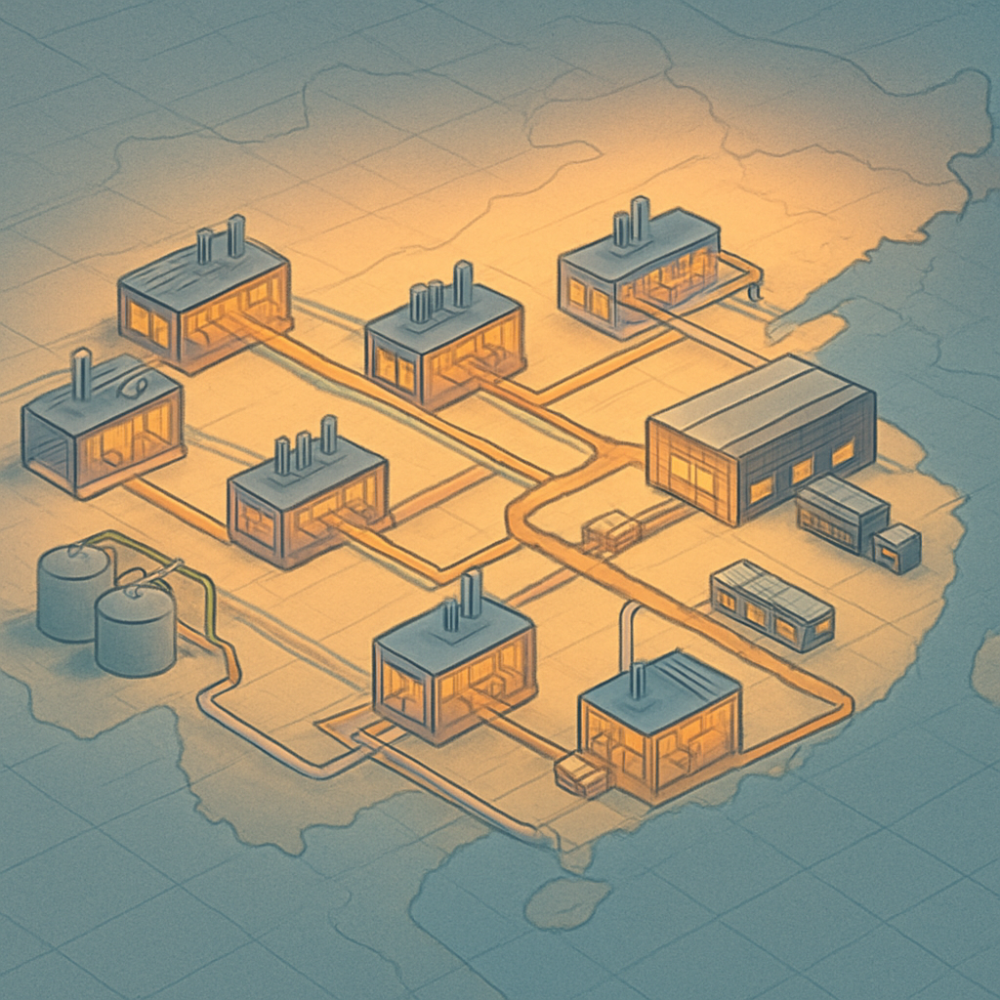

# Concentração Geográfica — Guangdong e o Cluster Industrial de Tijolos

Quando você abre o AliExpress e digita "LEGO compatible bricks", os resultados vêm de centenas de lojas diferentes — nomes distintos, logos distintos, preços distintos. A sensação é de um mercado caótico e disperso. Essa aparência é enganosa. Por baixo da fragmentação visual do marketplace, a fabricação real está extremamente concentrada: a esmagadora maioria das peças compatíveis com LEGO vendidas no mundo inteiro sai de uma única região da China, a Província de Guangdong — e dentro dela, principalmente do Distrito de Chenghai, na cidade de Shantou.

Entender por que isso acontece, e o que esse nível de concentração significa na prática, é o ponto de entrada para compreender o mercado de compatíveis como um todo. Não é trivia geográfica — é a chave para entender por que a qualidade de dois produtos sem marca pode ser radicalmente diferente, por que os preços praticados em escala são os que são, e por que fornecedores sérios como Gobricks, Sembo, Mould King e dezenas de outros conseguem existir com o nível de sofisticação que têm.

O Distrito de Chenghai é hoje chamado de "capital mundial dos brinquedos de plástico" — um título que não é marketing, mas descrição literal. Mais de 50.000 empresas ligadas à cadeia de brinquedos estão instaladas na região, e estima-se que ela responda por aproximadamente 70% da produção global de brinquedos plásticos. Para tijolos de montar especificamente, Chenghai produz mais de 10 bilhões de peças por ano. Uma única fábrica de grande porte — como a Golds, cujas instalações ultrapassam 300.000 metros quadrados — opera quase mil máquinas de injeção automatizadas. Para ter uma referência de escala: a planta inteira da LEGO em Billund, sua maior fábrica histórica, operava com algumas centenas de máquinas. A concentração em Chenghai não é de uma empresa, mas de um ecossistema inteiro operando nessa escala simultaneamente.

A pergunta relevante é: por que Chenghai? A resposta não é um único fator, mas a convergência de vários que se reforçaram mutuamente ao longo de décadas. O processo começou nos anos 1980, quando a China abriu sua economia e Shantou foi designada como uma das Zonas Econômicas Especiais — o que atraiu capital externo, criou incentivos para manufatura de exportação e acelerou a formação de uma base industrial local. A região já tinha acesso a mão de obra barata e infraestrutura portuária funcional via Guangzhou e Shenzhen. As primeiras pequenas oficinas de injeção plástica começaram a se estabelecer fabricando brinquedos simples. Cada oficina nova que se instalava precisava de fornecedores locais de moldes, de resina ABS, de embalagens, de logística — e esses fornecedores vinham se instalar perto das fábricas. Isso é a dinâmica clássica de cluster industrial: quanto mais empresas de um setor se concentram num lugar, mais atrativo aquele lugar se torna para novos entrantes do mesmo setor, porque a infraestrutura compartilhada já está lá.

O resultado décadas depois é um ecossistema vertical completo dentro de um raio de poucos quilômetros. Dentro do cluster de Chenghai e adjacências, você encontra:

| Elo da cadeia | O que existe localmente |
|---|---|
| Matéria-prima | Distribuidores de ABS virgem e reciclado em granulado, com entregas em horas |
| Ferramental | Centenas de fabricantes de moldes de aço para injeção, especializados em geometrias de tijolos |
| Produção | Fábricas de injeção plástica com parques de centenas a milhares de máquinas |
| Qualidade | Laboratórios de metrologia dimensional e testes de encaixe compartilhados ou in-house |
| Embalagem | Fornecedores de caixas, sacos zip-lock, bandejas e etiquetas personalizadas a poucos quilômetros |
| Logística | Transportadoras especializadas em exportação, com acesso direto aos portos de Shenzhen e Guangzhou |
| Design e P&D | Escritórios de design industrial e times de engenharia reversa integrados ao cluster |

Essa verticalidade é o que permite que uma fábrica em Chenghai cotize um lote de peças compatíveis com prazo de 15 a 30 dias, do pedido ao contêiner. É também o que torna o custo fixo por unidade tão baixo: os overheads de tooling, logística interna e matéria-prima são diluídos por um mercado local denso e competitivo — não há um único fornecedor de moldes com poder de ditar preço.

A analogia com Shenzhen para eletrônicos é precisa e instrutiva. Shenzhen não é apenas o lugar onde estão as fábricas de eletrônicos — é o lugar onde está a cadeia completa: os fabricantes de PCBs, os distribuidores de chips, os fabricantes de gabinetes plásticos, os serviços de SMT, os testadores, os fornecedores de embalagem, os agentes de frete. Qualquer pessoa que já tentou desenvolver um produto eletrônico fora do cluster de Shenzhen sabe o custo logístico e de coordenação que isso implica. Chenghai faz a mesma coisa para tijolos: o cluster elimina a fricção de coordenação entre os elos da cadeia produtiva.

Há um detalhe importante para quem vai comprar no AliExpress sem saber disso: dois produtos listados com nomes completamente diferentes podem sair da mesma fábrica, ou de fábricas que compartilham os mesmos moldes e a mesma resina. O cluster cria condições para que uma fábrica produza OEM (Original Equipment Manufacturer) para múltiplas marcas simultaneamente — a mesma linha de injeção, o mesmo molde, a mesma resina ABS, mas com sacolas diferentes. Isso tem duas implicações. Primeiro, preço similar entre marcas diferentes não significa qualidade similar — a diferença está no controle de processo e nos parâmetros de injeção (temperatura, pressão, tempo de resfriamento), não na origem geográfica. Segundo, e mais útil para quem compra, marcas sem nome reconhecido que operam dentro do cluster podem oferecer peças de qualidade comparável às marcas conhecidas, desde que terceirizem produção para fábricas com controle de processo rigoroso — o que acontece frequentemente com revendedores que compram de Gobricks (o maior fabricante OEM do cluster, que será detalhado no próximo conceito).

A metrologia que o cluster atingiu é notável. Fábricas de ponta em Chenghai trabalham com tolerância dimensional de 0,02 mm por peça — o que é relevante porque o sistema stud-and-tube da LEGO exige tolerâncias apertadas para garantir o clutch power (a força de encaixe e desencaixe) adequado. Essa precisão não surgiu do nada: é resultado de décadas de investimento em moldes de aço de alta qualidade, de máquinas de injeção com controle de temperatura e pressão mais sofisticados, e de competição acirrada dentro do próprio cluster — onde a diferença entre vencer e perder um contrato OEM pode ser questão de microns de variação dimensional.

Para quem está montando um negócio de mosaicos em São Paulo e precisa comprar peças em volume, essa concentração geográfica tem uma implicação concreta e direta: quase todo fornecedor relevante que você vai encontrar — seja no AliExpress, seja no BrickLink, seja numa plataforma de atacado — está comprando de Guangdong. A distância geográfica entre o fornecedor e Chenghai é um proxy razoável para a qualidade: empresas com operação consolidada no cluster tendem a ter acesso melhor à cadeia de qualidade local. Quando um listing no AliExpress não especifica cidade de origem e vende a preços muito abaixo da média, há boa chance de ser produto de fora do cluster principal — ou de uma fábrica dentro do cluster operando com parâmetros de produção mais frouxos para baixar custo.

## Fontes utilizadas

- [Inside world's toy capital: Chenghai's 10-billion-building block factory — NewsGD](https://www.newsgd.com/node_d36b0ef83f/1b4d08eaac.shtml)
- [Shantou: The Toy Capital of China (And Why It Still Reigns Supreme For Sourcing) — Awen Hollek](https://www.awen-hollek.com/post/shantou-the-toy-capital-of-china-and-why-it-still-reigns-supreme-for-sourcing)
- [Smart manufacturing drives development of toy industry in Chenghai — People's Daily](http://en.people.cn/n3/2024/0712/c98649-20192906.html)
- [Best 20 China building block brands list — DT Supplier](https://www.dtsupplier.com/building-bricks-brands/)
- [Top Lego Manufacturers in China: Custom Building Block Suppliers — Accio](https://www.accio.com/supplier/lego-manufacturer-in-china)
- [LEGO-Compatible Brick Suppliers: Guide for B2B Buyers 2024 — Alibaba](https://www.alibaba.com/price-comparison/bricks-lego-producer)
- [Toy production hub in South China's Shantou sees booming orders — Global Times](https://www.globaltimes.cn/page/202304/1288517.shtml)

---

**Próximo conceito** → [Gobricks como Infraestrutura do Mercado](../02-gobricks-como-infraestrutura-do-mercado/CONTENT.md)
