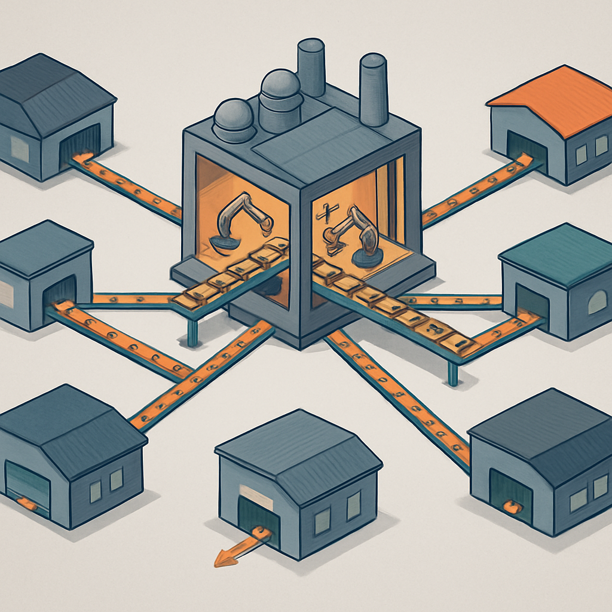

# Gobricks como Infraestrutura do Mercado



O conceito anterior estabeleceu que a fabricação de compatíveis com LEGO está extremamente concentrada em Guangdong — e que essa concentração cria um ecossistema vertical com custos de coordenação baixos e tolerâncias dimensionais altas. Mas dentro desse cluster, existe uma empresa que ocupa uma posição estruturalmente diferente de todas as outras: a Gobricks, nome comercial da Shantou City Golds Precision Technology (高德斯精密科技). Entender o papel dela é entender como o mercado de compatíveis de qualidade funciona por baixo.

A Gobricks não vende sets. Não tem personagens, não tem temas, não tem packaging de prateleira de brinquedoteca. O que ela vende é a peça avulsa — em qualquer quantidade, em qualquer cor disponível, com catálogo que cobre virtualmente todo elemento que a LEGO já produziu mais alguns que ela não produz. O modelo de negócio é inteiramente orientado a quem compra em quantidade com finalidade construtiva: MOCers, artistas, designers de sets independentes e, mais relevante para este livro, donos de negócios que precisam de insumo confiável em escala. Esse posicionamento faz da Gobricks o equivalente funcional de um fornecedor de componentes eletrônicos no mercado de EMS (Electronics Manufacturing Services) — você não vai ao Foxconn para comprar um smartphone, mas todo iPhone já passou por lá.

A escala de operação da Gobricks é o que diferencia estruturalmente o papel que ela ocupa no mercado. A empresa mantém dois parques fabris em Guangdong: um em Chaozhou com 200 máquinas de injeção, outro em Shantou com 100 máquinas. Operando essas 300 máquinas em plena carga, a capacidade instalada chega a 1 bilhão de peças por mês — e há planos de expansão para 3 bilhões mensais. Para ter dimensão do que isso significa: se você precisasse de 10 milhões de peças 1×1 plate em vermelho para um projeto de mosaico em escala industrial, a Gobricks produziria isso em menos de um dia de operação das suas linhas. O depósito AI (armazenagem automatizada por inteligência artificial) comporta até 120.000 caixas de armazenagem. As cores ABS ficam em silos de 4 toneladas cada, com 50 opções cromáticas disponíveis para injeção imediata.

A função OEM (Original Equipment Manufacturer) que a Gobricks desempenha é o elo mais importante para compreender por que várias marcas do mercado entregam qualidade consistente sem terem capacidade fabril própria equivalente. Mould King, Sembo, Super 18K, Rael e Xinyu — marcas que aparecem em avaliações como referências de qualidade em diferentes categorias de sets — dependem da Gobricks para mais de 90% das peças que colocam dentro das suas caixas. Pantasy, Power Build, Jaki e FunWhole também fazem parte da lista de clientes conhecidos, além de Decool via subsidiária JiSi. A Gobricks não publica uma lista oficial e fixada de clientes, mas o padrão identificado pela comunidade é consistente: quando uma marca de compatíveis é bem avaliada para peças básicas (plates, tiles, slopes), a probabilidade de ela estar usando Gobricks como fornecedor é alta.

A implicação direta desse modelo é o seguinte: quando você compra um set da Mould King e recebe peças básicas de qualidade notável — com clutch power firme, superfície sem rebarbas, cor sólida e uniforme —, você provavelmente está segurando uma peça fabricada pela Gobricks com o logo da Mould King na caixa. E quando você compra peças avulsas diretamente da Gobricks pelo canal mygobricks.com, está acessando o mesmo insumo que alimenta essas marcas, sem a margem que o branding intermediário adiciona. Para um negócio de mosaicos onde a peça 1×1 é o elemento de custo dominante, isso tem peso direto na conta.

O padrão de qualidade que a Gobricks atingiu resulta de um processo de engenharia que não é trivial. A empresa usa ABS virgem como matéria-prima padrão (não reciclado, que é a fonte das inconsistências de cor e rigidez nos genéricos baratos), com formulação que passou por certificações internacionais de segurança em brinquedos. O processo de injeção usa controle de temperatura e pressão apertados, com sistemas de visão computacional para inspeção de contagem e controle dimensional automatizados. O padrão de encaixe que a empresa adota como critério interno é o que a comunidade chama de "zero tolerance adaptation" — a geometria stud-and-tube é dimensionada para que o clutch power seja comparável ao da LEGO original, eliminando tanto o problema de peças que trancam irreversivelmente quanto o de peças que se soltam com o próprio peso. Em testes comparativos independentes, os resultados consistentemente colocam a Gobricks na faixa superior do mercado — alguns revisores reportam que o encaixe é ligeiramente mais firme do que o da LEGO, não mais frouxo.

Para quem vai comprar no mygobricks.com pela primeira vez, a interface funciona de forma diferente das lojas de sets. O fluxo padrão é:

```
1. Importar lista de peças (formato Rebrickable CSV ou planilha própria da plataforma)
2. O sistema resolve automaticamente quais GDS codes (código interno Gobricks) correspondem a cada elemento
3. Selecionar cor e quantidade por linha
4. O sistema verifica estoque em tempo real (sincronização live)
5. Checkout com envio consolidado de Shantou
```

O catálogo usa numeração interna GDS — cada elemento Gobricks tem um código GDS que mapeia para um número LDraw/BrickLink equivalente. A correspondência não é 1:1 perfeita em todos os casos (há elementos que a LEGO produz e a Gobricks não, e vice-versa), mas a cobertura supera 95% dos elementos mais usados em projetos de mosaico e MOC. Para peças 1×1 — plate (GDS-501, equivalente ao LEGO 3024), tile (GDS-601, equivalente ao LEGO 3070b) e round plate (GDS-855R, equivalente ao LEGO 4073) — o catálogo é completo e com alta disponibilidade de estoque.

A tabela abaixo resume o que diferencia a Gobricks de outras posições no mercado, para calibrar onde ela se encaixa no mapa mental que este subcapítulo está construindo:

| Dimensão | Gobricks | Marca de set (ex: Mould King) | Genérico sem marca (AliExpress) |
|---|---|---|---|
| Proposta de valor | Insumo B2B / peça avulsa em escala | Set completo com instruções | Volume baixo a baixo custo |
| Modelo de distribuição | mygobricks.com + revendedores autorizados | Loja própria + AliExpress + BrickLink | Vendedores individuais no AliExpress |
| Controle de qualidade | Tolerância dimensional rigorosa, ABS virgem | Depende do fabricante das peças (frequentemente Gobricks) | Variável, frequentemente sem especificação |
| Preço por peça (1×1, alta qtd) | US$ 0,02–0,05 aprox. | Embutido no preço do set | US$ 0,01–0,03, mas inconsistente |
| Pedido mínimo | Sem mínimo formal, mas frete compensa a partir de ~US$ 30–50 | Por set | Por lote/saco |
| Catálogo | 10.000+ elementos | Limitado aos elementos dos sets da marca | Limitado a elementos comuns |

Para quem está montando um negócio de mosaicos e precisa comprar peças 1×1 em cores específicas, o fluxo mais direto para qualidade controlada é: Gobricks como fornecedor primário, pedido via mygobricks.com com upload de lista exportada do Rebrickable ou gerada pelo software de design de mosaicos. Marcas como Mould King ou Sembo fazem sentido para adquirir conjuntos de elementos específicos (Technic, minifiguras, tiles especiais), mas para peças básicas de mosaico em quantidade, comprar diretamente da Gobricks elimina uma camada de margem sem abrir mão da qualidade que fez essas marcas funcionarem.

A analogia com Foxconn — que circula em vários textos da comunidade desde pelo menos 2020 — captura bem a dinâmica, mas tem um limite: Foxconn é invisível para o consumidor final. A Gobricks escolheu não ser invisível. Ela tem marca própria, canal direto de venda ao público e uma estratégia ativa de comunicação com a comunidade de MOCers. Isso significa que, diferente de Foxconn, você pode comprar Gobricks diretamente — e a comunidade global construiu um ecossistema de revendedores autorizados (Wobrick, Brickwith, mygobricks.com como loja oficial) que torna o acesso viável mesmo de fora da China.

## Fontes utilizadas

- [Gobricks the Foxconn of China Clone Bricks — Customize Minifigures Intelligence](https://customizeminifiguresintelligence.wordpress.com/2020/07/27/gobricks-the-foxconn-of-china-clone-bricks/)
- [What is Gobricks and why do builders love their bricks? — Latericius](https://latericius.com/en/blogs/blog/gobricks-what-it-isexactly-and-why-so-many-people-talk-about-their-bricks)
- [Gobricks vs LEGO Bricks: What's the Differences? — Lumibricks](https://www.lumibricks.com/blogs/news/lego-vs-gobricks-review)
- [Gobricks | MOCer's Premier Source for Compatibility and Quality](https://mygobricks.com/)
- [The 10 best LEGO compatible brands to try in 2024 — Latericius](https://latericius.com/en-eu/blogs/blog/best-lego-compatible-brands)
- [How to order GoBricks parts for MOCs? — BuyMeBricks](https://www.buymebricks.com/posts/how-to-order-gobricks-parts-mocs)

---

**Próximo conceito** → [Hierarquia de Qualidade — Top Tier, Intermediário e Genérico sem Controle](../03-hierarquia-de-qualidade-top-tier-intermediario-e-generico/CONTENT.md)
