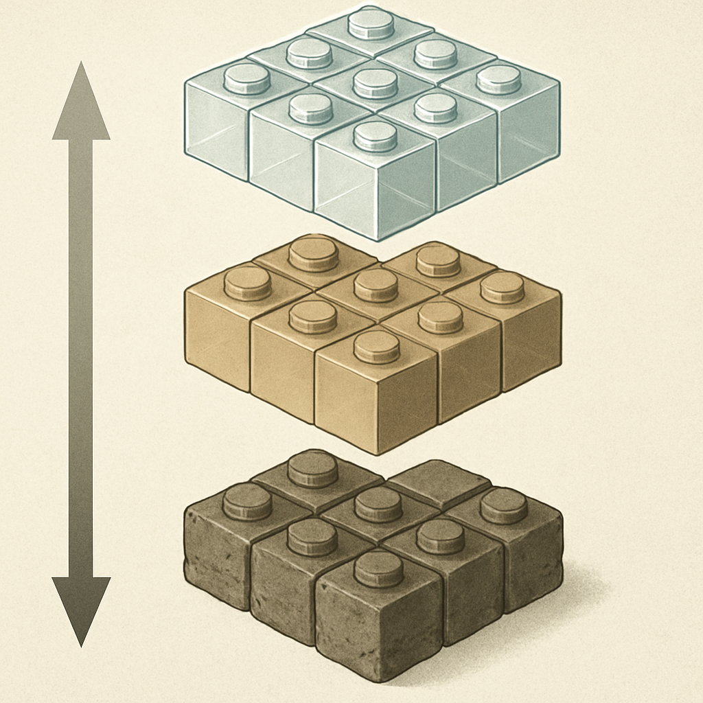

# Hierarquia de Qualidade — Top Tier, Intermediário e Genérico sem Controle

O conceito anterior mostrou que a Gobricks funciona como infraestrutura do mercado — fabricando OEM para Mould King, Sembo, Pantasy e dezenas de outros. Isso resolve parte do quebra-cabeça, mas abre uma pergunta inevitável: se várias marcas usam a mesma fornecedora de peças, por que ainda existe tanta variação de qualidade entre produtos no AliExpress? E o que exatamente separa uma peça "de qualidade" de uma peça "genérica"? A resposta exige entender a hierarquia que estrutura o mercado — não como ranking de marcas, mas como descrição de categorias com mecanismos diferentes de controle de processo.

O mercado de compatíveis tem três camadas funcionalmente distintas. A camada superior — o que a comunidade chama de top tier — é composta por fabricantes que controlam todo o processo produtivo com rigor e usam esse controle como diferencial competitivo. A Gobricks é o exemplo mais visível: ABS virgem (nunca reciclado), parâmetros de injeção apertados, inspeção automatizada por visão computacional, tolerância dimensional de 0,02 mm. A CaDA ocupa posição equivalente mas com modelo diferente: ao invés de ser OEM para outras marcas, ela produz seus próprios sets e mantém fabricação in-house com padrão semelhante ao da Gobricks para peças básicas — e com diferencial específico em peças Technic, onde o mercado de compatíveis historicamente era mais fraco. O critério de entrada no top tier não é o preço de venda, mas a evidência de que há um sistema de controle de qualidade real funcionando — moldes de aço de alta durabilidade, matéria-prima rastreável, inspeção por lote.

A camada intermediária cobre a maioria das marcas com nome e presença estabelecida no mercado. Mould King, Sembo, Pantasy, Super 18K, FunWhole, Jaki — todas têm um elemento em comum: dependem parcial ou majoritariamente da Gobricks como fornecedora de peças básicas. Isso significa que a qualidade das plates, tiles e slopes dentro de um set dessas marcas é, na prática, qualidade Gobricks — o que as coloca funcionalmente próximas ao top tier para os elementos mais usados em mosaico. O que as separa da camada superior é a consistência da cadeia completa: além das peças básicas, essas marcas incluem elementos especiais, peças Technic e itens decorativos que podem vir de outros fabricantes, com controle menos rigoroso. Numa compra de lote de 1×1 tiles de uma dessas marcas, a probabilidade de receber peça Gobricks — ou de qualidade comparável — é alta. Mas se o pedido inclui slopes grandes, painéis planos ou peças especiais, a variância aumenta.

A camada genérica — o bottom tier — é estruturalmente diferente das duas anteriores, e a diferença não é apenas de grau; é de natureza. Genéricos sem marca não são simplesmente fabricantes menores com menos recursos. São vendedores que frequentemente não controlam a origem das peças que vendem, ou que produzem com parâmetros de processo frouxos deliberadamente para reduzir custo por unidade. Os sinais práticos são conhecidos pela comunidade: ABS reciclado como matéria-prima, que introduz variação na fluidez do material durante a injeção e produz studs com geometria levemente arredondada em vez de cilíndrica precisa; moldes de alumínio ou aço de baixa durabilidade, que se desgastam mais rápido e introduzem imprecisão dimensional crescente ao longo da vida útil; ausência de controle de temperatura no processo de injeção, que gera warping (empenamento) em peças maiores; e coloração inconsistente entre lotes — o que em mosaico é crítico, porque duas sacolas de "vermelho" chegam em tons visivelmente diferentes.

A distinção técnica mais importante para quem compra peças para mosaico é o que acontece com o clutch power quando a tolerância dimensional sai da faixa correta. O sistema stud-and-tube tem uma faixa de tolerância estreita dentro da qual o encaixe funciona bem: o stud entra no tube com força suficiente para prender, mas sem exigir força excessiva para soltar. Quando a tolerância é mais larga do que o especificado, o stud entra sem resistência e a peça se solta com o próprio peso — problema fatal em qualquer estrutura. Quando é mais estreita, o encaixe é tão firme que a peça pode não sair sem deformar. A Gobricks escolheu errar levemente para o lado do clutch firme, o que é a decisão correta — uma peça que prende bem mas exige um pouco mais de força para soltar é utilizável; uma peça que cai é descarte. Genéricos sem controle frequentemente ficam no extremo oposto: tolerância mais larga, clutch insuficiente, e variação de lote para lote que torna impossível prever o que vai chegar na próxima compra.

A tabela abaixo mapeia as três camadas pelos critérios que importam para uma operação de mosaico:

| Critério | Top Tier (Gobricks, CaDA) | Intermediário (Mould King, Sembo, Pantasy) | Genérico sem marca |
|---|---|---|---|
| Matéria-prima | ABS virgem, formulação controlada | ABS virgem (quando Gobricks OEM) | ABS reciclado ou origem não rastreada |
| Tolerância dimensional | 0,02 mm ou melhor | Similar ao Gobricks para peças básicas | ±0,1 mm ou mais, variável por lote |
| Clutch power | Firme e consistente entre peças | Bom para elementos básicos | Inconsistente, frequentemente frouxo |
| Cor entre lotes | Alta consistência | Boa para peças Gobricks, variável para especiais | Variação visível entre sacolas do mesmo pedido |
| Warping em peças grandes | Raro, controlado | Ocasional em elementos especiais | Comum, especialmente em plates maiores |
| Preço por 1×1 plate (volume) | US$ 0,02–0,05 | Embutido no preço do set | US$ 0,01–0,02, mas com descarte provável |

O último ponto da tabela — preço com descarte provável — é onde o cálculo real de custo por peça útil diverge do custo nominal por peça comprada. Um lote de 1.000 peças genéricas a US$ 0,01 cada parece mais barato do que 1.000 peças Gobricks a US$ 0,03. Mas se 15% a 20% das peças genéricas chegam com clutch inaceitável ou cor errada (fora da faixa), o custo efetivo por peça utilizável sobe para US$ 0,012–0,013 — e isso sem contabilizar o tempo de triagem manual. Para um negócio onde o material de entrada é insumo de produção, não brinquedo casual, a triagem representa custo operacional real.

Há uma nuance importante que a hierarquia em três camadas simplifica: dentro do intermediário, a qualidade das peças depende fortemente de quais elementos você está comprando. Numa compra de Mould King focada em 1×1 plates e tiles — os elementos que a Gobricks fabrica com maior controle e que são os mais usados em mosaico — a experiência é essencialmente top-tier. Mas se o mesmo set incluir uma plate 4×12 de estrutura, há chance de warping. A hierarquia de camadas não é uma propriedade fixa de uma marca; é uma propriedade de cada elemento dentro do catálogo, mediada pelo processo que gerou aquela peça específica. Para quem compra exclusivamente peças 1×1 para mosaico — que é o caso de uso central deste livro —, a fronteira entre intermediário e top tier é praticamente irrelevante quando o intermediário usa Gobricks: a peça é a mesma.

Para o leitor que está montando sua primeira operação de mosaicos em São Paulo, isso se traduz em uma regra operacional simples: compre de fontes que você consegue rastrear até uma fabricante com controle de processo documentado. Gobricks diretamente via mygobricks.com garante que você está na camada superior. Marcas como Mould King, Sembo ou Pantasy em peças básicas entregam resultado equivalente a custo próximo — mas compre por set ou por peça avulsa de lojas que especificam o fabricante, não por lote a granel de vendedor anônimo. Quando a origem é opaca — listing genérico sem marca, preço muito abaixo da média, sem especificação de ABS virgem — você está no território do genérico sem controle, e o custo oculto de triagem e descarte costuma anular a vantagem de preço.

## Fontes utilizadas

- [The 10 best LEGO compatible brands to try in 2024 — Latericius](https://latericius.com/en/blogs/blog/best-lego-compatible-brands)
- [LEGO Alternatives: Comparing Lumibricks, COBI, Mould King & More (2025 Guide) — Bamgood Bricks](https://bamgoodbricks.com/blogs/lego-reviews/brick-alternatives-to-lego%C2%AE-how-do-they-compare)
- [Gobricks vs LEGO Bricks: What's the Differences? — Lumibricks](https://www.lumibricks.com/blogs/news/lego-vs-gobricks-review)
- [What is Gobricks and why do builders love their bricks? — Latericius](https://latericius.com/en/blogs/blog/gobricks-what-it-isexactly-and-why-so-many-people-talk-about-their-bricks)
- [LEGO Compatible Brands Review — CADA BRICKS](https://cada-bricks.com/blogs/lego/lego-compatible-brands-review)
- [Are LEGO-Compatible Knockoff Bricks Worth Buying? — How-To Geek](https://www.howtogeek.com/reasons-to-buy-lego-compatible-bricks-from-knockoff-brands/)
- [Lego-Compatible Brands: Comprehensive Comparison — UnofficialBricks](https://unofficialbricks.com/mainstream-lego-compatible-brands/lego-compatible-brands-a-comprehensive-comparison-of-features-prices-and-reviews/)
- [How to Choose the Best LEGO Bricks Chinese Alternatives — Alibaba](https://www.alibaba.com/product-insights/how-to-choose-the-best-lego-bricks-chinese-alternatives-a-complete-guide.html)

---

**Próximo conceito** → [Trajetória de Melhora da Última Década](../04-trajetoria-de-melhora-da-ultima-decada/CONTENT.md)
