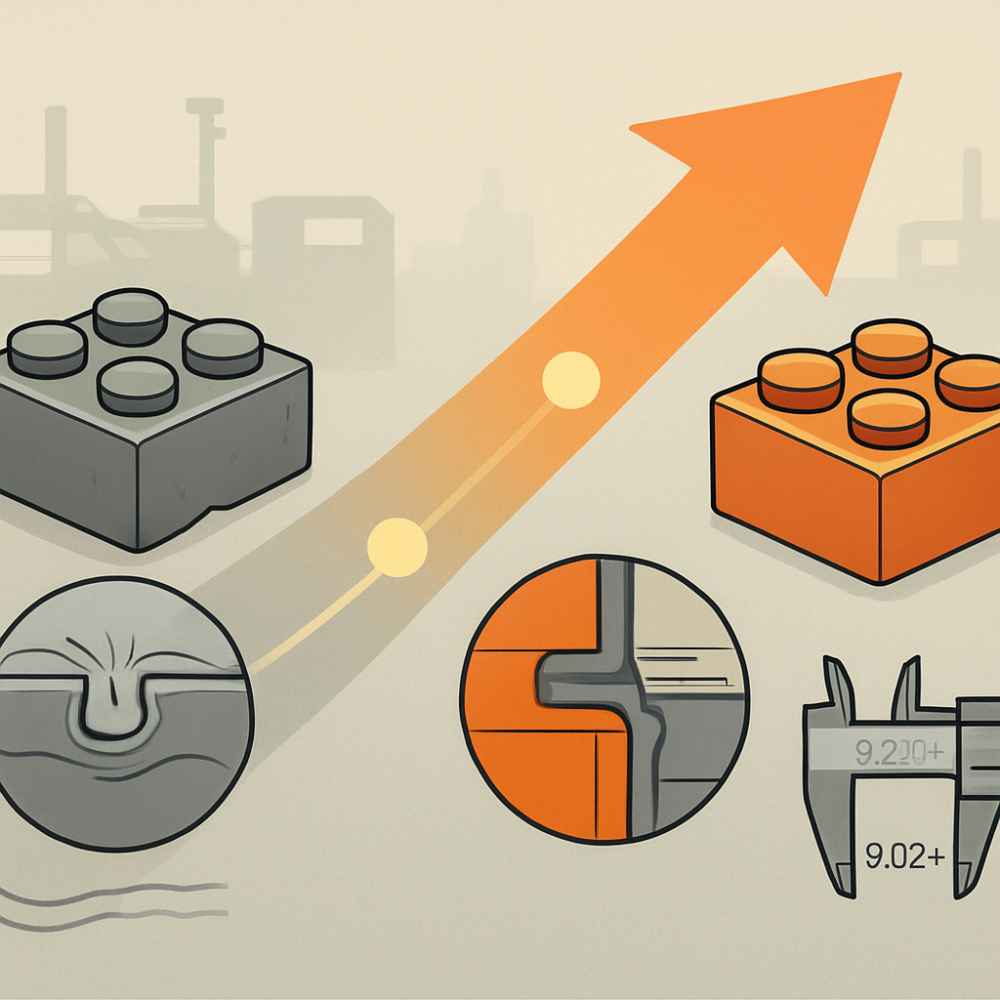

# Trajetória de Melhora da Última Década



A hierarquia de qualidade descrita no conceito anterior — top tier, intermediário, genérico — não é estática. Ela é o resultado de uma trajetória de dez anos que transformou radicalmente o que o mercado de compatíveis é capaz de entregar. Entender essa trajetória importa por uma razão prática: ela explica por que avaliações antigas de "clones chineses" são frequentemente inúteis para decisões de compra hoje, e por que o mercado atual pode ser confiável de formas que não eram possíveis em 2013 ou 2015.

O ponto de partida é o que o mercado de compatíveis era antes de 2015: um conjunto de marcas que competiam principalmente por preço, com qualidade como variável secundária. O ABS reciclado era predominante — barato, disponível em volume, mas com propriedades mecânicas inconsistentes lote a lote. Os moldes eram frequentemente de alumínio ou aço de baixa dureza, com tolerâncias na faixa de ±0,1 mm ou mais. O resultado prático era peças com clutch power imprevisível: algumas travavam, outras escorregavam, e duas sacolas do "mesmo produto" podiam ter comportamento dimensional diferente. A coloração variava visivelmente entre pedidos — o mesmo número de cor poderia chegar em tons diferentes dependendo da remessa. Para uso casual e infantil, esses problemas eram toleráveis. Para qualquer uso que exigisse consistência — mosaicos, MOCs estruturais, produção em escala — o mercado de compatíveis pré-2015 era genuinamente problemático.

O evento catalisador que reorientou o mercado foi, paradoxalmente, legal e não tecnológico. A consolidação dos casos judiciais entre 2005 e 2015 — precedentes estabelecidos em torno do sistema stud-and-tube como não-patenteável — deu a fabricantes sérios a segurança jurídica para investir em capacidade produtiva de longo prazo. Antes disso, havia risco real de que um investimento pesado em tooling de precisão fosse obsoletizado por uma decisão judicial desfavorável. Com o precedente firmado, o cálculo mudou: valia a pena construir infraestrutura de qualidade porque o mercado não seria fechado por decreto legal.

O segundo catalisador foi a pressão de mercado exercida pela comunidade de MOCers e criadores de sets independentes, que começou a crescer aceleradamente com plataformas como Rebrickable e iniciativas de financiamento coletivo de sets originais (crowdfunded sets). Essa comunidade é tecnicamente exigente e global — escreve reviews detalhados, compartilha fotos de cross-sections, mede clutch power com instrumentos de precisão e influencia onde o dinheiro de centenas de milhares de compradores vai. Para atender esse público, não bastava ser barato: era necessário ser dimensionalmente preciso e consistente.

A Gobricks, fundada em 2017, foi o marco mais visível dessa nova fase — não porque inventou a precisão, mas porque a tornou acessível em escala B2B. Como o conceito anterior detalhou, a empresa padronizou ABS virgem como matéria-prima, investiu em máquinas de injeção com controle de temperatura e pressão por zona, e implementou inspeção automatizada por visão computacional. O que importa para a trajetória é o efeito sistêmico: ao se tornar fornecedora OEM de Mould King, Sembo, Pantasy e dezenas de outras, a Gobricks elevou o patamar de qualidade das peças básicas em todo o segmento intermediário simultaneamente. Uma marca que antes dependia de moldes próprios mediocres passou a receber peças com tolerância de 0,02 mm sem precisar construir essa capacidade internamente.

```
Linha do tempo da evolução de qualidade

Antes de 2015   → ABS reciclado dominante, tolerâncias ±0,1 mm+, clutch imprevisível
2015–2016       → Consolidação jurídica, início de investimento em tooling de precisão
2017            → Fundação da Gobricks; CaDA lança com foco em qualidade in-house
2018–2019       → Gobricks começa a fornecer OEM para marcas estabelecidas
2020            → Comunidade identifica e documenta a Gobricks como "Foxconn dos tijolos"
2021–2022       → Expansão do catálogo Gobricks; revendedores globais (Wobrick, Brickwith)
2023–2024       → Planos de expansão para 3 bilhões de peças/mês; novos players de qualidade
```

O caso do Lepin — que dominou manchetes entre 2016 e 2019 — serve como contraponto revelador dessa trajetória. O Lepin era um clone de sets LEGO (não apenas de peças compatíveis), que reproduzia não só o sistema de encaixe mas as instruções, embalagens e temas licenciados — o que configurava violação de propriedade intelectual. A LEGO entrou com ação judicial em 2016, obteve decisão favorável em 2018, e os donos foram eventualmente presos. A qualidade das peças Lepin era notoriamente inferior: clutch frouxo em construções grandes, ABS com composição inconsistente, coloração instável. O caso importa para a trajetória porque consolidou na comunidade a distinção crítica: marcas que copiavam sets ilegalmente e usavam processo produtivo desleixado eram varridas do mercado, enquanto marcas que fabricavam peças compatíveis com processo rigoroso — sem copiar sets ou marcas registradas — prosperaram e se sofisticaram. A limpeza do mercado que o caso Lepin produziu foi, indiretamente, favorável às marcas sérias.

A melhora técnica da última década pode ser quantificada por algumas métricas que a comunidade acompanhou ao longo do tempo:

| Métrica | Antes de 2015 (mercado geral) | Hoje (top tier / intermediário com Gobricks) |
|---|---|---|
| Tolerância dimensional por peça | ±0,1 mm ou mais | 0,02 mm (top tier) |
| Matéria-prima predominante | ABS reciclado ou origem mista | ABS virgem com formulação controlada |
| Clutch power | Inconsistente, variável entre peças do mesmo lote | Firme e uniforme, próximo ao LEGO original |
| Variação de cor entre lotes | Visível a olho nu | Dentro de tolerância ΔE < 2 (imperceptível em mosaico) |
| Inspeção de qualidade | Manual, amostral ou inexistente | Automatizada por visão computacional, por lote |
| Warping em peças planas | Comum em plates maiores | Controlado com parâmetros de resfriamento apertados |

A coluna "antes de 2015" não descreve o que não existe mais — genéricos sem controle de processo ainda produzem com esses parâmetros hoje. O que mudou é que agora existe uma camada superior amplamente acessível que antes simplesmente não existia, e que o cluster de Guangdong tem capacidade instalada suficiente para produzir essa qualidade em escala de bilhões de peças mensais.

Há um detalhe que a trajetória revela sobre o que "qualidade" significa em diferentes momentos. Em 2013, a comparação de referência era "essa peça encaixa com LEGO?". A barra era baixa — se a peça cabia no stud sem travar, era considerada compatível. Em 2020, a comparação evoluiu para "essa peça tem o mesmo clutch power que o LEGO?". Em 2024, a conversa em fóruns especializados é sobre consistência de cor entre lotes medida por colorímetro e sobre variação dimensional em amostras de mil peças. O fato de a comunidade ter refinado a própria métrica de avaliação ao longo do tempo é evidência de que a qualidade geral subiu o suficiente para tornar os critérios anteriores insuficientes como diferenciadores.

Para quem está comprando peças para mosaico em São Paulo hoje, essa trajetória tem uma implicação direta: o mercado chegou a um ponto em que a qualidade técnica das peças — clutch, tolerância, cor — não é mais a variável de risco principal para fornecedores rastreáveis. Como o conceito da hierarquia estabeleceu, comprar de Gobricks diretamente ou de marcas que documentam uso de Gobricks como OEM entrega consistência que seria impensável dez anos atrás. A variável de risco que permanece real é a logística — prazo, frete, disponibilidade de estoque — e não a qualidade intrínseca da peça. Isso é uma mudança fundamental na equação de compra.

## Fontes utilizadas

- [What is Gobricks and why do builders love their bricks? — Latericius](https://latericius.com/en/blogs/blog/gobricks-what-it-isexactly-and-why-so-many-people-talk-about-their-bricks)
- [Gobricks the Foxconn of China Clone Bricks — Customize Minifigures Intelligence](https://customizeminifiguresintelligence.wordpress.com/2020/07/27/gobricks-the-foxconn-of-china-clone-bricks/)
- [Lego clone — Wikipedia](https://en.wikipedia.org/wiki/Lego_clone)
- [LEGO wins lawsuit against Lepin in China — Brickset](https://brickset.com/article/39608/lego-wins-lawsuit-against-lepin-in-china)
- [The LEPIN case: The brand that shook the brick world — Latericius](https://latericius.com/en/blogs/blog/the-lepin-case-the-brand-that-shook-the-brick-world)
- [Gobricks vs LEGO Bricks: What's the Differences? — Lumibricks](https://www.lumibricks.com/blogs/news/lego-vs-gobricks-review)
- [LEGO's 0.002mm Specification and Its Implications for Manufacturing — The Wave](https://www.thewave.engineer/articles.html/productivity/legos-0002mm-specification-and-its-implications-for-manufacturing-r120/)
- [These brands use GoBricks, the most popular LEGO-compatible alternative bricks — Brick Anatomy](https://www.brickanatomy.org/2024/02/these-brands-use-gobricks-the-most-popular-lego-compatible-alternative-bricks.html)
- [The 10 best LEGO compatible brands to try in 2024 — Latericius](https://latericius.com/en-eu/blogs/blog/best-lego-compatible-brands)

---

**Próximo subcapítulo** → [Legalidade, Ética e Comunicação com o Cliente](../../04-legalidade-etica-e-comunicacao-com-o-cliente/CONTENT.md)
