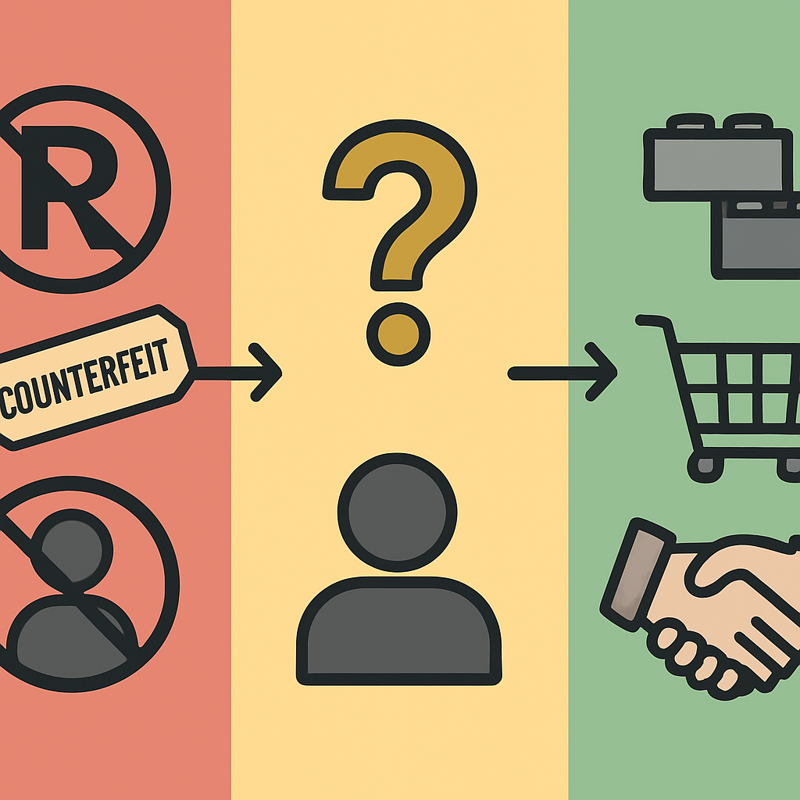

# O que É Definitivamente Proibido

A clareza sobre o que é proibido não é um exercício legal abstrato — é o piso operacional do negócio. Saber onde está a linha com precisão é o que permite explorar com segurança todo o espaço que fica do lado de cá dela. Para um negócio de mosaicos e esculturas que usa peças compatíveis como insumo, essa linha é mais estreita do que a maioria das pessoas imagina: a enorme maioria das práticas do dia a dia fica bem longe dela.

A confusão vem de uma troca conceitual frequente: pessoas equiparam "usar peças compatíveis" com "usar algo protegido pela LEGO". Essa equação é errada. O sistema de encaixe — o stud e o tube, a geometria que permite a interoperabilidade — é domínio público desde 1978, quando expiraram as patentes originais. Nenhuma lei protege geometria de encaixe que já está em domínio público. O que a LEGO ainda protege é um conjunto diferente de ativos: sua marca registrada, a aparência específica da minifigura e os designs de conjuntos que incorporam propriedade intelectual licenciada de terceiros. É sobre esses três pilares que o proibido se sustenta.

**O primeiro pilar: a marca registrada "LEGO".** O nome LEGO é uma marca registrada ativa, e usá-la para descrever ou comercializar produtos sem autorização da empresa é infração de marca — independentemente de qual seja o produto. Isso tem implicações práticas diretas para qualquer negócio que venda mosaicos feitos com peças compatíveis:

- Anunciar um produto como "mosaico de LEGO" quando as peças não são originais LEGO é afirmação falsa de origem — está proibido.
- Usar "LEGO" no nome do produto, no nome da loja ou no domínio do site cria a impressão de vínculo oficial com a empresa — está proibido.
- Incluir o logo LEGO em qualquer material de marketing ou embalagem, mesmo com disclaimer, não sanitiza o uso — está proibido.
- Dizer a um cliente que o produto usa "peças LEGO" quando não usa — está proibido, e é adicionalmente um problema de relação de consumo, não só de propriedade intelectual.

A política oficial da LEGO (Fair Play) deixa isso explícito: a marca deve ser usada como adjetivo, nunca como substantivo ou nome genérico do produto. Dizer "mosaico montado com peças compatíveis com o sistema LEGO" é diferente de dizer "mosaico de LEGO" — a primeira é descritiva e legal, a segunda é atribuição de origem e está proibida quando as peças não são originais.

**O segundo pilar: a minifigura.** Enquanto o tijolo em si perdeu proteção de patente décadas atrás e tentativas de registrá-lo como marca falharam nos tribunais europeus (o Tribunal de Justiça da UE decidiu em 2010 que a forma do tijolo é puramente funcional e não pode ser protegida como marca), a minifigura teve trajetória diferente. A LEGO registrou a minifigura como marca tridimensional na União Europeia em 2000, e esse registro sobreviveu a contestações porque os tribunais reconheceram que os elementos visuais da figura — a cabeça cilíndrica, o tronco trapezoidal, as proporções dos membros — não são necessários para a função técnica do brinquedo. Eles existem para dar aparência humana, o que os torna distintivos e protegíveis como marca.

O que isso proíbe na prática é reproduzir a silhueta geral reconhecível da minifigura LEGO. O tribunal deixou claro, porém, que a compatibilidade técnica — ou seja, uma figura que se encaixa no sistema de blocos — não pode ser monopolizada. Fabricantes como Gobricks e outras marcas sérias podem produzir figuras humanoides compatíveis com o sistema, desde que a aparência geral difira suficientemente da minifigura protegida. O que não é permitido é o clone visual direto.

**O terceiro pilar: propriedade intelectual licenciada.** Conjuntos como Star Wars, Harry Potter, Marvel, DC e Minecraft existem porque a LEGO pagou por licenças para usar essas propriedades intelectuais. Essas licenças pertencem aos detentores originais dos direitos — Disney, Warner Bros., Universal, Microsoft — e não à LEGO. Fabricar ou vender produtos que reproduzam personagens, veículos ou elementos desses universos sem licença própria é violação direta dos direitos autorais e de marca dos detentores, independentemente de usar peças LEGO ou compatíveis.

O caso Lepin ilustra bem a distinção. A marca chinesa foi processada e condenada não por fabricar peças com sistema de encaixe compatível, mas por copiar integralmente sets LEGO — incluindo instruções, embalagens e todos os designs proprietários — e por reproduzir designs que incluíam propriedade licenciada de terceiros. O sistema de encaixe não foi o problema; a cópia de obras protegidas foi.

Organizando as três categorias em uma tabela:

| Categoria | O que é proibido | Base legal |
|---|---|---|
| Marca registrada | Usar "LEGO" no nome do produto, loja, domínio, marketing, ou afirmar que peças compatíveis são originais LEGO | Direito de marcas |
| Design da minifigura | Reproduzir a silhueta reconhecível da minifigura LEGO (cabeça cilíndrica, tronco trapezoidal, proporções características) | Marca tridimensional registrada (UE) |
| PI licenciada de terceiros | Reproduzir personagens, veículos ou elementos de universos licenciados (Star Wars, Harry Potter, Marvel, etc.) | Direito autoral e licenças dos detentores originais |

Para o negócio de mosaicos, o risco real está quase inteiramente na primeira categoria. Mosaicos planares com peças coloridas não reproduzem minifiguras e não envolvem propriedade licenciada — a exposição de risco é zero nesses dois pilares. O único vetor que requer atenção contínua é o linguístico: como o produto é descrito, como a loja é nomeada e o que é dito ao cliente quando ele pergunta sobre as peças. Esse é o tema dos conceitos seguintes do subcapítulo.

## Fontes utilizadas

- [Fair Play | Notices & Policies | Legal | LEGO.com US](https://www.lego.com/en-us/legal/notices-and-policies/fair-play)
- [The history of trademark dispute over LEGO minifigures — JMBricklayer](https://www.jmbricklayer.com/blogs/knowledge/the-history-of-trademark-dispute-over-lego-minifigures)
- [Lego Wins Minifigure Copyright, Trademark Suit Over Copycat — Bloomberg Law](https://news.bloomberglaw.com/ip-law/lego-wins-copyright-trademark-claims-over-minifigure-competitor)
- [How Lego legally locked in the iconic status of its mini-figures — The Conversation](https://theconversation.com/how-lego-legally-locked-in-the-iconic-status-of-its-mini-figures-43489)
- [LEGO brick not a trademark, court rules — CNN](https://edition.cnn.com/2010/BUSINESS/09/15/eu.lego.trademark/index.html)
- [Everyday IP: The building blocks of LEGO law — Dennemeyer](https://www.dennemeyer.com/ip-blog/news/everyday-ip-the-building-blocks-of-lego-law/)
- [LEGO Sues Toy Company For Trademark and Copyright Infringement — Garbis Law](https://www.garbislaw.com/lego-sues-toy-company-for-trademark-and-copyright-infringement)
- [The LEGO Group takes action against clone brand LEPIN — BrickBrains](https://brickbrains.com/2016/09/the-lego-group-takes-legal-action-against-chinese-clone-brand-lepin/)
- [Lego clone — Wikipedia](https://en.wikipedia.org/wiki/Lego_clone)

---

**Próximo conceito** → [O que É Completamente Permitido](../02-o-que-e-completamente-permitido/CONTENT.md)
