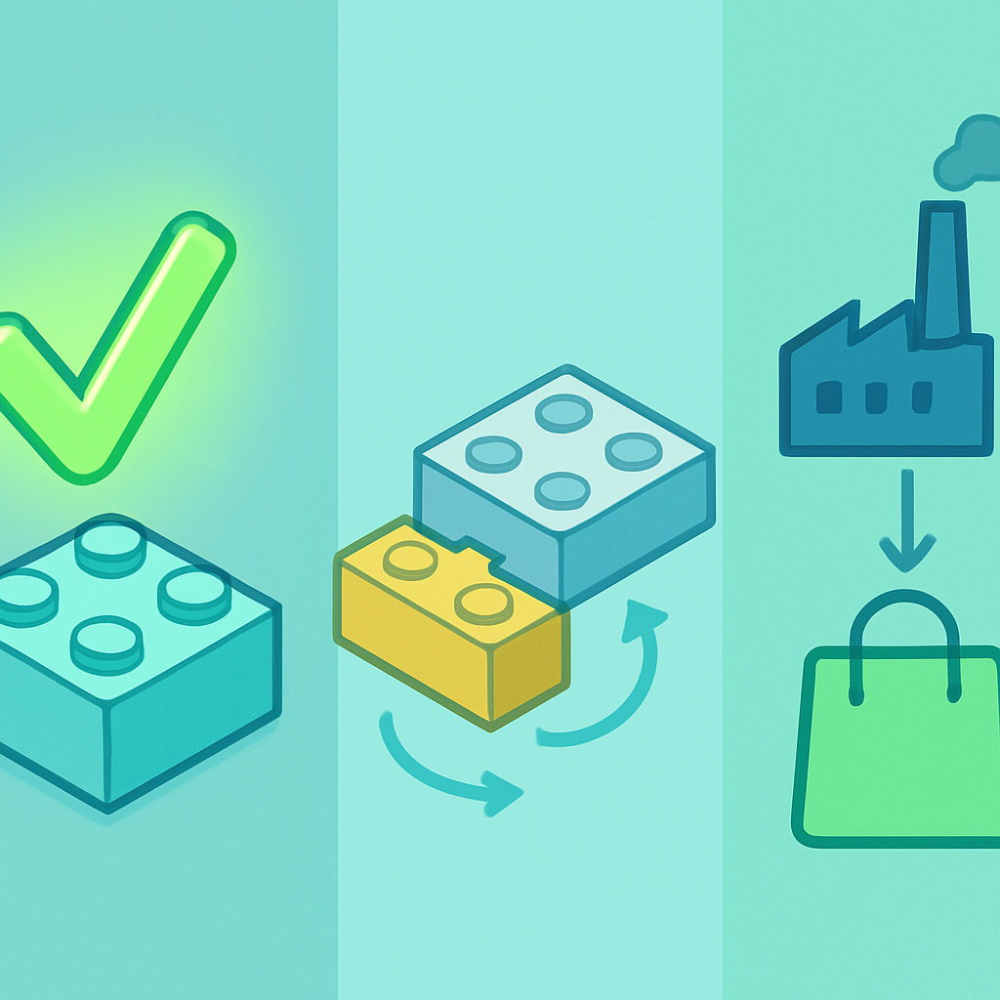

# O que É Completamente Permitido

Se o conceito anterior mapeou o perímetro — a linha que não se cruza — este conceito trata do vasto território que fica do lado de cá. E ele é muito maior do que a maioria das pessoas imagina na primeira vez que pensa no assunto.

O ponto de partida é o mesmo que foi estabelecido quando o sistema de encaixe stud-and-tube entrou em domínio público em 1978: a geometria de interoperabilidade pertence a todos. Isso não é uma permissão concedida pela LEGO — é uma consequência direta da natureza do regime de patentes, que concede exclusividade temporária precisamente para que, depois de expirado o prazo, a inovação se torne patrimônio comum. Qualquer fabricante, em qualquer país, pode hoje projetar moldes de injeção que produzam peças nessas dimensões. Qualquer loja pode comprá-las e revendê-las. Qualquer pessoa ou negócio pode usá-las como insumo de produção — misturadas ou não com originais LEGO — sem pedir permissão, sem pagar royalty, sem licença.

O caso Tyco de 1987 nos tribunais americanos foi o primeiro grande teste desta lógica depois da expiração das patentes. A LEGO processou a Tyco alegando concorrência desleal e uso do trade dress da empresa. O tribunal decidiu que Tyco tinha o direito de fabricar e vender tijolos compatíveis — o que a corte proibiu foi exclusivamente o uso da marca LEGO no marketing e alegações de que os produtos eram "LEGO, só que mais baratos". A conclusão foi precisa: o encaixe é livre, a marca não é. Dezoito anos depois, a Suprema Corte do Canadá reafirmou esse princípio no caso Mega Bloks, confirmando que nenhum instrumento de propriedade intelectual — nem patente, nem marca, nem copyright — pode reconstruir um monopólio sobre um sistema técnico em domínio público.

Isso cria um espaço operacional muito bem delimitado para um negócio de mosaicos. Dentro desse espaço, tudo que segue é completamente permitido:

| Atividade | Permitido? | Observação |
|---|---|---|
| Comprar peças compatíveis de fabricantes como Gobricks, Mould King, Cada | Sim | Comércio ordinário entre empresas |
| Revender peças compatíveis avulsas (no varejo ou para outros fabricantes) | Sim | Não há restrição de canal de distribuição |
| Usar peças compatíveis como insumo para fabricar produtos físicos (mosaicos, esculturas) | Sim | O produto final pertence ao criador |
| Misturar peças compatíveis com peças originais LEGO no mesmo produto | Sim | A interoperabilidade é o propósito do domínio público |
| Descrever peças compatíveis como "compatíveis com o sistema LEGO" em material de marketing | Sim | Uso descritivo referencial — não atribui origem LEGO |
| Vender produtos físicos feitos com peças compatíveis sem mencionar LEGO | Sim | Produto próprio, insumo irrelevante para o cliente |
| Comprar peças LEGO originais de segunda mão e revendê-las | Sim | Doutrina da primeira venda — exaure o controle do fabricante após a venda inicial |

A doutrina da primeira venda merece atenção porque é frequentemente mal entendida. Uma vez que a LEGO vende uma peça, ela perde o controle legal sobre aquela peça específica. O comprador pode usá-la, revendê-la, usá-la em projetos comerciais, integrá-la a produtos que serão vendidos — tudo sem restrição. Isso se aplica igualmente a peças originais e a compatíveis que já entraram em circulação comercial legalmente.

O ponto que mais gera confusão no contexto de negócios de mosaicos é a mistura. Muitos artesãos e negócios usam peças originais LEGO onde a disponibilidade de cor é melhor — certos tons de azul ou tons de bege, por exemplo, são mais consistentes no catálogo original — e compatíveis para as cores padrão de alto volume. Essa mistura é completamente lícita. Não há regra que exija homogeneidade de origem das peças dentro de um produto. O cliente que recebe um mosaico está comprando o resultado visual, não o certificado de origem de cada peça. E como o conceito anterior deixou claro, o único vetor de risco é linguístico — o que se diz sobre o produto, não o que o produto contém.

Um detalhe técnico que sela a questão para mosaicos planares especificamente: o sistema de encaixe é a única coisa que define se uma peça é "LEGO-compatível". Mosaicos feitos com peças 1×1 plates, tiles ou round plates vistas de frente funcionam como uma grade de pixels. Nenhum dos elementos proibidos — a marca registrada LEGO, a silhueta da minifigura, as propriedades licenciadas de terceiros — tem qualquer relevância para esse produto. Um mosaico de retrato feito com peças coloridas é, do ponto de vista legal, idêntico a um mosaico feito com azulejos cerâmicos genéricos: o fabricante escolhe o insumo, combina, monta e vende o resultado. Não há nada para negociar com a LEGO, não há licença necessária, não há zona cinzenta.

Empresas como Brick Me e Art4Bricks operam exatamente nesse modelo — negócios comerciais que constroem e vendem mosaicos customizados usando peças compatíveis, sem qualquer rubrica especial de permissão. Elas existem e crescem porque o espaço legal que descrevemos aqui é real e estável, não uma brecha que pode ser fechada. A abertura que expiraram as patentes criou é estrutural, não acidental.

O conforto operacional que isso traz é este: as decisões de compra, qualidade, marca e logística que preenchem o restante do livro podem ser tomadas inteiramente com critérios de negócio — custo por peça, consistência de cor, prazo de entrega, confiabilidade do fornecedor. Não há nenhuma variável legal que precise entrar no modelo de decisão, contanto que o marketing respeite a linha do conceito anterior.

## Fontes utilizadas

- [Lego clone — Wikipedia](https://en.wikipedia.org/wiki/Lego_clone)
- [Fake LEGO®s? The truth behind LEGO®'s patents — Latericius](https://latericius.com/en/blogs/blog/fake-legos)
- [Lego Compatible: The Intellectual Property Cases of Alternative Bricks — Brick Toad](https://bricktoad.com/posts/lego-compatible-alt-bricks/)
- [Everyday IP: The building blocks of LEGO law — Dennemeyer](https://www.dennemeyer.com/ip-blog/news/everyday-ip-the-building-blocks-of-lego-law/)
- [Lego vs. Tyco: The Battle of the Bricks — The Retroist](https://www.retroist.com/p/lego-vs-tyco-the-battle-of-the-bricks)
- [LEGO, TYCO EACH DECLARE VICTORY IN BATTLE OF THE BRICKS — The Washington Post](https://www.washingtonpost.com/archive/business/1987/09/01/lego-tyco-each-declare-victory-in-battle-of-the-bricks/0d3f7283-37d7-4687-8f3e-ec5cb14d173b/)
- [Interlego AG v Tyco Industries Inc — Wikipedia](https://en.wikipedia.org/wiki/Interlego_AG_v_Tyco_Industries_Inc)
- [Can you commercially manufacture Lego compatible building blocks? — Quora](https://www.quora.com/Can-you-commercially-manufacture-Lego-compatible-building-blocks)
- [Personalized Brick Mosaic — Brick Me](https://brick.me/products/personalized-brick-mosaic-custom-mosaic-maker-lego-compatible-art)
- [The ultimate guide to LEGO® compatible building blocks — Latericius](https://latericius.com/en/blogs/blog/lego-compatible-building-blocks)

---

**Próximo conceito** → [Como a LEGO Respondeu à Concorrência](../03-como-a-lego-respondeu-a-concorrencia/CONTENT.md)
