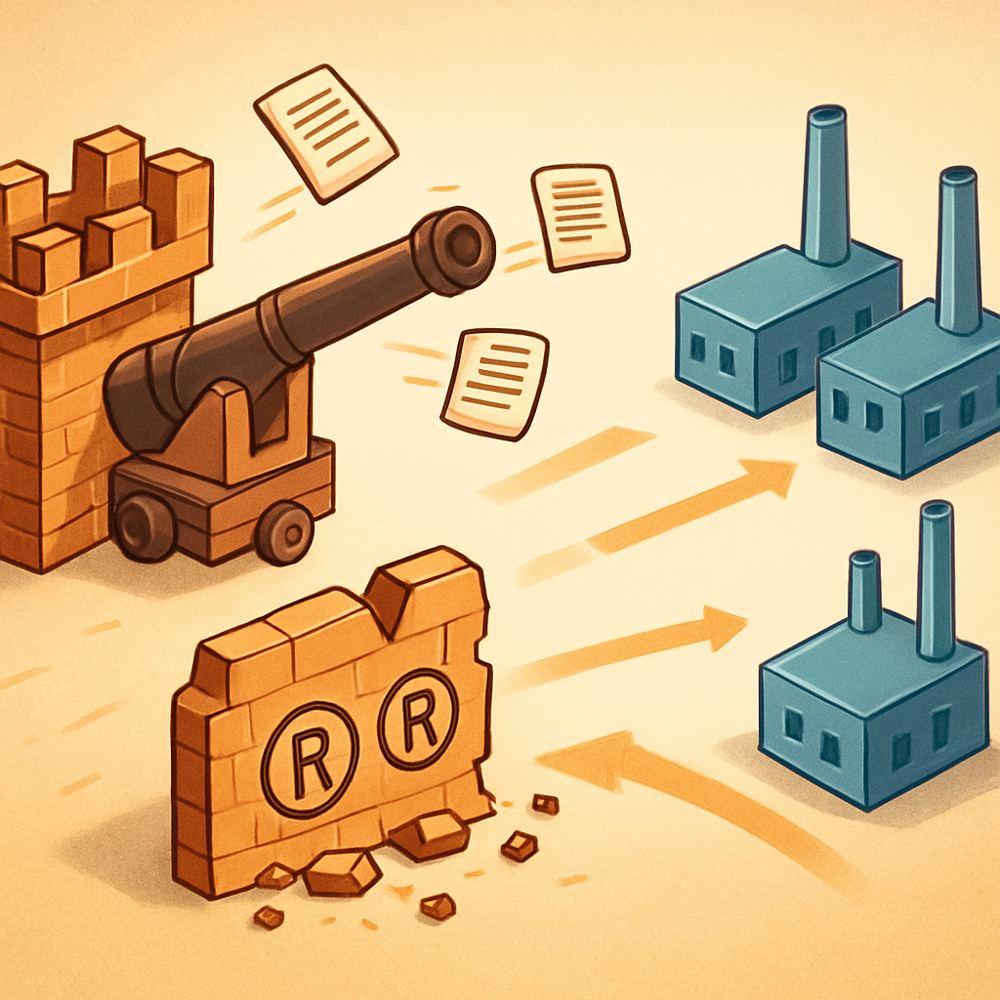

# Como a LEGO Respondeu à Concorrência



Os dois conceitos anteriores deste subcapítulo estabeleceram o mapa legal do território: de um lado, os três pilares do que é proibido — a marca registrada, a minifigura como marca tridimensional e a propriedade intelectual licenciada de terceiros; de outro, o vasto espaço de tudo que é completamente livre, incluindo fabricar, comprar, misturar e revender peças com sistema de encaixe compatível. Mas esse mapa não surgiu pronto. Ele foi desenhado — e testado — ao longo de quatro décadas de litígios, e o resultado final foi moldado tanto pelas tentativas da LEGO quanto pelas decisões dos tribunais que rejeitaram boa parte dessas tentativas. Entender essa história resolve uma questão que pode ficar submersa na leitura dos dois conceitos anteriores: "se é tão claramente permitido, por que alguém ainda duvida?". A resposta está em quanto a LEGO lutou para que não fosse.

Quando as patentes do sistema stud-and-tube expiraram em 1978, a LEGO não capitulou silenciosamente. A empresa era suficientemente poderosa e suficientemente lucrativa para tentar transformar o que havia perdido em patente em algo que pudesse recriar pela via de marcas registradas — e passou as décadas seguintes testando essa estratégia nos tribunais de pelo menos quatro países ao mesmo tempo.

A primeira grande batalha foi contra a Tyco Industries, nos Estados Unidos, em 1987. A LEGO processou a Tyco alegando concorrência desleal e uso indevido do trade dress da empresa — o argumento era que o tijolo LEGO tinha características visuais próprias que mereciam proteção mesmo depois de expirada a patente. O tribunal americano decidiu em favor da Tyco: os blocos compatíveis podiam continuar sendo fabricados e vendidos. O que a corte proibiu foi exclusivamente o uso da marca "LEGO" no marketing da Tyco e a afirmação de que os produtos eram "LEGO, só que mais baratos". O encaixe era livre; a marca não era. O resultado foi exatamente o mesmo mapa que os dois conceitos anteriores descreveram — só que retirado de dentro de um processo judicial, não de uma análise prévia.

A LEGO não parou. Nos anos 1990, a empresa voltou aos tribunais, dessa vez contra a empresa canadense Mega Bloks, com o argumento de que o próprio uso do sistema stud-and-tube — a geometria de encaixe agora em domínio público — poderia ser protegido como marca tridimensional. A ideia era que a aparência do tijolo LEGO, mesmo sem proteção de patente, tinha se tornado tão associada à empresa que os consumidores confundiriam qualquer tijolo compatível com um produto LEGO original — o que configuraria violação de marca por confusão de origem. Em novembro de 2005, a Suprema Corte do Canadá rejeitou esse argumento de forma categórica e unânime. O tribunal formulou o princípio com precisão cirúrgica: direito de marcas não pode ser usado para perpetuar um monopólio que o direito de patentes já concedeu e que já expirou. Se a exclusividade sobre o sistema de encaixe acabou com a patente, nenhuma outra proteção pode recriá-la.

Cinco anos depois, em setembro de 2010, o Tribunal de Justiça da União Europeia encerrou a última grande tentativa de proteger o tijolo como marca. A LEGO havia registrado o design do tijolo clássico de 8 studs como marca tridimensional na Europa e defendeu esse registro contra a contestação da Mega Bloks. O tribunal europeu derrubou o registro com o mesmo raciocínio: a geometria do tijolo é puramente funcional — ela existe para permitir o encaixe, e não para identificar origem comercial. Forma que serve apenas a uma função técnica não pode ser marca.

```
Linha do tempo das batalhas jurídicas:

1978 ─── Expiração da patente stud-and-tube (EUA)
   │
1987 ─── Tyco (EUA): LEGO perde o argumento de trade dress
   │         → Tijolos compatíveis: liberados
   │         → Uso da marca LEGO pelo concorrente: proibido
   │
1990s ── Mega Bloks (Canadá): LEGO tenta marca tridimensional
   │
2005 ─── Suprema Corte do Canadá: derrota definitiva para LEGO
   │         → "Trademark law cannot perpetuate an expired patent monopoly"
   │
2010 ─── Tribunal de Justiça da UE: tijolo de 8 studs removido como marca
   │         → Forma puramente funcional não é protegível como marca
   │
2019 ─── LEGO vence contra Lepin na China
              → Base: copyright de sets específicos e marca registrada
              → Compatibilidade técnica: NÃO foi o fundamento da condenação
```

O caso Lepin, que aparece ao final dessa linha do tempo, merece leitura cuidadosa porque é frequentemente citado como prova de que a LEGO ainda pode processar fabricantes de compatíveis — o que é uma leitura equivocada. Em 2019, a LEGO venceu uma ação de grande repercussão contra a Lepin na China, com o tribunal de Guangdong ordenando indenizações de aproximadamente 4,5 milhões de renminbis, valor que foi elevado para 30 milhões de renminbis na apelação em 2021. Mas o fundamento da condenação não foi a fabricação de peças compatíveis. A Lepin não foi processada por fabricar tijolos no sistema de encaixe LEGO — ela foi processada por copiar integralmente sets específicos da LEGO, reproduzindo as instruções, as embalagens e os designs de conjuntos que incluíam propriedade licenciada de terceiros. O tribunal enquadrou a conduta como violação de direito autoral sobre obras tridimensionais e como concorrência desleal por parasitismo. O encaixe técnico não aparece como violação. A Gobricks, o Mould King e dezenas de outros fabricantes continuam operando livremente porque não fazem o que a Lepin fazia.

O que emerge de toda essa trajetória não é uma LEGO magnânima que decidiu generosamente tolerar seus concorrentes. É uma empresa que tentou de forma agressiva e sistemática manter o controle sobre um sistema técnico que os tribunais, repetidamente e em múltiplas jurisdições, reconheceram como patrimônio comum. A coexistência pacífica atual não é uma política escolhida pela LEGO — é o resultado de décadas de litígios que a empresa perdeu nos pontos que realmente importavam.

A resposta da LEGO nas últimas duas décadas se deslocou, consequentemente, do campo jurídico para o campo de produto e marketing. A turnaround liderada por Jørgen Vig Knudstorp a partir de 2004 reorganizou a empresa em torno de princípios que as patentes expiradas não podiam mais proteger: qualidade de fabricação consistente, experiência de marca consolidada (LEGOLAND, filmes, videogames, parcerias com franquias de entretenimento), comunidade ativa (LEGO Ideas, VIP program) e portfólio de licenças exclusivas de propriedade intelectual de alto valor — Star Wars, Harry Potter, Marvel — que nenhum fabricante compatível pode reproduzir. Em outras palavras, a LEGO migrou sua vantagem competitiva de ativos que expiravam (patentes) para ativos que se renovam e se aprofundam com o tempo (marca, ecossistema, licenças, comunidade).

Esse deslocamento estratégico é o que explica a coexistência atual. Gobricks, Mould King, Cada e dezenas de outros fabricantes operam abertamente, exibem compatibilidade com o sistema LEGO em seus sites e vendem para o mundo inteiro. A LEGO não processa nenhum deles — não porque não possa, mas porque não há base legal para isso, como os tribunais demonstraram repetidamente, e porque o negócio desses fabricantes (peças avulsas para MOCers e produtores de mosaicos, como você) ocupa um segmento que a LEGO não serve com eficiência e não tem interesse estratégico em servir.

Para um negócio de mosaicos operando em São Paulo, essa trajetória importa por uma razão prática muito concreta: ela confirma que a estabilidade do espaço legal que os dois conceitos anteriores descreveram não é contingente à boa vontade de nenhuma empresa. Ela foi consolidada por decisões judiciais vinculantes em múltiplas jurisdições ao longo de quase quarenta anos. Nenhuma mudança de estratégia da LEGO pode reverter o que a Suprema Corte do Canadá estabeleceu em 2005 ou o que o Tribunal de Justiça da UE estabeleceu em 2010. Fabricar e usar peças compatíveis é direito adquirido por via judicial — não permissão concedida.

## Fontes utilizadas

- [Lego clone — Wikipedia](https://en.wikipedia.org/wiki/Lego_clone)
- [Kirkbi AG v Ritvik Holdings Inc — Wikipedia](https://en.wikipedia.org/wiki/Kirkbi_AG_v_Ritvik_Holdings_Inc)
- [Lego vs. Tyco: The Battle of the Bricks — The Retroist](https://www.retroist.com/p/lego-vs-tyco-the-battle-of-the-bricks)
- [Lego Loses Trademark Battle in Canada — Smart Biggar](https://www.smartbiggar.ca/insights/publication/lego-loses-trademark-battle-in-canada---update)
- [LEPIN case — LEGO.com](https://www.lego.com/en-us/aboutus/news/2019/october/lepin-case)
- [LEGO vs. LEPIN: How Punitive Damages work in a Trademark Infringement Case — LinkedIn](https://www.linkedin.com/pulse/lego-vs-lepin-how-punitive-damages-work-trademark-infringement-zhu)
- [Protecting the Brick: LEGO's Global IP Enforcement Efforts — WilmerHale](https://www.wilmerhale.com/-/media/files/shared_content/editorial/publications/documents/2015-08-03-protecting-the-brick-legos-global-ip-enforcement-efforts.pdf)
- [From Bankruptcy to Billions: Lego's Blueprint for Business Transformation — The Strategy Institute](https://www.thestrategyinstitute.org/insights/from-bankruptcy-to-billions-legos-blueprint-for-business-transformation)
- [Everyday IP: The building blocks of LEGO law — Dennemeyer](https://www.dennemeyer.com/ip-blog/news/everyday-ip-the-building-blocks-of-lego-law/)

---

**Próximo conceito** → [A Pergunta do Cliente — Três Abordagens Práticas para Responder](../04-a-pergunta-do-cliente-tres-abordagens-praticas/CONTENT.md)
