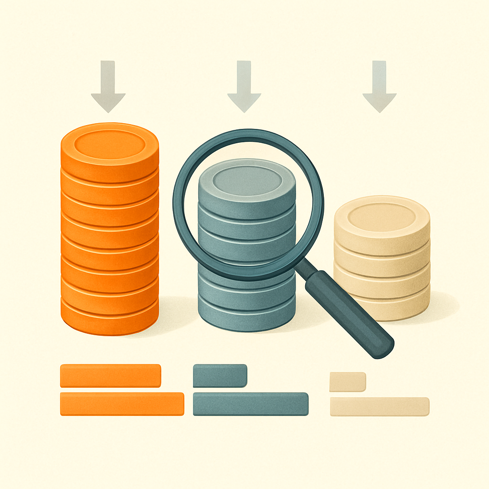

# O Custo por Peça na Prática

Este subcapítulo existe porque o raciocínio sobre compatíveis, até aqui, foi histórico e conceitual — patentes expiradas, vocabulário do mercado, fabricantes de Guangdong, legalidade. Tudo isso importa, mas nenhum desses tópicos responde à pergunta que o dono de um negócio de mosaicos precisa responder antes de fazer qualquer pedido: quanto custa, por unidade, cada peça 1×1 que vai entrar no produto que vou vender?

A resposta existe em três camadas de preço que definem três realidades operacionais completamente diferentes. Entender onde cada número vem de, e por que a diferença entre eles é tão grande, é o pré-requisito para qualquer cálculo de margem honesto.

**Peças originais LEGO via BrickLink** são a referência mais cara e mais granular do mercado secundário. No BrickLink, o preço médio de uma Plate 1×1 (part 3024) nova gira em torno de US$ 0,07 a US$ 0,10 por peça em cores comuns como preto, branco e vermelho, e pode chegar a US$ 0,30–0,50 ou mais em cores raras como Dark Red, Dark Azure ou Sand Green — porque essas cores aparecem em poucos sets e a oferta de segunda mão é escassa. O Round Plate 1×1 (4073) e o Round Tile 1×1 (98138), as duas peças mais usadas em mosaicos de retrato circular (portrait no estilo "pixel art arredondado"), seguem o mesmo padrão: cores comuns ficam entre US$ 0,05 e US$ 0,10 novas; cores de média demanda entre US$ 0,10 e US$ 0,20; raras acima disso. Pelo LEGO Pick a Brick oficial, os preços unitários são similares ou levemente superiores, com mínimos de pedido e taxas de serviço que encarecem ainda mais compras pequenas. O ponto crítico é que, no BrickLink, você está comprando de colecionadores e desmanteladores de sets — o preço reflete oferta e demanda do mercado secundário, e para volumes de centenas ou milhares de peças na mesma cor você frequentemente precisa combinar múltiplos vendedores, pagando frete separado para cada.

**Compatíveis premium via importação direta** jogam o custo para um patamar completamente diferente. O Gobricks Plate 1×1 (GDS-501) no myGobricks.com custa US$ 0,03 por peça em pedido direto — um terço do preço mínimo do BrickLink para a mesma peça em cor comum, e cerca de um décimo do preço de cores raras no mercado secundário LEGO. O Round Plate 1×1 (GDS-615) e o Round Tile 1×1 (GDS-612) seguem na mesma faixa. Para chegar ao custo real por peça importada para São Paulo, porém, esse número precisa absorver o frete internacional (que varia por volume e canal — Shopee Internacional, AliExpress, agentes como Joy Bricks) e os impostos do programa Remessa Conforme: 20% de II (Imposto de Importação) aplicados ao valor total da importação acima de US$ 50, mais ICMS variável por estado. Para SP, o custo real por peça Gobricks importada, com frete e impostos diluídos em lotes de 1.000 peças ou mais por cor, costuma ficar na faixa de R$ 0,25 a R$ 0,50 por peça dependendo da cotação do dólar e do peso do pedido. Em comparação, um vendedor BrickLink nacional ou fornecedor como Techbricks pratica preços na casa de R$ 0,60 a R$ 1,50 por peça em peças originais LEGO comuns — sem frete internacional e sem espera de 3 a 6 semanas, mas também sem a escala de preço que a importação oferece em lotes.

**Genéricos sem marca via AliExpress bulk** são a terceira camada, e aqui a equação muda de natureza: o preço por peça cai para US$ 0,005 a US$ 0,01 em lotes de 500–1.000 peças da mesma cor, o que em reais importados equivale a R$ 0,05 a R$ 0,15 por peça. A economia é real, mas o custo escondido é a variabilidade de qualidade — tolerância dimensional inconsistente entre lotes, fidelidade de cor imprevisível entre pedidos do mesmo vendedor e ausência de suporte técnico. Para mosaicos, onde cor consistente entre peças é a única coisa que o cliente vê, um lote genérico com variação perceptível de tonalidade pode inutilizar centenas de peças num retrato semiacabado.

A tabela abaixo sintetiza as três camadas com os parâmetros mais relevantes para quem opera um negócio de mosaicos:

| Categoria | Preço por peça (USD) | Equivalente BRL (estimado) | Consistência de cor | Prazo para SP | Pedido mínimo prático |
|---|---|---|---|---|---|
| LEGO original (BrickLink) | US$ 0,07–0,50+ | R$ 0,60–3,00+ | Alta (cor por produção LEGO) | Imediato (vendedor BR) ou 2–4 sem | Sem mínimo, mas frete por vendedor |
| Compatível premium Gobricks | US$ 0,03 + frete/imposto | R$ 0,25–0,50 (lote ≥1.000/cor) | Alta (controle de produção Gobricks) | 3–6 semanas (importação) | ~500–1.000 peças/cor para diluir frete |
| Genérico AliExpress bulk | US$ 0,005–0,01 | R$ 0,05–0,15 | Variável (sem garantia entre lotes) | 3–6 semanas | Geralmente 500–1.000/cor por pacote |

O que essa tabela não captura é o efeito multiplicador que só aparece quando você projeta esses números sobre o volume real de um pedido de mosaico — o que o próximo conceito faz. Mas já é possível ver a lógica estrutural: o Gobricks premium entrega qualidade equivalente ao original LEGO com custo por peça 3 a 10 vezes menor, dependendo da cor e da comparação. O genérico é ainda mais barato, mas introduz risco de produto — e num negócio onde a entrega é um item físico montado que o cliente vai pendurar na parede ou fotografar, variação visual de cor é um defeito, não uma economia.

Um aspecto que costuma surpreender quem vem do mercado de eletrônicos: no LEGO original, o preço não é homogêneo por peça — ele é heterogêneo por cor e por raridade de set. Uma 1×1 plate preta sai a US$ 0,07; a mesma geometria em Dark Orange pode custar US$ 0,40, simplesmente porque aparece em poucos sets e há pouca oferta no mercado secundário. Gobricks não tem esse problema estrutural: o preço é fixo por geometria, e a paleta de cores disponível cobre dezenas de tons sem variação de preço entre eles. Isso significa que a vantagem do compatível premium não é uniforme em centavos absolutos — ela é dramaticamente maior nas cores difíceis, exatamente as que um mosaico de retrato mais precisa (tons de pele, médios de azul, vermelhos escuros, laranjas terrosos).

Essa assimetria é o argumento mais forte a favor do compatível como insumo de negócio: não se trata apenas de economizar 60% numa peça preta, mas de poder trabalhar toda a paleta de cores necessária para um retrato de qualidade sem que as cores menos comuns tornem o produto economicamente inviável.

## Fontes utilizadas

- [Plate 1 x 1 : Part 3024 — BrickLink](https://www.bricklink.com/catalogItem.asp?P=3024)
- [Plate, Round 1 x 1 : Part 4073 — BrickLink](https://www.bricklink.com/catalogitem.asp?P=4073)
- [Tile, Round 1 x 1 : Part 98138 — BrickLink](https://www.bricklink.com/v2/catalog/catalogitem.page?P=98138)
- [Gobricks Plate 1×1 — mygobricks.com](https://www.mygobricks.com/collections/hot-sale-gobricks-bricks/products/plate-1-x-1)
- [Gobricks GDS-615 Plate Round 1x1 — Amazon](https://www.amazon.com/Gobricks-Compatible-Building-Technical-Assembles/dp/B0CWB299MZ)
- [Gobricks 98138 Circular Plate Tile Round 1x1 — Amazon](https://www.amazon.com/Gobricks-Circular-GDS-612-Compatible-Building/dp/B0F31FSLNF)
- [Is it really possible to rebrick LEGO Art mosaics at a reasonable price? — Stonewars](https://stonewars.com/deep-dive/is-it-really-possible-to-rebrick-lego-art-mosaics-at-a-reasonable-price/)
- [GoBricks vs LEGO — Bobby Brix](https://store.bobbybrix.com/blogs/news/gobricks-vs-lego)
- [Tips on best place to buy 1x1 plates — Brickset Forum](https://forum.brickset.com/discussion/22909/tips-on-best-place-to-buy-1x1-plates)

---

**Próximo conceito** → [O Impacto no Mosaico de Retrato](../02-o-impacto-no-mosaico-de-retrato/CONTENT.md)
