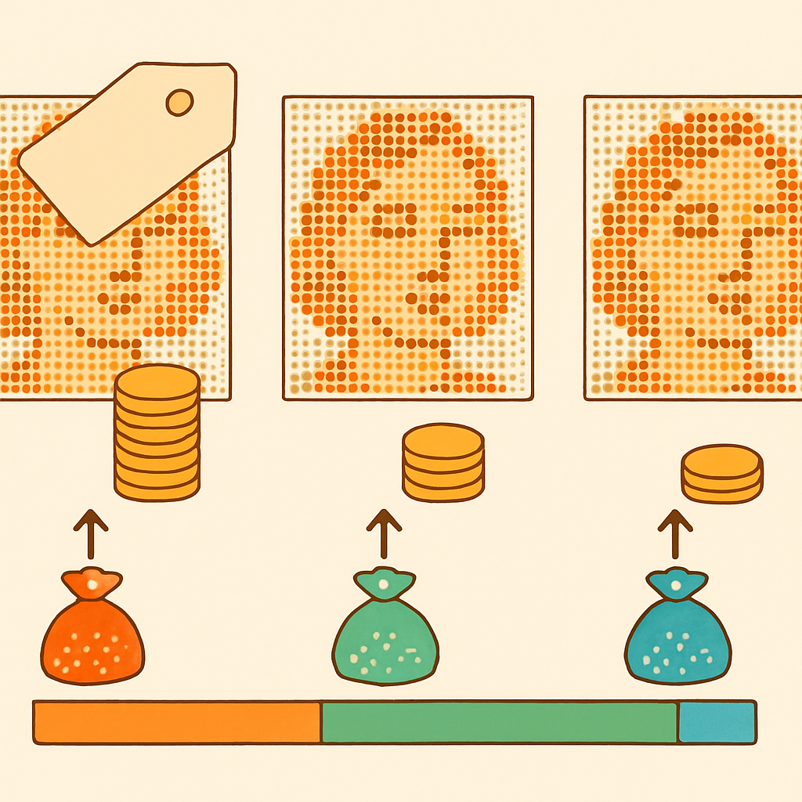

# O Impacto no Mosaico de Retrato



O conceito anterior estabeleceu os três patamares de preço por peça: LEGO original no BrickLink (R$ 0,60–3,00+), compatível premium Gobricks importado (R$ 0,25–0,50), e genérico AliExpress bulk (R$ 0,05–0,15). Esses números, isolados, parecem diferenças modestas num objeto que cabe na ponta dos dedos. O que transforma essas diferenças em decisão estratégica de negócio é a escala — o volume de peças que um mosaico de retrato real consome e o que esse volume faz com o custo de material.

Um mosaico de retrato é essencialmente uma grade de pontos coloridos onde cada ponto é uma peça 1×1. O tamanho da grade determina a resolução visual e o volume total de peças. As configurações mais comuns no mercado — e as que definem os níveis de produto para um negócio de mosaicos customizados — giram em torno de três escalas:

- **Mini-retrato (32×32 studs)**: 1.024 peças. Cabe em moldura pequena, ideal para presentes, fácil de montar e transportar.
- **Retrato padrão (48×48 studs)**: 2.304 peças. O formato de referência do mercado — é o tamanho do LEGO Mosaic Maker (set 40179) e dos mosaicos personalizados que empresas como PictureBrickArt vendem. Visualmente lembra uma fotografia emoldurada em tamanho médio.
- **Retrato grande (64×64 studs)**: 4.096 peças. Peça statement para parede, mais elaborada, demanda mais tempo de montagem e custo de material proporcionalmente maior.

Esses três tamanhos definem três produtos distintos, com estruturas de custo e margens distintas. A tabela abaixo projeta o custo de material (só insumo de peças, sem baseplate, sem embalagem, sem mão de obra) para cada tamanho, em cada camada de preço:

| Tamanho | Peças | LEGO original BrickLink (R$ 0,80/peça est.) | Gobricks importado (R$ 0,35/peça est.) | Genérico AliExpress (R$ 0,10/peça est.) |
|---|---|---|---|---|
| Mini 32×32 | 1.024 | ~R$ 819 | ~R$ 358 | ~R$ 102 |
| Padrão 48×48 | 2.304 | ~R$ 1.843 | ~R$ 806 | ~R$ 230 |
| Grande 64×64 | 4.096 | ~R$ 3.277 | ~R$ 1.434 | ~R$ 410 |

Os valores de LEGO original usam R$ 0,80 como média conservadora — cores comuns ficam por volta disso, mas qualquer pedido real de retrato vai misturar tons comuns (preto, branco, cinza) com cores médias (vermelho, azul, marrom) e possivelmente alguns tons difíceis (laranja escuro, verde oliva, azul petróleo), o que puxa a média unitária para cima facilmente. Os valores Gobricks usam R$ 0,35 como estimativa central dentro da faixa R$ 0,25–0,50 com lotes por volta de 1.000 peças por cor.

Esses números revelam a lógica estrutural do negócio: **o custo de material com peças originais para o retrato padrão já é próximo ou superior ao preço de venda que o mercado aguenta**. Um mosaico 48×48 vendido por R$ 1.500 — o que já seria caro para boa parte do público — mal cobre o insumo de peças se forem originais LEGO, sem nenhuma margem para baseplate, embalagem, tempo de montagem, frete ou lucro. Com Gobricks importado, o mesmo mosaico tem custo de material de R$ 806, abrindo espaço para uma margem de 40–50% mesmo num preço de venda conservador.

A assimetria de cor que o conceito anterior introduziu amplifica esse efeito. Um retrato realista não usa paleta monocromática nem cores primárias puras — usa tons de pele, gradações de castanho, azuis medianos, verdes discretos, laranjas terrosos. No BrickLink, exatamente essas são as cores com oferta escassa e preço inflacionado pelo mercado secundário. Uma peça preta sai a R$ 0,50; a mesma geometria em Dark Orange pode custar R$ 2,50 ou mais. Gobricks precifica por geometria, não por cor — todas as cores disponíveis custam o mesmo. Isso significa que um retrato colorido realista, que requer dezenas de tons fora do preto/branco/cinza, tem custo por peça médio significativamente maior com originais LEGO do que o cálculo simples sugere, enquanto no Gobricks o custo permanece previsível.

Para visualizar como a paleta de cores de um retrato típico se distribui entre camadas de raridade no mercado original:

```
Retrato típico de pessoa (~2.304 peças, 48x48)
│
├── Cores comuns (~40% das peças): preto, branco, cinza claro, cinza escuro
│   └── BrickLink: ~R$ 0,50–0,70/peça   |   Gobricks: ~R$ 0,35/peça
│
├── Cores médias (~35% das peças): vermelho, azul médio, marrom claro, bege
│   └── BrickLink: ~R$ 0,80–1,50/peça   |   Gobricks: ~R$ 0,35/peça
│
└── Cores difíceis (~25% das peças): tons de pele, laranja, verde oliva, teal
    └── BrickLink: ~R$ 1,50–4,00+/peça  |   Gobricks: ~R$ 0,35/peça
```

O custo médio real de um retrato de pessoa com originais LEGO não é R$ 0,80/peça — é R$ 1,20, R$ 1,50 ou mais, dependendo da paleta exigida pela foto. Com Gobricks, o custo médio não muda com a paleta. Essa previsibilidade de custo é tão valiosa quanto a economia nominal: ela permite precificar produtos sem depender de simulações de cor por cor no BrickLink a cada pedido.

O piso de preço de venda de um produto segue diretamente do custo de material. Se o custo de insumo para o retrato padrão 48×48 com Gobricks é ~R$ 806, e você adiciona baseplate (R$ 80–150 por placa compatível 48×48), embalagem e proteção (R$ 30–60), e valoriza minimamente o tempo de montagem (~6–10 horas para um retrato com montagem cuidadosa), o custo total chega facilmente a R$ 1.100–1.300 antes de qualquer margem. Vender por R$ 1.800–2.400 representa uma margem bruta de 40–55%, que é o território onde o negócio é viável. Com peças originais LEGO, o mesmo cálculo começa de ~R$ 1.850 em insumo e termina sem margem prática a nenhum preço que o mercado informal aceite pagar.

Esse raciocínio de custo → margem → piso de preço é o que fundamenta qualquer conversa sobre precificação de mosaicos. O próximo conceito parte daqui para discutir onde, exatamente, a diferença de insumo desaparece no produto final — porque toda essa análise de custo só faz sentido quando o produto entregue com Gobricks é visualmente equivalente ao entregue com original LEGO, o que é o caso para mosaicos planares.

## Fontes utilizadas

- [LEGO Mosaic Maker 40179 — lego.com](https://www.lego.com/en-us/product/mosaic-maker-40179)
- [LEGO Personalized Mosaic Portrait review — The Brothers Brick](https://www.brothers-brick.com/2021/02/18/lego-40179-personalized-mosaic-portrait-downsized-but-not-in-a-fun-way-feature/)
- [LEGO Mosaic Wall Art 48x48 — PictureBrickArt](https://picturebrickart.com/products/lego-mosaic-wall-art-famous-art-pixel-art-48x48)
- [All About LEGO Mosaics — Brick Builder's Handbook](https://brickbuildershandbook.com/all-about-lego-mosaics/)
- [Everything You Want to Know About LEGO Mosaics — BrickNerd](https://bricknerd.com/home/everything-you-want-to-know-about-lego-mosaics-11-12-24)
- [Is it really possible to rebrick LEGO Art mosaics at a reasonable price? — Stonewars](https://stonewars.com/deep-dive/is-it-really-possible-to-rebrick-lego-art-mosaics-at-a-reasonable-price/)
- [LEGO Custom Portrait Mosaic — Etsy](https://www.etsy.com/listing/289301355/lego-custom-portrait-mosaic)
- [Personalized Brick Mosaic Art — Brick Me](https://brick.me/)

---

**Próximo conceito** → [Onde o Compatível é Indistinguível no Produto Final](../03-onde-o-compativel-e-indistinguivel-no-produto-final/CONTENT.md)
