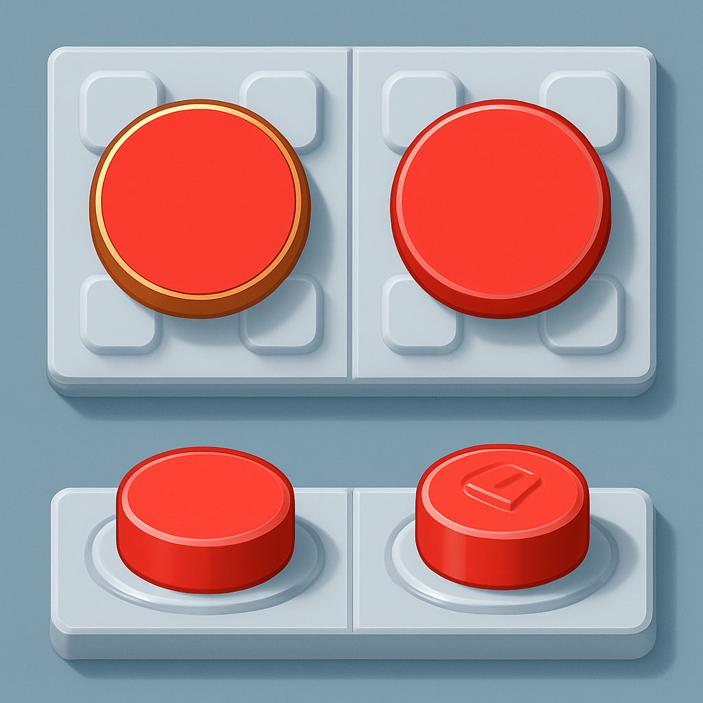

# Onde o Compatível é Indistinguível no Produto Final

O raciocínio dos dois conceitos anteriores termina com uma pergunta implícita que qualquer cliente ou parceiro vai fazer eventualmente: "mas dá para ver a diferença?". A análise de custo só tem validade prática se a resposta for não — e ela é não, desde que o contexto seja o certo. Entender exatamente qual é esse contexto, e por que ele se encaixa perfeitamente com mosaicos de retrato, é o que transforma a economia calculada em argumento completo.

Um tijolo LEGO é, na essência, um objeto projetado para ser visto de dois ângulos distintos durante o uso: de cima (no topo do stud) e de frente/lado (no corpo lateral e na junta entre peças). Esses dois ângulos carregam informações visuais completamente diferentes. O topo de uma plate ou tile 1×1 é uma superfície plana colorida — no caso do tile, completamente lisa e sem stud exposto; no caso da plate e do round plate, com stud, mas que visto de frente num mosaico montado fica escondido atrás do ângulo de visão. O corpo lateral, por outro lado, revela a junta de encaixe, a transparência ou opacidade do plástico nas bordas, e — no caso de peças originais LEGO — o logotipo gravado no stud.

É justamente nesse segundo ângulo que existem diferenças entre original LEGO e compatível premium. O Gobricks não imprime logotipo nos studs — os studs são lisos, sem texto. Numa análise lado a lado em luz forte, um observador familiarizado com LEGO pode notar essa ausência, além de variações mínimas de acabamento superficial ou brilho. A plataforma Bobby Brix descreve as cores Gobricks como "praticamente indistinguíveis a menos que você esteja fazendo comparação lado a lado em luz forte" para os tons comuns, e confirma acabamento "liso e limpo, nem muito brilhante nem muito fosco", equivalente ao LEGO. Diferenças sutis de tonalidade aparecem apenas em cores raras ou descontinuadas — exatamente as cores com menor probabilidade de aparecer num mosaico de retrato padrão, que usa tons de pele, azuis médios, verdes discretos e neutros — todos bem cobertos pela paleta de cores padronizada Gobricks.

Num mosaico planar montado e entregue ao cliente, nenhum desses ângulos laterais está disponível para inspeção. O produto final é montado sobre uma baseplate com peças 1×1 dispostas em grade, pendurado ou exibido numa parede e visto de frente, à distância de visão natural — 50 cm a alguns metros. Nesse ângulo e nessa distância, o que o olho humano percebe é exclusivamente a superfície colorida de cima de cada peça, formando o padrão pixelado do retrato. O stud (quando existe) pode aparecer como textura sutil que dá profundidade ao mosaico — mas isso vale igualmente para original e compatível, porque a geometria do stud é definida pelas mesmas cotas toleradas pelo sistema de encaixe. A diferença que existe — ausência de logotipo, variação mínima de brilho — simplesmente não é visível nesse ângulo e nessa distância.

A tabela abaixo mapeia os ângulos de visão com as diferenças que cada um revela:

| Ângulo de inspeção | O que revela | Diferença original vs. compatível premium |
|---|---|---|
| Topo frontal (produto montado na parede) | Superfície colorida da peça, padrão de pixels | Nenhuma diferença visível |
| Lado/perfil (peça isolada, luz direta) | Junta de encaixe, corpo lateral, brilho do plástico | Mínima (variação de acabamento em algumas cores) |
| Stud de perto (lupa ou macro foto) | Logo gravado no stud ou stud liso | Diferença clara: Gobricks tem stud sem logotipo |
| Lateral de todo o mosaico montado | Profundidade das placas, juntas de montagem | Nenhuma diferença perceptível a olho nu |

O argumento não é que compatíveis são idênticos ao LEGO em todos os ângulos e contextos. O argumento é mais preciso: **a diferença existe e é verificável, mas ocorre exatamente no ângulo que não está disponível no produto que o cliente recebe**. Isso não é uma ressalva; é uma característica estrutural do formato mosaico.

Esse raciocínio tem precedente no mercado comercial estabelecido. A empresa Brick Me, que vende mosaicos customizados LEGO-compatible diretamente para o consumidor final americano, usa explicitamente peças compatíveis com 50 cores padronizadas — e posiciona o produto como "LEGO-compatible Art", sem esconder o uso de compatíveis, simplesmente porque o produto entregue é visualmente equivalente em qualquer contexto de uso razoável. Empresas similares operam no mesmo modelo porque a lógica é a mesma: o cliente compra o retrato, não a peça.

Há uma nuance importante sobre consistência dentro do lote que merece atenção antes de qualquer pedido em escala. A indistinguibilidade depende de que todas as peças do mesmo campo de cor num retrato venham do mesmo lote de produção Gobricks — porque a cor é controlada por lote, e dois lotes diferentes do mesmo código de cor podem ter variação perceptível entre si quando colocados lado a lado. Isso não é exclusividade dos compatíveis: o LEGO também tem variação por lote, especialmente em peças mais antigas ou produzidas em fábricas diferentes. A prática recomendada para mosaicos de qualquer origem é pedir todas as peças de uma cor específica de uma única encomenda, garantindo que venham do mesmo run de produção. Gobricks, operando com controle industrial-grade da produção em Guangdong, tem consistência de cor por lote que revisões independentes descrevem como equivalente ao LEGO para as cores do catálogo padrão.

O cliente que vai comprar um mosaico de retrato personalizado está comprando uma obra visual para pendurar na parede. O critério de avaliação dele é visual — fidelidade ao retrato original, nitidez das cores, aparência geral. Não é procedência de insumo. A peça que compõe o mosaico é infraestrutura invisível do produto final — exatamente como o transistor que compõe um chip é invisível no produto eletrônico que o cliente usa. O que importa é o comportamento emergente: a imagem que aparece na parede. E nessa dimensão, compatível premium e original LEGO produzem o mesmo resultado.

## Fontes utilizadas

- [GoBricks vs LEGO — Bobby Brix](https://store.bobbybrix.com/blogs/news/gobricks-vs-lego)
- [Gobricks vs LEGO Bricks: What's the Differences? — Lumibricks](https://www.lumibricks.com/blogs/news/lego-vs-gobricks-review)
- [Personalized Brick Mosaic | LEGO-compatible Art — Brick Me](https://brick.me/products/personalized-brick-mosaic-custom-mosaic-maker-lego-compatible-art)
- [Everything You Want to Know About LEGO Mosaics — BrickNerd](https://bricknerd.com/home/everything-you-want-to-know-about-lego-mosaics-11-12-24)
- [Gobricks vs Lego: Colour Matching Review for MOCs — YouTube](https://www.youtube.com/watch?v=o_3C9hRpJHQ)
- [Color palette — Gobricks (wobrick.com)](https://wobrick.com/color/)

---

**Próximo conceito** → [Quando Pode Valer Usar Original](../04-quando-pode-valer-usar-original/CONTENT.md)
