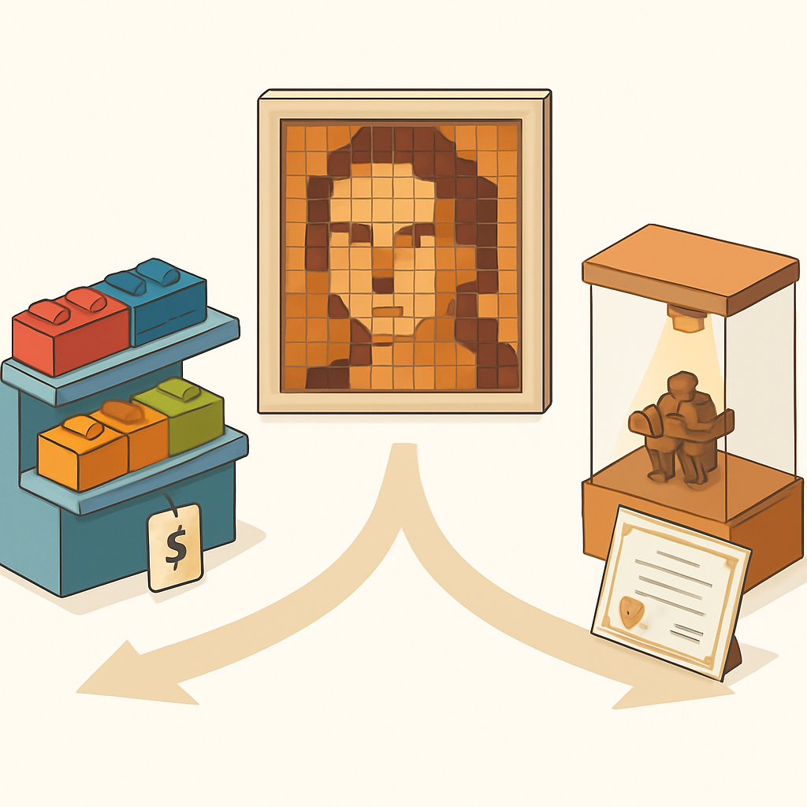

# Quando Pode Valer Usar Original

O conceito anterior demonstrou que, no formato mosaico planar visto de frente — o produto que o cliente recebe —, compatível premium e original LEGO produzem resultado visual equivalente. Isso fecha o argumento para o caso geral. Mas "caso geral" nunca é "caso universal". A pergunta honesta que fecha este subcapítulo é: existem situações concretas, dentro de um negócio de mosaicos customizados, em que usar peças originais LEGO faz sentido estratégico ou é simplesmente insubstituível? A resposta é sim — e entender exatamente quais são essas situações impede dois erros simétricos: gastar com original quando compatível resolve, e usar compatível quando o produto exige original.

O primeiro caso que realmente não tem substituto é o de **peças com geometria proprietária que o compatível não reproduz**. O sistema de encaixe básico — studs e anti-studs, plates, tiles, bricks — é livre desde 1978 e está disponível em todas as marcas de qualidade. Mas a LEGO foi acumulando, ao longo de décadas, um catálogo de elementos com geometrias proprietárias ainda protegidas por design patents ou simplesmente não replicadas por compatíveis por falta de demanda comercial. Minifiguras são o exemplo mais citado: a LEGO obteve proteção de trademark para a silhueta da minifigura — cabeça cilíndrica, torso com braços articulados, pernas em L — no Canadá e em países europeus, e tem aplicado esses direitos com injunções contra importadores. Fabricantes compatíveis que tentaram reproduzir figuras humanoides de proporções próximas às originais LEGO enfrentaram ação legal; o resultado prático é que nenhuma marca compatível de primeira linha (Gobricks, Mould King, CADA) oferece minifiguras no estilo LEGO como produto comercializável no mercado ocidental. Quem precisa de minifiguras LEGO genuínas no produto — por estética ou por exigência de cliente — precisa comprá-las originais.

Além das minifiguras, há peças com geometrias que simplesmente não existem no catálogo de compatíveis por não terem volume suficiente para justificar moldes próprios. Peças técnicas especializadas (pneumáticos, juntas universais complexas, alguns slope incomuns), peças de cores descontinuadas que o LEGO não produz mais e que o compatível nunca começou a produzir, e peças exclusivas de sets licenciados que nunca foram convertidas para o catálogo avulso. Para mosaicos, a maioria dessas geometrias é irrelevante — mosaico usa plate 1×1, tile 1×1, round plate 1×1, e variações simples. Mas se o projeto incluir elementos tridimensionais ou decorativos que não sejam planares, a lacuna no catálogo compatível pode aparecer.

O segundo caso é o cliente que **especifica originalidade como requisito**. Isso não é hipotético — existe um segmento de compradores que, por razões variadas, exige autenticidade das peças LEGO: colecionadores que adicionam o mosaico à sua coleção e querem que tudo seja "real LEGO", presenteadores que consideram a autenticidade parte do valor do presente, ou encomendas corporativas onde a especificação foi explicitamente "LEGO original". Nesses casos, o produto que o cliente comprou é diferente — não é apenas o resultado visual, mas a garantia de procedência. Cobrar pelo original sem repasse do custo adicional não faz sentido; mas entregar compatível quando o cliente comprou original é desonesto mesmo que o resultado seja visualmente idêntico.

Na prática, esse segundo caso é raro e nunca deve ser assumido — ele tem que ser explicitamente declarado pelo cliente, não inferido. A maioria dos compradores de mosaicos customizados está comprando uma obra visual, não um inventário de peças LEGO. Como o conceito anterior estabeleceu com o exemplo da Brick Me, empresas consolidadas posicionam abertamente o produto como "LEGO-compatible art" sem perda de demanda, porque o cliente avalia o retrato, não o insumo.

O terceiro caso, mais sutil, é o de **peças em cores que o Gobricks não produz no momento da compra**. A paleta Gobricks cobre dezenas de cores, mas não é infinita e tem descontinuidades — algumas cores raras ou descontinuadas da paleta LEGO simplesmente não existem no catálogo atual de compatíveis de qualidade. Se um retrato específico exige uma cor que só existe em original LEGO, o caminho mais eficiente pode ser comprar exatamente aquelas peças no BrickLink e usar compatíveis para todo o resto. Esse híbrido é operacionalmente válido: como o conceito de "onde o compatível é indistinguível" mostrou, a diferença visual entre original e compatível premium no ângulo de frente é zero, então misturar ambos no mesmo mosaico não compromete a aparência — desde que a tonalidade dos lotes seja compatível, o que se verifica antes de usar.

Para tornar esses casos fáceis de rastrear no dia a dia, a tabela abaixo categoriza as situações:

| Situação | Usar original? | Justificativa |
|---|---|---|
| Mosaico planar padrão com cores do catálogo Gobricks | Não | Custo 3–10× maior sem benefício visual ou funcional |
| Mosaico com minifiguras LEGO como elemento do design | Sim (só as figs) | Minifiguras originais não têm substituto comercialmente viável |
| Cliente colecionador que especificou "peças originais LEGO" | Sim (tudo) | Originalidade é parte do produto contratado |
| Cor necessária ausente no catálogo Gobricks atual | Sim (só essa cor) | Não há alternativa; mistura funciona visualmente |
| Peça com geometria proprietária não disponível em compatível | Sim (só essa peça) | Sem equivalente funcional ou visual |
| Cliente pergunta se são LEGO sem especificar exigência | Não | Compatível resolve; transparência na comunicação |

A lógica que une esses casos é simples: original entra quando há lacuna funcional ou contratual que o compatível não preenche. Fora dessas condições, o argumento financeiro calculado nos dois primeiros conceitos deste subcapítulo permanece sem contrapartida — a economia de 60 a 90% no custo de material não é neutralizada por nenhum benefício de produto concreto para o cliente típico de mosaico customizado.

Uma nota operacional sobre o custo de incluir originais pontualmente: comprar peças originais avulsas no BrickLink para cores ou geometrias específicas é perfeitamente compatível com o fluxo de abastecimento baseado em Gobricks. O BrickLink tem vendedores nacionais — Techbricks, Bloco Digital, Bricksolutions — que entregam sem frete internacional e em volumes baixos. Para uma cor que aparece em 50 peças de um retrato de 2.304 peças, o custo diferencial de comprar aquelas 50 peças como LEGO original é absorvível sem comprometer a margem calculada para o pedido inteiro.

O argumento de custo que inaugurou este subcapítulo — diferença de R$ 0,35 vs R$ 0,80+ por peça multiplicada por 2.304 peças — é, portanto, um argumento sobre o caso padrão, não sobre uma regra absoluta. A sofisticação operacional está em saber identificar os casos excepcionais com precisão, agir cirurgicamente neles, e não generalizar a exceção para paralisá-la a estratégia correta para o volume principal.

## Fontes utilizadas

- [How Lego legally locked in the iconic status of its mini-figures — The Conversation](https://theconversation.com/how-lego-legally-locked-in-the-iconic-status-of-its-mini-figures-43489)
- [The intellectual property battle for the Lego minifigures — Good Law](https://goodlaw.eu/en/insight/the-battle-for-the-lego-minifigures-2/)
- [Fake LEGO®s? The truth behind LEGO®'s patents — Latericius](https://latericius.com/en/blogs/blog/fake-legos)
- [Are LEGO-Compatible Knockoff Bricks Worth Buying? — How-To Geek](https://www.howtogeek.com/reasons-to-buy-lego-compatible-bricks-from-knockoff-brands/)
- [A non-exhaustive list of LEGO parts exclusive to one set — Brick Fanatics](https://www.brickfanatics.com/non-exhaustive-list-lego-parts-exclusive-set/)
- [Personalized Brick Mosaic Art — Brick Me](https://brick.me/products/personalized-brick-art-brick-mosaic-maker-picture-to-lego-style)
- [Create your individual Mosaic Set — Brickmosaicdesigner](https://brickmosaicdesigner.com/en)
- [Molds Over Time: How Updates to LEGO Elements Change Building Techniques — BrickNerd](https://bricknerd.com/home/molds-over-time-how-part-updates-change-build-techniques-12-15-22)

---

**Próximo capítulo** → [Anatomia das Peças para Mosaico](../../../02-anatomia-das-pecas-para-mosaico/CONTENT.md)
