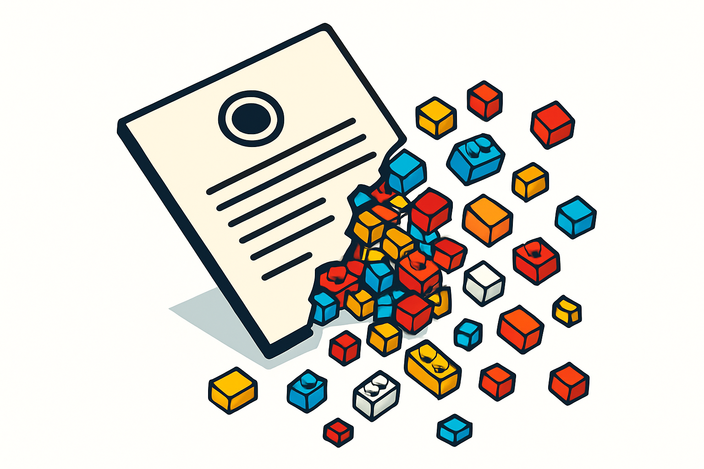

# O Universo das Peças Compatíveis

## Sobre este capítulo

Antes de comprar qualquer peça ou comparar marcas, é fundamental entender por que o mercado de compatíveis existe e por que ele é completamente legítimo. Este capítulo abre o livro respondendo à pergunta que todo iniciante faz: "é certo usar peças que não são LEGO?". A resposta está na história das patentes da empresa — e no que aconteceu quando elas expiraram. Sem esse contexto, qualquer decisão de compra futura fica suspensa no ar, sem base para raciocinar sobre qualidade, confiabilidade de fornecedores ou posicionamento de produto.

O capítulo também situa o leitor no ecossistema atual: um mercado global de bilhões de dólares, com fabricantes chineses de primeira linha que investem pesado em engenharia de precisão, e que hoje fornecem peças para MOCers, artistas e negócios do mundo inteiro — incluindo negócios exatamente como o que o leitor quer construir.

## Estrutura

Os grandes blocos são: (1) a história das patentes LEGO — quando expiraram, o que isso liberou e por que qualquer fabricante pode hoje produzir peças no sistema de encaixe LEGO; (2) a distinção entre "clone" e "compatível" — termos que a comunidade usa de formas diferentes e o que cada um implica em termos de qualidade e posicionamento; (3) o tamanho e a maturidade do mercado — principais players globais, volume de produção e por que isso importa para quem compra; (4) implicações práticas para um negócio de mosaicos — o que usar compatíveis significa em termos de custo, margem e percepção do cliente.

## Objetivo

Ao terminar este capítulo, o leitor terá o contexto histórico e legal para tomar decisões de compra sem culpa ou insegurança, entenderá a diferença semântica entre os termos do mercado e estará calibrado para absorver os capítulos seguintes — que entram em detalhe técnico sobre marcas, qualidade e logística — com a visão de dono de negócio em vez de hobbyista.

## Subcapítulos

1. [A Expiração das Patentes LEGO](01-a-expiracao-das-patentes-lego/CONTENT.md) — a linha do tempo de 1958 a 1978, o que expirou, o que a LEGO ainda protege e os casos judiciais que consolidaram a abertura do mercado
2. ["Clone", "Compatível" e "Alternativo" — o Vocabulário do Mercado](02-clone-compativel-e-alternativo-o-vocabulario-do-mercado/CONTENT.md) — como a comunidade usa esses termos, o que cada um implica em qualidade e posicionamento e por que nenhum deles equivale a "falsificação"
3. [O Mercado Global de Compatíveis Hoje](03-o-mercado-global-de-compativeis-hoje/CONTENT.md) — concentração em Guangdong, Gobricks como "Foxconn dos tijolos", volume de produção bilionária e como a escala industrial elevou o patamar de qualidade na última década
4. [Legalidade, Ética e Comunicação com o Cliente](04-legalidade-etica-e-comunicacao-com-o-cliente/CONTENT.md) — por que comprar e usar compatíveis é completamente legal, como a LEGO respondeu à concorrência ao longo dos anos e como lidar com perguntas de clientes sobre o assunto
5. [Compatíveis como Insumo de Negócio de Mosaicos](05-compativeis-como-insumo-de-negocio-de-mosaicos/CONTENT.md) — impacto direto no custo por peça e na margem, por que para retratos e mosaicos o compatível de qualidade é indistinguível do original no produto final e o que isso significa para a viabilidade do negócio

## Conceitos

1. [A Expiração das Patentes LEGO](01-a-expiracao-das-patentes-lego/CONTENT.md) — a linha do tempo de 1958 a 1978, o que expirou, o que a LEGO ainda protege e os casos judiciais que consolidaram a abertura do mercado
2. ["Clone", "Compatível" e "Alternativo" — o Vocabulário do Mercado](02-clone-compativel-e-alternativo-o-vocabulario-do-mercado/CONTENT.md) — como a comunidade usa esses termos, o que cada um implica em qualidade e posicionamento e por que nenhum deles equivale a "falsificação"
3. [O Mercado Global de Compatíveis Hoje](03-o-mercado-global-de-compativeis-hoje/CONTENT.md) — concentração em Guangdong, Gobricks como "Foxconn dos tijolos", volume de produção bilionária e como a escala industrial elevou o patamar de qualidade na última década
4. [Legalidade, Ética e Comunicação com o Cliente](04-legalidade-etica-e-comunicacao-com-o-cliente/CONTENT.md) — por que comprar e usar compatíveis é completamente legal, como a LEGO respondeu à concorrência ao longo dos anos e como lidar com perguntas de clientes sobre o assunto
5. [Compatíveis como Insumo de Negócio de Mosaicos](05-compativeis-como-insumo-de-negocio-de-mosaicos/CONTENT.md) — impacto direto no custo por peça e na margem, por que para retratos e mosaicos o compatível de qualidade é indistinguível do original no produto final e o que isso significa para a viabilidade do negócio

## Fontes utilizadas

- [The ultimate guide to LEGO® compatible building blocks — Latericius](https://latericius.com/en/blogs/blog/lego-compatible-building-blocks)
- [Lego clone — Wikipedia](https://en.wikipedia.org/wiki/Lego_clone)
- [LEGO® Alternatives: Comparing brands (2025 Guide) — BamGoodBricks](https://bamgoodbricks.com/blogs/lego-reviews/brick-alternatives-to-lego%C2%AE-how-do-they-compare)
- [Get Started with Alternative Bricks — Seven Star Bricks](https://sevenstarbricks.wordpress.com/get-started/)
- [The 10 best LEGO® compatible brands to try in 2024 — Latericius](https://latericius.com/en-eu/blogs/blog/best-lego-compatible-brands)
