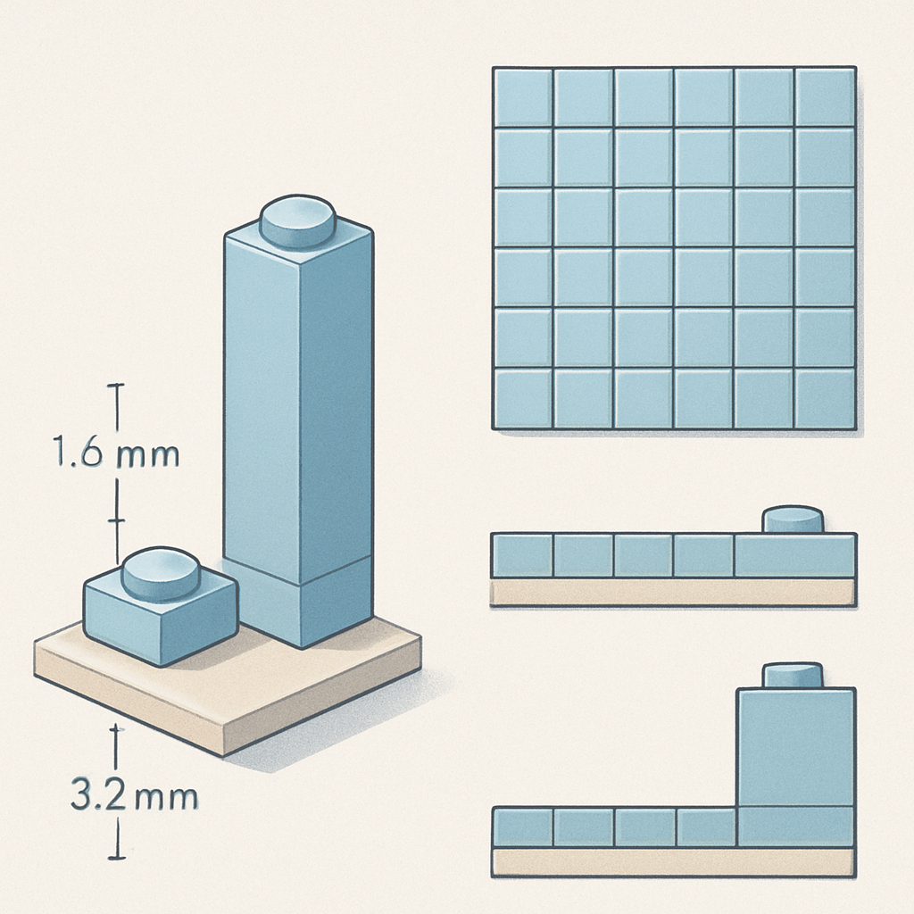

# Calculando a Espessura Real de um Mosaico



O conceito anterior fechou com a conclusão mais direta possível: plate e tile têm a mesma espessura (3,2 mm) e a proporção entre plate e brick é de 1:3. Agora essa proporção deixa de ser teoria e vira um cálculo concreto — porque quando você fecha um pedido de mosaico, precisa saber exatamente qual será a profundidade do produto físico que vai entregar ao cliente.

A espessura real de um mosaico acabado é a soma de duas camadas independentes: a **baseplate**, que serve de substrato, e a **camada de pixels**, formada pelas peças 1×1 que o cliente vê de frente. Cada uma contribui com uma medida diferente, e a soma delas determina se o mosaico cabe dentro de um porta-retrato comum ou se precisa de uma moldura com recesso extra.

A baseplate, estabelecida como substrato do mosaico, tem espessura de **1,6 mm** — exatamente metade de uma plate, ou 4 LDU. Esse número é menor do que parece: a baseplate é intencionalmente fina e flexível, projetada para ficar apoiada em uma superfície plana e não para ser empilhada. Os studs que projetam da sua face superior somam mais 1,6 mm (4 LDU), mas esses studs desaparecem dentro do anti-stud das peças que se encaixam sobre ela — não contribuem para a espessura total do conjunto montado.

A camada de pixels é onde a escolha de peça importa. Com os valores estabelecidos anteriormente:

| Peça escolhida | Altura do corpo | Espessura total (baseplate + peça) |
|---|---|---|
| 1×1 plate | 3,2 mm | 1,6 + 3,2 = **4,8 mm** |
| 1×1 tile | 3,2 mm | 1,6 + 3,2 = **4,8 mm** |
| 1×1 brick | 9,6 mm | 1,6 + 9,6 = **11,2 mm** |

Plate e tile entregam exatamente a mesma espessura total — o que muda entre eles não é a profundidade do produto, mas a superfície que o cliente vê. A escolha entre plate e brick, por outro lado, triplica a espessura: de 4,8 mm para 11,2 mm. Isso é quase 1,2 cm de profundidade num mosaico de bricks — o equivalente a uma moldura de caixa (*deep frame*), não uma moldura plana.

Para o negócio de mosaicos de retrato, essa conta tem implicações práticas imediatas. Um mosaico de plates com 4,8 mm de espessura cabe sem problema em uma moldura de galeria padrão — as de madeira com recesso de 5 a 8 mm. Um mosaico de bricks com 11,2 mm precisa de uma moldura tipo caixa (*shadow box*), que custa mais e é menos comum nas opções de acabamento que o cliente espera para um produto de parede. Além disso, o peso total de um mosaico de bricks é significativamente maior: um brick 1×1 pesa cerca de 0,27 g, contra 0,09 g de uma plate 1×1. Para um mosaico de 32×32 = 1.024 peças, a diferença é de aproximadamente 180 g a mais no produto final — perceptível ao manuseio e relevante no cálculo de envio.

Há um terceiro componente de espessura que aparece quando o stud está presente: o stud projetado da camada de pixels. No caso de um mosaico de plates, o stud de cada peça projeta 1,6 mm acima do corpo da plate — mas esse stud não fica encaixado em nada (já que o mosaico é uma única camada de pixels, não há peça acima). Isso significa que a face visível de um mosaico de plates tem relevo: cada pixel tem um cilindro de 1,6 mm projetado para fora. No tile, esse cilindro não existe — a superfície é completamente plana. Para quem vai colocar o mosaico dentro de uma moldura com vidro, essa diferença é crítica: um mosaico de tiles encosta no vidro sem folga, enquanto um de plates precisa de um espaçador ou o vidro vai pressionar os studs e potencialmente desmontar peças nas bordas.

```
Vista lateral do mosaico montado (corte transversal, não em escala):

Mosaico de PLATES:
  ○  ○  ○  ○   ← studs projetados: +1,6 mm (visíveis, sem encaixar em nada)
┌──┬──┬──┬──┐  ← corpo das plates: 3,2 mm
└──────────┘   ← baseplate: 1,6 mm
===============  superfície de apoio
Espessura total do conjunto = 4,8 mm
Profundidade total com stud visível = 6,4 mm

Mosaico de TILES:
══════════════   ← superfície plana, sem stud
┌──┬──┬──┬──┐   ← corpo dos tiles: 3,2 mm
└──────────┘    ← baseplate: 1,6 mm
===============   superfície de apoio
Espessura total = 4,8 mm
Profundidade total = 4,8 mm (sem stud)
```

A distinção entre "espessura do conjunto" (corpo da peça + baseplate) e "profundidade com stud" é relevante quando o cliente especifica o acabamento. Se o mosaico vai dentro de uma moldura com vidro, a profundidade máxima que o recesso da moldura precisa acomodar é 6,4 mm para plates e 4,8 mm para tiles. Se vai numa moldura aberta sem vidro — apoiado em um suporte ou pregado diretamente na parede com fita adesiva de dupla face — o stud do plate não é problema.

Quando o pedido usa múltiplas baseplates montadas em grade para fazer um retrato maior, a espessura não se acumula — ela é sempre determinada pelo número de *camadas verticais* de peças, não pelo tamanho horizontal do painel. Um mosaico de 96×96 studs (três baseplates 32×32 por lado) tem exatamente a mesma espessura de 4,8 mm que um de 32×32. O que cresce é a área e, portanto, o número de peças e o peso total — mas a profundidade permanece idêntica.

Para o fluxo de produção, o cálculo que vale a pena fixar antes de fechar qualquer pedido é este:

```
espessura_total_mm = espessura_baseplate + altura_corpo_peca
                   = 1,6 + 3,2   →  4,8 mm  (plate ou tile)
                   = 1,6 + 9,6   → 11,2 mm  (brick)

profundidade_total_mm = espessura_total_mm + (1,6 se plate, 0 se tile ou brick encaixado)
```

O caso de brick "encaixado" merece uma nota: se o mosaico usa bricks com uma camada de tiles por cima — uma prática para entregar a superfície plana do tile com a robustez estrutural do brick — a profundidade do stud do brick fica encaixada dentro do tile, não projeta para fora. Nesse caso, a profundidade total é 1,6 (baseplate) + 9,6 (brick) + 3,2 (tile) = 14,4 mm. Esse tipo de construção aumenta o custo de material (você usa dois tipos de peça por pixel), o peso e a espessura, e raramente faz sentido para mosaicos de retrato — onde a escolha padrão é plate ou tile diretamente na baseplate.

O próximo conceito fecha o sistema de medidas com a dimensão que o cliente mais quer saber antes de fechar um pedido: o tamanho físico do painel em centímetros, convertendo diretamente da grade de studs para o mundo real.

## Fontes utilizadas

- [Basic LEGO Parts Guide — Brick Architect](https://brickarchitect.com/parts/category-1)
- [LEGO Brick Dimensions and Measurements — Christoph Bartneck](https://www.bartneck.de/2019/04/21/lego-brick-dimensions-and-measurements/)
- [Stud Dimensions Guide — Brick Owl](https://www.brickowl.com/help/stud-dimensions)
- [Everything You Want to Know About LEGO Mosaics — BrickNerd](https://bricknerd.com/home/everything-you-want-to-know-about-lego-mosaics-11-12-24)
- [Vertical Mosaic LEGO Portraits — Instructables](https://www.instructables.com/Vertical-Mosaic-LEGO-Portraits-Everything-You-Need/)
- [Framing a Lego Mosaic — Eurobricks Forums](https://www.eurobricks.com/forum/forums/topic/75283-framing-a-lego-mosaic/)
- [LEGO® Art: the new mosaic theme — New Elementary](https://www.newelementary.com/2020/07/lego-art-new-mosaic-theme.html)

---

**Próximo conceito** → [Dimensão Física de uma Baseplate em Centímetros](../05-dimensao-fisica-de-uma-baseplate-em-centimetros/CONTENT.md)
