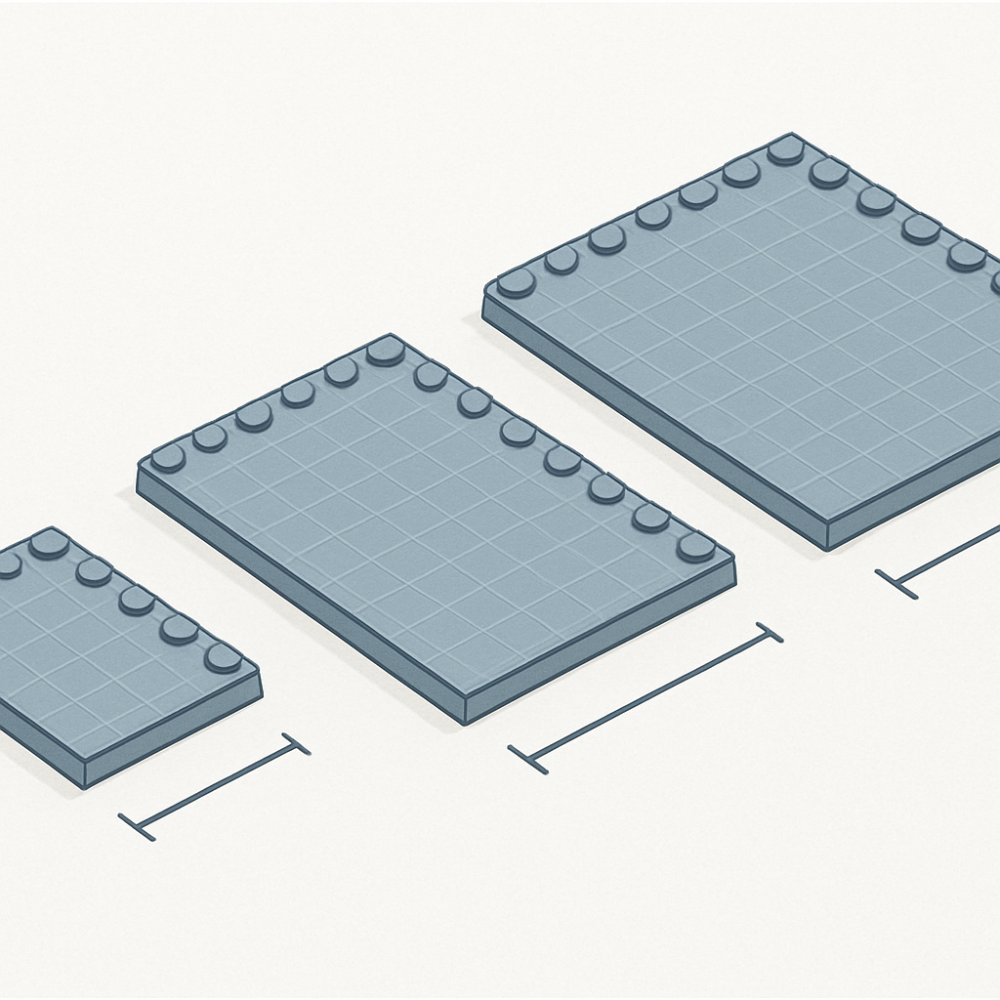

# Dimensão Física de uma Baseplate em Centímetros



O conceito anterior terminou com uma promessa precisa: o tamanho físico do painel em centímetros é a pergunta que o cliente mais quer saber antes de fechar um pedido. Todo o percurso deste subcapítulo — do LDU ao stud pitch de 8 mm, da proporção brick/plate/tile à espessura do mosaico acabado — converge neste último passo: converter a grade de studs para o tamanho que cabe ou não cabe na parede do cliente.

A conversão parte de um número já estabelecido: **1 stud = 8 mm**. O espaçamento entre centros de studs adjacentes é o módulo horizontal que governa toda a dimensão lateral de qualquer peça ou baseplate LEGO. Para calcular a largura física de uma baseplate, basta multiplicar o número de studs por 8 mm — sem frações, sem exceções.

| Baseplate | Studs | Cálculo | Dimensão física |
|---|---|---|---|
| 16 × 16 | 16 studs por lado | 16 × 8 mm | **128 mm × 128 mm = 12,8 cm × 12,8 cm** |
| 32 × 32 | 32 studs por lado | 32 × 8 mm | **256 mm × 256 mm = 25,6 cm × 25,6 cm** |
| 48 × 48 | 48 studs por lado | 48 × 8 mm | **384 mm × 384 mm = 38,4 cm × 38,4 cm** |

Esses são os números que você usa para responder ao cliente em segundos, sem abrir nenhum software. Uma baseplate 32×32 tem praticamente 25,6 cm de lado — pouco mais que uma folha A4 em largura. Uma 48×48 tem 38,4 cm — o tamanho de um pôster de parede de tamanho médio.

Vale notar que o número redondo "25 cm" frequentemente aparece em fichas de produto e até na própria comunicação oficial da LEGO para a baseplate 32×32. A medida mais precisa é 25,6 cm — resultado direto de 32 × 0,8 cm. A diferença de 6 mm existe porque LEGO arredonda para baixo na comunicação de marketing, enquanto a conta exata em milímetros fecha em 256 mm. O mesmo ocorre com a 48×48: alguns fornecedores listam "38 cm", mas o valor exato é 38,4 cm. Para especificação de moldura e de envio, use sempre os números exatos.

O padrão dos sets LEGO Art — a referência mais próxima do que este negócio produz — é o painel de **48×48 studs**: um único mosaico quadrado de 38,4 cm × 38,4 cm. Esse tamanho foi escolhido pela LEGO porque equilibra resolução (2.304 pixels num formato quadrado) com um tamanho de parede familiar ao cliente — está entre o pôster tamanho carta e o quadro de galeria médio. Para pedidos de retrato customizados, esse é o ponto de partida natural: 48×48 numa baseplate única ou 96×96 com quatro baseplates 48×48 em grade 2×2, resultando em 76,8 cm × 76,8 cm.

Quando o pedido usa múltiplas baseplates lado a lado, a conta de tamanho se repete:

```
painel 2×2 de baseplates 32×32:
  largura = 2 × 256 mm = 512 mm = 51,2 cm
  altura  = 2 × 256 mm = 512 mm = 51,2 cm

painel 2×2 de baseplates 48×48:
  largura = 2 × 384 mm = 768 mm = 76,8 cm
  altura  = 2 × 384 mm = 768 mm = 76,8 cm
```

Nesses painéis compostos, há uma consideração prática que não aparece na conta pura de milímetros: a **junta visível** entre baseplates. As duas peças encostam mas não têm como se fundir — a borda de cada baseplate tem 1 a 2 mm de material plástico que fica exposto entre as últimas fileiras de studs de uma e os primeiros da outra. Visualmente, para um mosaico de retrato onde o cliente olha de frente a uma distância de 1 metro ou mais, essa junta é irrelevante — ela some na perspectiva. O que importa é que o corte da imagem não coloque uma linha de detalhe importante exatamente sobre essa junta, o que pode criar uma descontinuidade perceptível.

A relação entre o número de studs e a resolução do retrato também vale ser fixada aqui. Cada stud é um pixel. Uma baseplate 32×32 entrega 1.024 pixels; uma 48×48 entrega 2.304 pixels; um painel 96×96 (quatro 48×48) entrega 9.216 pixels. Para um algoritmo de mosaico que converte uma foto num grid de pixels coloridos, o número de studs é o parâmetro de resolução — e a dimensão física resultante da conversão de studs para milímetros é o tamanho que o produto físico vai ter. Não há espaçamento extra, não há borda, não há margem: a largura da baseplate em centímetros é exatamente o que aparece na parede do cliente.

Uma verificação prática que ajuda a internalizar esses números: o eBay lista a baseplate 16×32 (que é uma variante de tamanho diferente, 12,8 × 25,6 cm) com descrição "Actual dimensions 12.8cm × 25.6cm × 0.3cm" — confirmando que 16 × 8 mm = 128 mm = 12,8 cm e 32 × 8 mm = 256 mm = 25,6 cm. A espessura de 0,3 cm (3 mm) listada ali inclui o stud projetado da baseplate — que é maior do que os 1,6 mm do conceito anterior porque inclui a variação do molde nesse produto específico. Para fins de cálculo de moldura, o que importa é a espessura do conjunto montado (baseplate + peças), que o conceito anterior detalhou.

Com esses números fixados, o fluxo de produção para responder ao cliente fica completo: o cliente diz qual tamanho quer em centímetros, você converte para studs (dividindo por 0,8 cm), escolhe as baseplates que comportam essa grade e sabe imediatamente quantas peças 1×1 o pedido vai exigir — que é exatamente o número de studs total do painel.

## Fontes utilizadas

- [Baseplate 48 × 48 (Part 4186) — BrickLink](https://www.bricklink.com/v2/catalog/catalogitem.page?P=4186)
- [Baseplate 16 × 16 (Part 3867) — BrickLink](https://www.bricklink.com/v2/catalog/catalogitem.page?P=3867)
- [LEGO BASEPLATE GREY 16×32 — Actual dimensions 12.8cm × 25.6cm × 0.3cm — eBay](https://www.ebay.com/itm/302703829418)
- [Building Base Plate Compatible 32×32 Studs 25.6 × 25.6 cm — A2ZOZMALL](https://www.a2zozmall.com.au/products/building-base-plate-lego-compatible-baseplate-32x32-studs-25-6-x-25-6-cm)
- [Baseplate Bundle 10 pack 16×16 (5×5 Inches) — Brickloot](https://www.brickloot.com/products/baseplate-bundle-10-pack-of-16x16-5-x-5-base-plates)
- [PIPART Baseplate 15.7×15.7 (48×48-studs) — Amazon](https://www.amazon.com/PIPART-Baseplate-15-7x15-7-48x48-studs-Compatible/dp/B0BFHVTBTZ)
- [Stud Dimensions and Other Standards — BrickLink Help](https://www.bricklink.com/help.asp?helpID=261)
- [LEGO® Art: the new mosaic theme — New Elementary](https://www.newelementary.com/2020/07/lego-art-new-mosaic-theme.html)
- [Everything You Want to Know About LEGO Mosaics — BrickNerd](https://bricknerd.com/home/everything-you-want-to-know-about-lego-mosaics-11-12-24)

---

**Próximo subcapítulo** → [As Peças 1×1 para Mosaico: Plate, Tile e Variantes](../../02-as-pecas-1x1-para-mosaico-plate-tile-e-variantes/CONTENT.md)
