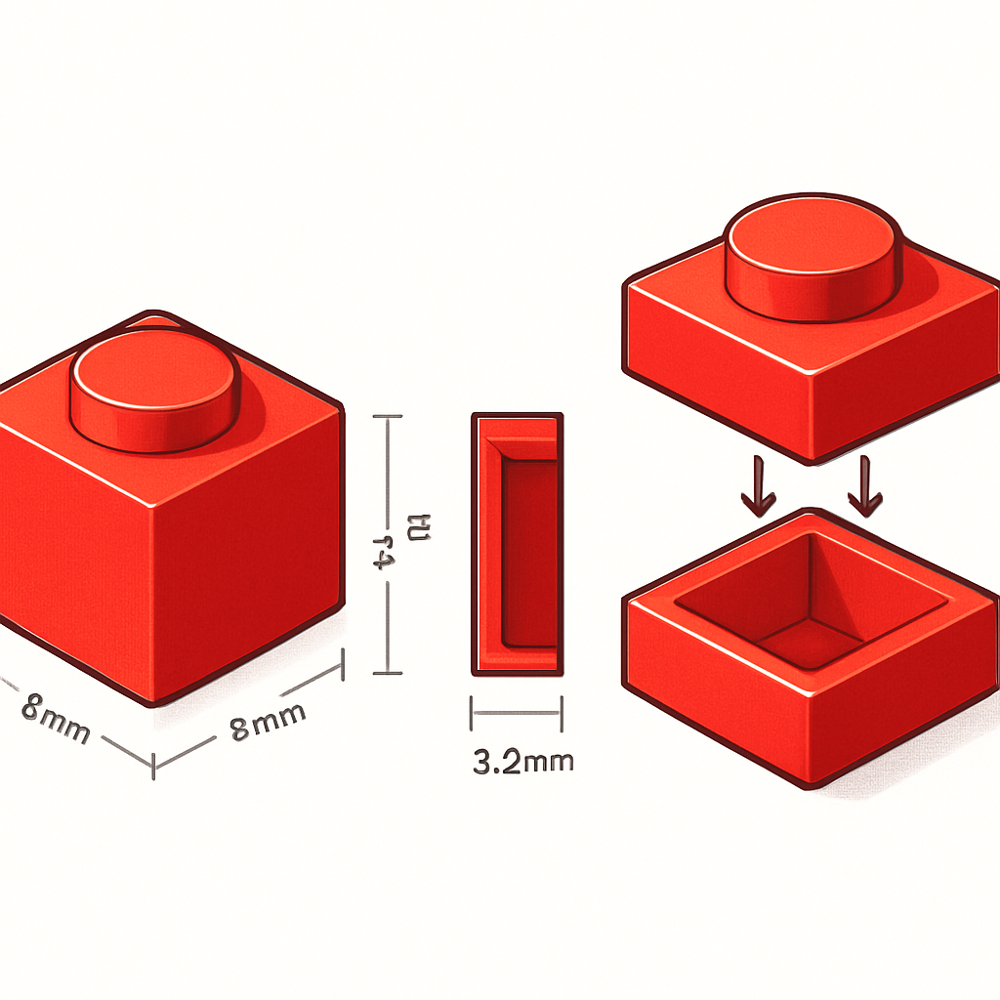

# O 1×1 Plate



Para qualquer mosaico de retrato — seja o de um cliente encomendando o próprio rosto ou o de um personagem pop — a peça que ocupa cada pixel da imagem convertida é, na esmagadora maioria das vezes, o 1×1 plate. Entender essa peça em detalhe não é curiosidade acadêmica: é o pré-requisito para interpretar fichas de produto sem ambiguidade, calcular quantidades de material e entender por que fornecedores às vezes listam "plate" e "brick" separadamente quando o leigo esperaria ver um produto único.

O 1×1 plate tem Design ID **3024** no catálogo BrickLink — um dos mais antigos e mais produzidos de toda a história LEGO, presente em mais de 13 mil sets desde 1962, em até 75 cores diferentes. Essa onipresença não é acidente: a peça resolve com elegância a relação entre o pixel digital e o módulo físico de construção.

**Footprint e módulo horizontal.** A base do 1×1 plate é quadrada, com 8mm × 8mm de área de contato no plano horizontal. Esse valor de 8mm é exatamente o *stud pitch* — o espaçamento entre centros de studs adjacentes em qualquer peça LEGO. Como cada pixel de uma imagem digitalizada pode ser mapeado 1:1 para um módulo de 8mm × 8mm, a correspondência entre o mundo digital e o físico é direta: um pixel vira um plate, sem arredondamento ou perda de posição. É por isso que, ao contrário de peças maiores (2×2, 2×4), o 1×1 plate permite a máxima resolução de detalhe possível dentro do sistema.

**Altura e posição na hierarquia brick/plate/tile.** A altura do 1×1 plate é **3,2mm** (equivalente a 8 LDU no sistema LDraw, onde 1 LDU ≈ 0,4mm). Essa medida não é arbitrária: ela é exatamente 1/3 da altura de um brick padrão (9,6mm de corpo + 1,7mm de stud = 11,3mm de altura total visível, mas o corpo de construção mede 9,6mm, que equivale a 3 plates de 3,2mm). Essa proporção 3:1 entre brick e plate é a espinha dorsal de toda a geometria vertical do sistema LEGO — e para mosaicos planares, o que importa é o plate, não o brick, porque mosaicos são estruturas de uma única camada de altura.

**O stud no topo.** Sobre a face superior do plate há um único cilindro de encaixe — o stud — com diâmetro de **4,8mm** e altura de aproximadamente **1,7mm**. É esse stud que dá ao mosaico o relevo característico: quando você olha um mosaico montado com plates, cada peça projeta um cilindro que capta luz de formas diferentes dependendo do ângulo de observação, gerando micro-sombras que aumentam percepção de profundidade e textura. Esse efeito é estético e técnico ao mesmo tempo — ele decorre diretamente da presença do stud.

**O anti-stud na base.** A face inferior do plate é oca no interior e tem paredes com uma abertura circular que forma o *anti-stud* — o receptor que encaixa no stud de outra peça. O mecanismo de conexão é o que a engenharia chama de *interference fit*: o diâmetro do stud é ligeiramente maior do que o diâmetro interno do anti-stud. Quando você pressiona um plate sobre outro, as paredes do anti-stud deflectem minimamente, e a tensão elástica do ABS (o plástico utilizado) gera atrito suficiente para manter a conexão firme sem nenhum mecanismo de travamento mecânico adicional. Esse atrito controlado é o que a comunidade chama de *clutch power*. Em termos práticos para mosaico: o plate encaixado na baseplate não sai por vibração ou manuseio leve, mas pode ser removido com ferramenta de separação (brick separator) ou com o polegar sem danificar a peça.

```
Dimensões do 1×1 Plate (Part 3024)
────────────────────────────────────────────────────
Footprint (base quadrada)    8mm × 8mm
Altura do corpo              3,2mm  (8 LDU)
Diâmetro do stud             4,8mm
Altura do stud               ~1,7mm
Material                     ABS (Acrylonitrile Butadiene Styrene)
Design ID BrickLink          3024
────────────────────────────────────────────────────
```

**Por que o plate e não o brick para mosaicos.** Um brick 1×1 padrão (Part 3005) tem corpo de 9,6mm de altura — três vezes o plate. Usar bricks em vez de plates para mosaicos aumentaria a profundidade total do painel em 3× para o mesmo efeito visual, tornando o produto mais pesado, mais caro em material e mais difícil de pendurar na parede. Mosaicos de retrato são essencialmente objetos planos de parede: o plate resolve com altura mínima e custo de material proporcional.

**1×1 plate em compatíveis.** Fabricantes como Gobricks replicam o Part 3024 com tolerâncias dimensionais muito próximas ao original LEGO, o que é essencial para que o *clutch power* funcione ao montar plates compatíveis sobre baseplates originais (e vice-versa). A dimensão crítica é o diâmetro do stud: qualquer desvio acima de 0,1–0,2mm compromete o encaixe — ou fica frouxo demais (peça cai) ou apertado demais (dificulta remoção). Em compatíveis de qualidade top-tier esse ajuste está dentro da tolerância aceitável; em genéricos sem marca, a variação pode ser perceptível peça a peça dentro do mesmo lote.

O 1×1 plate é, portanto, a unidade fundamental do vocabulário do mosaico: define resolução (1 peça = 1 pixel), profundidade mínima do painel (3,2mm), e o mecanismo de fixação à baseplate que mantém o mosaico íntegro durante envio e exposição. Os conceitos seguintes — o 1×1 tile, o round plate e o round tile — partem todos deste ponto de referência: cada um é uma variação estrutural do plate quadrado, e entender o plate em profundidade torna imediata a compreensão do que muda (e por que muda) em cada variante.

## Fontes utilizadas

- [Plate 1x1 — BrickLink Reference Catalog (Part 3024)](https://www.bricklink.com/v2/catalog/catalogitem.page?P=3024)
- [LEGO Part 3024 Plate 1x1 — Rebrickable](https://rebrickable.com/parts/3024/plate-1-x-1/)
- [Stud Dimensions Guide — Brick Owl](https://www.brickowl.com/help/stud-dimensions)
- [LDU and You: The Oldest New LEGO Measurement Unit — BrickNerd](https://bricknerd.com/home/ldu-and-you-the-oldest-new-lego-measurement-unit-2-9-23)
- [The stud and tube principle — LEGO History](https://www.lego.com/en-us/history/articles/d-the-stud-and-tube-principle)
- [Anti-stud — Bricks McGee Glossary](https://www.bricksmcgee.com/glossary/anti-stud/)
- [Everything You Want to Know About LEGO Mosaics — BrickNerd](https://bricknerd.com/home/everything-you-want-to-know-about-lego-mosaics-11-12-24)
- [All About LEGO Mosaics — Brick Builder's Handbook](https://brickbuildershandbook.com/all-about-lego-mosaics/)

---

**Próximo conceito** → [O 1×1 Tile (Flat Tile)](../02-o-1x1-tile-flat-tile/CONTENT.md)
