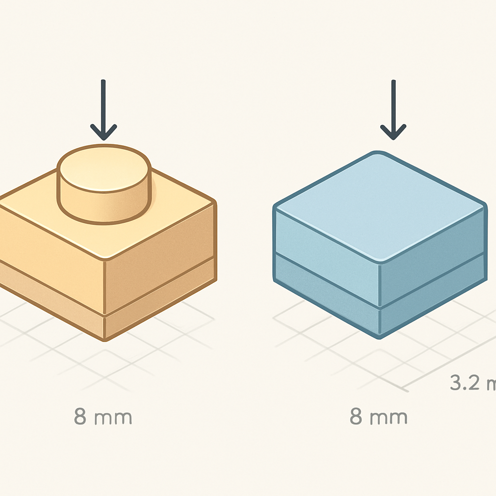

# O 1×1 Tile (Flat Tile)



O 1×1 plate estabelece o padrão de referência para mosaicos — base de 8mm × 8mm, corpo de 3,2mm, stud projetando 1,7mm acima da face superior. O 1×1 tile começa exatamente do mesmo ponto: o mesmo footprint, o mesmo corpo de 3,2mm, o mesmo anti-stud na base. A diferença está na face superior: onde o plate tem um cilindro de 4,8mm de diâmetro e ~1,7mm de altura, o tile tem superfície plana e lisa, sem nenhuma projeção. Essa ausência não é uma simplificação — é uma decisão de design com consequências físicas e visuais específicas que determinam quando o tile é a escolha certa e quando não é.

No catálogo BrickLink o 1×1 tile aparece sob o Part ID **3070b** (a variante moderna, com o entalhe na base chamado *underside groove*) e sob **3070a** (a variante mais antiga, sem groove, hoje descontinuada na produção regular). Presente em mais de 7.600 sets desde 1973, ele é uma das peças mais antigas do sistema — a LEGO reconheceu cedo a necessidade de uma superfície plana que completasse estruturas sem o relevo característico dos studs.

A altura total visível do tile é **3,2mm**, idêntica ao corpo do plate. Mas como não há stud, essa é também a altura *real* que o tile ocupa no espaço vertical de um mosaico. Quando você empilha um plate sobre uma baseplate, a peça seguinte enxerga o topo do stud a ~4,9mm do plano da baseplate (3,2mm de corpo + 1,7mm de stud). Quando você encaixa um tile, o topo da superfície fica exatamente a 3,2mm — nenhum milímetro a mais. Para um mosaico planar isso raramente importa em termos estruturais, mas é relevante para uma coisa: **a aparência da superfície**.

```
Comparação de dimensões: Plate vs Tile 1×1
────────────────────────────────────────────────────────────────
Propriedade                  1×1 Plate (3024)    1×1 Tile (3070b)
────────────────────────────────────────────────────────────────
Footprint (base)             8mm × 8mm           8mm × 8mm
Altura do corpo              3,2mm (8 LDU)       3,2mm (8 LDU)
Face superior                Stud ø4,8mm         Lisa e plana
Altura total visível         ~4,9mm (c/ stud)    3,2mm
Anti-stud (base)             Sim                 Sim (+ groove)
Design ID BrickLink          3024                3070b
────────────────────────────────────────────────────────────────
```

O que o tile entrega que o plate não entrega é uma **superfície contínua e uniforme**. Num mosaico montado com plates, cada posição projeta um cilindro para cima — há relevo em toda a extensão do painel. Num mosaico montado com tiles, a superfície é plana e homogênea: cada posição é um quadrado de cor pura, sem nenhuma projeção interrompendo a leitura da imagem. Isso tem impacto direto na percepção de cor: o stud do plate cria micro-sombras e reflexos direcionais que alteram levemente a percepção do matiz dependendo do ângulo de iluminação; o tile elimina esse efeito, entregando a cor mais diretamente ao olho do observador. Para um mosaico de retrato visto de frente, sob iluminação ambiente, a superfície de tile tende a parecer "mais saturada" e "mais limpa" que a de plate — não porque as cores sejam diferentes, mas porque não há sombra cilíndrica competindo com a cor da peça.

Essa é precisamente a escolha dos sets **LEGO Art** (linha lançada em 2020): não por coincidência, a linha usa o 1×1 round tile (Part 98138, circular e liso) justamente porque prioriza a superfície plana sem relevo. O 1×1 tile quadrado (3070b) oferece a mesma lógica de superfície lisa, mas com a base quadrada que preenche o espaço da grade sem deixar cantos expostos — o que o round tile, por ser circular, inevitavelmente faz. Para coberturas onde o preenchimento total do pixel é importante, o tile quadrado ganha do round tile.

A desvantagem prática do tile em mosaicos é a dificuldade de remoção. O plate tem o stud exposto, que serve como ponto de alavanca natural para o polegar ou para o brick separator — você posiciona a ferramenta no gap entre dois studs adjacentes e aplica torque. O tile não tem esse ponto de alavanca na face superior; a única forma de removê-lo sem ferramentas é deslizando uma ferramenta pelo slot lateral, ou usando a extremidade plana do brick separator para empurrar a peça de baixo para cima pela abertura da baseplate. O **underside groove** do 3070b — o entalhe horizontal na base do tile, perpendicular ao comprimento da peça — existe justamente para que a ponta do brick separator possa enganchar nele com mais precisão. Esse detalhe estrutural é o que distingue o 3070b do antigo 3070a, e é relevante o suficiente para que o conceito seguinte trate dele com exclusividade.

Para fabricantes compatíveis como Gobricks, o 1×1 tile é listado como **GDS-613** (Tile 1 × 1 with Groove, equivalente ao 3070b). A dimensão crítica aqui não é o diâmetro do stud — que no tile não existe — mas o **footprint de 8mm × 8mm** e a **espessura de 3,2mm**: qualquer desvio nesses valores compromete o alinhamento visual do mosaico, criando gaps ou sobreposições na grade. Em compatíveis de qualidade top-tier o desvio está dentro de 0,1mm — imperceptível na montagem e invisível no produto final. Em genéricos sem controle de qualidade, a variação pode ser maior e se acumular em mosaicos grandes: numa grade de 32 × 32 tiles, um desvio de 0,2mm por peça gera quase 6mm de erro acumulado numa das dimensões, visível a olho nu como um desalinhamento da grade.

Em termos de custo, o tile costuma ser ligeiramente mais caro que o plate equivalente em compatíveis — entre 10% e 20% a mais por unidade, dependendo do fornecedor e da cor. Isso se deve principalmente ao processo de moldagem: a face superior lisa requer acabamento de molde mais preciso do que a face com stud, onde qualquer micro-imperfeição fica visualmente oculta sob o cilindro. Para mosaicos de alto volume essa diferença é relevante na composição de custo; o próximo conceito apresentará a comparação direta entre todos os tipos em uma tabela, o que tornará mais tangível a escolha por tipo de peça dado o objetivo do mosaico.

## Fontes utilizadas

- [Tile 1 x 1 — BrickLink Reference Catalog (Part 3070)](https://www.bricklink.com/v2/catalog/catalogitem.page?P=3070)
- [Tile 1 x 1 with Groove — BrickLink (3070b)](https://www.bricklink.com/v2/catalog/catalogitem.page?P=3070b)
- [LEGO Tile 1 x 1 with Groove — Brick Owl](https://www.brickowl.com/catalog/lego-tile-1-x-1-with-groove-3070-30039)
- [Gobricks GDS-613 Tile 1×1 — Amazon listing](https://www.amazon.com/Gobricks-GDS-613-Groove-Compatible-Color%EF%BC%9ABlack/dp/B0CQMFMC5M)
- [Flat Tile 1×1 — Webrick](https://www.webrick.com/flat-tile-1x1-3070.html)
- [LEGO Tile vs Plate — Basic Parts Guide — Brick Architect](https://brickarchitect.com/parts/category-1)
- [Everything You Want to Know About LEGO Mosaics — BrickNerd](https://bricknerd.com/home/everything-you-want-to-know-about-lego-mosaics-11-12-24)
- [LEGO Brick Dimensions and Measurements — Christoph Bartneck](https://www.bartneck.de/2019/04/21/lego-brick-dimensions-and-measurements/)

---

**Próximo conceito** → [Estrutura Interna do Tile: o Underside Groove](../03-estrutura-interna-do-tile-o-underside-groove/CONTENT.md)
