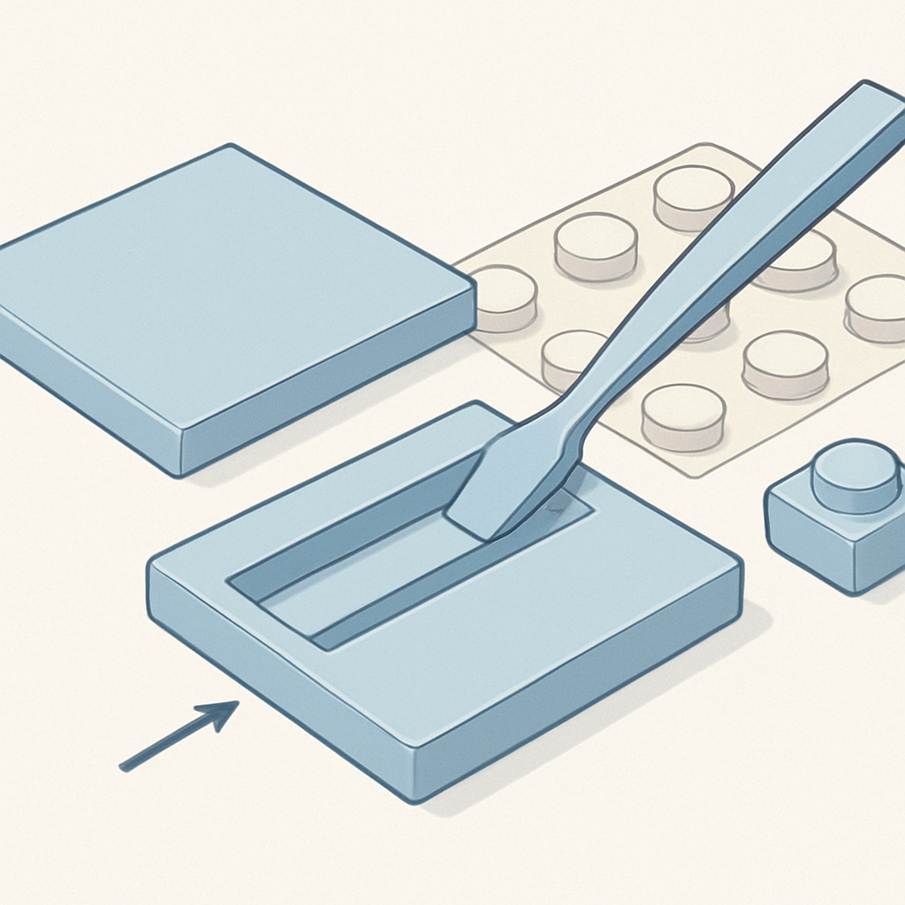

# Estrutura Interna do Tile: o Underside Groove



O conceito anterior apresentou o 1×1 tile como a versão plana do plate: mesmas dimensões de base (8mm × 8mm), mesmo corpo de 3,2mm, anti-stud na base — mas sem stud na face superior. Uma consequência prática desse design ficou anotada mas não aprofundada: o tile é difícil de remover justamente porque não oferece o ponto de alavanca natural que o stud do plate fornece. O underside groove existe especificamente para resolver esse problema, e entender sua geometria explica por que o BrickLink cataloga dois subtipos da mesma peça — o 3070a (sem groove) e o 3070b (com groove) — e por que, na prática, o 3070a sumiu da produção regular enquanto o 3070b é o tile 1×1 que você vai encontrar em qualquer fornecedor compatível hoje.

O groove é um entalhe horizontal cortado transversalmente na face inferior do tile — uma ranhura retangular que atravessa toda a largura da base de lado a lado, no eixo perpendicular ao comprimento. Diferente do anti-stud (que é a abertura circular que aceita o stud da peça abaixo), o groove não participa do mecanismo de encaixe: ele não toca o stud quando a peça está montada. Sua função é exclusivamente de alavancagem para remoção. Quando um tile está encaixado sobre um stud, a ponta do brick separator — a extremidade fina e levemente chanfrada da ferramenta — pode ser inserida no espaço lateral entre dois tiles adjacentes e posicionada de forma que o lábio da ferramenta enganche no groove. A partir daí, um movimento de torque transmite a força para baixo do tile e não para a lateral da peça, o que descola o tile do stud de forma controlada sem entortar as bordas da peça nem marcar a superfície da baseplate.

```
Vista da base do 1×1 Tile (3070b)
─────────────────────────────────────────────────────
  ┌───────────────────────────────┐
  │           ← 8mm →            │
  │  ┌─────────────────────────┐  │
  │  │  (anti-stud: ø ~4,8mm) │  │
  │  └─────────────────────────┘  │
  │═══════════════════════════════│ ← underside groove
  │   (entalhe traversal ~0,7mm) │
  │                               │
  └───────────────────────────────┘
─────────────────────────────────────────────────────
O groove corre de borda a borda, perpendicular à base,
posicionado entre o anti-stud e uma das bordas laterais.
```

A diferença entre o 3070a e o 3070b é, portanto, estrutural. O 3070a — produzido entre 1965 e meados da década de 1970 — tem a base lisa abaixo do anti-stud, sem nenhum entalhe. Para removê-lo de uma grade, era necessário usar a ponta de uma ferramenta externa ou, mais comumente, deslizar a lâmina de um separador pelo gap entre peças adjacentes sem nenhum ponto de ancoragem preciso, o que resultava em remoção imprecisa ou marcas nas peças vizinhas. O 3070b, introduzido a partir de 1974 (com adoção ampla desde 1978), incorporou o groove como solução de ergonomia: o entalhe define exatamente onde a ferramenta engata, tornando a remoção repetível e segura para uso em mosaicos que precisam ser desmontados, corrigidos ou reaproveitados.

A relevância desse detalhe para um negócio de mosaicos é direta. Mosaicos de retrato com centenas ou milhares de tiles são montados sobre baseplates, e eventualmente precisam ser desmontados — seja para correção de cor durante a montagem, seja quando o cliente devolve um painel para atualização, seja no aproveitamento de peças de uma remessa com erro de especificação. Sem o groove, remover tiles em série é uma operação frustrante e lenta; com o groove e um brick separator Art (o modelo largo lançado com os sets LEGO Art em 2020, quatro studs de largura), é possível deslizar a ferramenta ao longo de uma fileira e desencaixar múltiplos tiles em sequência com um único movimento de varredura.

Outro aspecto do groove que vale entender é sua relação com o molde de injeção. O ABS moldado por injeção tende a contrair levemente ao resfriar; em peças com paredes finas e geometria assimétrica, essa contração pode gerar deformação ou tensão residual. O entalhe na base do tile funciona também como um alívio de massa — ao remover material de uma região da base, o molde equilibra melhor a distribuição de espessura e facilita o fluxo de plástico durante a injeção, reduzindo o risco de rechupe (sink marks) na face superior lisa do tile. Para o tile especificamente, a face superior é o elemento visualmente crítico — qualquer imperfeição ali é imediatamente visível no mosaico. O groove na base, ao ajudar a garantir a uniformidade do resfriamento, contribui indiretamente para a qualidade da superfície plana do topo.

Para fabricantes compatíveis, a presença do groove no tile 1×1 é hoje um requisito implícito de qualidade. O Gobricks GDS-613 replica o 3070b com o groove, e qualquer compatível sério que você encontre no AliExpress ou no Gobricks listará explicitamente "with groove" (ou equivalente em chinês) para distinguir da variante antiga sem entalhe. Se você encontrar um lote de tiles 1×1 sem groove, está diante de uma peça descontinuada, de uma versão genérica de baixa qualidade que ignorou o refinamento de molde, ou de um erro de descrição do fornecedor — em qualquer dos três casos, um sinal de alerta antes de comprar em volume.

| Propriedade | 3070a (sem groove) | 3070b (com groove) |
|---|---|---|
| Base inferior | Lisa (apenas anti-stud) | Anti-stud + entalhe traversal |
| Período de produção LEGO | 1965 – ~1976 | 1974 – presente |
| Remoção com brick separator | Difícil, sem ancoragem | Precisa, groove serve de gancho |
| Uso em compatíveis atuais | Ausente (descontinuado) | Padrão universal |
| Identificador BrickLink | 3070a | 3070b |

Do ponto de vista da compra, a implicação prática é simples: ao especificar tiles 1×1 para um mosaico, use sempre o Part ID **3070b** — nunca apenas "3070". O BrickLink trata os dois como subtipos distintos, e alguns vendedores mais antigos ainda têm estoque do 3070a. Para montagem em volume e desmontagem eventual, só o 3070b garante a ergonomia de remoção que o negócio exige.

## Fontes utilizadas

- [Tile 1 x 1 with Groove: Part 3070b — BrickLink Reference Catalog](https://www.bricklink.com/v2/catalog/catalogitem.page?P=3070b)
- [LEGO Part 3070a Tile 1 x 1 without Groove — Rebrickable](https://rebrickable.com/parts/3070a/tile-1-x-1-without-groove/)
- [LEGO Part 3070b Tile 1 x 1 with Groove — Rebrickable](https://rebrickable.com/parts/3070b/tile-1-x-1-with-groove/)
- [The LEGO Art Brick Separator — LEGO Help Topics](https://www.lego.com/en-us/service/help-topics/article/lego-art-brick-separator)
- [How to use the Brick Separator — LEGO Help Topics](https://www.lego.com/en-us/service/help-topics/article/lego-classic-brick-separator)
- [LEGO Brick Separators, Tile Remover Tools & More! — The Brick Blogger](https://thebrickblogger.com/2021/04/lego-brick-separators-tile-remover-tools-more/)
- [Molds Over Time Part 2: How Updates to LEGO Elements Change Building Techniques — BrickNerd](https://bricknerd.com/home/molds-over-time-part-2-how-part-updates-change-build-techniques-10-19-23)
- [3070 – 1×1 Tile — LEGO Parts Guide — Brick Architect](https://brickarchitect.com/parts/3070?partstyle=1)
- [Gobricks GDS-613 Tile 1×1 with Groove](https://www.amazon.com/Gobricks-GDS-613-Groove-Compatible-Color%EF%BC%9ABlack/dp/B0CQMFMC5M)

---

**Próximo conceito** → [O 1×1 Round Plate](../04-o-1x1-round-plate/CONTENT.md)
