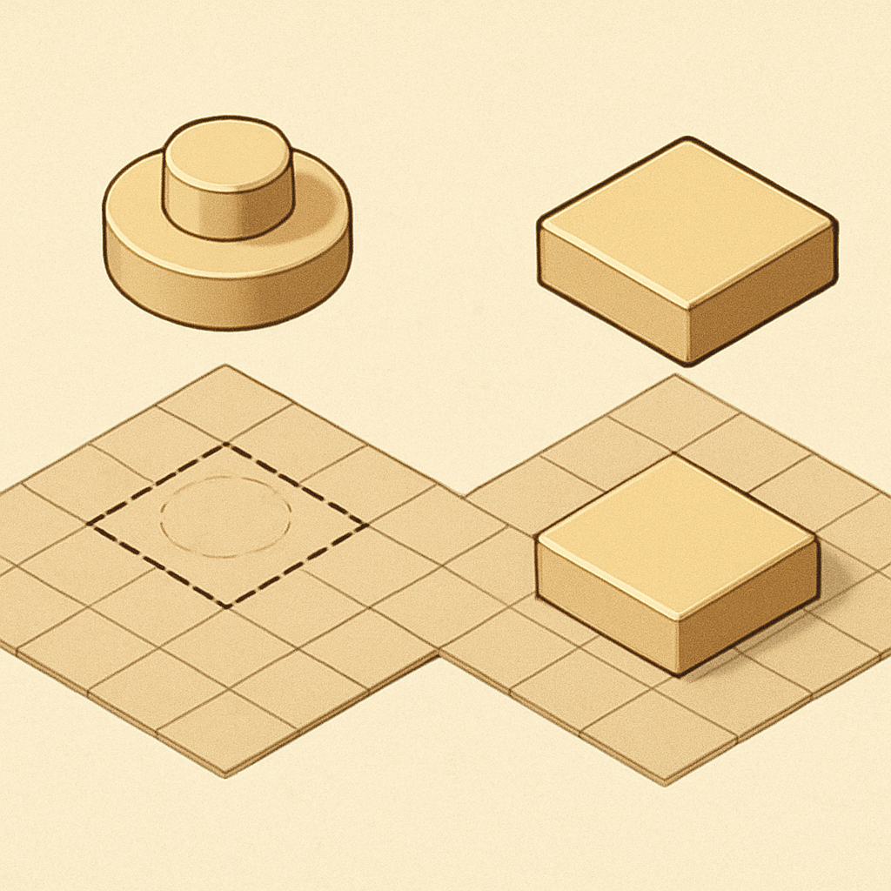

# O 1×1 Round Plate



Até aqui, o subcapítulo trabalhou com peças que compartilham uma característica em comum: a base quadrada de 8mm × 8mm. O 1×1 plate tem essa base quadrada com stud. O 1×1 tile tem a mesma base quadrada sem stud, e o underside groove aperfeiçoa a remoção sem alterar nada no footprint. O 1×1 round plate quebra essa sequência: o corpo da peça é circular — mas ela ainda ocupa o mesmo espaço de grade de 8mm × 8mm que as demais, porque o grid da baseplate é quadrado e cada posição na grade corresponde a uma célula de 8mm × 8mm independentemente da forma da peça encaixada.

Essa distinção é o ponto central do round plate: **a posição é quadrada; a peça é circular**. No BrickLink, a peça aparece principalmente como Part **4073** (o número histórico, com mold mark na lateral) e Part **6141** (a versão moderna, com mold mark no topo do stud) — ambas referem-se à mesma peça no catálogo, e compatíveis como Gobricks as listam sob o código **GDS-615** com a descrição "Plate Round 1 × 1 with Solid Stud". A LEGO produziu o 4073 desde 1980; a 6141 é a designação mais recente e predominante nas listas modernas. O BrickLink trata as duas como o mesmo Part ID consolidado (4073), e Rebrickable as mantém separadas (4073 para a lateral mark, 6141 para a top mark) — detalhe relevante apenas se você estiver especificando peças para um pedido BrickLink muito preciso, pois funcionalmente são intercambiáveis.

Estruturalmente, o round plate replica a lógica do plate quadrado em tudo que importa para encaixe: há um stud sólido no topo com as mesmas dimensões — diâmetro de 4,8mm e altura de ~1,7mm — e um anti-stud na base que aceita o stud de uma peça abaixo pelo mesmo mecanismo de interference fit descrito no plate quadrado. A espessura do corpo é de 3,2mm (8 LDU), idêntica ao plate. O que muda é exclusivamente o contorno da base: em vez de quatro paredes retas de 8mm, o round plate tem um cilindro de base com diâmetro nominal de 8mm — equivalente ao stud pitch, o espaçamento entre centros de studs adjacentes. Na prática, o diâmetro externo da base mede ligeiramente abaixo de 8mm (próximo de 7,9mm a 7,95mm) para acomodar a folga de encaixe da grade; isso significa que a peça se centraliza em sua célula da baseplate, mas não enche todos os cantos do espaço disponível.

```
Geometria de cobertura: Square Plate vs Round Plate na grade
─────────────────────────────────────────────────────────────
                    ┌───────┐              ┌───────┐
                    │███████│              │  ╭─╮  │
                    │███████│   ──────     │╭╯   ╰╮│  ← cantos expostos
                    │███████│              ││     ││
                    │███████│              │╰╮   ╭╯│
                    └───────┘              │  ╰─╯  │
                                           └───────┘
               1×1 Plate (3024)         1×1 Round Plate (4073/6141)
           base 8×8mm: cobertura        base ø≈8mm: ~78,5% da área
                   total                (π/4 ≈ 0,785 da célula quadrada)
─────────────────────────────────────────────────────────────
```

Os quatro cantos da célula de grade que a base circular não cobre são o elemento visual mais importante do round plate em mosaicos. Quando você monta um mosaico com plates quadrados sobre uma baseplate preta, a superfície é preenchida quase completamente — os gaps entre plates adjacentes são mínimos (a tolerância de encaixe, frações de milímetro). Quando você monta com round plates, os quatro cantos de cada célula ficam descobertos, expondo a baseplate (ou qualquer superfície abaixo). Se a baseplate for preta e as peças forem coloridas, esses cantos formam um padrão de cruz escura entre as peças — cada posição da grade fica visualmente circundada por um leve fundo negro. Esse efeito não é um defeito de montagem: é a consequência geométrica direta da forma circular.

Esse padrão pode ser usado de duas maneiras opostas em mosaicos de retrato. Como recurso visual deliberado, os cantos expostos criam uma separação visual nítida entre cada pixel da imagem, funcionando como um grid de contorno natural que isola as cores. Com uma baseplate preta como fundo, o resultado é um mosaico onde cada ponto de cor aparece como um disco destacado — o que favorece a leitura de retratos com contrastes fortes e áreas de cor uniforme (rostos com poucos tons intermediários, por exemplo). Já em retratos com gradações sutis — pele com muitas variações tonais, cabelos com degradê — os cantos expostos adicionam ruído visual entre pixels adjacentes de tons próximos, quebrando a transição suave que o algoritmo de mosaico tentou construir. A mesma peça pode ser o melhor recurso ou a maior distração, dependendo da imagem.

É importante não confundir o round plate com o round tile (Part 98138), que é a peça circular sem stud — e é justamente essa, a sem stud, que os sets LEGO Art utilizam como padrão. A diferença operacional entre os dois será o tema do conceito seguinte, mas já vale fixar: o round plate tem stud e, portanto, projeta o cilindro para cima com os mesmos ~1,7mm do plate quadrado. Num mosaico montado com round plates, cada posição projeta um stud sólido ao centro da célula — a superfície tem relevo e, por ser circular, o stud e a base visível formam dois círculos concêntricos vistos de frente. Num mosaico com round tiles, a superfície é um disco plano: sem stud, sem relevo, apenas a cor da peça num contorno circular com os mesmos cantos expostos.

Existe ainda uma terceira variante relevante: o Part **85861**, "Plate, Round 1 × 1 with Open Stud" — onde o cilindro do stud não é sólido, mas oco, com um buraco central passante. Essa variante existe porque o stud oco aceita uma barra axial de 3,18mm de diâmetro (o mesmo diâmetro de hastes usadas em técnicas Technic e em antenas), tornando a peça um ponto de montagem para conexões perpendiculares. Para mosaicos planares, o 85861 é irrelevante — a abertura no stud é invisível quando a peça está montada de frente, e o encaixe na baseplate funciona da mesma forma. Mas como o BrickLink lista os dois separados (4073 para stud sólido, 85861 para stud oco), vale saber distingui-los na hora de comprar para não receber a variante errada sem perceber.

| Propriedade | 1×1 Plate (3024) | 1×1 Round Plate (4073/6141) |
|---|---|---|
| Forma da base | Quadrada, 8mm × 8mm | Circular, ø ≈ 7,9–8mm |
| Cobertura da célula | ~100% | ~78,5% (π/4) |
| Stud no topo | Sim, sólido | Sim, sólido |
| Anti-stud na base | Sim | Sim |
| Altura do corpo | 3,2mm (8 LDU) | 3,2mm (8 LDU) |
| Cantos expostos na grade | Não | Sim |
| Part ID BrickLink | 3024 | 4073 (ou 6141) |
| Gobricks | N/D padrão | GDS-615 |
| Uso típico em mosaico | Preenchimento completo | Efeito disco / grid visual |

Para compatíveis, o round plate é produzido por Gobricks (GDS-615) e por outros fabricantes top-tier com tolerâncias comparáveis ao original. A dimensão crítica aqui é o diâmetro do stud e a posição de centralização na base circular — se o stud estiver descentrado (desvio de molde), a peça aparece levemente torta quando montada em série, criando um padrão perturbado na grade do mosaico. Em compatíveis de qualidade, esse desvio está abaixo do perceptível a olho nu. Em genéricos de baixa qualidade, o descentramento pode ser visível especialmente em áreas de cor uniforme onde o padrão regular é esperado.

O custo do round plate em compatíveis é tipicamente equiparável ao do plate quadrado — às vezes levemente mais alto por ser menos produzido em volume (mosaicos com plates quadrados são mais comuns). Para um pedido de retrato onde a escolha recai sobre round plates, o impacto no custo total por peça é marginal. O impacto maior é na decisão estética: adotar o round plate significa aceitar os cantos expostos como parte integrante do produto e validar com o cliente que esse é o resultado esperado — ou escolher uma baseplate da cor correta para que os cantos se integrem ao fundo em vez de contrastar com ele.

## Fontes utilizadas

- [Plate, Round 1 x 1 — BrickLink Reference Catalog (Part 4073)](https://www.bricklink.com/v2/catalog/catalogitem.page?P=4073)
- [Plate Round 1 x 1 with Solid Stud — Rebrickable (Part 6141)](https://rebrickable.com/parts/6141/plate-round-1-x-1-with-solid-stud/)
- [Plate Round 1 x 1 with Open Stud — BrickLink (Part 85861)](https://www.bricklink.com/v2/catalog/catalogitem.page?P=85861)
- [1×1 Round Plate (Part 6141) — Brick Architect Parts Guide](https://brickarchitect.com/parts/6141)
- [LEGO Plate 1 x 1 Round (6141 / 30057) — Brick Owl](https://www.brickowl.com/catalog/lego-plate-1-x-1-round-6141-30057)
- [Gobricks GDS-615 Plate Round 1×1 with Solid Stud — Amazon](https://www.amazon.com/BrickBuddy-Gobricks-Compatible-Components-Color%EF%BC%9ATan/dp/B0CSBMWFJ2)
- [Everything You Want to Know About LEGO Mosaics — BrickNerd](https://bricknerd.com/home/everything-you-want-to-know-about-lego-mosaics-11-12-24)
- [LEGO® Art: the new mosaic theme — New Elementary](https://www.newelementary.com/2020/07/lego-art-new-mosaic-theme.html)

---

**Próximo conceito** → [O 1×1 Round Tile](../05-o-1x1-round-tile/CONTENT.md)
