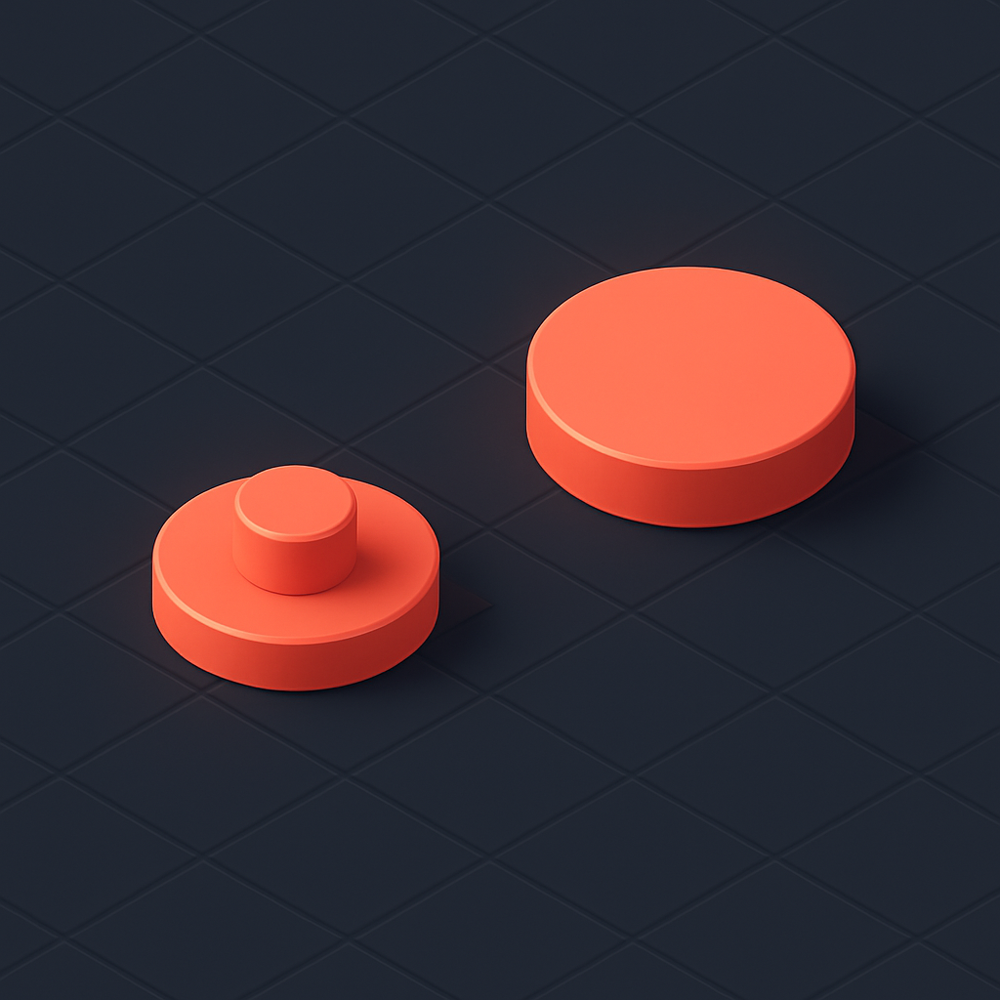

# O 1×1 Round Tile



O conceito anterior estabeleceu o que define o round plate: mesma espessura de 3,2mm e mesmo stud sólido do plate quadrado, mas com base circular de diâmetro próximo a 8mm — o que gera os quatro cantos expostos por célula da grade, aquele padrão de cruz visível especialmente sobre baseplates escuras. O 1×1 round tile parte do mesmo ponto geométrico e remove a única coisa que distinguia o round plate do tile quadrado: o stud. O resultado é a peça mais "limpa" do vocabulário do mosaico — um disco plano, circular e sem nenhuma projeção na face superior.

No catálogo BrickLink a peça é identificada como Part **98138** ("Tile, Round 1 × 1"), com design IDs alternativos **35381** e **35380** — os três referem-se ao mesmo molde e são intercambiáveis na prática, com a diferença estando apenas na localização do mold mark (parte inferior, lateral ou ausente dependendo da versão de molde). A Brick Owl consolida os dois principais sob 35381/98138 como sinônimos. A peça estreou na produção LEGO em 2011, aparece em mais de 3.300 sets e está disponível em até 64 cores — um catálogo de cores relevante para mosaicos, mas ainda menor que o do plate quadrado (até 75 cores) e do tile quadrado. O Gobricks produz a equivalência como **GDS-612** ("Tile Round 1 × 1"), listado explicitamente como compatível com os Design IDs 35381, 98138 e 35380.

A dimensão essencial do round tile é a mesma do round plate: corpo de **3,2mm** de altura (8 LDU), base circular com diâmetro externo próximo a 8mm — em torno de 7,9mm a 7,95mm para garantir a folga de encaixe dentro da célula da grade. O anti-stud na base existe, exatamente como no tile quadrado e no round plate, permitindo que a peça encaixe sobre qualquer stud de uma baseplate ou de outro plate abaixo. O que não existe é o stud na face superior: a superfície do round tile é plana e lisa, sem qualquer projeção. Isso coloca o round tile na interseção de dois eixos: é circular como o round plate, e é liso como o tile quadrado.

```
Geometria de superfície comparada: os quatro tipos 1×1
──────────────────────────────────────────────────────────────────
                ┌───────┐   ┌───────┐   ┌───────┐   ┌───────┐
                │  ●●●  │   │       │   │  ╭─╮  │   │  ╭─╮  │
                │ ●   ● │   │       │   │╭╯ ● ╰╮│   │╭╯   ╰╮│
                │  ●●●  │   │       │   ││  ●  ││   ││     ││
                │       │   │       │   │╰╮   ╭╯│   │╰╮   ╭╯│
                └───────┘   └───────┘   └───────┘   └───────┘
               1×1 Plate   1×1 Tile     1×1 Round   1×1 Round
                (3024)      (3070b)       Plate        Tile
              Base quad.  Base quad.    Base circ.   Base circ.
               Com stud    Sem stud      Com stud     Sem stud
──────────────────────────────────────────────────────────────────
```

A combinação de base circular sem stud tem uma consequência direta sobre como a peça aparece num mosaico: ela entrega ao mesmo tempo o efeito de "disco de cor" do round plate e a superfície plana do tile quadrado. Cada posição da grade, quando preenchida com um round tile, aparece como um círculo perfeitamente plano — sem o cilindro central projetado do round plate, e sem os quatro cantos preenchidos do tile quadrado. O observador vê, de frente, apenas um disco de cor sólida com os cantos da célula expostos atrás. É por isso que **a linha LEGO Art escolheu exatamente essa peça** como padrão para todos os seus mosaicos desde o lançamento em 2020: sets como os retratos de ícones da música pop (Andy Warhol, The Beatles, etc.) usam exclusivamente o round tile 98138 para cada pixel da imagem. A superfície plana garante fidelidade de cor sem micro-sombras; a forma circular cria separação visual natural entre pixels adjacentes — o grid de contorno que o round plate também gera, mas agora sem o relevo do stud interrompendo a cor no centro do disco.

Esse é o comportamento óptico central do round tile: ao eliminar o stud, a peça entrega a cor diretamente ao olho sem a interferência de sombras cilíndricas, e ao manter a base circular, mantém o grid natural de separação entre pixels. A comparação com o tile quadrado é reveladora — ambos têm superfície plana, mas onde o tile quadrado preenche 100% da célula de 8mm × 8mm, o round tile preenche apenas cerca de 78,5% (a razão π/4 da área do círculo inscrito no quadrado). Esses 21,5% restantes — os quatro cantos — ficam descobertos, expondo a cor da baseplate. Numa baseplate preta, isso cria o padrão de contorno escuro que isolita cada pixel; numa baseplate branca, esses cantos se integram ao fundo sem contraste. A escolha da cor da baseplate deixa de ser apenas estrutural e passa a ser parte do design do produto.

A dificuldade de remoção que o tile quadrado apresenta — e que motivou o underside groove do 3070b — se aplica igualmente ao round tile, com um agravante: a base circular não tem os cantos retos que, no tile quadrado, permitem que a ponta do brick separator encontre alguma geometria de encaixe lateral. O round tile é um disco sem quina. O anti-stud existe na base, mas quando a peça está encaixada sobre um stud, o único acesso para remoção é o espaço lateral entre peças adjacentes — que, numa grade densa de round tiles, é o mesmo padrão de gap circular que existe nos cantos. O brick separator Art (o modelo largo lançado em 2020 especificamente para os sets LEGO Art) tem uma extremidade projetada para deslizar pelo plano da baseplate e empurrar a peça de baixo para cima; para round tiles, essa técnica de varredura horizontal é mais eficaz do que tentar engatar num groove inexistente. Em mosaicos comerciais, onde a desmontagem eventual é previsível, trabalhar linha a linha com o brick separator Art é o método padrão.

A relação entre o round tile e o round plate na escolha de peça para mosaico pode ser sistematizada por critério:

| Critério | 1×1 Round Tile (98138) | 1×1 Round Plate (4073/6141) |
|---|---|---|
| Superfície | Plana, lisa, sem projeção | Com stud (~1,7mm de relevo) |
| Percepção de cor | Direta, sem micro-sombras | Alterada por reflexo do stud |
| Separação visual entre pixels | Grid escuro nos cantos | Grid escuro nos cantos + relevo central |
| Cobertura da célula | ~78,5% (π/4) | ~78,5% (mesma geometria de base) |
| Uso padrão nos sets LEGO Art | Sim | Não |
| Part ID BrickLink | 98138 | 4073 / 6141 |
| Gobricks | GDS-612 | GDS-615 |
| Custo relativo (compatíveis) | Ligeiramente mais alto | Comparável ao plate quadrado |

O custo do round tile em compatíveis fica tipicamente um pouco acima do round plate — a face superior lisa exige o mesmo nível de acabamento de molde que o tile quadrado, enquanto no round plate o stud sólido tolera alguma variação de superfície sem impacto visual. Em volume de mosaico de retrato, essa diferença raramente passa de 15% por peça em relação ao round plate. O impacto real está no número de cores disponíveis: como a paleta do round tile em compatíveis top-tier é menor do que a do plate quadrado, projetos que exigem cores muito específicas (tons pastéis raros, metálicos, transparentes) podem encontrar o round tile indisponível naquela cor no fornecedor principal, forçando a combinação com outra peça ou a mudança de fornecedor para aquela cor particular.

A especificação de compra para round tiles segue o mesmo padrão que o subcapítulo estabeleceu para as demais peças: usar o Design ID **98138** (ou 35381 como sinônimo) combinado com o Color ID correto no BrickLink — nunca apenas "round tile" em linguagem natural, que é ambíguo entre as variantes. No Gobricks, o código **GDS-612** identifica a peça; a pesquisa cruzada entre os dois sistemas usa os três Design IDs (98138, 35381, 35380) como chave de mapeamento. Para lotes de mosaico em escala, a quantidade mínima de pedido no Gobricks (geralmente 50 unidades por SKU) é suficiente para qualquer cor presente num único retrato de resolução média, mas cores de uso intenso (pele, cabelo escuro) podem exigir múltiplos lotes.

## Fontes utilizadas

- [Tile, Round 1 x 1 — BrickLink Reference Catalog (Part 98138)](https://www.bricklink.com/v2/catalog/catalogitem.page?P=98138)
- [LEGO Part 98138 Tile Round 1 x 1 — Rebrickable](https://rebrickable.com/parts/98138/tile-round-1-x-1/)
- [LEGO Tile 1 x 1 Round (35381 / 98138) — Brick Owl](https://www.brickowl.com/catalog/lego-tile-1-x-1-round-35381-98138)
- [98138 – 1×1 Tile, Round — Brick Architect Parts Guide](https://brickarchitect.com/parts/98138?retired=1)
- [Gobricks GDS-612 Tile Round 1×1 — Amazon](https://www.amazon.com/Gobricks-GDS-612-Compatible-Components-Color%EF%BC%9APearl/dp/B0CSBJJLRP)
- [Everything You Want to Know About LEGO Mosaics — BrickNerd](https://bricknerd.com/home/everything-you-want-to-know-about-lego-mosaics-11-12-24)
- [LEGO Art: the new mosaic theme — New Elementary](https://www.newelementary.com/2020/07/lego-art-new-mosaic-theme.html)

---

**Próximo conceito** → [Comparação Direta entre os Quatro Tipos](../06-comparacao-direta-entre-os-quatro-tipos/CONTENT.md)
