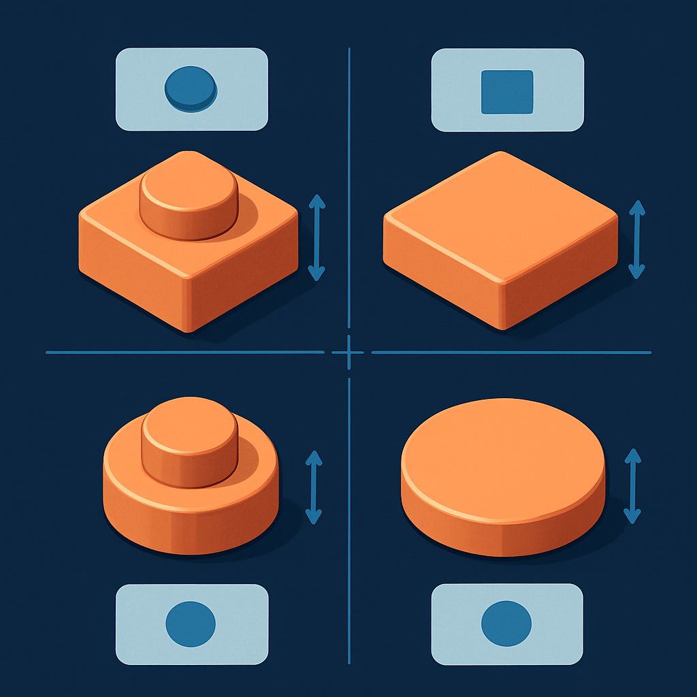

# Comparação Direta entre os Quatro Tipos



Os cinco conceitos anteriores construíram o vocabulário das peças 1×1 para mosaico peça por peça: o plate quadrado com stud, o tile quadrado liso, o underside groove que distingue o 3070b do 3070a, o round plate com base circular e stud, e o round tile com base circular e superfície plana. A essa altura o leitor tem uma imagem mental de cada tipo — mas ainda sem a visão lateral que só emerge quando os quatro são colocados lado a lado com os mesmos critérios. É disso que este conceito trata: consolidar as dimensões, as estruturas, os Part IDs e os códigos Gobricks em uma única referência que elimina qualquer ambiguidade na hora de especificar um pedido.

A tabela abaixo é o destilado de tudo que foi explicado nos conceitos anteriores. Cada linha representa um atributo que já apareceu em detalhe; o valor aqui é poder enxergar os quatro tipos em paralelo — não reaprender o que cada coluna significa, mas comparar entre colunas com um único golpe de visão.

| Atributo | 1×1 Plate | 1×1 Tile (Flat Tile) | 1×1 Round Plate | 1×1 Round Tile |
|---|---|---|---|---|
| **Part ID BrickLink** | 3024 | 3070b | 4073 / 6141 | 98138 |
| **Código Gobricks** | GDS-611 | GDS-613 | GDS-615 | GDS-612 |
| **Forma da base** | Quadrada | Quadrada | Circular | Circular |
| **Dimensão da base** | 8mm × 8mm | 8mm × 8mm | ø ≈ 7,9–8mm | ø ≈ 7,9–8mm |
| **Altura do corpo** | 3,2mm (8 LDU) | 3,2mm (8 LDU) | 3,2mm (8 LDU) | 3,2mm (8 LDU) |
| **Stud no topo** | Sim — sólido, ø 4,8mm | Não | Sim — sólido, ø 4,8mm | Não |
| **Altura total visível** | ~4,9mm (c/ stud) | 3,2mm | ~4,9mm (c/ stud) | 3,2mm |
| **Anti-stud na base** | Sim | Sim + groove | Sim | Sim |
| **Underside groove** | Não | Sim (3070b) | Não | Não |
| **Cobertura da célula de grade** | ~100% | ~100% | ~78,5% (π/4) | ~78,5% (π/4) |
| **Cantos expostos na grade** | Não | Não | Sim | Sim |
| **Superfície visível em mosaico** | Relevo cilíndrico (stud) | Plana e lisa | Relevo cilíndrico (stud) | Plana e lisa |
| **Padrão nos sets LEGO Art** | Não | Não | Em alguns sets | Sim — padrão desde 2020 |
| **Cores disponíveis (LEGO original)** | ~75 | ~64 | ~66 | ~64 |
| **Cores disponíveis (Gobricks)** | Alta cobertura | Alta cobertura | Cobertura moderada | Cobertura moderada |
| **Custo relativo (compatíveis)** | Referência (mais barato) | +10–20% vs plate | Similar ao plate | Similar ao tile quadrado |
| **Facilidade de remoção** | Alta (stud como alavanca) | Média (groove ajuda) | Alta (stud como alavanca) | Baixa (sem groove, sem stud) |
| **Introdução no catálogo LEGO** | 1962 | 1965 (3070a); groove desde ~1974 | 1980 | 2011 |

Dois eixos ortogonais organizam completamente essa família: **forma da base** (quadrada ou circular) e **presença de stud** (com ou sem). O cruzamento desses dois eixos gera exatamente os quatro tipos:

```
                  BASE QUADRADA        BASE CIRCULAR
                 ┌────────────────┬────────────────────┐
   COM STUD      │   1×1 Plate    │  1×1 Round Plate   │
                 │    (3024)      │   (4073 / 6141)    │
                 ├────────────────┼────────────────────┤
   SEM STUD      │  1×1 Tile      │  1×1 Round Tile    │
                 │   (3070b)      │     (98138)        │
                 └────────────────┴────────────────────┘
```

Essa matriz é a forma mais rápida de localizar a peça certa dado um objetivo: se você precisa de cobertura total da célula (sem cantos expostos), filtre a coluna esquerda; se precisa de superfície plana sem relevo, filtre a linha inferior. A interseção das duas restrições aponta para uma única célula.

Uma implicação da matriz que não fica óbvia até ver os quatro em paralelo: **nenhum dos quatro lados do quadrado está vazio**. Cada combinação existe como peça real com Part ID próprio, com produção em múltiplas cores, com fornecedor compatível mapeado. Isso importa para decisões de design que misturam tipos — por exemplo, um mosaico que usa round tiles (98138) para a maior parte das áreas mas plate quadrado (3024) para bordas onde a cobertura total da grade é necessária. A compatibilidade dimensional entre os quatro é total no plano horizontal: todos têm footprint de 8mm × 8mm (ou equivalente circular dentro da mesma célula) e todos encaixam no mesmo stud de 4,8mm de qualquer baseplate. O único ponto de incompatibilidade é na altura visível: misturar peças com stud (plate, round plate) e sem stud (tile, round tile) no mesmo painel resulta em superfície com dois níveis — as peças com stud ficam ~1,7mm acima das sem stud. Para a esmagadora maioria dos mosaicos planares isso é imperceptível a distância, mas pode gerar uma sombra lateral visível em luz rasante.

A diferença de disponibilidade de cores entre os tipos tem impacto prático mais sutil do que parece. Os ~75 tons do plate 3024 representam o catálogo historicamente mais amplo — são mais de seis décadas de produção acumulada. O round tile 98138, introduzido em 2011, já alcançou 64 tons em apenas quinze anos de produção, e é justamente a família que a linha LEGO Art priorizou, o que acelerou a expansão da paleta. Para compatíveis, a diferença de cobertura entre tipos é mais pronunciada: Gobricks e os fabricantes top-tier cobrem bem os tons de alta demanda (cores de pele, cinzas neutros, preto, branco, azul, vermelho), mas para matizes raros — verde azulado, lavanda, marrom avermelhado — a disponibilidade do round tile pode estar ausente numa cor específica enquanto o plate está disponível. Quando o algoritmo de mosaico converte uma foto para a paleta disponível e gera a lista de material, o tipo de peça escolhido define não só a aparência do produto mas também a viabilidade do pedido dado o estoque do fornecedor.

No contexto de um pedido comercial de mosaico de retrato em SP, a escolha entre os quatro tipos pode ser sistematizada assim:

| Objetivo do pedido | Tipo recomendado | Justificativa |
|---|---|---|
| Custo mínimo, cobertura total | 1×1 Plate (3024) | Mais barato, maior paleta, cobertura 100% |
| Superfície lisa, cobertura total | 1×1 Tile (3070b) | Plano sem stud, sem cantos expostos |
| Estética LEGO Art, separação entre pixels | 1×1 Round Tile (98138) | Padrão dos sets oficiais, disco plano com grid natural |
| Relevo texturado circular | 1×1 Round Plate (4073) | Mesmo grid do round tile + stud projetado |

O subcapítulo seguinte — Impacto Visual das Peças no Mosaico de Retrato — aprofunda exatamente o critério estético: como a escolha de cada tipo afeta a textura, o reflexo e a percepção de cor num retrato real visto de distância. O que a tabela acima indica como "estética" ou "cobertura" vira análise visual concreta quando o mosaico é avaliado montado e à distância de leitura típica.

## Fontes utilizadas

- [Plate 1x1 — BrickLink Reference Catalog (Part 3024)](https://www.bricklink.com/v2/catalog/catalogitem.page?P=3024)
- [Tile 1 x 1 with Groove — BrickLink (3070b)](https://www.bricklink.com/v2/catalog/catalogitem.page?P=3070b)
- [Plate, Round 1 x 1 — BrickLink Reference Catalog (Part 4073)](https://www.bricklink.com/v2/catalog/catalogitem.page?P=4073)
- [Tile, Round 1 x 1 — BrickLink Reference Catalog (Part 98138)](https://www.bricklink.com/v2/catalog/catalogitem.page?P=98138)
- [LEGO Part 6141 Plate Round 1 x 1 with Solid Stud — Rebrickable](https://rebrickable.com/parts/6141/plate-round-1-x-1-with-solid-stud/)
- [LEGO Part 3070b Tile 1 x 1 with Groove — Rebrickable](https://rebrickable.com/parts/3070b/tile-1-x-1-with-groove/)
- [LEGO Part 98138 Tile Round 1 x 1 — Rebrickable](https://rebrickable.com/parts/98138/tile-round-1-x-1/)
- [Gobricks GDS-612 Tile Round 1×1 — Amazon](https://www.amazon.com/Gobricks-GDS-612-Compatible-Components-Color%EF%BC%9APearl/dp/B0CSBJJLRP)
- [Everything You Want to Know About LEGO Mosaics — BrickNerd](https://bricknerd.com/home/everything-you-want-to-know-about-lego-mosaics-11-12-24)
- [Building Custom LEGO Mosaics with LEGO Art Sets — The Brick Blogger](https://thebrickblogger.com/2020/12/building-custom-lego-mosaics-with-lego-art-sets/)
- [LEGO® Art: the new mosaic theme — New Elementary](https://www.newelementary.com/2020/07/lego-art-new-mosaic-theme.html)

---

**Próximo subcapítulo** → [Impacto Visual das Peças no Mosaico de Retrato](../../03-impacto-visual-das-pecas-no-mosaico-de-retrato/CONTENT.md)
