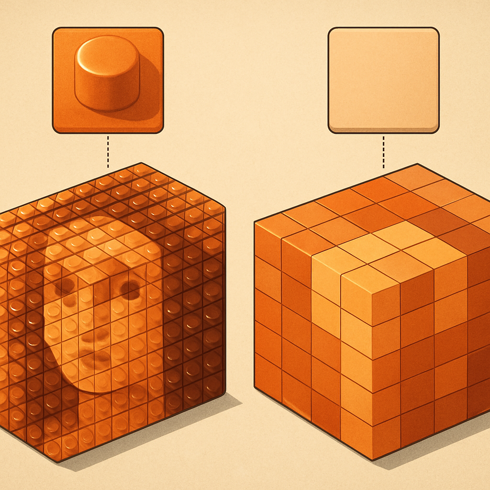

# Plate vs Tile no Mosaico Acabado



O conceito anterior estabeleceu o mecanismo físico pelo qual o stud interfere na percepção de cor e contraste — o cilindro de 1,7 mm que gera highlights e micro-sombras dependentes do ângulo de luz. Agora a questão prática é direta: para um mosaico de retrato que vai ser pendurado na parede de um cliente, você escolhe plate (com stud) ou tile (sem stud)? Essa decisão não é cosmética — ela determina a categoria visual do produto que o cliente vai receber.

O 1×1 plate e o 1×1 tile são dimensionalmente idênticos em base e altura: ambos medem 8 × 8 mm em planta e 3,2 mm de espessura (8 LDU). A diferença é exclusivamente o stud no topo — presente no plate, ausente no tile. O tile tem, na sua face inferior, o underside groove (o entalhe em U que facilita remoção e distingue o tile de uma plaquinha sólida), mas na face superior que aparece no mosaico acabado ele é completamente plano. Isso parece detalhe trivial de engenharia de peça, mas no produto montado a diferença é sistêmica: um mosaico de 32×32 studs tem 1.024 peças, e cada stud presente ou ausente contribui para um campo visual uniforme. Quando o stud está presente em todas as peças, a superfície inteira é texturizada; quando está ausente, a superfície é contínua.

```
Vista de perfil — mesma cor, mesmo plano de montagem:

Plate (com stud):          Tile (sem stud):
      ┌──┐                    ┌────┐
──────┘  └──────           ─────────────

Vista de topo — campo de 4×4 peças:

Plate:        Tile:
○ ○ ○ ○      ┌─┬─┬─┬─┐
○ ○ ○ ○      ├─┼─┼─┼─┤
○ ○ ○ ○      ├─┼─┼─┼─┤
○ ○ ○ ○      └─┴─┴─┴─┘
(cada ○ = stud)  (cada célula = superfície lisa)
```

A consequência visual mais imediata do tile liso é que a cor percebida pelo observador é substancialmente mais fiel ao color ID especificado. Como o stud elimina a micro-sombra e o highlight direcional que o plate introduz, a superfície de tile reflete luz ambiente de forma mais uniforme — o `Medium Blue` de um tile aparece como `Medium Blue` em praticamente qualquer condição de iluminação do ambiente doméstico ou corporativo típico. O plate do mesmo color ID terá, em iluminação lateral, regiões ao redor de cada stud onde a luminosidade percebida cai entre 5% e 15% do valor base — suficiente para ser visível como "grão" ou "textura escura" nas áreas de cor lisa quando o painel é visto a 1,5 m. Esse não é defeito de cor: é geometria. A cor não mudou; o que mudou é quanto de luz chega uniformemente à retina do observador.

O padrão escolhido pela LEGO para seus sets oficiais da linha LEGO Art ilustra essa distinção de forma direta. Os sets dos Beatles e das coleções Andy Warhol usam 1×1 tiles quadrados lisos — a escolha pelo produto com acabamento mais próximo de uma impressão gráfica. Os sets de Iron Man e Star Wars The Sith usam 1×1 round plates — que têm stud, portanto textura. Conforme descrito pelos próprios designers da linha, a escolha por peças redondas (round) confere ao produto um "feel de Pop Art" e evita o problema prático de alinhar centenas de peças quadradas na grid, mas implica aceitar a textura do stud. Quando a LEGO quer o resultado mais "limpo" e próximo de arte gráfica, vai para tile.

| Propriedade | 1×1 Plate (com stud) | 1×1 Tile (sem stud) |
|---|---|---|
| Superfície no mosaico | Texturizada (stud exposto) | Lisa e plana |
| Fidelidade de cor percebida | Modulada por micro-sombras | Alta fidelidade ao color ID |
| Aspecto visual geral | "Produto LEGO" — identificável | Próximo de impressão gráfica |
| Sensação de profundidade | Maior (relevo 3D) | Menor (bidimensional) |
| Comportamento com luz lateral | Textura direcional pronunciada | Praticamente neutro |
| Custo por peça (compatíveis) | Levemente inferior | Levemente superior |
| Part ID BrickLink referência | 3024 | 3070b |

Existe uma armadilha recorrente que aparece em fóruns e grupos de MOC builders: confundir "plate parece mais LEGO" com "plate é melhor para retrato". Para mosaicos decorativos de retrato — produto para parede, projetado para ser apreciado de frente a distância — o critério relevante não é o reconhecimento da identidade LEGO, mas a legibilidade do retrato em si. Studs expostos introduzem textura que compete visualmente com a informação de cor. Em imagens de baixo contraste ou com muitas gradações suaves — retratos fotográficos são exatamente esse caso —, a textura do stud fragmenta a transição tonal e o observador percebe "grão" onde deveria perceber a suavidade de uma face humana. Com tile, as transições de cor são lidas pelo cérebro como gradação de pixel, não como textura de superfície.

Isso não significa que plate seja errado para qualquer mosaico. Em imagens com alto contraste, bordas nítidas e poucos meios-tons — silhuetas, ícones, retratos estilizados como os Andy Warhol do LEGO Art —, o stud contribui para a sensação de textura artesanal sem prejudicar a leitura da imagem. A textura do plate até reforça o caráter handmade. O problema aparece quando o cliente envia uma foto de alta resolução esperando fidelidade máxima de reprodução: nesse caso, o tile entrega um resultado que o plate não consegue igualar.

Do ponto de vista de custo, a diferença é pequena mas consistente. O 1×1 tile (Design ID 3070b no BrickLink) historicamente custa entre 10% e 20% a mais por unidade do que o 1×1 plate (Design ID 3024) em compatíveis de qualidade como Gobricks, tanto por peça individual quanto por lote. Para um painel 32×32 de 1.024 peças, essa diferença representa algo na ordem de R$ 10–30 no custo de material, dependendo do fornecedor e do câmbio. É uma diferença real mas não proibitiva — o que significa que a escolha entre plate e tile pode (e deve) ser feita por critério visual e por alinhamento com a expectativa do cliente, não por economia de material.

A pergunta operacional para quem produz retratos customizados é simples: o cliente quer um produto que pareça um painel de arte com acabamento gráfico limpo, ou quer um produto que pareça inequivocamente LEGO, com textura e profundidade de superfície? A primeira resposta aponta para tile; a segunda, para plate. E quando o cliente não souber responder — o que é o caso da maioria —, mostrar os dois resultados lado a lado (ou uma foto de referência de cada tipo) é a forma mais eficaz de alinhar expectativa antes de fazer o pedido ao fornecedor. Os conceitos seguintes deste subcapítulo vão adicionar a dimensão das peças redondas e da distância de visualização a esse critério, completando o quadro de decisão.

## Fontes utilizadas

- [Everything You Want to Know About LEGO Mosaics — BrickNerd](https://bricknerd.com/home/everything-you-want-to-know-about-lego-mosaics-11-12-24)
- [LEGO® Art: the new mosaic theme — New Elementary](https://www.newelementary.com/2020/07/lego-art-new-mosaic-theme.html)
- [Brick Breakdown: LEGO Art Iron Man Mosaic — The Brick Blogger](https://thebrickblogger.com/2020/10/brick-breakdown-lego-art-iron-man-mosaic/)
- [All About LEGO Mosaics — Brick Builder's Handbook](https://brickbuildershandbook.com/all-about-lego-mosaics/)
- [Is it really possible to rebrick LEGO Art mosaics at a reasonable price? — Stonewars](https://stonewars.com/features/is-it-really-possible-to-rebrick-lego-art-mosaics-at-a-reasonable-price/)
- [Lego Art — Wikipedia](https://en.wikipedia.org/wiki/Lego_Art)

---

**Próximo conceito** → [Round vs Square em Mosaicos de Retrato](../03-round-vs-square-em-mosaicos-de-retrato/CONTENT.md)
