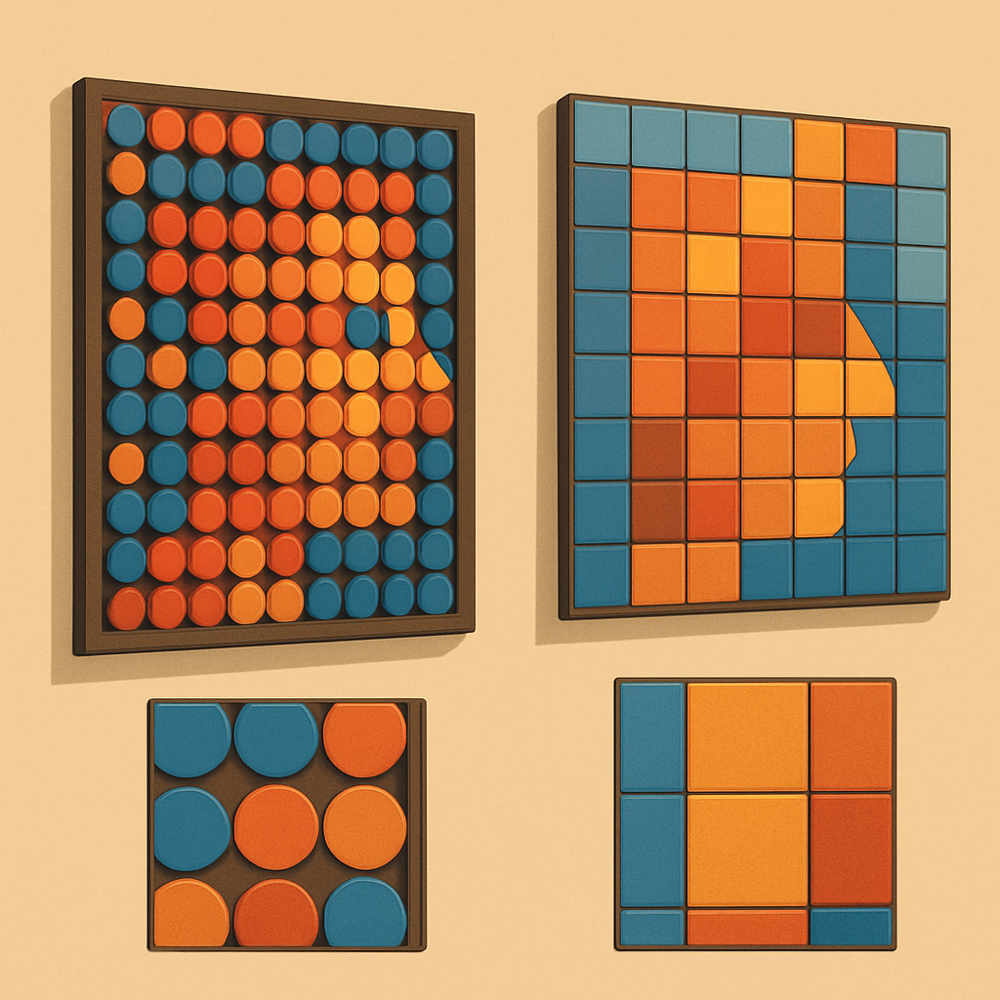

# Round vs Square em Mosaicos de Retrato



O conceito anterior fechou a comparação entre plate e tile — superfície texturizada com stud versus superfície plana sem stud — e estabeleceu que, para retratos fotográficos com gradações suaves, o tile entrega fidelidade de cor superior porque elimina as micro-sombras que o stud injeta na percepção visual. Mas há uma segunda dimensão na escolha de peças que não foi abordada: a forma da base. Até aqui comparamos peças com ou sem stud assumindo base quadrada. Existem, porém, as variantes round — o 1×1 round plate (Design ID 4073) e o 1×1 round tile (Design ID 98138) — e a diferença entre base circular e base quadrada cria um fenômeno visual completamente distinto do efeito do stud: o espaço negativo entre peças adjacentes.

Quando quatro peças de base quadrada se encontram num canto compartilhado de grade, elas cobrem o substrato inteiramente. Cada célula da grid é preenchida de borda a borda — a baseplate desaparece por completo sob as peças montadas. Com peças de base circular, a situação é diferente: um círculo inscrito num quadrado de 8×8 mm ocupa apenas π/4 ≈ 78,5% da área desse quadrado. Os 21,5% restantes — os quatro "cantos" entre a circunferência e as bordas da célula — ficam descobertos. E como cada canto de uma célula é compartilhado por quatro peças vizinhas, o padrão resultante não é aleatório: é sistemático, repetitivo e geometricamente preciso.

```
Vista de topo — campo 4×4 de peças:

Base quadrada (plate/tile):     Base circular (round plate/tile):

┌─┬─┬─┬─┐                       · ○ · ○ · ○ · ○ ·
├─┼─┼─┼─┤                       ○   ○   ○   ○   ○
├─┼─┼─┼─┤                       · ○ · ○ · ○ · ○ ·
└─┴─┴─┴─┘                       ○   ○   ○   ○   ○
                                 · ○ · ○ · ○ · ○ ·

Cada · representa um canto exposto da baseplate entre quatro círculos.
Com base preta, esses pontos formam uma grade de losangos escuros.
```

O espaço negativo entre as round pieces não é um defeito de montagem — é uma propriedade geométrica permanente da forma circular. Ele aparece identicamente em qualquer mosaico montado com round plates ou round tiles, independente de como as peças estão posicionadas, porque a circunferência nunca pode cobrir os cantos do quadrado subjacente. A baseplate preta, que é o substrato padrão da maioria dos mosaicos de retrato, fica visível nessas quatro interseções, formando uma grade de pequenos losangos escuros que se repetem regularmente por toda a superfície do painel.

Esse padrão de losangos é o traço mais importante para entender o comportamento visual das round pieces. Em baseplates pretas — o padrão dos sets LEGO Art e da maioria dos mosaicos de retrato comerciais —, os losangos se comportam como uma sobreposição constante de contraste escuro sobre a imagem. Cada ponto de cor no mosaico está, na verdade, separado dos seus vizinhos por uma microfresta negra. O efeito visual resultante tem dois caracteres possíveis dependendo do contexto: pode ser recurso ou ruído.

Quando é recurso: a grade de losangos cria uma separação visual entre as "células de cor" do mosaico que reforça a leitura pixel-a-pixel da imagem. Em imagens estilizadas com alto contraste, paleta reduzida e bordas nítidas — o Pop Art de Andy Warhol é o exemplo arquetípico —, essa separação funciona como contorno automático entre as regiões de cor, aumentando a clareza da forma sem exigir que o algoritmo de mosaico insira peças de contorno manualmente. É por isso que a LEGO escolheu round plates para os sets como Iron Man: a grade de losangos, combinada com a baseplate preta, reforça a silhueta de um super-herói de bordas definidas de forma mais eficaz do que um campo uniforme de tiles quadrados faria. A forma circular também elimina o problema prático de alinhamento que as peças quadradas introduzem durante a montagem — cada round piece pode ser colocada sem preocupação com rotação ou orientação, o que é relevante quando se está posicionando 1.024 peças seguidas.

Quando é ruído: retratos fotográficos de pessoas reais dependem de gradações suaves de tom para transmitir profundidade — a transição de luz para sombra numa face humana é contínua, não discreta. O que o mosaico faz é quantizar essa continuidade em uma grade de células de cor, e o objetivo é que a leitura à distância recomponha a ilusão de gradação contínua. A grade de losangos escuros intervém nesse processo: ela fragmenta visualmente as regiões de cor similar que deveriam se fundir opticamente, inserindo uma textura de contraste regular que o cérebro percebe como ruído visual, não como informação de retrato. Em áreas de pele com gradação suave — a região da bochecha, a transição do cabelo para a testa, o pescoço contra o fundo —, os losangos criam uma textura crocante que interrompe a fusão óptica que tornaria o retrato legível. O efeito é comparável a aplicar um filtro de halftone sobre a imagem, mas sem o controle de parâmetros que um designer teria.

| Propriedade | Round plate / round tile | Square plate / square tile |
|---|---|---|
| Cobertura da baseplate | ~78,5% por célula (círculo inscrito) | 100% por célula |
| Espaço negativo | Grade de losangos nas interseções | Nenhum |
| Efeito em imagens estilizadas | Contorno automático, reforça bordas | Pixels limpos, sem separação adicional |
| Efeito em retratos fotográficos | Ruído de halftone sobre gradações suaves | Gradações se fundem opticamente à distância |
| Estilo visual resultante | Pop Art, separação de pixels evidente | Mais próximo de impressão gráfica ou pixel art |
| Part IDs de referência (BrickLink) | 4073 (round plate), 98138 (round tile) | 3024 (plate), 3070b (tile) |
| Alinhamento durante montagem | Irrelevante (simétrica radialmente) | Requer atenção a bordas e cantos |

A escolha entre round e square não é independente da escolha entre plate e tile. As quatro combinações são possíveis e cada uma tem um perfil distinto:

- **Square plate**: textura de stud + cobertura total. Padrão "mais LEGO", textura 3D visível, nenhum espaço negativo.
- **Square tile**: sem stud + cobertura total. Resultado mais limpo, fidelidade de cor mais alta, padrão de pixel art pura.
- **Round plate**: textura de stud + grade de losangos. Dupla fonte de textura — o stud e o espaço negativo. Resultado mais complexo visualmente, Pop Art acentuado.
- **Round tile**: sem stud + grade de losangos. O padrão dos sets LEGO Art mais recentes (Beatles, coleções Warhol). Superficie lisa mas com separação de pixels pela grade de losangos.

Uma armadilha real que aparece na prática: quem experimenta round tiles pela primeira vez, comparando o render no BrickLink Studio com o resultado físico, percebe que o software não simula o espaço negativo com a mesma precisão que aparece no produto montado. O Studio renderiza a round tile como um círculo sobre fundo neutro, mas no físico a baseplate preta sob os cantos cria um contraste perceptível que não aparecia no preview digital. O efeito fica mais pronunciado em baseplates pretas — que é exatamente o substrato padrão — e menos evidente em baseplates de cor clara. Para quem produz retratos de clientes, isso significa que aprovar o design apenas pelo preview digital sem ter uma amostra física como referência pode resultar em surpresa na entrega: o cliente recebe um produto com uma textura de grade que não foi discutida.

O critério prático para um negócio de mosaicos de retrato é relativamente direto. Se o cliente envia uma foto de rosto com iluminação natural e gradações suaves, e o objetivo é máxima fidelidade ao retrato original, square tile é a escolha: cobertura total, sem espaço negativo, sem stud, cores percebidas com maior fidelidade. Se o cliente quer um produto que pareça inequivocamente LEGO Art — referenciando os sets oficiais como ponto de partida estético —, round tile é a escolha: o padrão visual dos products da linha LEGO Art como Beatles e Andy Warhol. Se a imagem é estilizada, com contraste alto e paleta limitada, round plate amplifica o caráter artesanal. Se o budget é mais restrito e a aparência "produto LEGO" importa mais que fidelidade fotográfica, square plate funciona com custo ligeiramente menor e sem a complexidade do espaço negativo.

O conceito seguinte deste subcapítulo adiciona a dimensão que faltou até aqui nessa análise: a distância de visualização. O que parece problemático a 20 cm — a grade de losangos de uma round tile, o grão de stud de um plate — pode desaparecer completamente a 1,5 m. A distância não anula as diferenças entre peças, mas calibra o peso que cada uma tem na percepção final do produto acabado.

## Fontes utilizadas

- [Everything You Want to Know About LEGO Mosaics — BrickNerd](https://bricknerd.com/home/everything-you-want-to-know-about-lego-mosaics-11-12-24)
- [LEGO Art: the new mosaic theme — New Elementary](https://www.newelementary.com/2020/07/lego-art-new-mosaic-theme.html)
- [Brick Breakdown: LEGO Art Iron Man Mosaic — The Brick Blogger](https://thebrickblogger.com/2020/10/brick-breakdown-lego-art-iron-man-mosaic/)
- [Tile, Round 1x1 (Part 98138) — BrickLink](https://www.bricklink.com/v2/catalog/catalogitem.page?P=98138)
- [98138 — 1×1 Tile, Round — Brick Architect](https://brickarchitect.com/parts/98138?retired=1)
- [All About LEGO Mosaics — Brick Builder's Handbook](https://brickbuildershandbook.com/all-about-lego-mosaics/)

---

**Próximo conceito** → [Distância de Visualização e Percepção de Detalhe](../04-distancia-de-visualizacao-e-percepcao-de-detalhe/CONTENT.md)
