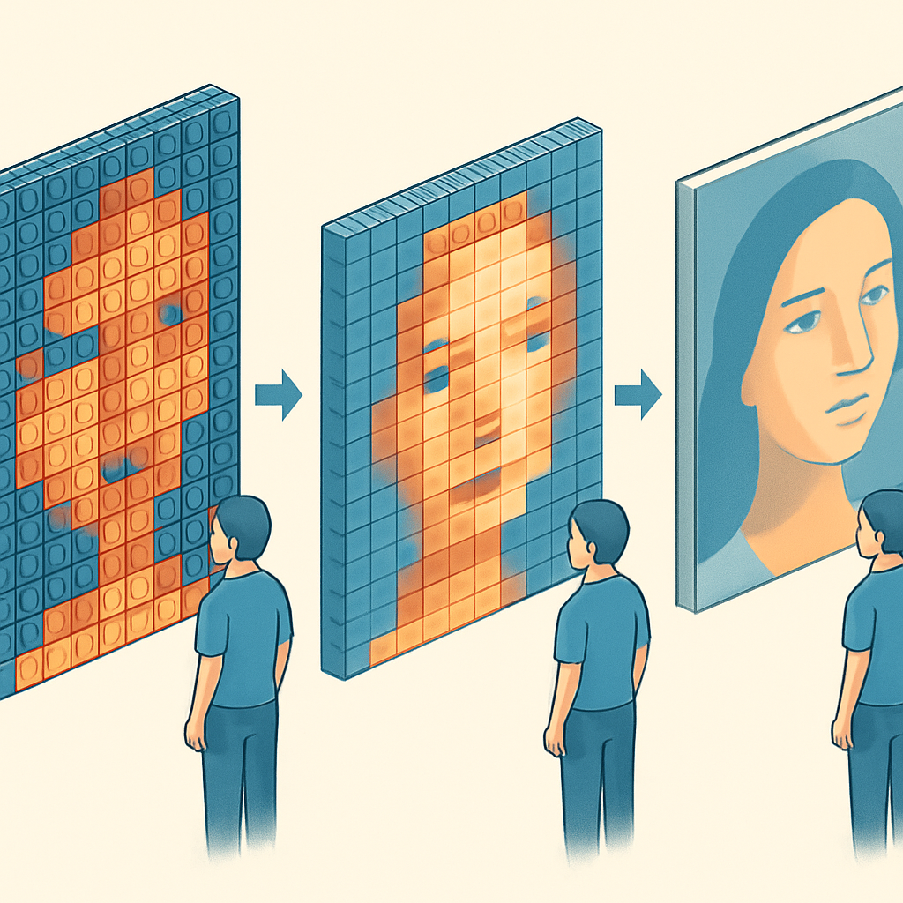

# Distância de Visualização e Percepção de Detalhe



O conceito anterior encerrou com uma observação que serve de ponto de partida aqui: o que parece problemático a 20 cm — a grade de losangos de uma round tile, o grão de stud de um plate — pode desaparecer completamente a 1,5 m. Isso não é otimismo; é óptica. A distância de visualização é a variável que calibra o peso prático de todas as diferenças discutidas até aqui, e entendê-la muda fundamentalmente como você avalia a escolha de peças para um pedido de retrato.

O mecanismo que governa esse comportamento é a acuidade visual humana. O olho, sob condições normais de iluminação, consegue resolver detalhes angulares de aproximadamente 1 minuto de arco — uma unidade de 1/60 de grau. Em termos concretos, isso significa que para um detalhe ser distinguível como elemento separado, ele precisa ocupar pelo menos esse ângulo na retina do observador. Traduzindo para tamanhos físicos: a 1 metro de distância, o limite de resolução do olho é de aproximadamente 0,29 mm. A 1,5 m é 0,44 mm. A 2 m é 0,58 mm.

O stud de um 1×1 plate tem 4,8 mm de diâmetro. O espaçamento entre centros de stud é 8 mm. A micro-sombra que o stud projeta sobre a superfície do plate — o mecanismo que estudamos no primeiro conceito deste subcapítulo — tem profundidade de desvanecimento de talvez 1 mm a 1,5 mm ao redor da base do cilindro. A grade de losangos exposta nas round pieces, para uma baseplate de 8 mm por célula, tem cantos com cerca de 1,5 mm a 2 mm de dimensão linear.

Esses números tornam algo imediato visível: **nenhuma dessas texturas está perto do limiar de resolução do olho a distâncias típicas de apreciação de parede.** A 1,5 m, o olho resolve 0,44 mm — o stud de 4,8 mm é mais de dez vezes maior que esse limiar. A 2 m, o stud continua claramente distinguível. A 3 m, o stud ainda ocupa um ângulo de quase 6 arcminutos na retina — seis vezes o limiar de resolução. Isso quer dizer que os studs individuais são visíveis mesmo a distâncias consideráveis. O que muda com a distância não é a capacidade de ver o stud, mas a sua relevância perceptual relativa dentro do campo visual total do painel.

O fenômeno central é a integração espacial do sistema visual. Quando você está a 20 cm de um mosaico, o stud de uma peça específica ocupa uma fração significativa do seu campo de atenção. O contexto é toda a textura da superfície — os cilindros, as sombras, o relevo. A 1,5 m, o mesmo stud ocupa um ângulo minúsculo dentro de um campo visual que inclui o retrato inteiro. O sistema visual não analisa cada stud individualmente; ele integra a informação de cor e contraste de uma região e produz uma percepção holística. A textura pontilhada do campo de studs torna-se parte de uma impressão unificada de cor, e não uma série de artefatos discretos competindo com o retrato.

Isso é a mesma lógica do pontilhismo de Seurat. Uma tela pontilhista vista a 30 cm é um campo caótico de pontos de cor pura. A 3 metros, os pontos se fundem — não por adição perfeita de cores, mas por integração do sistema visual — e o retrato ou paisagem emerge como imagem contínua. A diferença para o mosaico LEGO é de escala: os "pontos" têm 8 mm de lado em vez de milímetros, então a fusão completa requer distâncias maiores do que para uma pintura pontilhista. Mas o mecanismo é idêntico.

```
Limiar de distinguibilidade vs. distância (acuidade de 1 arcminuto):

Distância  | Detalhe mínimo | Stud (4,8 mm) | Losango round (≈1,5 mm) | Grad. cor peça (8 mm)
-----------+----------------+---------------+--------------------------+----------------------
  0,5 m    |   0,15 mm      | distinguível  | distinguível             | distinguível
  1,0 m    |   0,29 mm      | distinguível  | distinguível             | distinguível
  1,5 m    |   0,44 mm      | distinguível  | distinguível             | distinguível
  2,0 m    |   0,58 mm      | distinguível  | distinguível             | distinguível
  3,0 m    |   0,87 mm      | distinguível  | visível, mas integrado   | fusão começa
  5,0 m    |   1,45 mm      | visível       | limiar de resolução      | fundido

Nota: "distinguível" = percebido como elemento separado e saliente
      "integrado" = visível mas absorvido na percepção da região de cor
      "fusão" = não mais percebido como elemento individual
```

A implicação prática não é que todos os efeitos desaparecem a distância. É que o peso subjetivo deles cai de forma não-linear. Um cliente que olha o mosaico no dia da entrega vai fazer o quê? Vai tirar da embalagem e examinar a 20 cm para checar a qualidade de montagem. Depois vai pendurar na parede e se sentar no sofá a 2–3 m para apreciar. A experiência cotidiana do produto é a segunda — não a primeira. E nessa segunda perspectiva, os fenômenos que pareciam problemáticos na análise próxima mudam de caráter.

A grade de losangos das round tiles, que a 30 cm parece uma sobreposição de halftone crocante, a 2 m produz um efeito visual diferente: cada célula de cor tem um halo sutilmente mais escuro ao redor que cria uma separação limpa entre pixels adjacentes. Em retratos com contraste médio a alto, isso reforça a legibilidade em vez de prejudicá-la. A textura de micro-sombras do plate, que a 30 cm parece modular a cor de forma perceptível, a 2 m é integrada como profundidade de superfície — o observador percebe o mosaico como "mais tridimensional" sem conseguir nomear a fonte desse efeito.

Isso não significa que a escolha de peça deixa de importar a distância. Significa que o critério muda: a pergunta não é "esse detalhe é visível?", mas "como esse detalhe contribui para a leitura do retrato à distância de apreciação?"

| Efeito visual          | A 30–50 cm                         | A 1,5–2 m                              | A 3 m+                               |
|------------------------|------------------------------------|----------------------------------------|--------------------------------------|
| Stud do plate          | Micro-sombra saliente, grão visível | Textura de superfície, profundidade 3D | Integrado como "densidade visual"    |
| Ausência de stud (tile)| Superfície visivelmente plana       | Fidelidade de cor alta, liso           | Quase indiferenciável de impressão   |
| Losango round tile     | Grade de halftone pronunciada       | Separação de pixels leve               | Quase invisível em baseplates escuras|
| Losango round plate    | Dupla textura: stud + halftone      | Caráter Pop Art pronunciado            | Textura rica, identidade LEGO forte  |
| Cobertura total (square)| Ausência de espaço negativo visível | Gradação suave de tons de pele         | Fusão óptica máxima                  |

A distância também interage com o tamanho do painel. Um retrato em painel 32×32 studs mede aproximadamente 25,6 × 25,6 cm. Esse é um quadro pequeno. Preso na parede de uma sala, o observador sentado no sofá vai estar a pelo menos 1,5 m dele — e provavelmente a 2–3 m se estiver no centro da sala. Um painel 48×48 studs mede aproximadamente 38,4 × 38,4 cm e chama atenção de posições mais distantes; a distância típica de apreciação sobe junto com o tamanho. Quanto maior o painel, mais a leitura acontece a distância — e menos as texturas superficiais de peças são salientes no produto acabado.

A consequência direta para um negócio de mosaicos de retrato é que **superestimar o impacto negativo das texturas de perto é um erro de calibração frequente.** Um produtor que analisa o mosaico no processo de montagem — por definição, a 30–50 cm de distância — vai perceber cada stud, cada losango, cada transição de cor. Esse é o contexto errado para avaliar o produto. O teste correto é fotografar o painel terminado de 1,5 m e comparar com a referência original; ou melhor ainda, pendurá-lo numa parede e recuar até a distância que o cliente vai estar no dia-a-dia.

Há uma consequência menos óbvia que vale mencionar: a distância de visualização afeta diferentemente imagens com diferentes características de frequência espacial. Uma imagem com detalhes finos — olhos, fios de cabelo, rugas — é perdida quando a peça usada é grande demais para a resolução do painel ou quando a distância de visualização funde os pixels antes que os detalhes finos possam ser lidos. Uma imagem com apenas grandes regiões de cor — fundo liso, ombros, áreas de pele sem textura — é robusta a variações de peça e distância porque o gradiente de cor está na escala do pixel inteiro, não na escala da textura interna da peça. Para retratos fotográficos, a região mais sensível à escolha de peça + distância é exatamente a transição de tom contínua — a sombra progressiva de uma bochecha, a gradação do cabelo para a testa — porque é nessa faixa que a textura de stud ou o losango de round podem fragmentar a fusão óptica que reconstrói a ilusão de continuidade.

Para um retrato padrão de cliente — face humana iluminada naturalmente, fundo neutro, montado em painel 32×32 — a distância de visualização esperada na parede de casa é entre 1,5 m e 3 m. Nessa faixa, square tile oferece a fusão óptica mais completa: sem stud para criar profundidade de superfície competindo com a leitura de cor, sem espaço negativo para fragmentar as gradações. Round tile oferece separação de pixels que funciona bem para retratos de contraste médio-alto — o efeito Pop Art da grade de losangos a 2 m é leve o suficiente para não prejudicar e forte o suficiente para dar caráter ao produto. Plate (square ou round) empurra o caráter visual para "produto LEGO identificável" — o stud permanece lido como textura 3D mesmo a 2 m, o que pode ser exatamente o que o cliente quer ou exatamente o que ele não quer dependendo da expectativa dele com o produto.

O próximo conceito fecha o subcapítulo traduzindo toda essa análise em regra prática de decisão — como escolher o tipo de peça para um pedido específico, pesando nível de acabamento, orçamento e expectativa do cliente.

## Fontes utilizadas

- [Everything You Want to Know About LEGO Mosaics — BrickNerd](https://bricknerd.com/home/everything-you-want-to-know-about-lego-mosaics-11-12-24)
- [All About LEGO Mosaics — Brick Builder's Handbook](https://brickbuildershandbook.com/all-about-lego-mosaics/)
- [Vertical Mosaic LEGO Portraits: Everything You Need to Know — Instructables](https://www.instructables.com/Vertical-Mosaic-LEGO-Portraits-Everything-You-Need/)
- [How to Design a Brick Mosaic — Stewart Lamb Cromar](https://stubot.me/how-to-design-a-brick-mosaic/)
- [Pointillism: optical mixing vs pigment mixing — Beyond Every Art](https://www.beyondeveryart.com/pointillism-optical-mixing-vs-pigment-mixing/)
- [Resolution limit of the eye — how many pixels can we see? — Nature Communications / arXiv](https://arxiv.org/html/2410.06068v1)
- [Visual Acuity, DPI, and Resolution — Jared Jared](https://jaredjared.com/visual-acuity-dpi/)
- [Custom LEGO Mosaics: Tips for Creating Personalized Brick Art — BrickPicFun](https://brickpicfun.com/custom-lego-mosaics-design-tips-and-inspiration/)

---

**Próximo conceito** → [Critério de Decisão para Pedidos](../05-criterio-de-decisao-para-pedidos/CONTENT.md)
