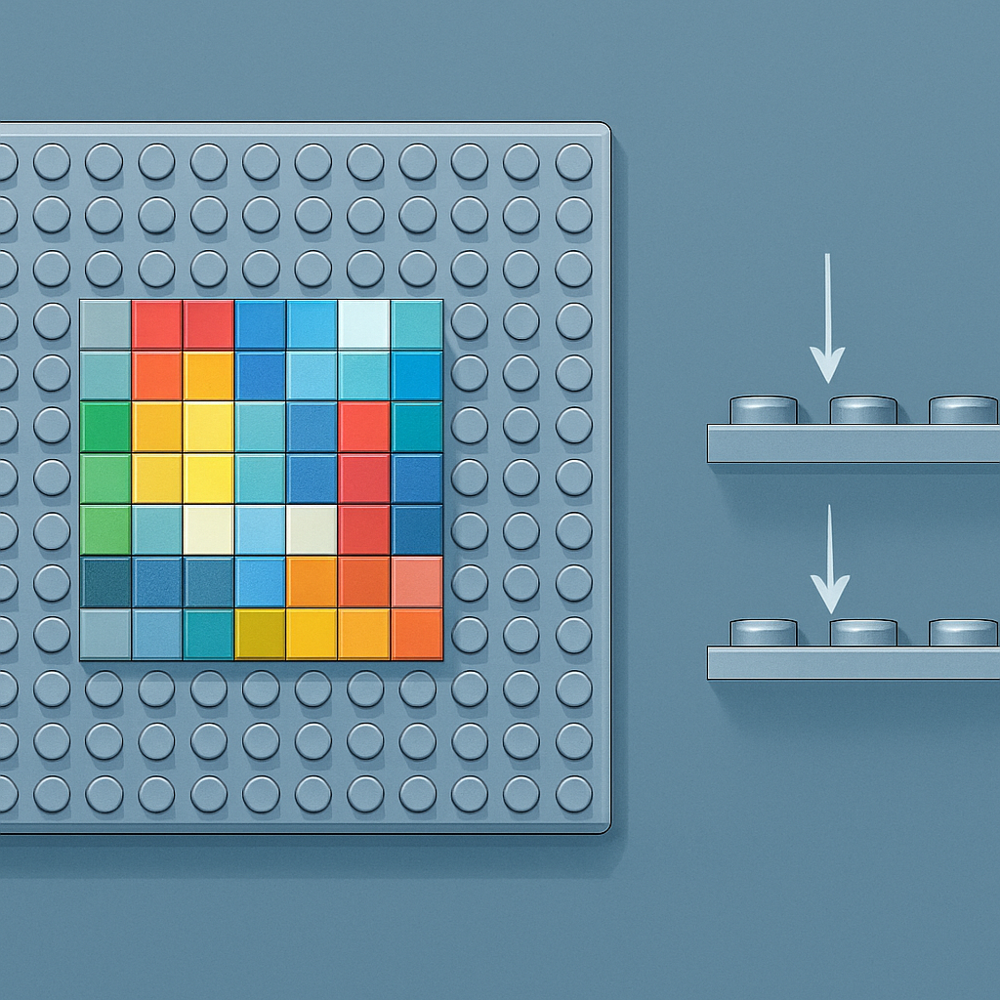

# O que é uma Baseplate e seu Papel Estrutural no Mosaico



Antes de chegar à baseplate, o subcapítulo estabeleceu o sistema de medidas do LEGO — LDU, stud, a proporção 3:1 entre brick e plate em altura — e catalogou as peças 1×1 que formam os pixels do mosaico: o plate com stud exposto, o tile com superfície lisa, as variantes round. Toda essa taxonomia descreve os pixels. A baseplate é a tela sobre a qual esses pixels se fixam, e entender o que ela é fisicamente — e o que ela não é — é o que separa um mosaico que sustenta a si mesmo de uma pilha de peças soltas.

Uma baseplate é uma placa plana, coberta integralmente por uma grade de studs em sua face superior, e com a face inferior completamente lisa, sem anti-studs. Esse segundo detalhe é o mais importante e o mais frequentemente ignorado por quem vem de trabalhar com plates comuns: a baseplate não se conecta a nada por baixo. Ela é um piso terminal — o ponto mais baixo do sistema. Enquanto um 1×1 plate tem, em sua base, o anti-stud (o encaixe cilíndrico que recebe o stud de outra peça), a baseplate tem apenas uma superfície plana e rígida. Isso significa que ela repousa sobre qualquer superfície nivelada — uma mesa, uma moldura, um suporte de parede — sem estabelecer conexão construtiva com ela.

A espessura do corpo da baseplate (desconsiderando a altura dos studs) é de aproximadamente 1,6 mm — exatamente metade da espessura de um plate padrão LEGO, que é 3,2 mm (8 LDU). A baseplate foi intencionalmente projetada mais fina para reduzir material e peso em grandes formatos, já que ela existe para cobrir áreas extensas. Uma baseplate 32×32 em ABS teria volume considerável se fosse tão espessa quanto plates convencionais empilhadas; a fina lâmina de 1,6 mm resolve isso. Em contrapartida, essa espessura reduzida torna a baseplate levemente flexível em formatos maiores — o que não é problema em mosaicos, onde as próprias peças 1×1 presas acima conferem rigidez ao conjunto.

A grade de studs na face superior segue exatamente o módulo de 8 mm entre centros que rege o sistema inteiro. Cada stud da baseplate é geometricamente equivalente ao stud de qualquer plate ou brick: diâmetro externo de 4,8 mm, passo de 8 mm horizontal e vertical. O 1×1 plate encaixa no stud da baseplate com o mesmo clutch power de qualquer conexão stud-to-anti-stud do sistema — a interferência de material que gera a força de retenção característica do LEGO. Do ponto de vista do pixel do mosaico, a baseplate é transparente: ele não sabe se está encaixado em outra plate, em um brick ou em uma baseplate. O que importa é que a conexão existe e é firme.

O papel estrutural da baseplate no mosaico de retrato é triplo. Primeiro, ela define a grade de referência: cada stud ocupa uma posição inequívoca em coordenadas (coluna, linha), e colocar um 1×1 plate em (5, 12) é uma operação determinística — não há margem de posicionamento livre como haveria ao colar peças numa superfície comum. Segundo, ela distribui o esforço lateral: quando o mosaico é manuseado ou pendurado, as forças que tentam deslocar as peças são absorvidas pela estrutura rígida da baseplate, que atua como uma espinha dorsal plana. Terceiro, ela fixa a escala física do painel: uma baseplate 32×32 ocupa exatamente 256 mm × 256 mm na dimensão horizontal (32 × 8 mm por eixo), definindo de forma precisa qual será o tamanho físico do produto acabado antes de a primeira peça ser encaixada.

A diferença funcional entre usar uma baseplate e usar plates comuns como base merece atenção especial. Tecnicamente, é possível montar um mosaico sobre uma camada de plates 1×N ou plates maiores em vez de uma baseplate — e alguns MOC builders fazem isso para criar mosaicos que se integram a construções mais complexas, onde o verso do painel também precisa conectar a outras peças. Mas no contexto de um produto final de retrato para venda, isso traz duas desvantagens práticas: custo (plates grandes acumulam preço por unidade em área coberta) e espessura adicional (o mosaico fica mais grosso, o que pode conflitar com molduras rasas). A baseplate resolve ambos: cobertura de área grande em uma única peça, com espessura mínima.

```
Baseplate 32×32            Plate empilhada como base
─────────────────────      ─────────────────────────
1 peça, 1 SKU              Múltiplas peças, múltiplos SKUs
1,6 mm de espessura        3,2 mm de espessura (1 plate)
Fundo liso, sem anti-stud  Fundo com anti-stud (conectável abaixo)
Levemente flexível sozinha Rígida por si mesma
Padrão para mosaicos       Padrão para construções complexas
```

No vocabulário do BrickLink, baseplates têm sua própria categoria de partes (Category 2 — Baseplate), separada de plates (Category 26 — Plate). Isso não é apenas organização editorial: reflete que baseplate e plate são famílias de peças com funções e comportamentos físicos distintos, mesmo que visualmente semelhantes na face superior. A distinção de categoria é útil na hora de buscar: ao procurar uma baseplate 32×32, você filtra pela categoria Baseplate e encontra imediatamente, sem se perder no catálogo extenso de plates de todos os tamanhos.

Para o negócio de mosaicos, a baseplate é componente de custo relevante — ela entra em todo pedido — e sua escolha entre original LEGO ou compatível tem implicações que os conceitos seguintes deste subcapítulo detalham. O que importa fixar aqui é o entendimento da peça em si: uma lâmina fina com grade de studs na face superior, fundo liso, que serve de substrato único e ordenado para todos os pixels do mosaico. Sem ela, o mosaico não existe como objeto; com ela, cada peça 1×1 tem um endereço permanente e a composição inteira ganha coesão estrutural.

## Fontes utilizadas

- [Baseplate — Brickipedia, the LEGO Wiki](https://en.brickimedia.org/wiki/Baseplate)
- [Basic LEGO Parts Guide — Brick Architect](https://brickarchitect.com/parts/category-1)
- [Baseplates — Help Topics — LEGO Customer Service](https://www.lego.com/en-us/service/help-topics/article/baseplates)
- [Everything You Want to Know About LEGO Mosaics — BrickNerd](https://bricknerd.com/home/everything-you-want-to-know-about-lego-mosaics-11-12-24)
- [Review: Brickyard Building Blocks LEGO Compatible Baseplate — Brick Model Railroader](https://brickmodelrailroader.com/index.php/2022/06/10/review-brickyard-building-blocks-lego-compatible-baseplate/)
- [BrickLink Reference Catalog — Parts — Category Baseplate](https://www.bricklink.com/catalogList.asp?catType=P&catString=2)

---

**Próximo conceito** → [Tamanhos Padrão de Baseplate: 16×16, 32×32 e 48×48](../02-tamanhos-padrao-de-baseplate-16x16-32x32-e-48x48/CONTENT.md)
