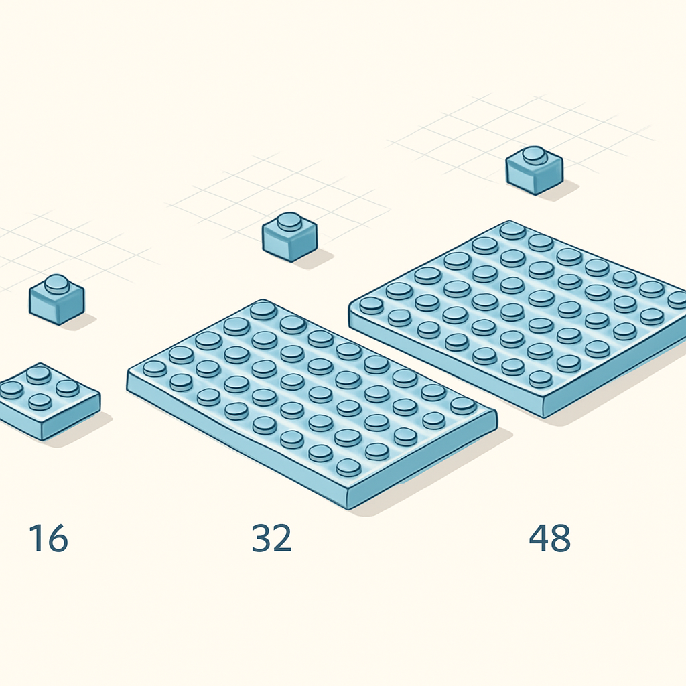

# Tamanhos Padrão de Baseplate: 16×16, 32×32 e 48×48



O conceito anterior estabeleceu a baseplate como substrato terminal do mosaico — a lâmina fina com grade de studs na face superior, fundo liso sem anti-studs, que transforma um conjunto de peças soltas em um painel coeso com endereços fixos. O que ficou em aberto foi a questão dimensional: qual baseplate usar para cada pedido? Essa pergunta não tem uma resposta única, mas tem uma lógica clara — e a lógica começa com os três formatos canônicos do sistema.

O sistema LEGO reconhece três tamanhos de baseplate padrão para uso em mosaicos: 16×16, 32×32 e 48×48 studs. As dimensões físicas derivam diretamente da medida de módulo que o capítulo de sistema de medidas introduziu: o espaçamento entre centros de stud é 8 mm. Multiplica por 16, 32 ou 48 studs e tem-se:

| Formato | Studs | Dimensão física | Pixels no mosaico | Part ID (BrickLink) |
|---------|-------|-----------------|-------------------|---------------------|
| 16×16   | 256   | 128 × 128 mm (12,8 × 12,8 cm) | 256 | 3811 (versão menor, raro) / ver nota |
| 32×32   | 1.024 | 256 × 256 mm (25,6 × 25,6 cm) | 1.024 | 3811 |
| 48×48   | 2.304 | 384 × 384 mm (38,4 × 38,4 cm) | 2.304 | 4186 |

A baseplate 32×32 — Part 3811 no BrickLink — é o formato dominante do mercado. Ela define o padrão do LEGO Art: todos os sets da linha (Beatles, Sith, Hokusai, Iron Man) usam múltiplas baseplates 32×32 conectadas em grade para formar o painel final. Uma única 32×32 resulta em um quadrado de 25,6 cm × 25,6 cm, que sozinho já entrega um produto com presença visual razoável em parede — comparável a um quadro de mesa ou uma impressão fotográfica pequena. Para mosaicos de retrato de uso comercial, esse é o ponto de entrada natural: um pedido típico de retrato simples parte de 1 ou 4 baseplates 32×32 combinadas (64×64 studs = 51,2 × 51,2 cm), que é o equivalente aproximado de um quadro A2.

A baseplate 48×48 — Part 4186, 38,4 × 38,4 cm — historicamente existiu como peça avulsa em cinza claro (set 10701) e como componente de kits de construção. O LEGO Mosaic Maker oficial (set 40179) usa uma única baseplate 48×48 como base. Em 2022, a LEGO lançou a versão 11024 (Classic Grey Baseplate 48×48) como produto vendido separadamente, sinalizando que o formato ainda tem espaço no catálogo ativo. A vantagem prática da 48×48 é cobrir mais área com uma junta a menos: um retrato de 48×48 studs entrega 38 × 38 cm sem nenhuma linha de conexão visível entre baseplates — o que importa quando o cliente vai expor o mosaico próximo e qualquer junta se torna imperfeita.

A baseplate 16×16 é o parente menor, menos comum em mosaicos de retrato por razão direta: 128 × 128 mm é pequeno demais para um produto de parede com impacto visual, e construir um retrato razoável nesse formato exigiria combinar muitas placas com muitas juntas. Seu uso principal em mosaicos aparece em contextos de miniaturas, logotipos pequenos, ícones e projetos decorativos compactos (um coaster, um ímã de geladeira em escala maior). Para o negócio de retratos customizados, a 16×16 raramente entra na conta.

O que determina a escolha na prática é uma combinação de três fatores: tamanho físico desejado pelo cliente, número de juntas aceitáveis e custo por área coberta. A junta entre baseplates adjacentes é um compromisso estrutural e estético que o próximo conceito deste subcapítulo detalha; aqui, a regra de ouro é que quanto mais baseplates individuais o mosaico exige, mais juntas aparecem — e cada junta é um risco de desalinhamento e uma linha visual que não estava na imagem original. Formatos grandes com poucas juntas exigem baseplates maiores; formatos menores permitem composições mais flexíveis com peças mais fáceis de adquirir e transportar.

```
Exemplo: retrato 96×96 studs (76,8 × 76,8 cm)

Com 32×32:  9 baseplates em grade 3×3  → 8 juntas visíveis
Com 48×48:  4 baseplates em grade 2×2  → 4 juntas visíveis
```

O dimensionamento em studs é a linguagem de projeto, e os centímetros são a linguagem do cliente. Traduzir um pedido de "quero um retrato de 50 cm × 50 cm" para a grade de baseplates é o primeiro cálculo que o negócio faz antes de qualquer outra decisão. Uma grade de 2×2 baseplates 32×32 entrega 64×64 studs = 51,2 × 51,2 cm, que serve esse pedido. Duas baseplates 48×48 lado a lado entregam 96×48 studs = 76,8 × 38,4 cm, adequado para uma composição panorâmica. Saber esses números de cabeça — 12,8 cm / 25,6 cm / 38,4 cm — é o que permite responder um cliente em segundos sem calculadora.

Uma nota sobre disponibilidade de cores: a 32×32 existe em mais opções de cor no catálogo LEGO e no mercado de compatíveis (verde, cinza, branco, bege). Para mosaicos de retrato, a cor da baseplate é irrelevante — ela fica completamente coberta pelas peças 1×1 — mas a disponibilidade em cinza claro ou cinza escuro facilita verificar se alguma peça ficou faltando, porque o contraste entre a cor da baseplate e as peças coloridas torna as posições vazias visíveis durante a montagem.

## Fontes utilizadas

- [Baseplate 32 x 32 : Part 3811 — BrickLink](https://www.bricklink.com/catalogItem.asp?P=3811)
- [Baseplate 48 x 48 : Part 4186 — BrickLink](https://www.bricklink.com/v2/catalog/catalogitem.page?P=4186)
- [LEGO Classic Grey Baseplate 48×48 (11024) — ToyPro](https://www.toypro.com/us/product/45123/grey-baseplate-48-x-48)
- [LEGO Baseplate sizes — Quora](https://www.quora.com/What-are-the-sizes-of-Lego-base-plates)
- [Everything You Want to Know About LEGO Mosaics — BrickNerd](https://bricknerd.com/home/everything-you-want-to-know-about-lego-mosaics-11-12-24)
- [LEGO® Baseplates — Choose-a-Brick](https://www.choose-a-brick.com/collections/parts-baseplate)
- [Mosaic Brick Art Starter Kit com 2 baseplates 32×32 — Bricktastics](https://bricktastics.com/en-us/products/mosaic-brick-art-starter-kit-13-colours-2-32x32-base-plates)

---

**Próximo conceito** → [Conexão entre Baseplates para Mosaicos Maiores](../03-conexao-entre-baseplates-para-mosaicos-maiores/CONTENT.md)
