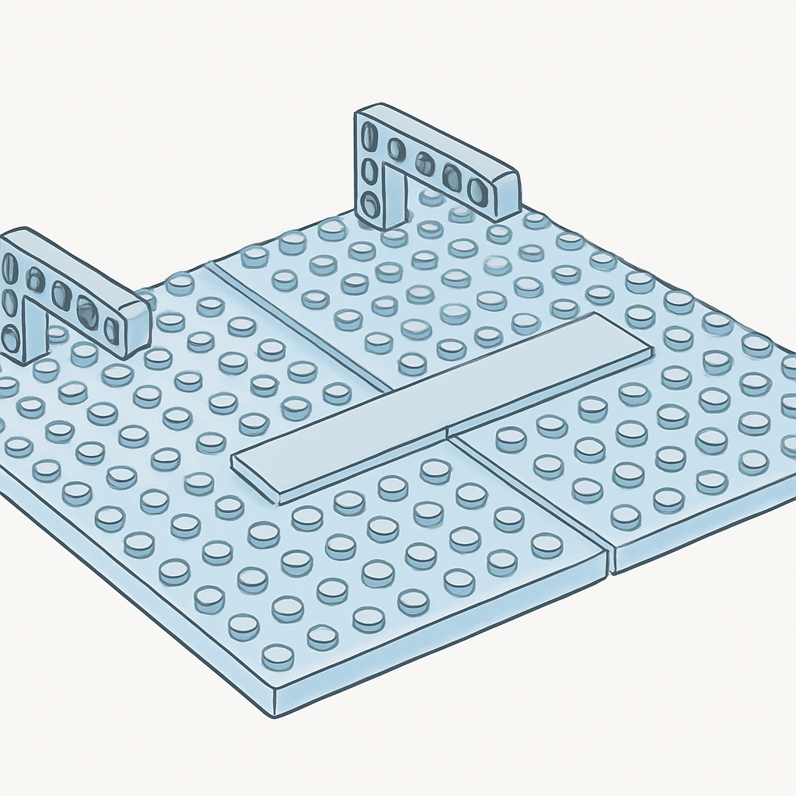
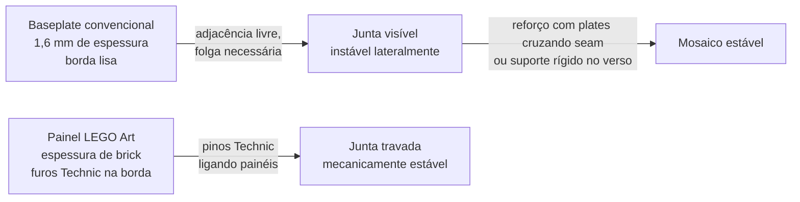

# Conexão entre Baseplates para Mosaicos Maiores



O conceito anterior deixou um problema em aberto de propósito: mosaicos que excedem o tamanho de uma única baseplate — seja um retrato de 64×64 studs composto por quatro 32×32, seja um painel de 96×96 exigindo nove — inevitavelmente criam juntas entre placas adjacentes. A questão não é se a junta vai aparecer, mas como ela se comporta estruturalmente e o quanto ela interfere no produto final.

A primeira coisa a entender sobre a junta é que baseplates adjacentes **não se encaixam entre si**. Isso não é falha de design; é consequência direta da geometria estabelecida nos conceitos anteriores. Cada baseplate tem fundo liso sem anti-studs, o que significa que ela não conecta ao que está abaixo. Ela também não tem nenhuma estrutura lateral — as bordas são lisas, sem stud, sem encaixe, sem pino. Duas baseplates colocadas lado a lado ficam simplesmente apoiadas na mesma superfície, mantidas no lugar exclusivamente pelo atrito com o suporte e pelo peso das peças 1×1 encaixadas em cima. Sem nenhuma intervenção adicional, elas podem deslizar horizontalmente com facilidade.

Há ainda o problema do espaçamento. Não se deve encostar as bordas de duas baseplates com força, porque a geometria da grade de studs precisa ser preservada. Se o último stud da primeira baseplate está a 8 mm do penúltimo, o primeiro stud da segunda baseplate precisa estar exatamente a 8 mm do último stud da primeira — ou seja, o módulo de 8 mm deve continuar sem interrupção na passagem entre as placas. Na prática, isso significa que as duas baseplates ficam com uma folga entre suas bordas físicas de cerca de 4 mm (metade do espaçamento entre centros), não encostadas. Empurrar as bordas com força cria um desalinhamento de meio stud — imperceptível no olho, mas que impede qualquer peça de 1×N que tente cruzar a junta de encaixar corretamente.

```
Módulo correto entre baseplates adjacentes:

  [Baseplate A]   [Baseplate B]
  ... ● ● ● ●  4mm  ● ● ● ● ...
              ↑
          folga necessária
          ~4 mm entre bordas físicas
          (metade do passo de 8 mm)
```

Com esse espaçamento correto, a junta ainda é visível — uma linha fina entre as placas — mas as peças 1×1 encaixadas em cima ficam no módulo exato e o mosaico parece contínuo quando visto de frente a distância. O problema real não é visual: é estrutural. Duas baseplates lado a lado com a folga correta formam uma superfície instável que pode se deslocar durante a montagem ou o transporte.

A solução clássica para solidarizar as placas é usar peças de ligação na face superior, cruzando a junta. Plates compridas — 1×4, 1×6, 1×8, 2×4, 2×8 — colocadas estrategicamente de modo a cruzar a fronteira entre baseplates constrangem o movimento relativo entre elas. Não é necessário cobrir toda a junta; distribuir algumas peças mais longas nos pontos críticos (cantos e centro) já reduz drasticamente o grau de liberdade. Para um mosaico de retrato onde todas as posições vão ser preenchidas por peças 1×1, não há espaço para colocar plates de ligação no front sem interferir com a arte. A alternativa é trabalhar na camada posterior: peças de ligação presas nos studs das baseplates antes de montar o mosaico, na área de borda, formando uma camada de reforço que fica escondida atrás do produto.

O LEGO Art tomou um caminho diferente e mais elegante para resolver esse problema nos seus sets modernos. Em vez de baseplates tradicionais de 1,6 mm, a linha usa painéis de canvas de 16×16 studs feitos em ABS mais espesso — com a mesma espessura de um brick padrão (9,6 mm, equivalente a três plates). Esses painéis têm furos Technic ao longo das quatro bordas, e a conexão entre painéis adjacentes é feita por pinos Technic inseridos nesses furos. O resultado é uma trava mecânica firme que elimina a folga: dois painéis conectados por pinos são uma peça só. A desvantagem é o custo e a espessura maior — o produto final de um LEGO Art é mais grosso que um mosaico sobre baseplates convencionais, o que complica a colocação em molduras rasas.



Para um negócio de retratos customizados sobre baseplates convencionais, o suporte rígido no verso é a solução mais prática e mais profissional. O procedimento consiste em fixar as baseplates a um substrato de MDF ou compensado cortado no tamanho do painel final, usando parafusos pequenos inseridos por furos pré-feitos no MDF (passando pela baseplate de baixo para cima) ou cola estrutural que não ataque o ABS. Com as baseplates travadas ao MDF, a junta entre elas é imobilizada permanentemente — não importa o tamanho do painel, não haverá deslocamento durante a montagem ou o transporte. O MDF adiciona peso, mas também rigidez, o que é exatamente o que um produto de parede precisa.

| Técnica de ligação | Reversível | Custo adicional | Indicado para |
|---|---|---|---|
| Plates cruzando a junta (face superior) | Sim | Baixo (reuso de peças) | Mosaicos que serão montados sem moldura; não cobre todas as posições |
| Peças de reforço no verso (borda interna) | Sim | Baixo | Painéis que serão desmontados depois |
| MDF + parafusos no verso | Parcialmente | Médio (material + corte) | Produto final para venda; painel permanente |
| Moldura de bricks ao redor do painel | Sim | Baixo-médio | Cria acabamento e reforça ao mesmo tempo |
| Pinos Technic (sistema LEGO Art) | Sim | Alto (requer painéis canvas) | Sets LEGO Art; não se aplica a baseplates convencionais |

A moldura de bricks ao redor do painel merece destaque especial porque cumpre duas funções simultaneamente: reforça a estrutura periférica e cria um acabamento visual que enquadra o mosaico sem precisar de uma moldura externa. Para isso, fileiras de plates 2×N ou bricks 1×N são encaixadas ao redor de todo o perímetro, cruzando os cantos das baseplates de borda. Quando bem executada, essa moldura interna de tijolos transforma um conjunto de baseplates soltas em uma peça única, auto-suficiente, que pode ser pendurada na parede com strips adesivos ou ganchos sem risco de desmembramento.

Um detalhe prático que frequentemente passa despercebido: a junta entre baseplates não aparece na arte do mosaico somente se a imagem foi projetada com essa junta em mente. Em um retrato de 64×64 studs montado em 4 baseplates 32×32 (grade 2×2), haverá duas linhas de junta — uma horizontal e uma vertical — cruzando a imagem. Se o algoritmo de mosaico não foi informado sobre a posição das juntas, essas linhas podem cortar um rosto exatamente no centro, um olho na metade, ou dividir uma área de cor uniforme de maneira que a linha fique mais evidente. Softwares de design de mosaico permitem especificar o layout de baseplates exatamente para evitar isso: a imagem é processada respeitando as posições de junta como zonas de tolerância, deslocando ou ajustando pixels para que nenhuma feição central do retrato fique cortada por uma junta visível.

## Fontes utilizadas

- [Everything You Want to Know About LEGO Mosaics — BrickNerd](https://bricknerd.com/home/everything-you-want-to-know-about-lego-mosaics-11-12-24)
- [Brick Breakdown: LEGO Art Iron Man Mosaic — The Brick Blogger](https://thebrickblogger.com/2020/10/brick-breakdown-lego-art-iron-man-mosaic/)
- [Resources for LEGO Mosaic Builders — The Brick Blogger](https://thebrickblogger.com/2011/02/resources-for-lego-mosaic-builders/)
- [Plate versus baseplate height — how to align them? — Brickset Forum](https://forum.brickset.com/discussion/26463/plate-versus-baseplate-height-how-to-align-them)
- [Joining a Baseplate to a Regular Plate — NewfoundLUG](https://newfoundlug.ca/2021/05/23/joining-a-baseplate-to-a-regular-plate/)
- [LEGO® Art: the new mosaic theme — New Elementary](https://www.newelementary.com/2020/07/lego-art-new-mosaic-theme.html)

---

**Próximo conceito** → [Baseplates de Marcas Compatíveis: Gobricks e Outros](../04-baseplates-de-marcas-compativeis-gobricks-e-outros/CONTENT.md)
