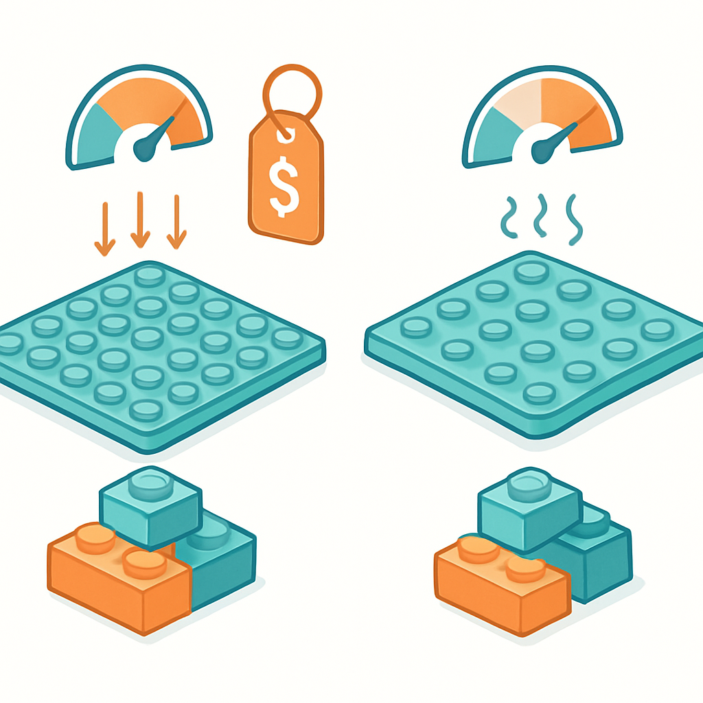

# Baseplates de Marcas Compatíveis: Gobricks e Outros



Os conceitos anteriores construíram uma compreensão completa da baseplate como objeto físico: a lâmina fina com grade de studs, o papel como substrato terminal do mosaico, os três formatos canônicos em centímetros, as técnicas de solidarização de juntas entre placas adjacentes. O que ficou deliberadamente em aberto é a pergunta de onde vem essa baseplate — e se ela precisa obrigatoriamente ser LEGO original. Para um negócio de mosaicos de retrato que compra centenas ou milhares de peças por pedido, a decisão entre original e compatível na baseplate é diferente da mesma decisão para peças 1×1, e vale entender por quê.

A Gobricks cataloga baseplates nas dimensões padrão (16×16, 32×32 e 48×48) sob seu sistema de IDs próprio — a baseplate 32×32 é a GDS-1200, correspondendo ao Part 3811 do BrickLink. Além delas, a marca oferece variantes menos comuns, como a baseplate 16×32 (retangular) e versões em ABS de cores diversas. O leque de cores das baseplates Gobricks é menor que o de peças 1×1 — na prática, as opções mais encontradas são cinza claro, cinza escuro, branco e verde — mas para mosaicos de retrato isso é irrelevante, já que a baseplate fica completamente coberta pelas peças do mosaico e sua cor não aparece no produto final. A disponibilidade em si não é problema; o catálogo de baseplates compatíveis é suficientemente estável para abastecimento regular.

A questão central na compra de uma baseplate compatível é o encaixe cruzado — o comportamento quando uma peça LEGO original encaixa em uma baseplate compatível, ou quando uma peça compatível encaixa em uma baseplate LEGO original. Esse é o cenário inevitável em qualquer operação que mistura fontes de fornecimento, seja por estratégia (baseplate compatível + peças originais para cores específicas) ou por oportunismo de mercado (estoque heterogêneo). A tolerância dimensional precisa ser compatível não apenas entre duas peças do mesmo fabricante, mas entre peças de fabricantes diferentes.

Nos fabricantes de primeiro nível — Gobricks e similares com controle de qualidade documentado — o encaixe cruzado com peças LEGO originais funciona dentro das mesmas tolerâncias que o encaixe entre dois originais. O clutch power de uma Gobricks no padrão usual é ligeiramente mais firme que o LEGO: a interferência de material entre stud e anti-stud é minimamente maior, o que torna o encaixe um pouco mais resistente à remoção, mas não problemático para montagem normal. Em mosaicos, onde cada peça 1×1 é encaixada uma única vez e permanece no lugar, esse clutch ligeiramente maior é irrelevante na prática — nenhum montador vai perceber a diferença. O que importa é que a peça encaixa, fica presa e não cai, e nesse quesito as baseplates Gobricks entregam o mesmo resultado que uma LEGO original.

A warping — deformação da placa — é o problema mais frequentemente mencionado em avaliações de baseplates compatíveis de qualidade inferior. Uma baseplate fora do plano não é apenas um problema estético; ela cria um problema estrutural real: se a placa não está plana, a grade de studs também não está plana, e encaixar peças 1×1 sobre uma superfície levemente côncava ou convexa resulta em um mosaico que não fica plano ao ser pendurado na parede. Testes com baseplates Gobricks e com compatíveis de outros fabricantes de primeiro nível (como Brickyard Building Blocks) mostram deformação mínima a zero quando usadas isoladas ou combinadas com baseplates LEGO originais. Em fabricantes genéricos sem controle de qualidade documentado — os sem marca que aparecem em lotes baratos no AliExpress — o warping é o problema mais comum e o mais difícil de detectar sem inspecionar a peça fisicamente.

| Critério | Gobricks / fabricante top-tier | Compatível genérico sem marca |
|---|---|---|
| Encaixe cruzado com LEGO original | Equivalente ao original, clutch levemente mais firme | Variável — pode ser frouxo (peça cai) ou muito apertado (dificuldade de encaixe) |
| Warping da placa | Mínimo a zero | Frequente, especialmente em 32×32 e 48×48 |
| Consistência entre lotes | Alta | Baixa — mesmo fornecedor pode variar entre pedidos |
| Fidelidade dimensional do módulo 8 mm | Mantida — stud no lugar correto | Pode derivar, especialmente nas bordas |
| Disponibilidade de cores | Restrita (4-6 cores) | Ampla mas inconsistente em cor real vs. cor anunciada |

A dimensão de preço é onde a diferença entre original e compatível fica mais nítida para a baseplate do que para peças 1×1. Uma baseplate LEGO 32×32 (Part 3811) comprada no BrickLink nacional custa em torno de R$ 35–60 dependendo da cor e do vendedor. A mesma baseplate na versão Gobricks ou compatível top-tier via importação direta fica entre R$ 8–15 incluindo frete proporcional — uma redução de 60 a 75% por unidade. Em um retrato de 64×64 studs que usa 4 baseplates 32×32, essa diferença representa R$ 80–180 só em substrato, antes de contar uma única peça 1×1. Para um negócio que recebe pedidos frequentes, a baseplate compatível de qualidade é o componente com melhor relação entre risco técnico (baixo, com fornecedor correto) e economia (alta).

Vale entrar em um detalhe que a lógica do capítulo de compatíveis já introduziu — e que aqui se aplica com precisão ao componente baseplate. O argumento de que "compatível é indistinguível do original no produto final" vale para peças 1×1 vistas de frente em um mosaico montado, porque a face superior de um 1×1 plate Gobricks e de um 1×1 plate LEGO são visualmente idênticas. Para a baseplate, o argumento é ainda mais forte: ela fica completamente escondida. O cliente nunca vê a baseplate depois que o mosaico está montado. Não importa se ela é LEGO, Gobricks, Brickyard ou qualquer outro fabricante com dimensional correto — contanto que o mosaico fique plano, os studs segurem as peças e a junta entre placas se alinhe, o substrato é transparente para o produto final.

```
Visibilidade dos componentes no produto acabado:

Peças 1×1 (frente do mosaico) ──── VISÍVEIS ao cliente ──── Qualidade visual importa
Baseplate (verso/substrato)   ──── INVISÍVEL ao cliente  ──── Qualidade dimensional importa
```

A decisão de quando manter LEGO original na baseplate tem dois cenários válidos. O primeiro é o caso de cliente colecionador que especifica explicitamente que quer um produto 100% LEGO — um nicho real, mas não o mercado de mosaicos de retrato comerciais comuns. O segundo, mais relevante operacionalmente, é a questão da disponibilidade imediata: se o pedido precisa ser entregue em 48 horas e o estoque local de baseplates compatíveis está zerado, comprar baseplates LEGO originais em uma loja nacional ou no BrickLink nacional é uma decisão de prazo, não de qualidade. A margem absorve o custo extra pontualmente; o que não pode acontecer é atrasar a entrega por esperar importação.

Além da Gobricks, outros fabricantes aparecem no mercado de baseplates compatíveis com diferentes posicionamentos. A Strictly Briks é uma marca americana com boa reputação em baseplates — os produtos têm espessura de plate completo (3,2 mm com anti-studs na face inferior, diferente das baseplates tradicionais LEGO), o que as torna ao mesmo tempo mais versáteis e menos idênticas ao original. A Brickyard Building Blocks entrega dimensional precisa, clutch power equivalente ao LEGO e sem warping detectável. Marcas europeias como a Cobi e a BlueBrixx comercializam baseplates como acessório de seus próprios sets, mas com compatibilidade LEGO documentada. Para importação via AliExpress, os lotes identificados como "Sembo", "XingBao" ou qualquer marca que mencione explicitamente compatibilidade com o Part 3811 tendem a ter dimensional consistente — diferente de lotes genéricos sem referência de Part ID, que são o território de risco real.

O critério prático de seleção para um negócio de mosaicos se reduz a três pontos: o fornecedor precisa referenciar explicitamente o Part ID correspondente ao BrickLink (GDS-1200 para 32×32 Gobricks, ou 3811 para genéricos com essa referência), precisa ter histórico de resenhas confirmando ausência de warping em pedidos múltiplos, e o preço por unidade precisa refletir a realidade de produção — baseplates 32×32 de qualidade não custam R$ 1,50 por unidade; se custar, é genérico sem controle, e o risco dimensional é real. Com esses três filtros, a baseplate compatível entra no material de produção com risco controlado e economia relevante — exatamente o mesmo raciocínio que governa a decisão sobre peças 1×1 ao longo deste livro.

## Fontes utilizadas

- [Review: Brickyard Building Blocks LEGO Compatible Baseplate — Brick Model Railroader](https://brickmodelrailroader.com/index.php/2022/06/10/review-brickyard-building-blocks-lego-compatible-baseplate/)
- [Gobricks vs LEGO Bricks: What's the Differences? — Lumibricks](https://www.lumibricks.com/blogs/news/lego-vs-gobricks-review)
- [GoBricks vs LEGO — The Bobby Brix Channel](https://store.bobbybrix.com/blogs/news/gobricks-vs-lego)
- [Gobricks vs LEGO, Who's More Expensive? — Medievalbrick.com](https://www.medievalbrick.com/blog/review/gobricks-vs-lego-whos-more-expensive/)
- [Gobricks Base Plate — MyGobricks](https://mygobricks.com/collections/gobricks-base-plate)
- [Strictly Briks — LEGO compatible products — The Brick Blogger](https://thebrickblogger.com/2017/10/strictly-briks-lego-compatible-products/)
- [Any good compatible/knockoff 32x32 baseplates? — Bricks in Motion Forums](https://bricksinmotion.com/forums/topic/24361/any-good-compatibleknockoff-32x32-baseplates/)
- [Is it really possible to rebrick LEGO Art mosaics at a reasonable price? — Stonewars](https://stonewars.com/deep-dive/is-it-really-possible-to-rebrick-lego-art-mosaics-at-a-reasonable-price/)

---

**Próximo conceito** → [Cálculo Prático de Material: Baseplates e Peças 1×1 a partir do Tamanho do Retrato](../05-calculo-pratico-de-material-baseplates-e-pecas-1x1-a-partir-do-tamanho-do-retrato/CONTENT.md)
