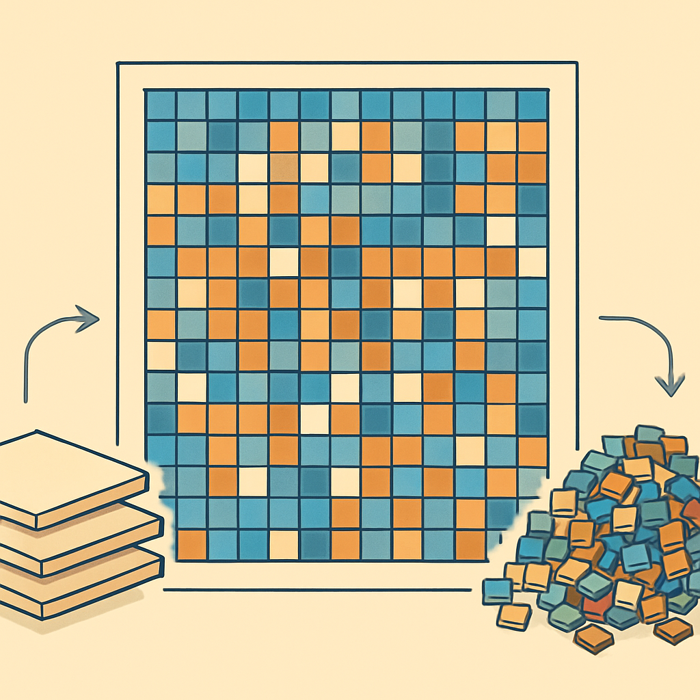
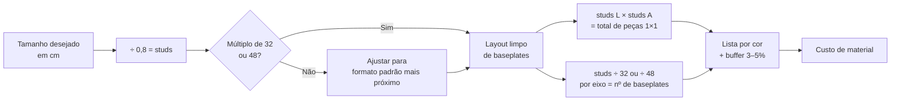

# Cálculo Prático de Material: Baseplates e Peças 1×1 a partir do Tamanho do Retrato



Tudo o que o subcapítulo construiu até aqui converge neste ponto. A baseplate como substrato terminal com fundo liso, os três formatos em centímetros (12,8 / 25,6 / 38,4 cm), a lógica de juntas e o comportamento de encaixe cruzado com compatíveis — esse vocabulário todo existe para que a pergunta do negócio possa ser respondida de forma precisa: dado que um cliente quer um retrato de X cm por Y cm, quantas baseplates e quantas peças 1×1 esse pedido exige? Sem saber responder isso antes de confirmar o pedido, o negócio não tem como cotar, não tem como comprar e não tem como planejar o estoque.

A fórmula é direta porque o sistema LEGO foi projetado sobre um módulo fixo. Cada stud ocupa exatamente 8 mm (0,8 cm) de espaço horizontal e vertical — a mesma medida estabelecida no subcapítulo de sistema de medidas. Isso significa que converter centímetros em studs é sempre divisão por 0,8. Um retrato de 25,6 cm × 25,6 cm tem exatamente 32 studs × 32 studs — o que corresponde a uma única baseplate 32×32. Um retrato de 51,2 cm × 51,2 cm tem 64 × 64 studs, o que exige quatro baseplates 32×32 em grade 2×2. A lógica é multiplicativa e não tem arredondamento: o sistema só admite tamanhos que são múltiplos de 8 mm, então o dimensionamento em studs sempre cai em número inteiro.

```
Conversão: cm → studs
studs = cm ÷ 0,8

Exemplos:
  25,6 cm ÷ 0,8 = 32 studs  → 1 baseplate 32×32
  38,4 cm ÷ 0,8 = 48 studs  → 1 baseplate 48×48
  51,2 cm ÷ 0,8 = 64 studs  → 4 baseplates 32×32 (grade 2×2)
  76,8 cm ÷ 0,8 = 96 studs  → 9 baseplates 32×32 (grade 3×3) ou 4 baseplates 48×48 (grade 2×2)
```

Com as dimensões em studs definidas, o número total de peças 1×1 é simplesmente a área em studs. Um mosaico de 32×32 studs tem 1.024 posições, então exige 1.024 peças 1×1. Um de 64×64 tem 4.096. Um de 96×96 tem 9.216. Essa é a contagem bruta — assume que cada posição da grade é preenchida por exatamente uma peça 1×1. Na prática, softwares de design de mosaico às vezes otimizam a lista de compra substituindo sequências de peças 1×1 de mesma cor por uma plate 1×4 ou 1×6, reduzindo o número de SKUs individuais. Para fins de orçamento e planejamento de estoque, a contagem bruta é a referência correta: garante que não vai faltar material e reflete o pior caso de fragmentação por cor.

O número de baseplates, por sua vez, depende do tamanho escolhido. Para a baseplate 32×32, divide-se cada dimensão em studs por 32:

```
baseplates_largura = studs_largura ÷ 32
baseplates_altura  = studs_altura  ÷ 32
total_baseplates   = baseplates_largura × baseplates_altura
```

Para a baseplate 48×48, substitui-se 32 por 48 nas divisões. O mosaico de 96×96 studs pode ser montado com 9 baseplates 32×32 (grade 3×3, 8 juntas visíveis) ou com 4 baseplates 48×48 (grade 2×2, 3 juntas visíveis) — a diferença de custo e de juntas foi tratada no conceito de tamanhos padrão. Aqui o cálculo confirma os números: 96 ÷ 32 = 3 por eixo = 9 placas; 96 ÷ 48 = 2 por eixo = 4 placas.

A tabela abaixo consolida os formatos mais comuns em pedidos de retratos comerciais, com contagens prontas:

| Dimensão do retrato | Studs (L × A) | Peças 1×1 totais | Baseplates 32×32 | Baseplates 48×48 |
|---|---|---|---|---|
| ~25,6 × 25,6 cm | 32 × 32 | 1.024 | 1 | — |
| ~38,4 × 38,4 cm | 48 × 48 | 2.304 | — | 1 |
| ~51,2 × 51,2 cm | 64 × 64 | 4.096 | 4 | — |
| ~51,2 × 25,6 cm | 64 × 32 | 2.048 | 2 | — |
| ~76,8 × 38,4 cm | 96 × 48 | 4.608 | — | 2 (lado a lado) |
| ~76,8 × 76,8 cm | 96 × 96 | 9.216 | 9 | 4 |
| ~102,4 × 51,2 cm | 128 × 64 | 8.192 | 8 | — |

O número bruto de peças 1×1 precisa ser convertido em uma lista de compra por cor, que é onde o cálculo se torna dependente do software de mosaico. O algoritmo que processa a imagem e distribui pixels para as cores disponíveis gera essa lista automaticamente — o resultado é um conjunto de pares (cor, quantidade) que somados chegam ao total calculado. O que cabe ao operador verificar manualmente é se o total bate: se o mosaico é 64×64 studs e a soma das quantidades por cor da lista não dá 4.096, há um erro no processamento da imagem ou na exportação da lista. Essa verificação é simples e vale fazer antes de qualquer compra.

Um ponto que frequentemente passa despercebido em pedidos comerciais é o buffer de reposição. Peças 1×1 são pequenas, leves e fáceis de perder durante a montagem — caem da mesa, rolam para debaixo de algo, se misturam com o lixo. A prática corrente entre produtores de mosaico é adicionar entre 3% e 5% de peças extras por cor como margem de erro, arredondando sempre para cima. Para um mosaico de 4.096 peças com 20 cores, isso significa cerca de 200 peças adicionais distribuídas proporcionalmente. Em cores com menos de 50 unidades no mosaico, o buffer mínimo razoável é 5 peças extras independentemente do percentual — a quantidade original é pequena o suficiente para que perder 2 ou 3 unidades já inviabilize a montagem.

```
Buffer recomendado:
  Cores com ≥ 100 peças: +5% (arredondado para cima)
  Cores com 50–99 peças: +5 peças fixas
  Cores com < 50 peças:  +5 peças fixas
```

O custo de material do pedido sai direto dessa contagem. Com os preços por unidade estabelecidos — por exemplo, R$ 0,05 por peça 1×1 compatível premium, R$ 12,00 por baseplate 32×32 compatível — a conta é mecânica:

```
custo_pecas     = total_pecas_com_buffer × preco_unitario_peca
custo_baseplates = numero_baseplates × preco_unitario_baseplate
custo_material   = custo_pecas + custo_baseplates
```

Para o retrato de 64×64 studs (4 baseplates 32×32, 4.096 peças 1×1):

```
custo_pecas      = 4.300 peças (com ~5% buffer) × R$ 0,05 = R$ 215,00
custo_baseplates = 4 baseplates × R$ 12,00        = R$ 48,00
custo_material   = R$ 263,00
```

Esse custo de material é o piso — o valor mínimo abaixo do qual qualquer preço de venda opera no prejuízo. Sobre ele vêm os custos de montagem (tempo), embalagem, frete ao cliente e margem. O exercício de calcular o material antes de fechar o preço não é burocracia; é o que separa um negócio que conhece sua estrutura de custo de um que descobre o prejuízo depois da entrega.

Um detalhe geométrico que o cálculo precisa absorver é o caso de retratos com dimensões não múltiplas de 32 ou 48. Se um cliente pede "algo em torno de 40 cm", o pedido não existe como grade LEGO limpa: 40 cm ÷ 0,8 = 50 studs, e 50 não é divisível por 32 nem por 48. As opções são duas: propor ao cliente o formato mais próximo que é limpo (48×48 = 38,4 cm, ou uma grade de 32×32+16 studs que exigiria corte de baseplate, o que não é prático), ou redimensionar para 48 studs e apresentar como "aproximadamente 38 cm". Na prática, para venda de retratos o fluxo mais eficiente é oferecer tamanhos pré-definidos que mapeiam diretamente para configurações limpas de baseplate — o cliente escolhe entre os formatos disponíveis em vez de especificar uma dimensão livre. Isso elimina o problema de arredondamento e simplifica o cálculo de material para algo que pode ser feito em segundos durante uma conversa de venda.



O cálculo fecha o subcapítulo de baseplates porque é o que dá sentido operacional a tudo o que foi apresentado antes. A definição da baseplate como substrato terminal, os tamanhos em centímetros, as técnicas de junção e o critério de escolha entre original e compatível — todos esses conceitos só se tornam ação quando traduzidos em números concretos: tantas baseplates, tantas peças, tanto custa. É esse número que vai para o orçamento, que define o preço de venda e que alimenta a ordem de compra ao fornecedor.

## Fontes utilizadas

- [Everything You Want to Know About LEGO Mosaics — BrickNerd](https://bricknerd.com/home/everything-you-want-to-know-about-lego-mosaics-11-12-24)
- [Is it really possible to rebrick LEGO Art mosaics at a reasonable price? — Stonewars](https://stonewars.com/deep-dive/is-it-really-possible-to-rebrick-lego-art-mosaics-at-a-reasonable-price/)
- [Mosaic — Studio Help Center — BrickLink](https://studiohelp.bricklink.com/hc/en-us/articles/5625025298327-Mosaic)
- [LEGO Mosaic Maker 40179 — Loja LEGO](https://www.lego.com/pt-pt/product/mosaic-maker-40179)
- [LEGO Unit Converter — studs.sariel.pl](https://studs.sariel.pl/)
- [Medidas das Peças LEGO — Techbricks](https://www.techbricks.com.br/blog/medidas-das-pecas-lego/)
- [Tutorial on how to create a LEGO Mosaic — Christoph Bartneck](https://www.bartneck.de/2013/08/18/tutorial-on-how-to-create-a-lego-mosaic-part-1/)

---

**Próximo subcapítulo** → [Nomenclatura BrickLink: Design ID, Color ID e Como Usar](../../05-nomenclatura-bricklink-design-id-color-id-e-como-usar/CONTENT.md)
