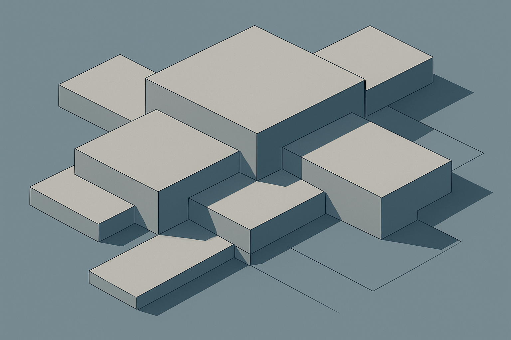

# Baseplates: O Substrato do Mosaico

## Sobre este subcapítulo

Um mosaico de retrato não é apenas uma coleção de peças coloridas — é um conjunto estruturado em torno de um substrato rígido que mantém tudo no lugar. Esse substrato é a baseplate: uma placa plana com grade de studs que recebe as peças do mosaico. A escolha do tamanho e da configuração de baseplates define as dimensões físicas do produto final, como ele é montado, como é embalado e como chega ao cliente. Este subcapítulo cobre os tamanhos disponíveis (16×16, 32×32 e 48×48 studs), como baseplates se conectam entre si para formar mosaicos grandes, e questões práticas de compatibilidade com baseplates de marcas compatíveis.

O tema aparece aqui — após as peças 1×1 — porque sem entender a baseplate é impossível dimensionar um pedido: saber que um retrato ocupa 48×48 studs só faz sentido se o leitor souber que isso equivale a três baseplates 32×32 e um total de 2.304 peças 1×1.

## Estrutura

Os grandes blocos são: (1) tamanhos padrão de baseplate — 16×16 (pequena), 32×32 (padrão do LEGO Art) e 48×48 (grande), dimensões físicas em centímetros de cada uma; (2) conexão entre baseplates — como duas ou mais baseplates se encaixam para formar mosaicos maiores que uma placa, limitações práticas dessa junção; (3) baseplates de marcas compatíveis — disponibilidade de baseplates Gobricks e outras marcas, qualidade do encaixe entre uma baseplate compatível e peças originais e vice-versa; (4) cálculo prático de material — dado o tamanho do retrato em studs, quantas baseplates e quantas peças 1×1 o pedido exige.

## Objetivo

Ao terminar este subcapítulo, o leitor conseguirá dimensionar um pedido de mosaico em termos de baseplates e peças 1×1, comparar preços de baseplates originais vs compatíveis com critério técnico e especificar o substrato correto ao montar a lista de material de um pedido. O subcapítulo seguinte — nomenclatura BrickLink — fecha o capítulo com o vocabulário de identificação necessário para transformar essa lista de material em um pedido real sem ambiguidade.

## Conceitos

1. [O que é uma Baseplate e seu Papel Estrutural no Mosaico](01-o-que-e-uma-baseplate-e-seu-papel-estrutural-no-mosaico/CONTENT.md) — definição da peça, função como substrato rígido com grade de studs receptores e diferença funcional em relação a uma plate comum
2. [Tamanhos Padrão de Baseplate: 16×16, 32×32 e 48×48](02-tamanhos-padrao-de-baseplate-16x16-32x32-e-48x48/CONTENT.md) — dimensões em studs e em centímetros de cada formato, qual é o padrão do LEGO Art e quando cada tamanho faz sentido para pedidos de retrato
3. [Conexão entre Baseplates para Mosaicos Maiores](03-conexao-entre-baseplates-para-mosaicos-maiores/CONTENT.md) — como duas ou mais baseplates se encaixam para formar um painel único, limitações da junta visível e técnicas práticas de ligação
4. [Baseplates de Marcas Compatíveis: Gobricks e Outros](04-baseplates-de-marcas-compativeis-gobricks-e-outros/CONTENT.md) — disponibilidade, qualidade de encaixe cruzado, diferença de preço e quando vale usar compatível vs. original neste componente
5. [Cálculo Prático de Material: Baseplates e Peças 1×1 a partir do Tamanho do Retrato](05-calculo-pratico-de-material-baseplates-e-pecas-1x1-a-partir-do-tamanho-do-retrato/CONTENT.md) — dado o tamanho do retrato em studs, como calcular quantas baseplates e quantas peças 1×1 o pedido exige

## Fontes utilizadas

- [Everything You Want to Know About LEGO Mosaics — BrickNerd](https://bricknerd.com/home/everything-you-want-to-know-about-lego-mosaics-11-12-24)
- [Mosaic — Studio Help Center — BrickLink](https://studiohelp.bricklink.com/hc/en-us/articles/5625025298327-Mosaic)
- [LEGO® Art: the new mosaic theme — New Elementary](https://www.newelementary.com/2020/07/lego-art-new-mosaic-theme.html)
- [Gobricks — catálogo de baseplates](https://mygobricks.com/)
- [Basic LEGO Parts Guide — Brick Architect](https://brickarchitect.com/parts/category-1)
