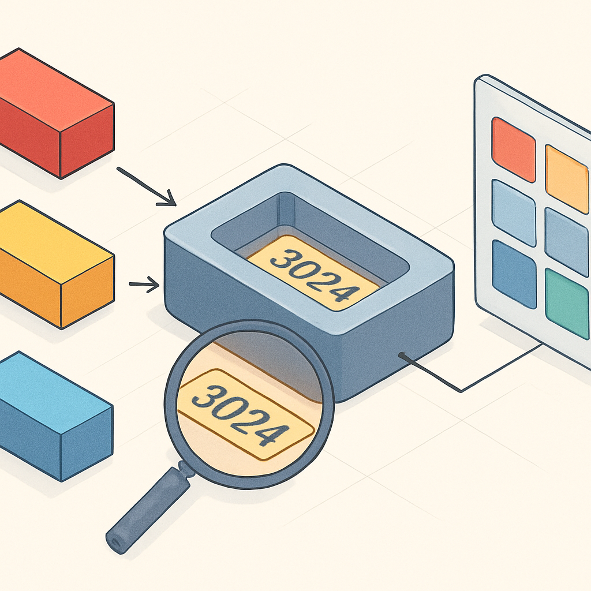

# Design ID

Todo o vocabulário construído nos subcapítulos anteriores — o que é um 1×1 plate, como ele difere de um tile, qual baseplate comporta quantos studs — só se transforma em um pedido real quando você consegue expressar essas peças num formato que fornecedores entendem sem ambiguidade. O Design ID é o ponto de entrada desse sistema de identificação: ele é o número que representa a **forma** de uma peça, independente de qualquer cor.

A LEGO grupo começou a gravar números de design diretamente nos moldes por volta de 1985. Desde então, praticamente toda peça produzida carrega fisicamente esse número impresso em baixo relevo na face inferior — a face "fêmea", onde ficam os anti-studs. Em peças grandes como uma baseplate, o número aparece numa região de fácil leitura; em peças 1×1 plate ou tile, o número é minúsculo e frequentemente requer uma lupa ou boa iluminação para ser lido sem erros. Quando há mais de um número na base de uma peça, é importante saber distinguir: o Design ID é a sequência de 4 a 6 dígitos sem hífen, enquanto o número com hífen no meio (ex: `40-67`) é um código de lote de fabricação que a LEGO usa internamente para rastreabilidade de moldes — serve para localizar lotes com falha de produção e não tem utilidade para compra.

O ponto conceitual mais importante é que o Design ID identifica apenas o **molde**, não a cor. O 1×1 plate quadrado tem Design ID `3024` independente de ser branco, preto, amarelo brilhante ou azul escuro. Isso significa que um único número abre todo o universo de variações cromáticas de uma peça no catálogo. Quando você digita `3024` na busca do BrickLink, a plataforma mostra a ficha da peça com dezenas de cores disponíveis em estoque de diferentes vendedores — a escolha da cor é um passo separado, que será coberto pelo conceito de Color ID na sequência.

Esse desacoplamento entre forma e cor tem uma razão fabril direta: a LEGO produz a grande maioria das suas peças em ABS colorido na massa, e o mesmo molde físico de aço injeta peças em qualquer cor disponível. Trocar de cor é simplesmente trocar o grânulo de ABS que alimenta a injetora; o molde não muda. Portanto, numerar o molde separadamente da cor é o mapeamento natural da realidade de produção.

O BrickLink adota o Design ID como base do seu próprio sistema de numeração, mas com uma ressalva importante: **os números no BrickLink e o Design ID oficial da LEGO nem sempre são idênticos**. Quando o BrickLink foi criado, muitos Design IDs oficiais não eram públicos, então parte do catálogo foi numerado de forma independente. Com o tempo, houve convergência, mas ainda existem casos em que o número que você lê na peça difere do número que o BrickLink usa. A diferença mais comum ocorre em peças com variantes de molde: a LEGO usa o mesmo Design ID para todas as variantes de um mesmo molde, enquanto o BrickLink cria sufixos (`a`, `b`, `c`) para distinguir variantes que considera relevantes para o colecionador. Por exemplo, `3001a` e `3001b` no BrickLink são a mesma peça 2×4 brick com detalhes diferentes no interior — a LEGO chama ambas de `3001`.

Para as peças que importam no contexto de mosaicos — 1×1 plate, 1×1 tile, 1×1 round plate, 1×1 round tile — a correspondência é direta e sem ambiguidade:

| Peça | Design ID BrickLink | Nome no catálogo |
|---|---|---|
| 1×1 Plate | `3024` | Plate 1 x 1 |
| 1×1 Tile (Flat Tile) | `3070b` | Tile 1 x 1 with Groove |
| 1×1 Round Plate | `4073` | Plate, Round 1 x 1 |
| 1×1 Round Tile | `98138` | Tile, Round 1 x 1 |

O sufixo `b` em `3070b` indica exatamente a variante que tem o entalhe na base (underside groove), distinguindo-a da versão antiga `3070a` sem entalhe — detalhe que o BrickLink optou por separar explicitamente. Para compra prática, `3070b` é o que você vai encontrar em estoque nos fornecedores atuais; a versão `a` é obsoleta.

Na prática, o fluxo de uso do Design ID é simples: você parte do tipo de peça que precisa (já sabendo que quer um 1×1 tile, por exemplo), localiza o Design ID correspondente — seja lendo da própria peça física, seja consultando o catálogo do BrickLink por nome de peça — e usa esse número como âncora de busca em qualquer fornecedor. O Design ID `3070b` funciona no BrickLink, no Gobricks, no Rebrickable e em qualquer outro sistema que use o padrão do mercado. Ele é o denominador comum que garante que você e o fornecedor estão falando da mesma forma de peça antes de qualquer conversa sobre cor ou preço.

Um erro frequente de quem está começando é tentar usar o número que aparece nas instruções dos sets para buscar peças avulsas. Esse número é o **Element ID** — combinação de forma e cor — e é diferente do Design ID. O conceito de Element ID será destrinchado na sequência; por ora, basta saber que o Design ID é o número da *forma*, aparece gravado fisicamente na peça e é o que você usa para abrir o catálogo de opções de cor antes de decidir a compra.

## Fontes utilizadas

- [Part and Color Combination Code (PCC Code) — BrickLink Help](https://www.bricklink.com/help.asp?helpID=1916)
- [Item Number — BrickLink Help](https://www.bricklink.com/help.asp?helpID=168)
- [Element ID — BrickWiki](http://www.brickwiki.info/wiki/element_id/)
- [Rebrickable Help Guide: Part Numbering](https://rebrickable.com/help/part-numbering/)
- [Códigos das Peças LEGO — Techbricks](https://www.techbricks.com.br/blog/identificacao-dos-codigos-da-pecas/)
- [Plate 1 x 1 : Part 3024 — BrickLink Catalog](https://www.bricklink.com/v2/catalog/catalogitem.page?P=3024)

---

**Próximo conceito** → [Color ID e Nomes Oficiais de Cores](../02-color-id-e-nomes-oficiais-de-cores/CONTENT.md)
