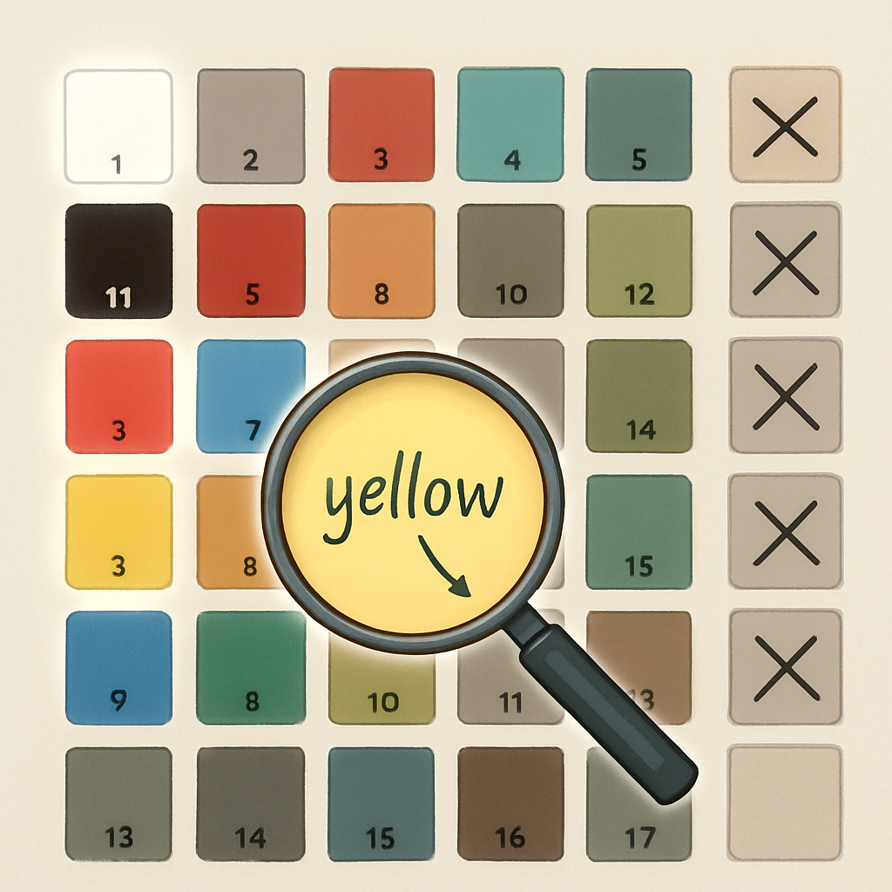

# Color ID e Nomes Oficiais de Cores

Saber que a peça que você precisa é o `3070b` resolve metade do problema. A outra metade é especificar a cor com a mesma precisão — e é aqui que o sistema falha silenciosamente para quem usa linguagem coloquial. "Amarelo" parece óbvio até o momento em que você descobre que o BrickLink tem `Yellow` (ID 3), `Bright Light Yellow` (ID 226), `Light Yellow` (ID 35), `Neon Yellow` (ID 121) e mais algumas variantes, cada uma com aparência distinta e estoque separado. O Color ID é o mecanismo que transforma essa ambiguidade em uma escolha inequívoca.

O Color ID no BrickLink é um número inteiro que identifica uma cor específica dentro do catálogo da plataforma. Ele funciona de forma análoga ao Design ID para formas: assim como o Design ID desacopla o molde da cor, o Color ID captura precisamente a cor independente de qualquer nome coloquial. A busca de peças no BrickLink aceita os dois IDs combinados — ao digitar o Design ID `3070b` na busca e depois filtrar por Color ID `3`, você obtém o 1×1 Tile na cor `Yellow` padrão, sem ambiguidade. Essa combinação (Design ID + Color ID) é tão central que o BrickLink a chama de PCC Code — Part-Color Combination Code — e é com ela que vendedores listam peças em suas lojas.

O Color ID cobre hoje 214 cores no catálogo BrickLink, distribuídas em categorias baseadas no tipo de acabamento:

| Categoria | Exemplos de cores |
|---|---|
| Sólidas | White (1), Black (11), Red (5), Blue (7), Yellow (3), Green (6), Tan (2) |
| Transparentes | Trans-Clear (12), Trans-Red (17), Trans-Blue (15), Trans-Yellow (19) |
| Especiais (chrome, pearl, speckle) | Chrome Gold (21), Pearl Dark Gray (85), Glitter Trans-Clear (117) |
| Fluorescentes | Neon Orange (18), Neon Yellow (121) |

Para mosaicos de retrato — o contexto deste livro — o universo prático é muito mais estreito. O algoritmo de conversão de foto para mosaico trabalha com a paleta de cores disponíveis em estoque e seleciona as cores dominantes da imagem. O resultado típico usa entre 10 e 25 cores sólidas do mesmo lote. Isso significa que, na prática, o leitor vai trabalhar com um subconjunto de cerca de 50 a 80 cores sólidas de alta disponibilidade — as demais categorias (transparentes, especiais) raramente aparecem em um retrato.

O ponto de confusão mais documentado no ecossistema envolve os **nomes de cor**, não os IDs. O BrickLink e a LEGO usam sistemas de nomenclatura diferentes, e eles divergiram ao longo da história por razões independentes. A LEGO Group interna frequentemente usa nomes como "Bright Red", "Bright Blue", "Medium Stone Grey" — nomenclatura sistemática com prefixos como *Bright*, *Dark*, *Medium* que seguem uma lógica de família de cores. O BrickLink, criado por colecionadores antes de qualquer integração com a LEGO, adotou nomes mais coloquiais e simplificados: "Red", "Blue", "Light Bluish Gray". A aquisição do BrickLink pela LEGO em 2019 não produziu convergência — em 2022 ficou claro que os dois sistemas continuariam paralelos, com divergências conhecidas:

| BrickLink | LEGO oficial |
|---|---|
| Yellow | Bright Yellow |
| Red | Bright Red |
| Blue | Bright Blue |
| Light Bluish Gray | Medium Stone Grey |
| Dark Bluish Gray | Dark Stone Grey |
| Neon Yellow | Vibrant Yellow |
| Medium Tan | Warm Tan |

A implicação prática para compra é direta: **ao buscar no BrickLink, use sempre o Color ID**, não o nome da cor. O ID `3` sempre significa o mesmo amarelo padrão, independente de como a LEGO interna ou um fornecedor genérico chama essa cor. O nome serve como referência para humanos, mas o número é o que o sistema processa sem ambiguidade. Ao passar uma lista de peças para um fornecedor como o Gobricks, fornecer o Color ID elimina qualquer chance de interpretação errada — o Gobricks mantém tabelas de correspondência exatamente para isso.

A confusão clássica relatada em fóruns e no StackOverflow de LEGO (Bricks) acontece especificamente com os tons de cinza. Antes de 2003, a LEGO produzia dois cinzas: um cinza claro e um cinza escuro. Em 2003–2004, ambos foram reformulados para versões com tom levemente azulado — os "bluish grays" atuais. Durante vários anos, sets antigos e novos coexistiam nos estoques de revendedores, e peças visualmente próximas tinham IDs diferentes. Quem pedia "cinza claro" podia receber o cinza antigo (ID 9, `Light Gray`) ou o novo (ID 86, `Light Bluish Gray`) dependendo do estoque do vendedor. A solução é sempre usar o ID: `9` é o cinza pré-2003, `86` é o bluish gray atual — estocados separadamente no BrickLink até hoje.

Para localizar o Color ID correto de uma cor que você quer, o fluxo mais direto é acessar o Color Guide do BrickLink (`bricklink.com/catalogColors.asp`), que lista todas as cores com swatches visuais e os IDs correspondentes. O segundo caminho é partir da ficha do Design ID: ao pesquisar `3070b` no catálogo, a página da peça exibe um seletor de cores com cada variante disponível e o Color ID de cada uma visível na URL ao clicar (`colorID=3`, `colorID=11`, etc.). Para o leitor deste livro, que vai receber listas de cores geradas por algoritmo de mosaico, o fluxo será o inverso: o algoritmo entrega nomes de cores no padrão BrickLink, e basta consultar o Color Guide para confirmar o ID correspondente antes de montar o pedido.

O Color ID de cada cor é o mesmo em toda a plataforma BrickLink — não importa se o vendedor está no Brasil, na Europa ou nos Estados Unidos. Isso é uma propriedade importante: quando você salva uma *Wanted List* no BrickLink com Design ID + Color ID, qualquer vendedor em qualquer país vê exatamente o mesmo pedido. Esse comportamento contrasta com o que aconteceria se você usasse só nomes: "amarelo" em português, "yellow" em inglês e "gelb" em alemão são a mesma cor, mas um sistema baseado em strings falharia na correspondência. O número é universal.

## Fontes utilizadas

- [Color Guide — BrickLink](https://v2.bricklink.com/en-us/catalog/color-guide)
- [Color Guide (legado) — BrickLink](https://www.bricklink.com/catalogColors.asp)
- [Part and Color Combination Code (PCC Code) — BrickLink Help](https://www.bricklink.com/help.asp?helpID=1916)
- [Understanding the LEGO Color Palette — Brick Architect](https://brickarchitect.com/color/)
- [LEGO colour chart references and history — New Elementary](https://www.newelementary.com/2015/03/lego-colour-chart-reference.html)
- [LEGO Colors cross-reference — Rebrickable](https://rebrickable.com/colors/)
- [LEGO ID / BrickLink ID / LDraw ID colour chart — Mecabricks](https://mecabricks.com/docs/colour_chart.pdf)
- [Bricklink-LEGO Color Translation Table — Eurobricks Forums](https://www.eurobricks.com/forum/forums/topic/91641-bricklinklego-color-translation-table/)

---

**Próximo conceito** → [Element ID](../03-element-id/CONTENT.md)
