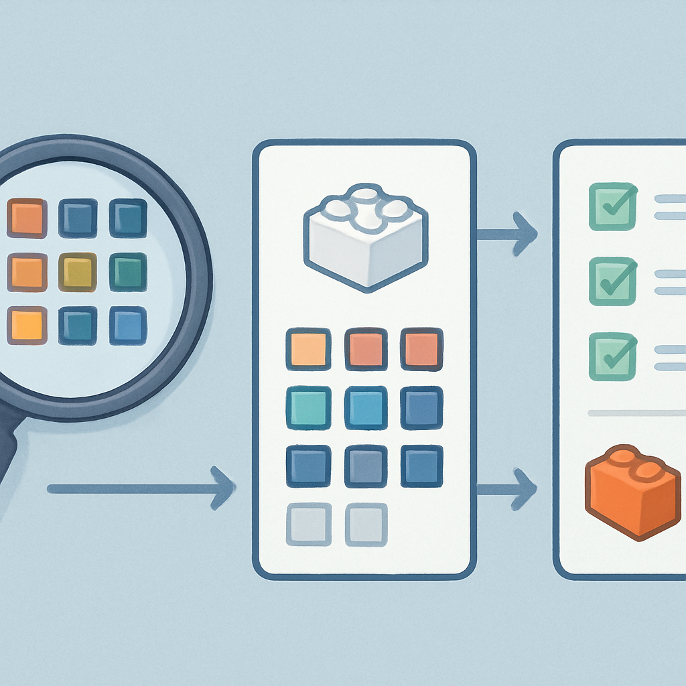

# Como Pesquisar no Catálogo BrickLink



Com o Design ID, o Color ID e o Element ID bem separados na cabeça, o próximo passo é saber usar esses identificadores no BrickLink de forma eficiente. O catálogo da plataforma é vasto — centenas de milhares de peças, dezenas de cores por peça, milhares de vendedores com estoques independentes — e sem um fluxo claro de navegação é fácil perder tempo procurando algo que está lá, ou pior, confirmar uma compra sem verificar se a peça que chegará é realmente a que você precisa.

O ponto de entrada padrão para quem já sabe o Design ID é a URL direta do catálogo: `bricklink.com/v2/catalog/catalogitem.page?P=<design_id>`. Para o 1×1 tile, por exemplo, `P=3070b` abre imediatamente a ficha da peça. Essa URL funciona sem login e é o atalho mais rápido quando você tem o número em mãos. Se preferir navegar pelo nome, a barra de busca do BrickLink aceita termos em inglês — "1x1 tile", "plate round 1x1", "baseplate 32x32" — e retorna resultados filtrados por categoria. Ao digitar um número com menos de 6 dígitos, o sistema interpreta como Design ID ou Part Number e tenta a correspondência direta. Se o número tiver 6 ou 7 dígitos, o BrickLink o interpreta como Element ID (combinação forma+cor) e redireciona automaticamente para a ficha da peça já na cor correta — comportamento útil quando você parte das instruções de um set.

A ficha de um item no catálogo tem três blocos distintos que você precisa ler em sequência antes de qualquer compra. O primeiro bloco mostra a **galeria de cores disponíveis**: todas as variações cromáticas em que essa peça já foi produzida, com thumbnails visuais. Clicar numa cor específica muda a ficha para aquela combinação e atualiza a URL com o parâmetro `colorID=<número>` — esse número na URL é exatamente o Color ID estudado antes. Quando a cor que você precisa não aparece nessa galeria, a peça simplesmente não existe nessa cor no catálogo BrickLink, o que é um sinal importante: ou você está buscando a cor errada, ou ela nunca foi produzida nessa combinação.

O segundo bloco, acessível pela aba **"Price Guide"** dentro da ficha, mostra os dados de mercado: preço médio dos itens atualmente à venda (current items for sale) e preço médio das vendas dos últimos seis meses (last six months sold). Para pedidos de mosaico em volume, o dado relevante é o preço das vendas recentes — ele representa o que compradores reais pagaram, filtrando fora os vendedores com preços fora de mercado que estão listados mas raramente vendem. Um desvio grande entre os dois números (ex: venda média a R$0,10 por unidade e oferta atual média a R$0,40) geralmente indica que aquela cor específica está em escassez momentânea no estoque dos vendedores.

O terceiro bloco é a aba **"For Sale"**, que lista todos os vendedores com estoque daquela peça naquela cor, com quantidade disponível, condição (new/used), localização do vendedor e preço por unidade. Aqui está o primeiro ponto de atenção prático: a localização do vendedor importa diretamente para o custo de frete e prazo. Vendedores nos EUA ou Europa cobram frete internacional para chegarem ao Brasil; vendedores com loja registrada no Brasil aparecem com menor custo logístico. Para pedidos avulsos de teste ou pequena quantidade, essa aba é onde você fecha a compra diretamente. Para pedidos em volume — centenas ou milhares de peças — o fluxo mais eficiente não é fechar venda aqui, mas sim criar uma **Wanted List**.

A Wanted List é a ferramenta central para compras em volume no BrickLink e funciona de forma radicalmente diferente do fluxo de loja individual. Você cria uma lista nomeada (Menu > Want > My Wanted Lists) e adiciona itens a ela especificando o Design ID, o Color ID e a quantidade desejada. A plataforma armazena essa lista e, ao acionar a função de **Auto-Match**, varre toda a base de vendedores da plataforma em tempo real, calculando quais combinações de lojas cobrem sua lista com menor número de pedidos e menor custo total incluindo frete. O resultado é uma tela que mostra o percentual da lista que cada loja consegue suprir — tipicamente você precisa de 3 a 5 vendedores para cobrir uma lista complexa de mosaico, porque raramente um único vendedor tem todas as cores e quantidades.

```
Fluxo prático de pesquisa para um pedido de mosaico:

1. Receber lista do algoritmo  →  Design ID + Color ID + quantidade por cor
2. Para cada par (Design ID, Color ID):
   a. Acessar bricklink.com/v2/catalog/catalogitem.page?P=<design_id>
   b. Clicar na cor correspondente (verificar que existe)
   c. Consultar aba "Price Guide" → benchmark de preço de mercado
3. Criar Wanted List com todos os pares + quantidades
4. Acionar Auto-Match → selecionar combinação de vendedores
5. Verificar estoque de cada vendedor selecionado antes de fechar pedido
```

Um erro frequente de quem está começando é usar a aba "For Sale" para verificar disponibilidade antes mesmo de confirmar que a peça existe na cor certa. O correto é validar a existência da cor na galeria de thumbnails da ficha (passo 2b acima) antes de ir para a listagem de vendedores — porque a aba "For Sale" pode aparecer vazia temporariamente mesmo para combinações válidas, caso nenhum vendedor ativo tenha estoque naquele momento, e isso não significa que a cor não existe.

A busca por nome — em vez de por Design ID — é útil na fase exploratória, quando você ainda não conhece o número de uma peça. A barra de busca do BrickLink aceita termos como "tile 1x1", "round plate 1x1" ou "baseplate 32x32" e retorna uma lista de peças correspondentes com foto. A partir do resultado, você clica na peça para chegar à ficha e pega o Design ID da URL ou do campo "Item No." exibido na página. Esse Design ID passa a ser sua âncora permanente — você não precisará buscar por nome de novo para aquela peça.

Para as quatro peças centrais do contexto de mosaico, o catálogo do BrickLink tem URLs diretas que valem guardar:

| Peça | URL direta da ficha |
|---|---|
| 1×1 Plate | `bricklink.com/v2/catalog/catalogitem.page?P=3024` |
| 1×1 Tile | `bricklink.com/v2/catalog/catalogitem.page?P=3070b` |
| 1×1 Round Plate | `bricklink.com/v2/catalog/catalogitem.page?P=4073` |
| 1×1 Round Tile | `bricklink.com/v2/catalog/catalogitem.page?P=98138` |

Ao acessar qualquer uma dessas fichas e clicar numa cor, a URL passa a ter o formato `?P=3024&idColor=<número>` ou `?id=<id_interno>&idColor=<número>` dependendo da versão da interface. O `idColor` nessa URL é o Color ID — o mesmo número que aparece no Color Guide e que você usa para montar a Wanted List. Essa correspondência entre a interface visual e o parâmetro de URL elimina qualquer ambiguidade: se a cor selecionada visualmente é "White (1)", o parâmetro na URL será `idColor=1`, e é o número `1` que vai na Wanted List como Color ID.

O fluxo de verificação de estoque antes de fechar um pedido merece atenção especial. Depois de selecionar os vendedores via Auto-Match, o BrickLink permite ver "all items this seller has on my Wanted List" — uma tela que cruza o estoque atual do vendedor com toda a sua lista, mostrando quais itens têm quantidade suficiente e quais estão abaixo do necessário. Isso evita a situação onde você fecha o pedido esperando 500 unidades de um item, mas o vendedor só tem 200 listadas. Verificar essa tela antes de confirmar o carrinho é o equivalente de confirmar o estoque antes de assinar uma ordem de compra.

A diferença entre usar o BrickLink de forma ad hoc — buscando peça por peça quando precisa — e usar a Wanted List de forma sistemática é mensurável em tempo e em dinheiro. Pedidos de mosaico típicos envolvem 10 a 30 cores diferentes com quantidades de 50 a 500 unidades por cor. Fazer esse pedido peça por peça na aba "For Sale" de cada ficha significa dezenas de pedidos separados com frete individual. A Wanted List reduz isso para 3 a 5 pedidos consolidados, com o Auto-Match otimizando automaticamente a combinação de vendedores para minimizar o número de transações — consequentemente reduzindo o custo total de frete, que numa importação para SP pode facilmente superar o custo das peças em si para pedidos pequenos.

## Fontes utilizadas

- [BrickLink Reference Catalog Search](https://www.bricklink.com/catalogSearch.asp)
- [How do I Find Items? — BrickLink Help](https://www.bricklink.com/help.asp?helpID=176)
- [Part and Color Combination Code (PCC Code) — BrickLink Help](https://www.bricklink.com/help.asp?helpID=1916)
- [Wanted List — BrickLink Help](https://www.bricklink.com/help.asp?helpID=1)
- [How to Buy from Wanted Lists — BrickLink Help](https://www.bricklink.com/help.asp?helpID=2445)
- [BrickLink Wanted Lists Guide — The Earl of Bricks](https://theearlofbricks.com/blog-bricklink-wanted-lists-guide/)
- [BrickLink Marketplace 101: A Beginner's Guide — UnofficialBricks](https://unofficialbricks.com/bricklink-marketplace/bricklink-marketplace-101-a-beginners-guide-to-buying-and-selling-lego/)
- [Parts prices and availability — Studio Help Center — BrickLink](https://studiohelp.bricklink.com/hc/en-us/articles/5705572363159-Parts-prices-and-availability)
- [Color Guide — BrickLink](https://v2.bricklink.com/en-us/catalog/color-guide)

---

**Próximo conceito** → [Como Pesquisar no Gobricks e a Correspondência com BrickLink](../05-como-pesquisar-no-gobricks-e-correspondencia-com-bricklink/CONTENT.md)
