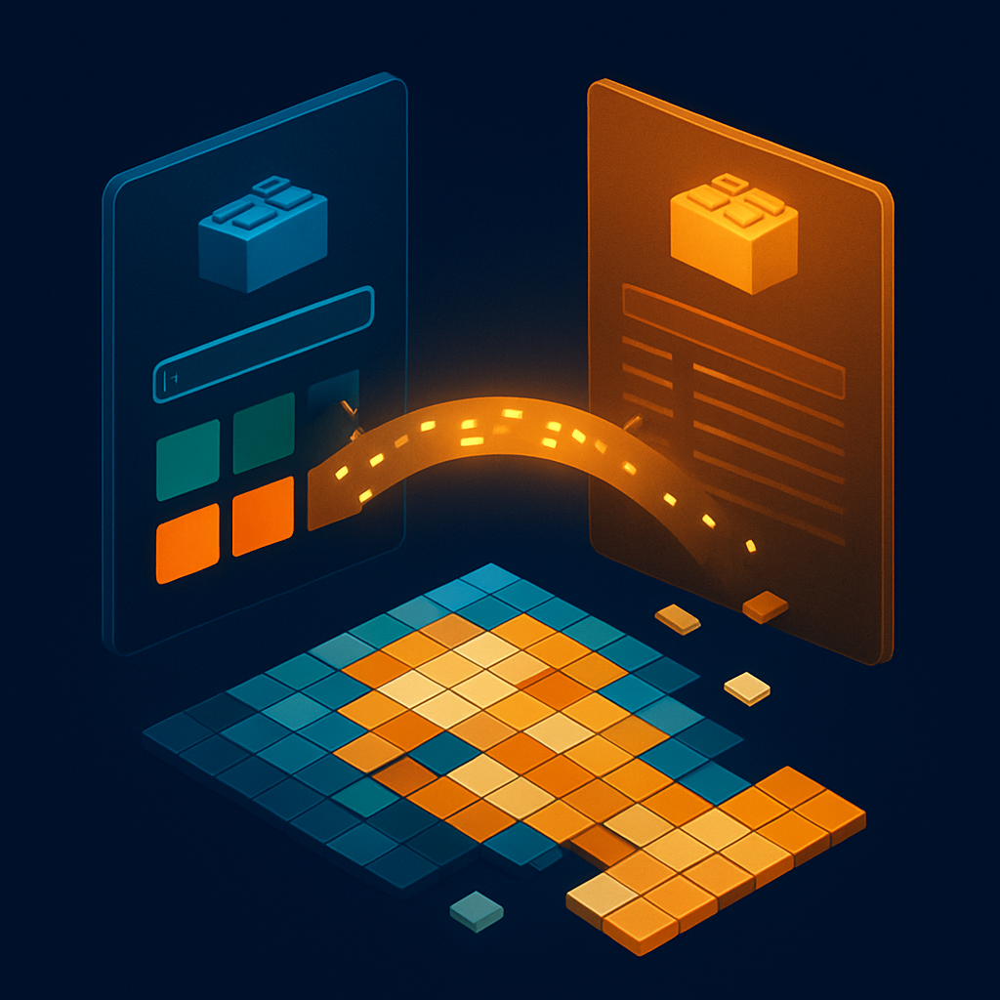

# Como Pesquisar no Gobricks e a Correspondência com BrickLink



O conceito anterior mostrou como o BrickLink funciona como catálogo de referência: você parte de um Design ID, seleciona uma cor pelo Color ID, cria uma Wanted List e fecha o pedido com vendedores individuais. Esse fluxo resolve compras dentro da própria plataforma BrickLink, mas para volumes maiores de mosaico — e especialmente quando o objetivo é reduzir custo por peça — o Gobricks entra como o principal fornecedor alternativo. O problema é que o Gobricks opera com seu próprio sistema de numeração interno, e sem entender como esse sistema se conecta ao Design ID e ao Color ID do BrickLink, a pesquisa na plataforma vira tentativa e erro.

O ponto de partida importante é que o Gobricks **aceita o Design ID do BrickLink como chave de busca**. Ao acessar o campo de pesquisa em `mygobricks.com`, você pode digitar diretamente o Design ID que já conhece — `3024` para o 1×1 plate, `3070b` para o 1×1 tile, `4073` para o round plate — e a plataforma retorna a peça correspondente se ela estiver disponível no catálogo. Isso significa que o vocabulário construído no BrickLink é diretamente transferível: o Design ID que você usa no BrickLink é o mesmo que você digita no Gobricks. A busca por nome em inglês também funciona ("1x1 plate", "flat tile 1x1"), mas o Design ID é mais confiável porque elimina variações de tradução e nomes alternativos.

Internamente, porém, o Gobricks mantém seu próprio sistema de numeração para os produtos — um identificador numérico proprietário diferente do Design ID da LEGO. Esse número aparece na URL da página do produto no Gobricks e nas planilhas de pedido em bulk. Ele não tem correspondência semântica com o Design ID; é simplesmente uma chave interna do sistema do Gobricks. Para o usuário que compra peças avulsas pelo site, esse número interno raramente importa — você encontra a peça pelo Design ID, confirma que é a peça certa pela foto e pelo nome, e adiciona ao carrinho. O número interno só passa a ser relevante se você usar a API do Gobricks diretamente para montar pedidos programáticos ou se usar serviços intermediários como o BuyMeBricks, que fazem a conversão de listas Rebrickable para o sistema interno do Gobricks.

O mecanismo dessa conversão foi documentado por desenvolvedores independentes: o endpoint da API do Gobricks em `gobricks.cn/frontend/v1/community/lego2ItemList` aceita um payload que inclui o campo `designid` (o Design ID da LEGO/BrickLink) e o campo `colorid` (código de cor no padrão LDraw), e retorna o item correspondente no catálogo interno do Gobricks se a peça compatível existir. Essa arquitetura confirma que o Gobricks construiu sua base de dados **usando o Design ID da LEGO como chave de indexação** — o que é por que a busca pelo Design ID no site funciona: a plataforma simplesmente consulta sua tabela de correspondência interna.

A questão das cores no Gobricks segue uma lógica paralela ao Design ID: o Gobricks tem seu próprio sistema de numeração de cores, com um prefixo "GB" e três dígitos (ex: GB 010, GB 090). Esse sistema não é idêntico ao Color ID do BrickLink. A tabela de correspondência está disponível publicamente na página `mygobricks.com/pages/color` e em parceiros como `wobrick.com/color`, com o formato:

| Gobricks (GB no.) | Nome em inglês | LEGO no. | LDraw no. | BrickLink no. | BrickOwl no. |
|---|---|---|---|---|---|
| GB 010 | Bright Red | 21 | 4 | 5 | 38 |
| GB 090 | White | 1 | 15 | 1 | 62 |
| GB 011 | Black | 26 | 0 | 11 | 64 |
| GB 043 | Bright Green | 37 | 2 | 36 | 80 |
| GB 023 | Bright Yellow | 24 | 14 | 3 | 57 |
| GB 044 | Sand Green | 48 | 378 | 48 | 155 |
| GB 136 | Medium Azur | 102 | 156 | 156 | 153 |

A coluna "BrickLink no." nessa tabela é o Color ID que você já conhece — o mesmo que aparece na URL `idColor=5` ao navegar pelo catálogo do BrickLink. Portanto, o fluxo de tradução é direto: você parte do Color ID do BrickLink (que o algoritmo de mosaico entrega ou que você confirma no Color Guide), consulta a tabela para encontrar o GB no. correspondente, e usa esse número ao fazer o pedido diretamente no sistema do Gobricks ou ao comunicar cor por email/chat com um vendedor Gobricks.

Na prática, contudo, a maioria dos pedidos no site do Gobricks não exige essa conversão manual de cor. A página de produto de uma peça no Gobricks apresenta uma grade de variantes cromáticas com swatches visuais, semelhante ao que o BrickLink faz. Você seleciona a cor visualmente — a plataforma mostra o nome em inglês no padrão LEGO/BrickLink ("Yellow", "White", "Red") — e a URL da página atualiza com o código interno correspondente. Para validar que a cor selecionada é a correta antes de finalizar o pedido, basta cruzar o nome exibido na página do Gobricks com o nome que você tem do BrickLink. "Yellow" no Gobricks é o mesmo "Yellow" (Color ID 3) do BrickLink na esmagadora maioria dos casos.

O caso onde a tabela de correspondência se torna indispensável é quando há divergências de nomenclatura entre sistemas — o mesmo problema discutido no conceito de Color ID. Os tons de cinza são o exemplo mais crítico: o Gobricks distingue "Light Bluish Gray" (GB ~, correspondendo ao BrickLink Color ID 86) do obsoleto "Light Gray" (BrickLink Color ID 9), e selecionar o cinza errado resulta em receber peças de tom diferente do esperado. Ao trabalhar com paletas de retrato onde vários tons de cinza são usados simultaneamente — cinza claro de fundo, cinza médio para sombras, cinza escuro para contornos — uma troca de um número de cor gera um defeito visível no produto final. A tabela de correspondência elimina essa ambiguidade porque você parte do Color ID numérico do BrickLink, não do nome.

O Gobricks também oferece uma ferramenta de bulk order — o Toolkit em `mygobricks.com/pages/toolkit` — que aceita upload de arquivos no formato Rebrickable `.csv` ou Studio `.ldr`. Nesse fluxo, você exporta a lista de peças do software de design diretamente e faz upload; o sistema processa a correspondência automaticamente e monta o carrinho com as peças disponíveis no catálogo Gobricks. O limite por upload é de 100 itens distintos, o que é suficiente para a maioria dos pedidos de mosaico (que tipicamente têm 15 a 30 cores distintas do mesmo Design ID). Para pedidos maiores ou com necessidade de validação detalhada por cor, o fluxo manual — buscar pelo Design ID, selecionar a cor, verificar estoque — é mais confiável porque você vê o status de estoque em tempo real para cada combinação.

```
Fluxo para pesquisa no Gobricks a partir de um pedido de mosaico:

1. Receber lista do algoritmo  →  Design ID + Color ID (BrickLink) + quantidade por cor
2. Para cada par (Design ID, Color ID):
   a. Acessar mygobricks.com e buscar pelo Design ID (ex: 3070b)
   b. Verificar que a peça retornada corresponde ao tipo esperado (foto + nome)
   c. Selecionar a cor visualmente OU cruzar Color ID BrickLink → GB no. pela tabela
   d. Verificar estoque da variante específica (botão "Add to Cart" vs "Sold Out")
3. Alternativa bulk: exportar lista como Rebrickable .csv e fazer upload no Toolkit
4. Revisar itens sem correspondência (peças que o Gobricks não fabrica)
5. Para itens sem estoque no Gobricks → fallback para BrickLink (Wanted List)
```

Um comportamento importante a conhecer: nem toda combinação de Design ID + cor que existe no BrickLink existe no catálogo do Gobricks. O Gobricks fabrica seletivamente as formas e cores com maior volume de demanda — as peças mais comuns em mosaicos (1×1 plate, 1×1 tile, 1×1 round plate) estão disponíveis em praticamente todas as cores sólidas relevantes, mas variantes mais raras podem estar ausentes. Quando o Gobricks não tem uma combinação específica, a página de produto simplesmente não aparece na busca ou o botão "Add to Cart" fica inativo por falta de estoque. O fluxo correto nesse caso é voltar ao BrickLink como fonte complementar para as peças que o Gobricks não cobre — os dois sistemas funcionam em conjunto, não em substituição.

A decisão entre comprar pelo Gobricks direto ou pelo BrickLink envolve fatores que vão além da disponibilidade: pedido mínimo (o Gobricks tipicamente exige volumes maiores por SKU para compensar o frete internacional), prazo de entrega (o Gobricks está baseado na China, com prazo de 15 a 30 dias para SP vs. BrickLink com vendedores nacionais em dias) e custo por unidade (Gobricks costuma ser 40 a 60% mais barato que o BrickLink para cores comuns em volume). A estratégia prática para mosaicos é usar o Gobricks para o núcleo do pedido — as cores que você vai consumir em volume, especialmente as que se repetem pedido após pedido — e o BrickLink como complemento para quantidades menores ou cores raras que o Gobricks não tem. Esse modelo híbrido é explorado em detalhes nos capítulos de compra e logística; a habilidade técnica para operar nele começa aqui, com a capacidade de cruzar os dois sistemas pelo Design ID e Color ID sem perder precisão.

## Fontes utilizadas

- [Gobricks Color Chart — mygobricks.com](https://mygobricks.com/pages/color)
- [Color Cross-Reference — Wobrick (Gobricks reseller)](https://wobrick.com/color/)
- [GitHub: GoBricksPart-API — mnemocron](https://github.com/mnemocron/GoBricksPart-API)
- [How to order GoBricks parts for Rebrickable MOCs — BuyMeBricks](https://www.buymebricks.com/posts/how-to-order-gobricks-parts-rebrickable)
- [How to order GoBricks parts for BrickLink Studio projects — BuyMeBricks](https://www.buymebricks.com/posts/how-to-order-gobricks-parts-studio)
- [Gobricks Toolkit — mygobricks.com](https://mygobricks.com/pages/toolkit)
- [Gobricks — MOCer's Premier Source for Compatibility and Quality](https://mygobricks.com/)

---

**Próximo conceito** → [Montando uma Lista de Material com IDs Precisos](../06-montando-uma-lista-de-material-com-ids-precisos/CONTENT.md)
