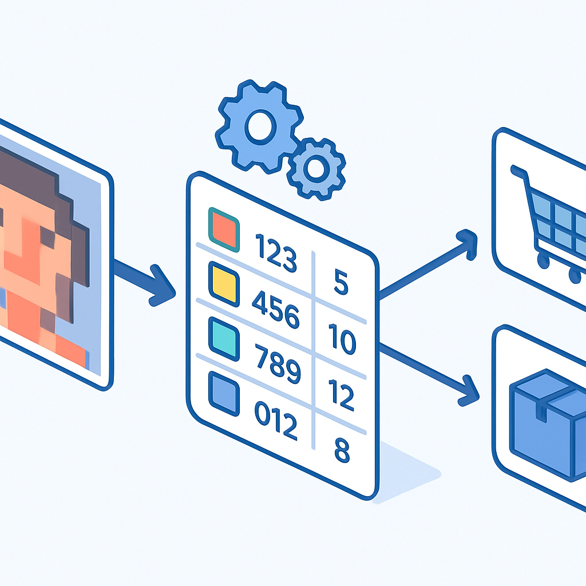

# Montando uma Lista de Material com IDs Precisos



Todo o subcapítulo até aqui foi uma construção progressiva de precisão: o Design ID identifica a forma sem cor, o Color ID identifica a cor sem forma, o Element ID combina os dois numa chave oficial da LEGO, e os dois conceitos de pesquisa mostraram como usar esses identificadores no BrickLink e no Gobricks sem ambiguidade. Este conceito fecha o ciclo com a pergunta prática que justifica todo o resto: **como um algoritmo de mosaico se transforma numa lista de compra acionável?**

O problema começa na saída do algoritmo. Qualquer ferramenta de conversão de imagem em mosaico — seja o módulo Mosaic do BrickLink Studio, seja um gerador externo como o brickmos, seja um script Python customizado — produz um resultado com a mesma estrutura essencial: para cada pixel ou região da imagem, a ferramenta escolheu uma cor do espaço de cores LEGO e atribuiu uma peça. Esse mapeamento, quando agregado por combinação única de peça + cor, é a lista de material. O que varia entre ferramentas é o formato em que essa lista é entregue e quais identificadores ela usa — e é exatamente aí que a confusão começa para quem ainda não tem os IDs memorizados.

O BrickLink Studio exporta a lista de material (BOM — Bill of Materials) em dois formatos principais via `File > Export BOM`. O formato CSV é uma tabela simples com colunas para Part ID (que é o Design ID no vocabulário BrickLink), Color Name (nome textual da cor no padrão BrickLink, como "White" ou "Light Bluish Gray") e Quantity. O formato XML é o mesmo conteúdo numa estrutura que o próprio BrickLink consegue importar diretamente como Wanted List — você faz upload do arquivo XML em `bricklink.com/v2/wantedList.page` e a plataforma cria a lista preenchida automaticamente. Esse fluxo direto Studio → XML → Wanted List é o mais eficiente para quem trabalha inteiramente no ecossistema BrickLink.

Geradores externos como o brickmos (disponível no GitHub, de código aberto) usam um arquivo de configuração de cores que define a paleta disponível no formato `R,G,B ; Nome da cor ; Color ID ; Design ID`. A saída de material do brickmos segue essa mesma estrutura — o que significa que a lista já chega com Color ID numérico e Design ID separados, pronta para uso direto sem nenhuma tradução adicional. Outros geradores menos padronizados entregam apenas o nome textual da cor ("yellow", "dark red") sem o ID numérico, o que exige uma etapa manual de resolução usando o Color Guide do BrickLink.

A estrutura mínima de uma lista de material útil para compra tem três colunas:

| Design ID | Color ID | Quantidade |
|-----------|----------|------------|
| `3070b`   | 1        | 847        |
| `3070b`   | 5        | 412        |
| `3070b`   | 11       | 388        |
| `3070b`   | 86       | 276        |
| `3070b`   | 3        | 154        |

O Design ID é o mesmo em todas as linhas quando o mosaico usa um único tipo de peça — por exemplo, 1×1 tile (`3070b`) como padrão dos sets LEGO Art. O Color ID é o que diferencia as linhas. A quantidade é o total de peças naquela cor para o mosaico inteiro. Essa tabela de três colunas é o denominador comum de todos os formatos e o que você vai carregar para o BrickLink como Wanted List ou para o Gobricks como pedido bulk.

Quando o gerador entrega nomes textuais de cor ao invés de Color IDs, a resolução é direta: acesse o Color Guide em `v2.bricklink.com/en-us/catalog/color-guide`, localize a cor pelo nome ou pelo swatch visual, e leia o ID numérico que aparece na coluna correspondente. O ponto de atenção crítico já mencionado no conceito de Color ID se aplica aqui com toda a força: **nunca resolva o ID pelo nome coloquial**. "Gray" sem qualificação é ambíguo — pode ser "Light Gray" (Color ID 9, descontinuado), "Dark Gray" (Color ID 10, descontinuado), "Light Bluish Gray" (Color ID 86, o cinza padrão moderno) ou "Dark Bluish Gray" (Color ID 85). Em mosaicos de retrato onde múltiplos tons de cinza são usados para gradientes de sombra, trocar um desses IDs produz um defeito visível no produto final. A mesma precaução vale para azuis, marrons e qualquer família de cores com variantes de nome similar.

Depois de ter a lista com Design ID + Color ID + Quantidade, o fluxo se divide conforme o fornecedor alvo. Para o BrickLink, o caminho mais eficiente é o upload XML da Wanted List — o Studio gera esse XML diretamente, ou você pode usar ferramentas como o script `csv_to_bricklinkxml` (disponível no Codeberg) para converter uma planilha CSV no formato XML esperado pela plataforma. O formato XML que o BrickLink aceita para upload de Wanted List tem uma estrutura como:

```xml
<INVENTORY>
  <ITEM>
    <ITEMTYPE>P</ITEMTYPE>
    <ITEMID>3070b</ITEMID>
    <COLOR>1</COLOR>
    <MINQTY>847</MINQTY>
    <CONDITION>N</CONDITION>
  </ITEM>
  <ITEM>
    <ITEMTYPE>P</ITEMTYPE>
    <ITEMID>3070b</ITEMID>
    <COLOR>5</COLOR>
    <MINQTY>412</MINQTY>
    <CONDITION>N</CONDITION>
  </ITEM>
</INVENTORY>
```

`ITEMTYPE>P` indica "Part" (em oposição a Set ou Minifig). `ITEMID` é o Design ID. `COLOR` é o Color ID. `MINQTY` é a quantidade mínima desejada. `CONDITION>N` indica peças novas (New). Esse é o formato documentado na Central de Ajuda do BrickLink para Mass Upload de Wanted Lists — qualquer arquivo nessa estrutura é importado sem erros.

Para o Gobricks, o fluxo descrito no conceito anterior se aplica diretamente: o Gobricks Toolkit aceita arquivos `.csv` no formato Rebrickable ou arquivos `.ldr` gerados pelo Studio. O formato Rebrickable CSV é uma tabela com colunas `Part`, `Color`, `Quantity` onde `Part` é o Design ID e `Color` é o Color ID no padrão BrickLink. Se o seu gerador de mosaico entrega CSV com esses campos, o upload é direto. Se entrega XML do BrickLink, o Studio consegue importar esse XML e reexportar no formato `.ldr` que o Gobricks também aceita.

Um aspecto prático importante: a lista que sai do algoritmo representa o **total por cor para o mosaico inteiro**, mas a decisão de onde comprar cada linha da lista envolve considerar disponibilidade e estoque mínimo. O Gobricks tem pedido mínimo por SKU — tipicamente 10 a 20 peças de uma combinação específica para compensar o custo de separação do lote. Para cores com quantidade muito baixa na lista (por exemplo, uma cor de destaque que aparece em apenas 12 peças no retrato), pode não valer a pena incluir no pedido Gobricks e ir diretamente para o BrickLink onde você compra a quantidade exata. A regra prática: linhas da lista com quantidade acima de ~50 unidades vão para o Gobricks; abaixo disso, o BrickLink com vendedores nacionais é mais ágil e não exige pedido mínimo.

O controle de múltiplos pedidos é o ponto onde a lista de material evolui de uma tabela para um documento de trabalho. Uma planilha com uma coluna adicional de "fornecedor" e outra de "status" transforma a lista de material num instrumento de acompanhamento:

| Design ID | Color ID | Qty Total | Fornecedor | Pedido | Status     |
|-----------|----------|-----------|------------|--------|------------|
| `3070b`   | 1        | 847       | Gobricks   | GBK-01 | Enviado    |
| `3070b`   | 5        | 412       | Gobricks   | GBK-01 | Enviado    |
| `3070b`   | 11       | 388       | Gobricks   | GBK-01 | Enviado    |
| `3070b`   | 86       | 276       | BrickLink  | BL-07  | Aguardando |
| `3070b`   | 3        | 154       | BrickLink  | BL-07  | Aguardando |

Esse modelo de planilha não é sofisticado — pode ser uma aba de Google Sheets — mas resolve o problema real de rastrear pedidos distribuídos por vários fornecedores para o mesmo mosaico. Quando um pedido Gobricks chega e outro BrickLink ainda está em trânsito, você precisa saber exatamente o que está faltando sem reler todos os pedidos do zero.

Um último ponto que fecha o raciocínio do subcapítulo inteiro: a lista de material com IDs precisos é a interface entre o mundo digital (o algoritmo de mosaico) e o mundo físico (o estoque de peças que chegará pelo correio). Todos os conceitos anteriores — o que é um Design ID, como o Color ID evita ambiguidade de nome, quando o Element ID aparece e atrapalha, como pesquisar no BrickLink e cruzar com o Gobricks — convergem para este momento: você tem uma imagem, passa pelo algoritmo, recebe uma tabela com IDs e quantidades, e executa o pedido com precisão suficiente para que as peças que chegam montem exatamente o mosaico que o cliente encomendou.

## Fontes utilizadas

- [Bill of Materials (BOM) — Studio Help Center — BrickLink](https://studiohelp.bricklink.com/hc/en-us/articles/5681358947095-Bill-of-Materials-BOM)
- [Exporting to other formats — Studio Help Center — BrickLink](https://studiohelp.bricklink.com/hc/en-us/articles/6502197862679-Exporting-to-other-formats)
- [Wanted List, Mass Upload — BrickLink Help](https://www.bricklink.com/help.asp?helpID=207)
- [Importing items on BrickLink with XML — BrickLink Help](https://www.bricklink.com/help.asp?helpID=2567)
- [Mosaic — Studio Help Center — BrickLink](https://studiohelp.bricklink.com/hc/en-us/articles/5625025298327-Mosaic)
- [GitHub: brickmos — Simple brick mosaic generator — merschformann](https://github.com/merschformann/brickmos)
- [Using csv_to_bricklinkxml — Codeberg](https://codeberg.org/plenae/BrickLinkXML/wiki/Using-csv_to_bricklinkxml)
- [Rebrickable Help Guide: Importing Parts](https://rebrickable.com/help/importing-parts/)
- [Gobricks Toolkit — mygobricks.com](https://mygobricks.com/pages/toolkit)

---

**Próximo capítulo** → [O Ecossistema de Marcas Compatíveis](../../../03-o-ecossistema-de-marcas-compativeis/CONTENT.md)
