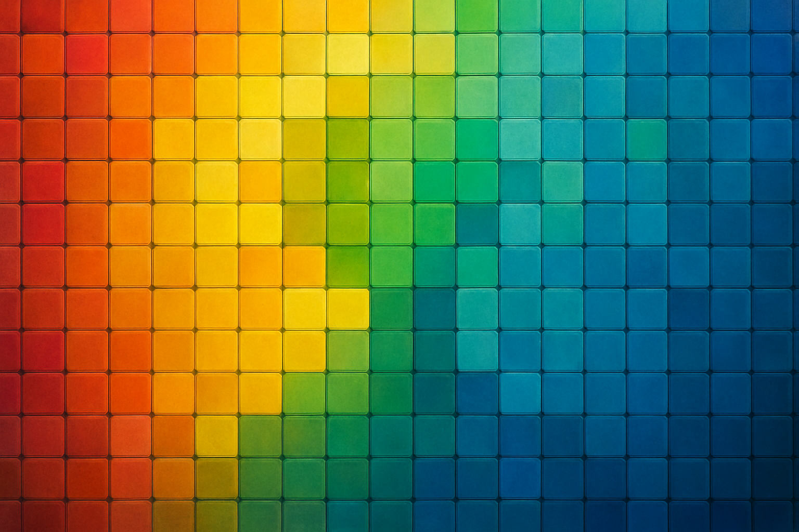

# Paleta de Cores: O Que Existe e O Que Importa

## Sobre este capítulo

Mosaicos de retrato dependem de cores específicas. A diferença entre um mosaico convincente e um resultado decepcionante costuma estar não na resolução, mas na paleta disponível. Este capítulo trata da paleta como restrição de negócio: quais cores existem em peças compatíveis, como elas se comparam ao sistema de cores oficial LEGO, quais são essenciais para retratos de rosto humano e como a escolha de paleta afeta diretamente o custo e a complexidade do estoque.

A posição aqui — após qualidade técnica e antes de logística — é deliberada: o leitor precisa saber quais cores vai precisar stockar antes de ir às plataformas de compra, senão vai navegar sem critério e perder tempo.

## Estrutura

Os grandes blocos são: (1) o sistema de cores LEGO — como as cores são nomeadas e numeradas (BrickLink color ID, LEGO color ID), por que existem duas nomenclaturas e qual usar ao comprar; (2) disponibilidade em compatíveis — quais das ~200 cores LEGO têm equivalente confiável em Gobricks e similares, onde a paleta fecha e onde há lacunas; (3) cores essenciais para retratos — a paleta mínima de 8–12 cores que cobre a maioria dos rostos humanos, com gradiente de pele, cabelo e fundo; (4) estratégia de paleta reduzida — como trabalhar com menos cores deliberadamente para simplificar o estoque e manter custo baixo sem sacrificar qualidade visual.

## Objetivo

Ao terminar este capítulo, o leitor terá definido a lista de cores que precisa stockar para os primeiros pedidos, entenderá como especificar essas cores ao comprar em qualquer plataforma e estará preparado para calcular o estoque inicial no capítulo 9.

## Fontes utilizadas

- [Everything You Want to Know About LEGO Mosaics — BrickNerd](https://bricknerd.com/home/everything-you-want-to-know-about-lego-mosaics-11-12-24)
- [Gobricks color catalog — MyGobricks](https://mygobricks.com/)
- [LEGO® Art: the new mosaic theme — New Elementary](https://www.newelementary.com/2020/07/lego-art-new-mosaic-theme.html)
- [BrickLink Color Guide](https://www.bricklink.com/catalogColors.asp)
- [Letbricks vs Gobricks vs LEGO color comparison — Letbricks](https://www.letbricks.com/2025/08/letbricks-vs-gobricks-vs-lego-best-moc-builder-bricks-review/)
