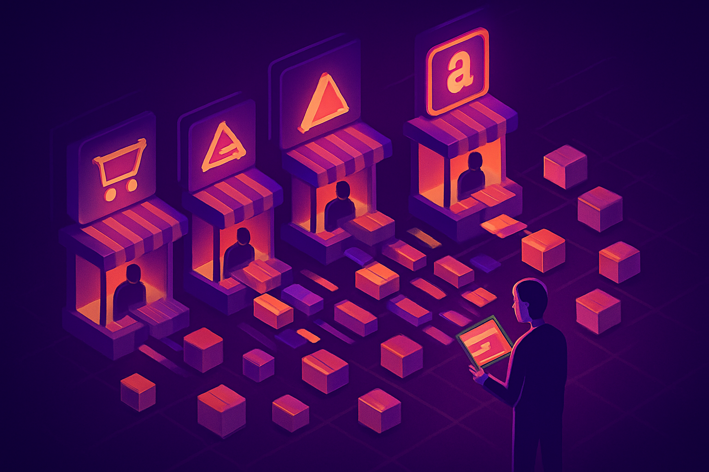

# Plataformas de Compra: BrickLink, AliExpress, Shopee e Mercado Livre

## Sobre este capítulo

Saber o que comprar e de quem comprar não resolve se o leitor não souber navegar pelas plataformas onde as transações acontecem. Este capítulo é um guia operacional: como funciona cada canal relevante para compra de peças LEGO compatíveis, quais são as vantagens e os riscos de cada um, e como tomar a decisão de qual usar para cada tipo de pedido.

O leitor tem familiaridade com e-commerce e plataformas digitais (background em tecnologia), mas nunca comprou peças LEGO avulsas — então o foco está nas especificidades do mercado de tijolos, não em como usar AliExpress em geral.

## Estrutura

Os grandes blocos são: (1) BrickLink — o que é, como criar conta de comprador, como buscar peças por design ID e color ID, como avaliar vendedores, como funciona o carrinho e o lote mínimo, e como identificar vendedores brasileiros vs. internacionais; (2) Gobricks diretamente (mygobricks.com) — quando vale comprar direto do fabricante, como funciona o sistema de pedido em quantidade e quais são os mínimos; (3) AliExpress — como filtrar fornecedores confiáveis de genéricos, como verificar fotos e avaliações para peças de mosaico, risco de variação de cor entre lotes; (4) Shopee — diferenças em relação ao AliExpress para o Brasil, vendedores nacionais vs. cross-border; (5) Mercado Livre — vendedores brasileiros de peças avulsas, vantagens de prazo e custo, como identificar revendedores de Gobricks.

## Objetivo

Ao terminar este capítulo, o leitor conseguirá abrir qualquer uma dessas plataformas e navegar até encontrar a peça certa ao preço correto, saberá qual canal priorizar para cada tipo de compra (urgente, volume, barato, específico) e entenderá os riscos de cada um antes de colocar o primeiro pedido em lote.

## Fontes utilizadas

- [BrickLink — Buy and sell LEGO Parts, Sets and Minifigures](https://www.bricklink.com/)
- [Need to buy certain LEGO® Bricks in bulk? — Medium/Maximilian Richter](https://medium.com/@germanmax/need-to-buy-certain-lego-bricks-in-bulk-how-to-get-exactly-what-you-are-looking-for-2806f145653a)
- [Gobricks Bulk Bricks — MyGobricks](https://mygobricks.com/collections/bulk-bricks)
- [Onde comprar peças LEGO — Comunidade 0937](https://comunidade0937.com/portal/2010/10/onde-comprar-pecas-lego/)
- [Buying Bulk LEGO — Bill Ward's Brickpile](https://www.brickpile.com/articles/buying-bulk-lego/)
