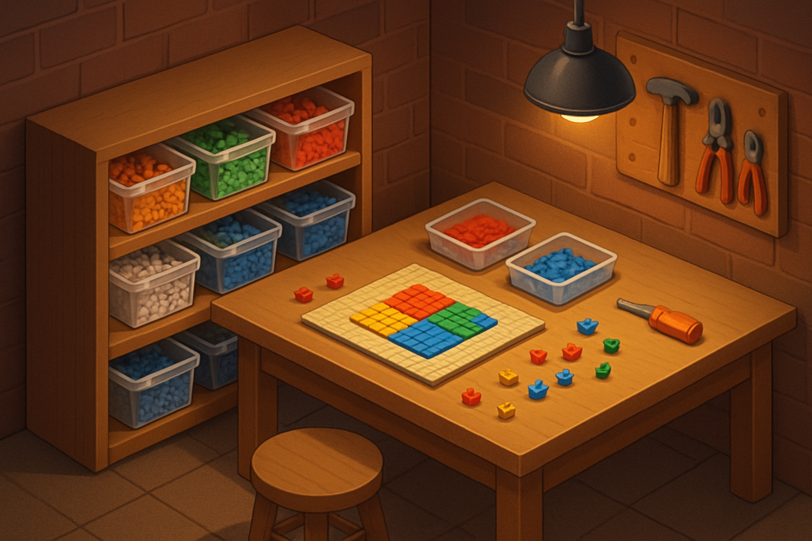

# Montando o Estoque Inicial

## Sobre este capítulo

Com marcas conhecidas, critérios de qualidade definidos, paleta de cores mapeada e canais de compra entendidos, é hora de traduzir tudo isso em um pedido concreto. Este capítulo orienta a montagem do primeiro estoque — o conjunto mínimo de peças que permite começar a produzir e entregar os primeiros mosaicos sem paralisar por falta de insumo e sem imobilizar capital desnecessário.

O foco é baixo investimento inicial com possibilidade de escalar conforme a demanda for se confirmando. O leitor tem perfil técnico e vai reconhecer a lógica: MVP de estoque, testar com volume mínimo e expandir com base em dados reais de pedidos.

## Estrutura

Os grandes blocos são: (1) dimensionamento por tipo de mosaico — quantas peças são necessárias por mosaico de retrato padrão (ex: 48×48 = 2.304 peças), como a variação de paleta afeta o número por cor, e margem de segurança recomendada; (2) lista de cores prioritárias e quantidades sugeridas para os primeiros 10–15 pedidos — com foco na paleta de retratos definida no capítulo 5; (3) orçamento estimado — cálculo de custo total considerando canal de compra (nacional urgente vs. importação lenta), com cenários conservador e econômico; (4) estratégia de reposição — quando pedir mais, como identificar quais cores esgotam mais rápido e como evitar ruptura em pedido em andamento; (5) organização física do estoque — recipientes, rotulagem e método de separação para manter velocidade na linha de montagem.

## Objetivo

Ao terminar este capítulo, o leitor sairá com uma lista de compras concreta — cores, quantidades, fornecedores e custo estimado — e um método de reposição para não travar na segunda quinzena de operação. O próximo passo é entender como esse estoque se integra ao fluxo de produção real.

## Fontes utilizadas

- [Everything You Want to Know About LEGO Mosaics — BrickNerd](https://bricknerd.com/home/everything-you-want-to-know-about-lego-mosaics-11-12-24)
- [Is it really possible to rebrick LEGO Art mosaics at a reasonable price? — Stonewars](https://stonewars.com/features/is-it-really-possible-to-rebrick-lego-art-mosaics-at-a-reasonable-price/)
- [Gobricks Bulk Bricks — MyGobricks](https://mygobricks.com/collections/bulk-bricks)
- [Personalized Brick Mosaic Art — Brick Me (referência de volume por baseplate)](https://brick.me/)
- [Mosaic — Studio Help Center — BrickLink](https://studiohelp.bricklink.com/hc/en-us/articles/5625025298327-Mosaic)
