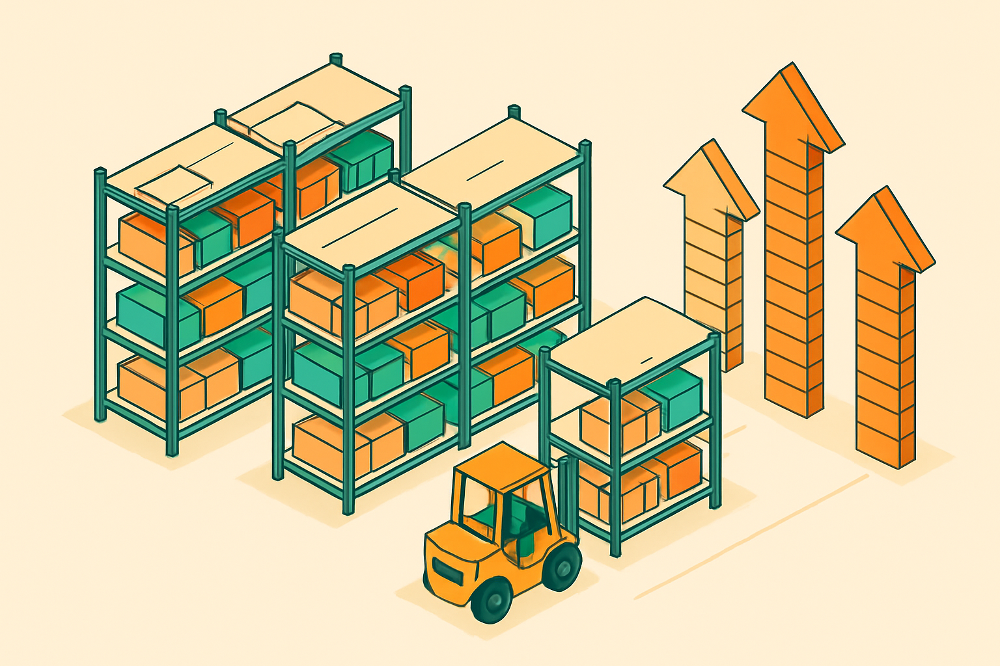

# Gestão e Escala do Estoque

## Sobre este capítulo

O estoque inicial resolve os primeiros pedidos. A partir do décimo ou vigésimo mosaico, surgem novos problemas: quais cores acabam mais rápido, como prever ruptura antes que aconteça, quando faz sentido aumentar o lote de importação e como a organização física começa a virar gargalo. Este capítulo fecha o livro com uma visão de gestão operacional simples, compatível com um negócio de baixo volume que quer crescer sem virar um caos logístico doméstico.

O leitor tem background em sistemas e automação — então este capítulo explora brevemente como ferramentas simples (planilha, Notion, script Python básico) podem servir como sistema de controle de inventário sem precisar de software de ERP.

## Estrutura

Os grandes blocos são: (1) métricas de consumo — como registrar entrada e saída de peças por cor para identificar giro e calcular estoque de segurança por cor; (2) ponto de ressuprimento — como definir o gatilho de recompra (quantidade mínima em estoque que dispara um pedido) para evitar ruptura sem imobilizar capital excessivo; (3) decisão de escala de lote — quando o volume de pedidos justifica um lote maior de importação, como calcular o ponto de equilíbrio entre custo de estoque parado e economia de escala; (4) ferramentas simples de controle — planilha básica de inventário, como automatizar com um script Python simples se o volume crescer; (5) evolução do espaço físico — quando a organização doméstica deixa de ser suficiente e o que considerar antes de alugar um espaço de armazenagem.

## Objetivo

Ao terminar este capítulo — e o livro — o leitor terá uma operação de estoque funcional e controlada: saberá o que tem, o que está acabando, quando pedir e quanto pedir. Isso encerra o percurso deste livro e abre caminho para os demais da série, que tratam de design de mosaicos, ferramentas de software e o fluxo completo de atendimento ao cliente.

## Fontes utilizadas

- [Need to buy certain LEGO® Bricks in bulk? — Medium/Maximilian Richter](https://medium.com/@germanmax/need-to-buy-certain-lego-bricks-in-bulk-how-to-get-exactly-what-you-are-looking-for-2806f145653a)
- [Gobricks Bulk Bricks — MyGobricks](https://mygobricks.com/collections/bulk-bricks)
- [Buying Bulk LEGO — Bill Ward's Brickpile](https://www.brickpile.com/articles/buying-bulk-lego/)
- [Is it really possible to rebrick LEGO Art mosaics at a reasonable price? — Stonewars](https://stonewars.com/features/is-it-really-possible-to-rebrick-lego-art-mosaics-at-a-reasonable-price/)
- [Personalized Brick Mosaic Art — Brick Me (referência de escala de negócio)](https://brick.me/)
