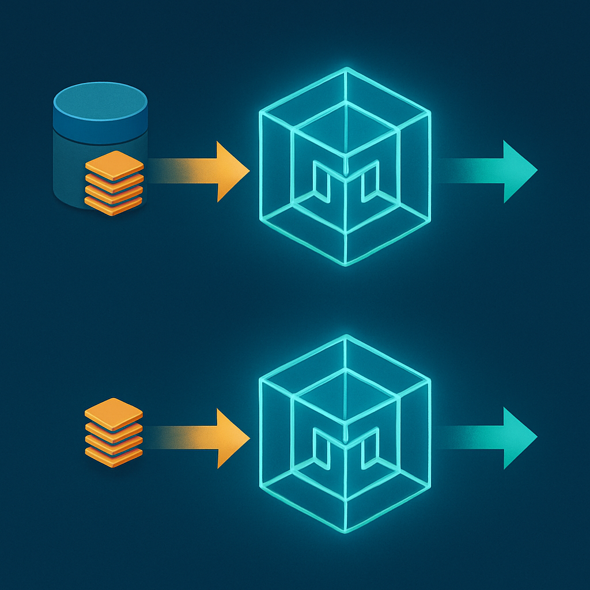

# O LLM e o Modelo Stateless por Design



Antes de entender por que um agente sem sessão quebra em produção, é preciso entender onde a ausência de estado começa: no próprio modelo de linguagem. O LLM não esquece porque foi mal projetado — ele nunca foi projetado para lembrar. Statelessness não é um bug; é a consequência direta de como inferência em transformers funciona, e qualquer camada de sessão construída sobre um LLM existe precisamente para compensar essa propriedade fundamental.

Um transformer é, na sua essência, uma função matemática com pesos fixos. Durante o treinamento, bilhões de exemplos ajustam esses pesos até que a função capte padrões linguísticos, raciocínio, código, fatos do mundo. Quando o treinamento termina, os pesos são congelados. Na inferência — cada vez que você chama a API — o modelo recebe uma sequência de tokens como entrada, passa essa sequência pelas camadas de atenção usando os pesos fixos, e produz tokens de saída. Depois disso, nada é preservado. A computação intermediária — os vetores de atenção, os estados ocultos de cada camada, o próprio raciocínio que produziu a resposta — é descartada. O modelo não tem onde armazenar o que "pensou": os pesos são somente leitura durante inferência.

```
Chamada 1:
  Input:  [system prompt] + [mensagem do usuário A]
  Pesos:  W (fixos, read-only)
  Output: tokens de resposta
  Estado após: ∅  ← absolutamente nada persiste no modelo

Chamada 2:
  Input:  [system prompt] + [mensagem do usuário B]
  Pesos:  W (idênticos, ainda fixos)
  Output: tokens de resposta
  Estado após: ∅
```

A comparação com um banco de dados relacional ajuda a fixar a distinção: um banco de dados tem estado interno persistido no disco; cada query o modifica ou o lê. Um LLM é mais parecido com uma função pura — `f(entrada) = saída`, sem efeito colateral, sem memória interna entre chamadas. Se você chamar `f` mil vezes, os resultados dependem só das entradas, nunca de um estado acumulado dentro de `f`.

Isso não é acidente de design; é escolha deliberada com consequências arquiteturais profundas. Por ser stateless, qualquer GPU disponível pode processar qualquer requisição — não há afinidade de sessão. Um serviço como a Vertex AI pode rodar o mesmo modelo em milhares de instâncias em paralelo e distribuir carga livre de coordenação. Cada chamada é reproduzível: os mesmos tokens de entrada geram a mesma distribuição de probabilidade de saída (com temperatura zero). Isso também simplifica o controle de versão do modelo — o comportamento é completamente determinado pelos pesos e pelo input.

| Propriedade | LLM stateless | Banco de dados com estado |
|---|---|---|
| Estado interno entre chamadas | Nenhum | Persiste em disco/memória |
| Escalabilidade horizontal | Trivial (qualquer nó serve qualquer request) | Requer coordenação ou replicação |
| Reprodutibilidade | Total (mesma entrada → mesma saída) | Depende do estado atual |
| Custo de uma chamada isolada | O(tokens da entrada) | Depende do histórico acumulado |
| "Aprender" com interações | Impossível sem retreinamento | Native (mutations, updates) |

O que não é óbvio à primeira vista é o que "contexto" significa neste modelo. Quando uma aplicação de chat envia o histórico de conversa junto com a nova mensagem, ela não está "passando memória para o modelo" — está construindo uma única entrada grande que contém tudo o que o modelo vai enxergar nessa chamada. A janela de contexto é o único substrato de atenção do transformer: tudo que está dentro dela pode influenciar a resposta; tudo que está fora não existe. Quando a chamada termina, essa janela é descartada junto com os vetores intermediários. Na próxima chamada, a aplicação precisa reconstruir uma nova janela do zero.

```
Turn 1:
  Janela enviada → [system] [user: "qual seu nome?"]
  Resposta ← "Sou o assistente."
  [janela descartada]

Turn 2:
  Janela enviada → [system] [user: "qual seu nome?"] [assistant: "Sou o assistente."] [user: "me dê uma tarefa"]
  Resposta ← "Vou criar um ticket no ClickUp..."
  [janela descartada]

Turn 3:
  Janela enviada → ??? ← a aplicação decide o que entra aqui
```

No turn 3, o LLM não sabe o que aconteceu nos turns anteriores a menos que a aplicação inclua isso na janela. E esse é exatamente o ponto de ruptura: a responsabilidade de construir a janela de contexto de cada chamada é inteiramente da camada de aplicação. O LLM não tem, e nunca terá, acesso a nada que a aplicação não explicitar naquele envelope de tokens.

Para o sistema que o leitor opera — Lambda + Haystack + Gemini — isso tem uma implicação direta: cada invocação do Lambda é uma chamada isolada à API do modelo. O MongoDB guarda o histórico de mensagens entre essas invocações, mas quem consulta o MongoDB e constrói a janela antes de chamar o modelo é o código do Lambda, não o modelo. O modelo nunca "lembra" de nada; ele processa o que a função Lambda decidiu colocar naquela chamada específica. A fidelidade da "memória" do agente é inteiramente uma propriedade da camada de orquestração, não do LLM.

Essa distinção é o alicerce de tudo que virá nos próximos conceitos. Quando falarmos de sessão, estaremos falando de estruturas que existem fora do modelo — na camada de aplicação, no banco de dados, nos documentos de estado. O modelo continuará sendo a função pura que sempre foi. A sessão é o mecanismo que a aplicação constrói ao redor do modelo para simular continuidade onde o modelo não tem nenhuma.

## Fontes utilizadas

- [Are LLMs Stateless? Architecture, Implications and Solutions — Atlan](https://atlan.com/know/are-llms-stateless/)
- [Why AI Agents Forget: The Stateless LLM Problem Explained — Atlan](https://atlan.com/know/why-ai-agents-forget/)
- [Stateful Agents: The Missing Link in LLM Intelligence — Letta](https://www.letta.com/blog/stateful-agents)
- [LLMs Are Stateless. Context Is the Product — Medium](https://medium.com/genai-llms/llms-are-stateless-context-is-the-product-336c50ae637c)
- [Stateful vs Stateless AI Agents: A Practical Comparison — Tacnode](https://tacnode.io/post/stateful-vs-stateless-ai-agents-practical-architecture-guide-for-developers)
- [In Transformers Inference, "Memory" Has No "Weight" — Latentspin](https://www.latentspin.ai/insights/in-transformers-inference-memory-has-no-weight)

---

**Próximo conceito** → [A Definição Operacional de Agente](../02-a-definicao-operacional-de-agente/CONTENT.md)
