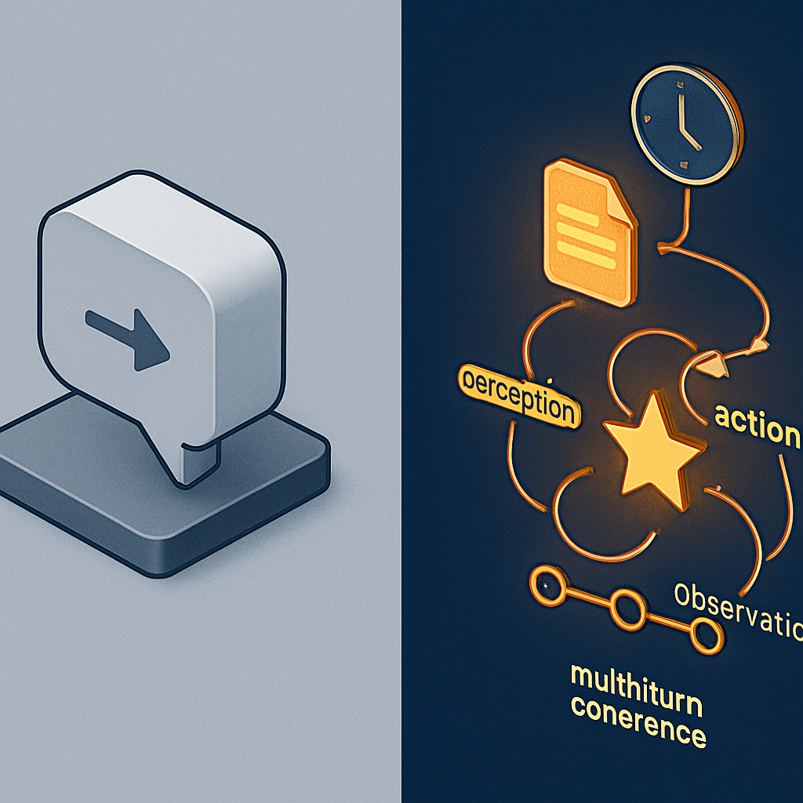

# A Definição Operacional de Agente



O conceito anterior deixou claro onde a ausência de estado começa: no modelo de linguagem, que é uma função pura — `f(entrada) = saída` — sem memória entre chamadas. Isso cria uma tensão imediata: se o LLM é stateless por design, como é possível construir algo que funcione como agente? A resposta não está no modelo. Está em definir com precisão o que "agente" significa operacionalmente — não como aspiração, mas como critério técnico verificável — para que seja possível saber quando o sistema satisfaz ou viola essa definição.

A confusão comum é tratar "agente" como sinônimo de "LLM com tool calling". Um sistema que chama ferramentas é certamente mais capaz que um chatbot puro, mas tool calling não é o critério discriminante. O critério real está em três propriedades que precisam coexistir: **persistência de intenções**, **observação contínua do ambiente ao longo do tempo**, e **coerência de decisão entre turnos**. As três juntas formam a definição operacional. Cada uma individualmente pode existir em sistemas que não são agentes.

**Persistência de intenções** é a propriedade pela qual o sistema mantém um objetivo ativo entre invocações. Quando um usuário pede ao sistema "crie um ticket no ClickUp com as tasks que definimos na semana passada, atribua ao João e me avise quando estiver feito", isso não é uma tarefa de um turno — é uma intenção que requer múltiplas ações, possivelmente distribuídas em múltiplas chamadas, com estado intermediário. Um agente real mantém essa intenção persistida: ela existe mesmo quando o sistema não está em execução, e cada novo turno sabe o que foi prometido. Um chatbot glorificado a perde na primeira invocação. Quando o usuário volta mais tarde e pergunta "como está o ticket?", o chatbot não tem nenhuma intenção pendente para consultar — ele tem, na melhor hipótese, um histórico de mensagens do qual precisa inferir o que estava fazendo, o que é funcionalmente diferente.

**Observação contínua** significa que o agente consegue perceber mudanças no ambiente que ocorreram entre turnos e incorporá-las ao seu raciocínio. Isso não é apenas "lembrar o que o usuário disse" — é rastrear o que aconteceu no mundo externo: o tool call do turno anterior retornou um erro? A task foi atribuída ao João mas ele recusou no Slack? O ticket foi fechado antes que o agente terminasse de agir sobre ele? Um sistema que reage apenas à janela de contexto da chamada atual não está observando o ambiente de forma contínua — está processando uma fotografia isolada. Um agente real acumula observações entre turnos em algum substrato persistente e as usa como entrada do raciocínio seguinte.

**Coerência de decisão entre turnos** é a propriedade que mais falha silenciosamente. Um sistema pode ter intenções persistidas e observações acumuladas e ainda assim tomar decisões contraditórias entre turnos se não existir um mecanismo de coerência. Coerência não é consistência de estilo — é garantia de que a decisão no turno N+1 levou em conta o que foi decidido e executado no turno N. No loop ReAct (Raciocínio → Ação → Observação), a coerência emerge porque o histórico de pensamentos, ações e observações está todo na janela de contexto daquela execução:

```
Turn N, Run interno:
  Thought: "preciso criar o ticket com as tasks X, Y, Z"
  Action:  create_ticket(title="Sprint tasks", items=[X, Y, Z])
  Obs:     { "ticket_id": "CK-1042", "status": "created" }
  Thought: "ticket criado, agora preciso atribuir ao João"
  Action:  assign_ticket(id="CK-1042", user="joao@empresa.com")
  Obs:     { "status": "assigned" }
  Answer:  "Ticket CK-1042 criado e atribuído ao João."
```

Dentro desse run, a coerência existe naturalmente — cada passo enxerga o resultado do anterior porque tudo está na mesma janela. O problema começa quando o próximo turn começa do zero. Se o sistema não tiver o estado "intenção: avisar quando concluído" persistido externamente, o agente no turn N+1 não sabe que há algo a monitorar. Ele responde ao que o usuário diz naquele momento, não ao que foi prometido no passado.

A distinção entre agente e chatbot glorificado pode ser capturada formalmente:

| Critério | Chatbot (com tool calling) | Agente operacional |
|---|---|---|
| Intenção entre turnos | Perdida ao fim da janela | Persistida em substrato externo |
| Observação do ambiente | Limitada ao contexto da chamada atual | Acumulada e consultada entre turnos |
| Coerência de decisão | Só existe dentro de um run | Garantida através de múltiplos turns |
| Estado das ações executadas | Não rastreado entre chamadas | Rastreado no substrato de sessão |
| Capacidade de retomada | Impossível — começa do zero | Possível — carrega o estado da sessão |
| "Lembrar" de promessas | Inferência frágil do histórico | Consulta estruturada ao estado ativo |

O que essa tabela revela é que o chatbot glorificado não é um agente incompleto — é uma categoria diferente. Adicionar mais tools a um chatbot não o transforma em agente. Adicionar um system prompt mais elaborado também não. O salto qualitativo acontece quando o sistema passa a manter as três propriedades acima como garantias arquiteturais, não como consequências acidentais de um contexto bem montado.

Para o sistema do leitor — Lambda + Haystack + Gemini via Vertex AI — a análise é direta. O MongoDB armazena histórico de mensagens, o que cria a ilusão de persistência. Mas histórico de mensagens não é o mesmo que estado de intenções. Quando o Lambda é invocado, ele consulta o MongoDB, constrói uma janela de contexto e chama o modelo. O modelo enxerga o histórico, mas não enxerga um objeto de estado estruturado que diga "esta sessão tem a intenção ativa de monitorar o ticket CK-1042 e notificar o usuário quando for fechado". Para saber isso, o modelo precisa inferir a intenção a partir das mensagens — o que é frágil, depende de quanta conversa cabe na janela, e silenciosamente falha quando o histórico fica longo demais para caber no contexto ou quando a janela é truncada para economizar tokens.

Isso não é uma crítica ao design atual; é um diagnóstico de posicionamento. O sistema está no espectro correto — tem tool calling, tem histórico, tem observabilidade — mas ainda não cruza o limiar que separa "LLM com memória de histórico" de "agente com estado persistido de intenções". Esse limiar é o que os próximos conceitos vão detalhar mecanicamente: o colapso stateless (conceito 03), por que a falha não aparece em desenvolvimento (conceito 04), e o que a sessão precisa ser para ser substrato real de continuidade (conceito 05).

## Fontes utilizadas

- [What is an AI Agent? — IBM](https://www.ibm.com/think/topics/ai-agents)
- [AI Agents Are Not Chatbots. Here's the Difference. — Medium](https://huryn.medium.com/ai-agents-are-not-chatbots-heres-the-difference-b2becfefdfe0)
- [What is a ReAct Agent? — IBM](https://www.ibm.com/think/topics/react-agent)
- [Understanding AI Agents through the Thought-Action-Observation Cycle — HuggingFace](https://huggingface.co/learn/agents-course/en/unit1/agent-steps-and-structure)
- [Beyond the Chatbot: Why AI Agents Need Persistent Memory — MemMachine](https://memmachine.ai/blog/2025/09/beyond-the-chatbot-why-ai-agents-need-persistent-memory/)
- [Stateful vs Stateless AI Agents: Architecture Patterns That Matter — Ruh.ai](https://www.ruh.ai/blogs/stateful-vs-stateless-ai-agents)
- [Chatbot vs Agent: Understanding the Architecture, Tools and Memory Layer — DEV Community](https://dev.to/yeahiasarker/chatbot-vs-agent-understanding-the-architecture-tools-and-memory-layer-3gop)
- [From the logic of coordination to goal-directed reasoning: the agentic turn in artificial intelligence — Frontiers in AI](https://www.frontiersin.org/journals/artificial-intelligence/articles/10.3389/frai.2025.1728738/full)

---

**Próximo conceito** → [O Colapso Stateless: de Agente a Chatbot Glorificado](../03-o-colapso-stateless-de-agente-a-chatbot-glorificado/CONTENT.md)
