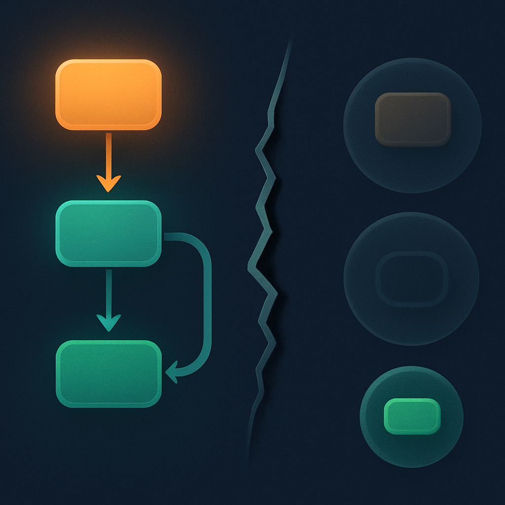

# O Colapso Stateless: de Agente a Chatbot Glorificado



Os dois conceitos anteriores estabeleceram os extremos do problema. O primeiro mostrou que o LLM é uma função pura — `f(entrada) = saída` — e que nenhuma memória persiste entre chamadas; o segundo definiu o que torna um sistema um agente operacional: persistência de intenções, observação contínua e coerência de decisão entre turnos. O que falta ainda é o mecanismo pelo qual esses dois fatos colidem — o processo concreto pelo qual um sistema que possui tool calling, histórico e modelo capaz se desintegra, na prática, em algo funcionalmente indistinguível de um chatbot. Esse processo tem nome: colapso stateless.

O colapso stateless não é um evento pontual. É uma degradação progressiva que começa no momento em que uma intenção multi-turno é criada sem que haja um substrato externo para sustentá-la. Para entender o mecanismo, vale construir a sequência de turnos de um cenário concreto.

Imagine que o usuário instrui o agente: "monitore o ticket CK-1042 no ClickUp. Quando ele mudar para 'Em revisão', notifique o time no canal #engenharia do Slack e crie um evento de revisão no calendário para amanhã." Isso é uma intenção de múltiplos turnos com três ações dependentes e uma condição de disparo. No turno em que essa instrução é dada, o agente tem acesso a tudo na janela de contexto — o pedido, as ferramentas disponíveis, a lógica da condição. Ele pode responder de forma coerente: "Entendido. Monitorarei o CK-1042."

```
Turn 1:
  Janela enviada → [system] [user: "monitore CK-1042, notifique quando Em revisão"]
  Thought: "preciso monitorar esse ticket. Vou registrar essa intenção."
  Action:  get_ticket(id="CK-1042")
  Obs:     { "status": "Em andamento" }
  Answer:  "Ticket em andamento. Monitorarei e notificarei quando mudar."
  [janela descartada]
```

Até aqui, tudo parece certo. Mas "vou registrar essa intenção" foi um pensamento dentro do raciocínio do modelo — não uma ação que escreveu em nenhum substrato persistente. O que "persiste" é apenas a mensagem de resposta no histórico do MongoDB. A intenção ativa — "há uma condição pendente para o CK-1042 que precisa disparar ações quando satisfeita" — não existe em lugar nenhum fora da janela de contexto que acabou de ser descartada.

```
Turn 2 (chamado pelo usuário com outro assunto):
  Janela enviada → [system] [histórico: turn 1] [user: "e quanto às tasks do sprint 14?"]
  Thought: "o usuário quer saber sobre as tasks do sprint 14"
  Action:  list_tasks(sprint=14)
  ...
  [janela descartada — a intenção do CK-1042 não foi mencionada, some do raciocínio]
```

```
Turn 3 (usuário pergunta sobre o ticket):
  Janela enviada → [system] [histórico: turns 1-2] [user: "e o CK-1042, mudou?"]
  Thought: "o usuário está perguntando sobre o CK-1042"
  Action:  get_ticket(id="CK-1042")
  Obs:     { "status": "Em revisão" }
  Answer:  "O ticket mudou para Em revisão."
  [sem notificação ao Slack, sem evento no calendário — o agente não sabe que devia fazer isso]
```

Aqui está o colapso. O agente respondeu corretamente à pergunta isolada do turno 3 — o ticket mudou, de fato — mas falhou completamente como agente: não havia nenhuma estrutura persistida que dissesse "quando o status mudar para Em revisão, execute as ações A, B, C". O modelo inferiu do histórico que havia um pedido de monitoramento no turno 1, mas inferência frágil de histórico não é o mesmo que uma intenção estruturada com condição e ações associadas. A diferença é a mesma que existe entre "o usuário disse que queria isso" e "o sistema tem um objeto de estado que explicita: `pending_intents: [{trigger: status==Em revisão, actions: [notify_slack, create_calendar_event]}]`".

O mecanismo tem três fases distintas:

**Fase 1 — Criação sem ancoragem.** A intenção é expressa pelo usuário e compreendida pelo modelo, mas nada a materializa fora da janela de contexto daquele turno. O modelo "sabe" da intenção apenas porque ela está nos tokens de entrada.

**Fase 2 — Deriva de especificação.** Nos turnos seguintes, a intenção original entra no histórico como texto plano junto com todo o resto da conversa. À medida que a janela de contexto cresce, os tokens iniciais perdem peso relativo na atenção do transformer — não desaparecem, mas ficam progressivamente diluídos por texto mais recente. Isso é diferente de perder o contexto por truncagem; é degradação semântica dentro da janela: a intenção está lá mas não governa o comportamento do agente porque está enterrada em histórico em vez de ser um parâmetro estruturado do estado atual. A pesquisa descreve isso como _specification drift_: o agente ainda tem o texto do pedido mas começa a reinterpretá-lo de forma que diverge do original.

**Fase 3 — Decisões contraditórias.** Quando o gatilho da intenção é eventualmente satisfeito, o agente não tem mecanismo para conectar "essa condição foi satisfeita" à "essas ações precisam ser executadas". Na ausência de um objeto de intenção ativo, o agente responde à realidade imediata — o status atual do ticket — sem a memória operacional de que há ações pendentes vinculadas a essa mudança. Em casos piores, se o modelo inferir parcialmente a intenção original a partir de texto distante na janela, pode executar uma parte das ações mas não outra, produzindo um estado parcialmente aplicado que é mais difícil de diagnosticar do que a falha completa.

```mermaid
sequenceDiagram
    participant U as Usuário
    participant L as Lambda (Agente)
    participant M as MongoDB (Histórico)
    participant LLM as Gemini

    U->>L: Turn 1: "Monitore CK-1042, notifique quando Em revisão"
    L->>M: Lê histórico
    L->>LLM: [system][hist][user: monitorar CK-1042]
    LLM-->>L: Thought+Action: get_ticket → "Em andamento. Monitorarei."
    L->>M: Grava mensagens do turn 1
    Note over L,M: Intenção ativa NÃO é persistida como objeto estruturado

    U->>L: Turn 2: "Tasks do sprint 14?"
    L->>M: Lê histórico (turns 1)
    L->>LLM: [system][hist 1][user: sprint 14]
    LLM-->>L: Responde sobre sprint 14
    L->>M: Grava turn 2
    Note over LLM: Intenção do CK-1042 diluída no histórico

    U->>L: Turn 3: "CK-1042 mudou?"
    L->>M: Lê histórico (turns 1-2)
    L->>LLM: [system][hist 1-2][user: CK-1042 mudou?]
    LLM-->>L: Action: get_ticket → "Em revisão." — SEM acionar Slack/Calendário
    Note over LLM: Intenção com ações nunca foi um objeto, não há gatilho para executar
```



O diagrama revela o ponto exato da ruptura: entre o turn 1 e o final do processamento, há uma lacuna estrutural. O MongoDB recebe o histórico de mensagens, mas o objeto de intenção que deveria ter sido criado — algo como `{session_id, trigger_condition, pending_actions, created_at}` — nunca foi escrito em lugar nenhum porque o sistema não tem esse conceito.

Isso é o colapso stateless em sua forma canônica: o sistema tem capacidade de raciocínio por turno, tem ferramentas, tem histórico de mensagens — e ainda assim não é um agente porque a continuidade entre turnos é construída sobre inferência de texto em vez de estado estruturado. O chatbot glorificado não é um agente degradado; é uma categoria diferente desde o início.

Para o sistema Lambda + Haystack do leitor, o colapso se manifesta de uma forma específica que vale mapear explicitamente. Cada invocação do Lambda é uma função independente que: (1) lê o histórico do MongoDB, (2) constrói a janela de contexto do Haystack, (3) chama o Gemini, (4) grava as novas mensagens no MongoDB. O passo que não existe é: (0) carrega o estado de sessão com intenções ativas, condições pendentes e ações rastreadas. Sem esse passo, cada invocação começa sem saber o que o agente estava "fazendo" — apenas com uma lista de mensagens anteriores da qual precisa inferir o contexto operacional.

| O que existe no sistema atual | O que o colapso stateless destrói |
|---|---|
| Histórico de mensagens no MongoDB | Intenções ativas com condições de disparo |
| Tool calling por turno com Haystack | Rastreamento de ações executadas entre turnos |
| Raciocínio coerente dentro de um run | Coerência de decisão entre runs separados |
| Resposta contextualizada ao turn atual | Execução de promessas feitas em turns passados |
| Inferência do histórico de texto | Consulta estruturada ao estado do agente |

A coluna da direita não lista funcionalidades extras — lista as propriedades que o conceito anterior identificou como definidoras de um agente operacional. O colapso stateless é exatamente a ausência dessas propriedades expressada como processo: não é que o sistema foi mal construído, é que ele nunca teve o substrato para suportá-las. A sessão — como será detalhada no conceito 05 — é o mecanismo que fecha esse gap: não um banco de histórico de chat mais sofisticado, mas um objeto de estado estruturado que persiste intenções ativas, rastreia ações executadas e fornece ao agente um ponto de partida operacional em cada turn, em vez de uma lista de mensagens da qual ele precisa reconstruir o mundo por inferência.

## Fontes utilizadas

- [Stateful Agents: The Missing Link in LLM Intelligence — Letta](https://www.letta.com/blog/stateful-agents)
- [Why AI Agents Forget: The Stateless LLM Problem Explained — Atlan](https://atlan.com/know/why-ai-agents-forget/)
- [AI Agent Memory: Why Stateless Agents Fail — Mem0](https://mem0.ai/blog/why-stateless-agents-fail-at-personalization)
- [Stateful vs Stateless AI Agents: Architecture Patterns That Matter — Ruh.ai](https://www.ruh.ai/blogs/stateful-vs-stateless-ai-agents)
- [Stateful vs Stateless AI Agents: A Practical Comparison — Tacnode](https://tacnode.io/post/stateful-vs-stateless-ai-agents-practical-architecture-guide-for-developers)
- [Loss of Intent as a Failure Mode in OWASP Agentic AI Risks (2026) — Parminder Singh](https://www.singhspeak.com/blog/loss-of-intent-as-a-failure-mode-in-owasp-agentic-ai-risks-2026)
- [Why do multi agent LLM systems fail (and how to fix) — Future AGI](https://futureagi.substack.com/p/why-do-multi-agent-llm-systems-fail)
- [Stateful agents, stateless infrastructure: the transport gap AI teams are patching by hand — Ably](https://ably.com/blog/stateful-agents-stateless-infrastructure-ai-transport-gap)

---

**Próximo conceito** → [Por que a Falha Não É Óbvia em Desenvolvimento](../04-por-que-a-falha-nao-e-obvia-em-desenvolvimento/CONTENT.md)
